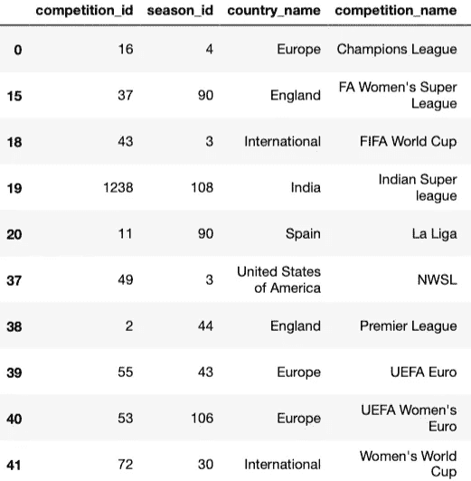
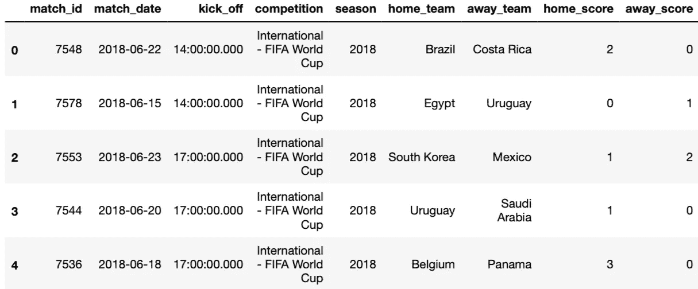
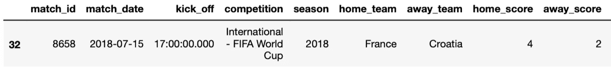
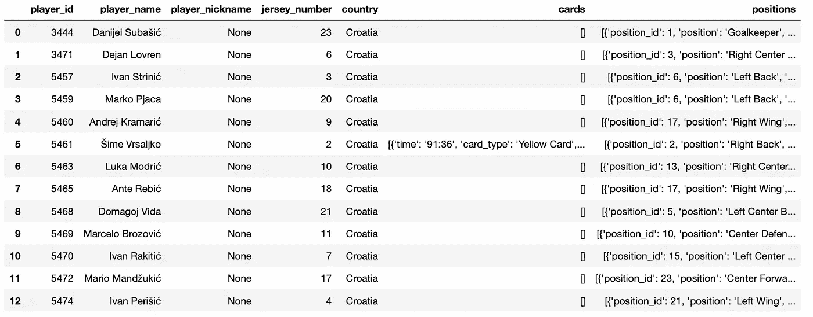
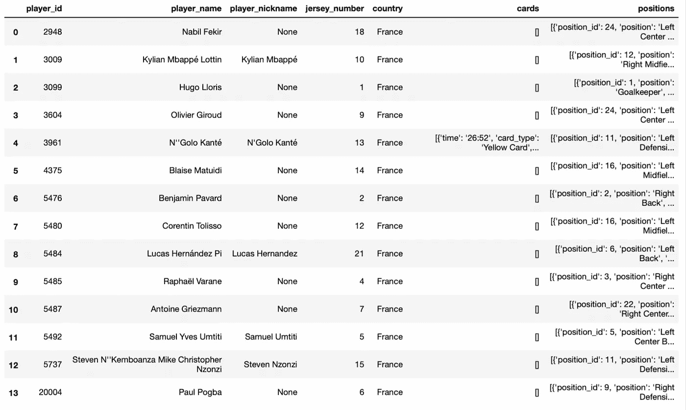
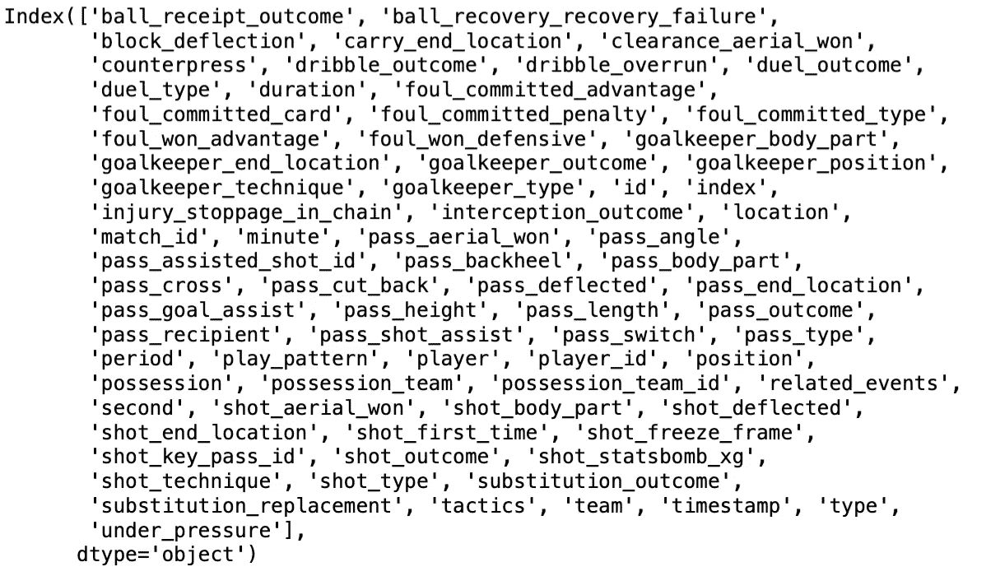
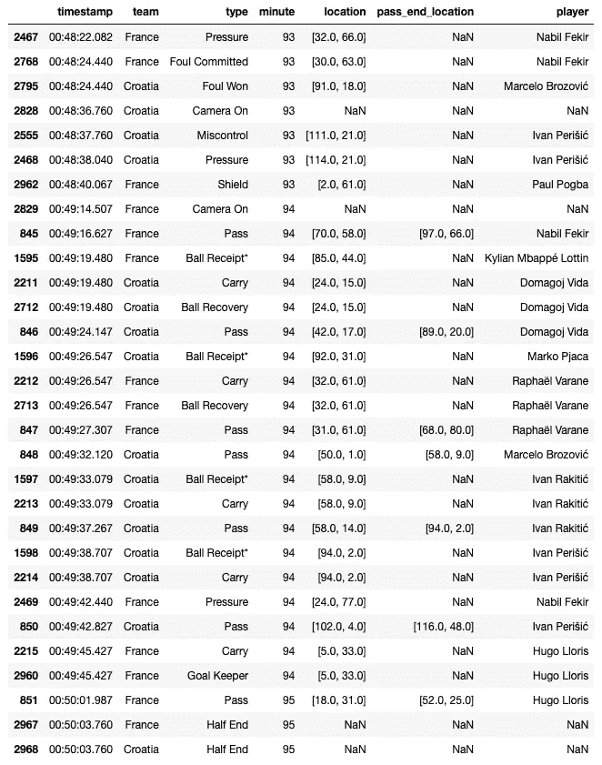

# 如何用 Python 包轻松获取足球数据(无需网络抓取)

> 原文：<https://towardsdatascience.com/how-to-easily-get-football-data-with-a-python-package-without-web-scraping-c922e7ebfb41>

## 在几分钟内获取关于世界杯、冠军联赛、西甲联赛等的数据


图片来自 Shutterstock，授权给 Frank Andrade

足球比赛的每一分钟都会产生数据，这些数据可用于获得高质量的见解，从而推动球员招募、比赛分析并帮助教练做出更好的决策。

不幸的是，大多数在线免费数据集只包含基本数据，如进球、球队名称和比赛日期。

只有基本的统计数据，我们无法获得许多有价值的见解。

要获得高级统计数据，你可以尝试网络抓取，但在花时间在这上面之前，你可以探索一些体育数据提供商免费共享的数据。

在本指南中，我们将探索 Statsbomb 在其 Python 包`statsbombpy`上共享的所有免费足球数据。

## 安装库

为了访问所有的足球数据 Statsbomb 共享，我们需要安装`statsbombpy`。

```
pip install statsbombpy
```

一旦我们安装了库，我们必须导入它。

```
from statsbombpy import sb
```

## 提供比赛

要查看 Statsbomb 免费分享的所有比赛，我们只需要运行`sb.competitions().`

我将删除`country_name`和`competition_name`列中的重复项，以显示 Statsbomb 的独特竞争。

```
# show all competitions
sb.competitions()

# show unique competitions
sb.competitions().drop_duplicates(['country_name', 'competition_name'])
```



我们可以看到，Statsbomb 的免费版有 FIFA 世界杯、欧冠、西甲、英超等比赛。

也就是说，Statsbomb 有更多的竞争对手，这些竞争对手只能通过 API 访问付费用户。

让我们探索数据集中可用的比赛之一——2018 年国际足联世界杯。

## 2018 年国际足联世界杯:探索比赛

为了探索 2018 年 FIFA 世界杯的数据，我们需要`competition_id`和`season_id`。从上图我们可以看到，数值分别是 43 和 3。

```
df_2018 = sb.matches(competition_id=43, season_id=3)
df_2018.head(5)
```



虽然在上图中看不到，但 dataframe `df_2018`有 22 列。这是一个足球分析项目的良好开端。

为了获得关于特定比赛的更多信息，我们需要`match_id`。比如 2018 世界杯决赛，法国 vs 克罗地亚，id 8658。

```
id_final_2018 = 8658
df_2018[df_2018['match_id']==id_final_2018]
```



既然我们已经验证了 8658 是正确的 id，那么让我们来看看这 90 分钟内的阵容和发生的所有事件。

## 阵容

让我们看看法国对克罗地亚的比赛阵容。

```
lineups = sb.lineups(match_id=id_final_2018)
```

如果我们打印`lineups`，我们会看到它是一本字典。让我们看看它的钥匙。

```
>>> lineups.keys()
dict_keys(['France', 'Croatia'])
```

我们可以通过钥匙进入法国和克罗地亚的阵容。

这是克罗地亚的阵容。

```
lineups['Croatia']
```



这是法国队的阵容。

```
lineups['France']
```



## 比赛项目

要获得法国对克罗地亚比赛中的事件，我们需要再次使用比赛的 id。

```
df_events = sb.events(match_id=id_final_2018)
```

让我们看看`df_events`里面的所有列

```
df_events.columns
```



我们可以看到这个数据集中有很多信息。让我们只选择几列，并按`minute`和`timestamp`列对数据帧进行排序。

```
df_events = df_events[['timestamp','team', 'type', 'minute', 'location', 'pass_end_location', 'player']]
df_events = df_events.sort_values(['minute', 'timestamp'])
```

让我们来看看法国对克罗地亚比赛最后一分钟的情况。

```
df_events.tail(30)
```



就是这样！现在你可以自己探索这个包来开始你的足球分析项目。

用 Python 学习数据科学？ [**加入我的 20k 多人电子邮件列表，获取我的免费 Python for Data Science 备忘单。**](https://frankandrade.ck.page/26b76e9130)

如果你喜欢阅读这样的故事，并想支持我成为一名作家，可以考虑报名成为一名媒体成员。每月 5 美元，让您可以无限制地访问数以千计的 Python 指南和数据科学文章。如果你使用[我的链接](https://frank-andrade.medium.com/membership)注册，我会赚一小笔佣金，不需要你额外付费。

<https://frank-andrade.medium.com/membership> 