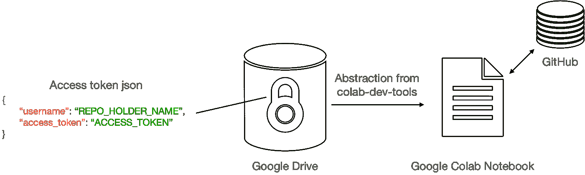

# 如何在 Google Colab 中轻松安装私有 Python 包

> 原文：<https://towardsdatascience.com/how-to-easily-install-private-python-packages-in-google-colab-98a43c8f8976>

## 压缩项目的优雅替代方案

> **TLDR:** 确保了。json 文件包含关键字“用户名”→存储库帐户持有人的姓名，“访问令牌”→您的 GitHub 访问令牌。请注意，该软件包是一个早期版本，将来可能会有所改进。我会尽量保持更新，但如果不是，请访问这里的[库](https://github.com/namiyousef/colab-utils)。

```
!pip install colab-dev-tools
import os
from colabtools.utils import mount_drive, install_private_library
drive_path = mount_drive()
git_access_token_json_path = os.path.join(drive_path, PATH_TO_JSON)
install_private_library(git_access_token_json_path, PROJECT_NAME)
```

Colab 是一个使用免费 GPU 快速测试深度学习模型的伟大工具。不过它和 Jupyter 笔记本相比最大的缺点之一就是不能安装自定义内核。这意味着你每次都需要安装所有你需要的软件包。在大多数情况下，这不是一个特殊的问题，只是一个小麻烦。你所需要做的就是在笔记本内使用`pip install`。

但是，如果您使用的是私有包，所有这些都将失败。也就是说，您正在一个版本化服务(例如 GitHub)上托管的私有存储库上开发的包。这是因为`pip`不再工作，因为你需要认证，这是更难实现的，因为 GitHub 决定对 Git 操作取消[密码认证](https://github.blog/2020-12-15-token-authentication-requirements-for-git-operations/)。

本文详细介绍了一种使用我开发的包 [colab-dev-tools](https://github.com/namiyousef/colab-utils) 安装私有包的可靠而快速的方法。

# 使用私有包

以前我有两种方法在 Colab 上使用私有代码:

1.  **将所有代码复制粘贴到 Colab:** 这仅适用于小项目(例如 1 或 2 个小文件)。不推荐，因为这样会让笔记本又长又乱；这使得版本控制变得非常困难；几乎任何改变都需要对基础代码进行彻底的重构。
2.  **压缩包并在 Colab 上解压缩:**虽然这对于单个用户来说非常有效，但是在团队中维护起来就变得非常困难。zip 文件很容易被放错位置、命名错误，而且版本控制几乎是不可能的。这使得在出现问题时很难重现结果和调试代码。

因为这两种方法都不够，所以必须考虑对 GitHub 进行认证。然而，只有两种方法可以做到这一点:ssh 或使用访问令牌。

当您有固定设备(例如您的计算机)时，ssh 方法非常有用，因为您不需要每次都生成密钥。然而，由于 Colab 是基于会话的，使用 ssh 是一件痛苦的事情，因为每次都需要生成密钥。auth-token 方法更好，但这需要复制粘贴，因为很难记住令牌…

然而，这是有问题的，因为:

1.  每次复制粘贴时都有暴露密钥的风险
2.  您可能会将它留在笔记本中，从而在笔记本推送时暴露它
3.  只是很烦…

因此，我建议的解决方案是将访问令牌存储在您的个人驱动器上，然后每次都从那里读取它，但是要确保读取的内容被一些代码提取出来。这样，您就不会显式地阅读它，从而消除了风险 2)。你也不需要复制粘贴任何东西，因此删除 1)。最后，这个过程非常简单，所以你可以确定你不会因为 3)而感到沮丧。如下图所示。



# 解决办法

```
# install the package
!pip install colab-dev-tools# imports
import os
from colabtools.utils import mount_drive, install_private_library# get path to Drive root, e.g. drive/MyDrive/
drive_path = mount_drive()# get path to the access token
git_access_token_json_path = os.path.join(drive_path, PATH_TO_JSON)# install using pip install:
# git+https://{access_token}@github.com/{username}/{repo_name}.gitinstall_private_library(git_access_token_json_path, PROJECT_NAME)
```

# 结束语

*   确保您的驱动器只能由您访问；这降低了您的访问令牌泄露的可能性。
*   注意，包中的函数只是抽象出代码。他们不会以任何方式加密您的访问令牌密钥。
*   这种方法的一个缺点是访问令牌的路径在笔记本中是可见的。这意味着，如果攻击者能够访问您的驱动器，他们将能够很容易地找到您的访问令牌 json。因此，每次将笔记本推送到 Github 时，删除路径可能是个好主意。
*   这个包还有其他工具在使用 Colab 时很有用，比如测量 GPU 利用率，向 GPU 发送对象等…

[](https://github.com/namiyousef/colab-utils) [## GitHub - namiyousef/colab-utils:使用 colab 和 drive 的辅助函数

### 此时您不能执行该操作。您已使用另一个标签页或窗口登录。您已在另一个选项卡中注销，或者…

github.com](https://github.com/namiyousef/colab-utils) 

*所有图片均由作者提供，除非另有说明*