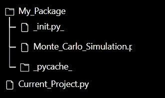

# 如何在新项目中有效地重用您的旧代码

> 原文：<https://towardsdatascience.com/how-to-effectively-reuse-your-old-code-in-a-new-project-7193d5d5605c>

## 编写你自己的 Python 包

来源:https://unsplash.com/photos/H424WdcQN4Y

当您处理数据一段时间后，您会很快意识到代码的大部分可以从一个项目重用到下一个项目。

在接下来的文章中，我将向您展示一种非常简单有效的方法来创建您的个人 python“包”，只要您在**本地**(同一台计算机并使用个人文件)，只需几行代码就可以重用潜在的大量代码。

## 创建个人包的步骤

1.  创建一个名为`_init.py_`的空文件。该文件用于将磁盘上的目录标记为 Python 包目录。换句话说，它让 Python 将包含它的目录视为模块(可以导入)。
2.  **在同一个目录中，创建一个包含您想要重用的代码的文件**。你需要做的是定义一个函数来返回一些东西。例如，在下面的代码中，我定义了一个接受不同参数并返回蒙特卡洛模拟结果的函数。

3.然后，在一个单独的文件夹中，放置你当前的项目，在那里你将需要使用你的“包”。这是代码。

在第 2 行，您只需添加将被重用的代码的位置。

第 4 行是您“导入”包的地方。这里，这一行的意思是我从找到它的文件(Monte_Carlo_Simulation)中导入我创建的函数(Monte_Carlo)。

然后，在第 6 行，我简单地使用这个函数，就像它已经在我当前的项目中一样。它返回结果，我可以在项目的其余部分使用这些结果。

4.**如果出现错误**，请确保您的文件放置正确。它们应该具有以下结构。

如您所见，在 My_Package 文件夹中，您应该会找到一个名为 _pycache_ 的新文件夹。它是在您使用线`from x import y`时创建的。这个文件夹包含了字节码，这使得第二次运行你的程序时速度会快一点。

如果你有正确的结构，但你的“包”仍然不能工作，这可能是因为你的主文件中有一个错误(在我的例子中是 Monte_Carlo_Simulation.py)。

就是这样！这个非常简单的技巧将允许你重用你的代码，而不必不断地复制粘贴它。它还允许您“集中”事情，并且如果您想要进行更改，只需更新您的代码一次(而不是必须在您使用它的每个文件中进行更新)。它也使东西更容易阅读。

希望这有所帮助。非常感谢你的阅读！

成为大媒平台会员:[https://francoisstamant.medium.com/membership](https://francoisstamant.medium.com/membership)

PS:在接下来的一篇文章中，我将向你展示如何创建一个对任何地方的其他人都可用的包**，而不仅仅是你自己。敬请期待！**