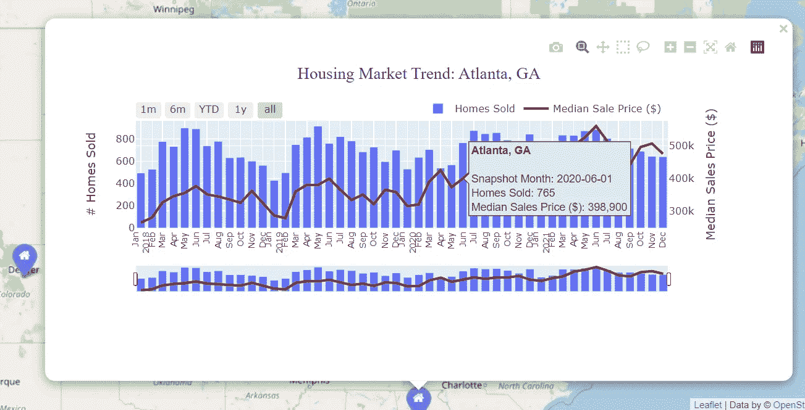
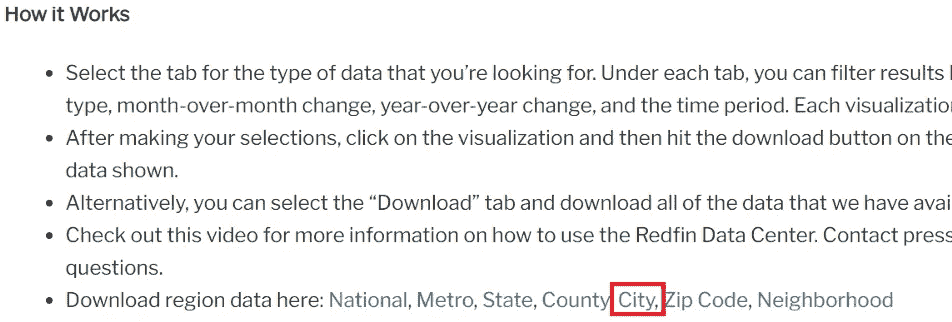
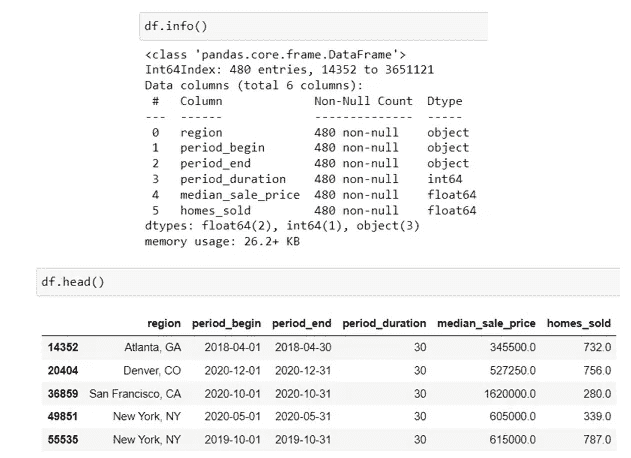
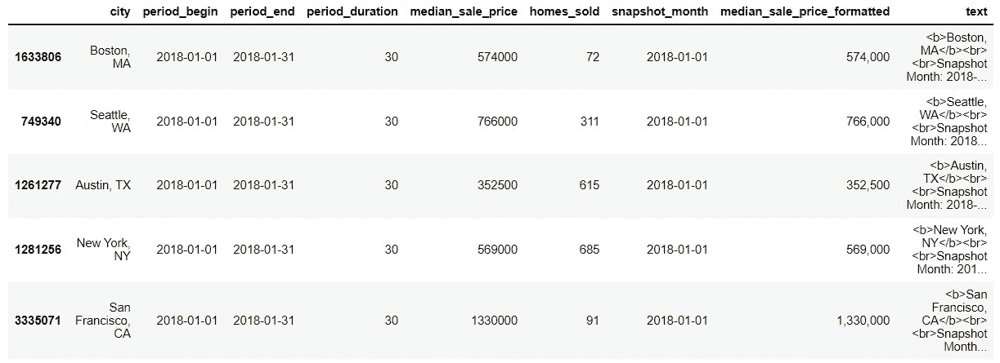
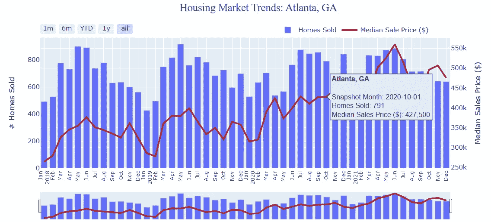
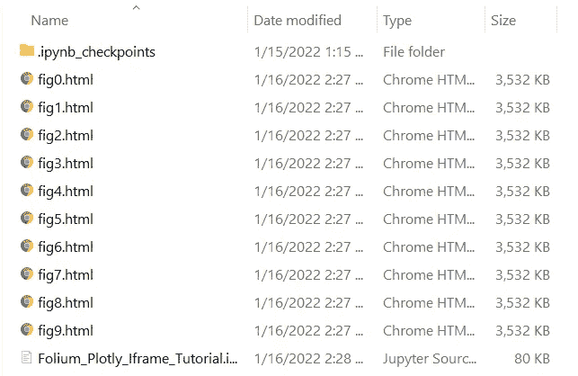
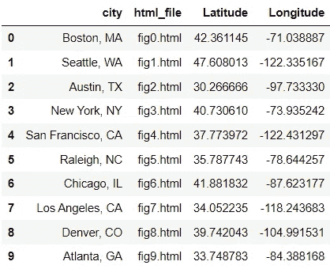
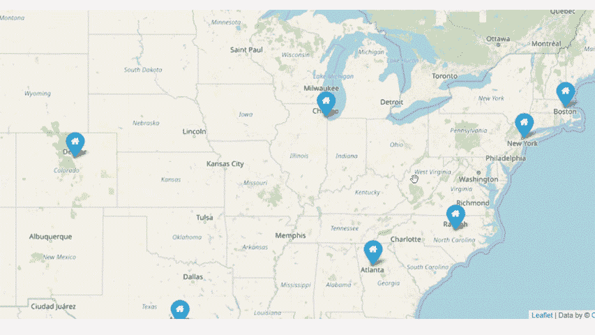

# 如何在树叶地图弹出窗口中嵌入交互式绘图可视化

> 原文：<https://towardsdatascience.com/how-to-embed-interactive-plotly-visualizations-in-folium-map-pop-ups-c69c818a8cd9>

## 一个详细的实践教程来提升你的 Python、Plotly 和 Folium 技能

由 [Pixabay](https://pixabay.com/illustrations/hand-card-empty-questions-map-5716719/) 制作的原始图片(由作者修改)

# 介绍

我最近写了一篇关于如何使用 HTML 将动态文本、图像、网络链接或表格插入到叶子弹出窗口中的文章。在我看来，允许用户将 HTML 网页和可视化作为标记在地图上传递，是 leav 最大的优势之一，并为使地图更具交互性和信息量开辟了无限的可能性。

  

在前面提到的[文章](/use-html-in-folium-maps-a-comprehensive-guide-for-data-scientists-3af10baf9190)的最后，我们谈到了将交互式 Plotly 图表作为 HTML 传递给 leav map markers 的可能性。在这篇文章中，我将向您展示如何使用 for-loop 和 HTML iframe 在 follow 地图弹出窗口中嵌入交互式 Plotly 图表。这是一个非常实用的编码和数据可视化项目，可以提升您的 Python、Plotly 和 Folium 技能。

具体来说，我们将创建一个 leav 地图，在地图中显示 10 个主要的美国城市作为标记。单击每个标记时，会出现一个弹出窗口，并显示一个交互式 Plotly 图表。该图表显示了该市过去 4 年的住房市场趋势，用户可以使用范围滑块选择不同的时间段。我们将要创建的令人惊叹的树叶地图如下所示:

作者图片

# 下载数据

转到 [redfin 的数据中心](https://www.redfin.com/news/data-center/)，向下滚动到“它如何工作”部分，并下载“城市”级别的区域数据。下载的文件是一个. gz 文件，包含美国大多数城市在过去 10 年左右的住房市场指标。这是一个免费的、开放的数据集，你可以下载并引用 Redfin 用于你自己的目的。

来源: [Redfin 房产市场数据](https://www.redfin.com/news/data-center/)

# 导入库和读取数据

首先，让我们导入所有必要的库并将数据读入 Pandas 数据框。这是一个巨大的数据集，所以读取到 Python 中可能需要比正常情况多一点的时间。

此外，出于演示的目的，我们将我们的数据限制在过去 4 年，10 个美国城市，并且只限于单户房产。我们不需要原始数据集中的所有列，所以我们只保留一些我们在这个项目中需要的列。

作者图片

# 数据争论

在上面的数据中有一些事情需要注意。字段“period_begin”是一个字符串，以后使用它绘制时间序列图时可能会导致一些问题。因此，让我们将其更改为“日期”类型，并将其重命名为“快照 _ 月份”。

“median_sale_price”和“homes_sold”字段都有一个不必要的小数位，所以让我们将它们都改为整数类型。我们还将创建一个名为“median_sale_price_formatted”的新字段，显示带有千位分隔符的数字。

最后，让我们创建一个名为“文本”的新字段。我们为什么需要它？默认情况下，当用户将鼠标移动到每个数据点上时，Plotly 会显示一个工具提示，显示一些基本信息。然而，默认选项非常有限，视觉上也不太吸引人，所以我们想创建一个定制的工具提示，以控制悬停工具提示中显示的信息内容和方式。

作者图片

# 创建双 Y 轴绘图图表

我们的数据准备好了，让我们开始绘图。请记住，我们的最终目标是为每个城市创建一个交互式 Plotly 图表，然后将每个图表传递给它在 follow 地图中对应的标记。我们将需要使用 for-loop 和 HTML iframe 来实现这一点。

在我们开始之前，让我们先预热一下，只为**一个城市**创建一个双 y 轴图表。我们可以选择亚特兰大，在条形图中绘制“homes_sold”指标，在折线图中绘制“median_sale_price”指标，并将这两个图组合成一个具有双 y 轴的组合图。我们还将向组合图添加一个定制的悬停工具提示以及一个范围滑块/选择器。

使用 Plotly Graph_Objects，我们首先使用 make_subplots()创建一个图形，以便该图形可以有两个不同比例的 y 轴。然后，我们向图中添加两条迹线，一条表示条形图，另一条表示线图。最后，我们使用 update_layout()方法更新图表，定制图表标题、图例、x 和 y 轴等。

如果你是 Plotly 的新手，你可以阅读下面这篇[文章](/leap-from-matplotlib-to-plotly-a-hands-on-tutorial-for-beginners-d208cd9e6522)来学习 Plotly 和 Plotly Graph_Objects 的基础知识。通过这样做，你将有更容易的时间跟踪和理解接下来的代码！

  

为了便于演示，我将展示整个代码，然后我将对代码的各个部分进行注释，这样您就可以很好地理解它是如何工作的。

第 1–2 行:我们将数据限制在一个城市(亚特兰大，佐治亚州),并使用 make_subplots()方法创建一个具有辅助 y 轴的图形。

第 4–23 行:由于我们绘制的是组合图(折线图和条形图的组合)，我们需要在图中添加两条迹线(迹线表示一种可视化形式，如散点图、条形图、饼图等)。).我们首先使用主 y 轴将条形图添加到图中。然后我们添加使用辅助 y 轴的线图。

请注意，折线图是使用 go 绘制的。散射()*。*这是因为 Plotly 折线图是作为连接散点图实现的。这也意味着数据点按照它们在数据集中出现的顺序用线连接起来(因此我们需要在数据争论步骤中按‘snapshot _ month’对数据集进行排序)。在第 19–20 行，我们还将定制的工具提示传递给折线图。

第 25–43 行:我们通过添加图表标题并指定其位置、字体大小、字体颜色等来更新图表。在第 41 行，我们还可以调整图例的位置。默认情况下，图例总是放置在图表区外的右上角，并且垂直放置。

第 45–55 行:我们还可以向图中添加一个范围选择器/滑块，以便用户可以放大到特定的时间段范围，这使得可视化更具信息性和交互性！这可以通过使用 fig.update_xaxes()用几行代码轻松实现。

作者图片

# 使用 for-loop 为每个城市创建一个 Plotly 图表，并将其导出到 HTML

现在回到我们的最终目标，我们需要使用一个 for 循环来自动执行上面的过程，为每个城市创建一个 Plotly 图表，并将它们导出到 HTML 文件——每个城市一个 HTML 文件！为了帮助您理解这是如何工作的，我将使用相同的策略:我将首先展示整个代码，然后逐部分解释它。

第 1–3 行:我们首先创建一个空的图形容器，在 for-loop 步骤中，我们将一个 Plotly 图形一个接一个地插入其中。我们还将创建两个空的 Python 列表，我们将向其中依次追加城市名和 HTML 文件名。

第 4–8 行:在第 4 行，我们首先获得所有城市名称的唯一列表。然后，我们使用 for 循环遍历数据框，并将每个城市名称及其对应的 HTML 文件名追加到我们之前创建的 Python 列表中(第 6–7 行)。我们还将分别为每个城市创建一个单独的数据框(第 8 行)。

第 10 行:我们为 for 循环中的每个城市创建一个 Plotly 图表/图形。代码与上一节所示的相同，所以我们在这里不再花时间解释。您需要从前面的代码块中复制并粘贴第 2–55 行(第 26 行有一点小的变化),并确保代码放在 for 循环中并正确缩进。

第 12–13 行:对于每个城市，我们创建一个 Plotly 图表，并将其导出到 HTML 文件中。所有十个 HTML 文件将自动保存在与 python 代码文件相同的文件夹中。

作者图片

第 15–17 行:我们创建了一个简单的包含两列的 panda 数据框。第一列包含所有城市名，第二列包含所有相应的 HTML 文件名。

第 18–20 行:我们为每个城市添加纬度和经度信息，并创建最终数据框，将其命名为“df_final”。

作者图片

# 将 HTML 文件传递给树叶地图标记

我们快到了！现在我们有了所有的 HTML 文件，每个文件都包含一个交互式 Plotly 图表，我们可以使用 iframe 将这些 HTML 文件传递给 follow markers。同样，我们将使用 for-loop 来完成这项工作，但也要借助 HTML iframe！

第 1–2 行:我们使用 follow 启动一个空的美国地图，缩放开始级别为 4。我们还通过取这 10 个城市的纬度和经度的平均值来指定大致位于美国中心的位置。

第 4–7 行:我们使用 for-loop 遍历 df_final 数据帧。对于 df_final 中的每个城市，我们取其对应的 HTML 文件(即 fig0.html、fig1.html 等。)并使用标签将其嵌入 iframe 中。

第 9-10 行:我们使用叶子。Popup()方法和 leav。Marker()将每个 iframe 插入到叶子弹出窗口中，最后使用 add_to()方法将所有标记添加到地图中。

第 13 行:我们可以将叶子地图保存到一个 HTML 文件(index.html)中，该文件将与 python 代码文件放在同一个文件夹中。

现在打开 index.html 文件，检查你的地图！单击地图中的每个标记时，会出现一个弹出窗口，显示一个漂亮的交互式绘图可视化效果！只需点击几下鼠标，您就能了解每个城市的房地产市场和趋势！

作者图片

# 结束语

Folium 是一个非常棒的地理空间图形库，它使我们能够在地图上传递丰富的 HTML 可视化标记。当我们用 Plotly 漂亮的交互式数据可视化来丰富 Folium 的地理空间制图功能时，结果确实令人印象深刻！我希望你喜欢这篇文章，并学到一些新的东西，这将对你的下一个地理空间数据科学项目有用！

# **数据来源:**

[Redfin 数据中心](https://www.redfin.com/news/data-center/) : Redfin 月度房市数据——城市级。这是由全国房地产经纪公司[*Redfin*](https://www.redfin.com/news/data-center/)*提供的一个开放数据集，你可以免费下载，并注明出处。*

*你可以通过这个[推荐链接](https://medium.com/@insightsbees/membership)注册 Medium 会员(每月 5 美元)来获得我的作品和 Medium 的其他内容。通过这个链接注册，我将收到你的一部分会员费，不需要你额外付费。谢谢大家！*