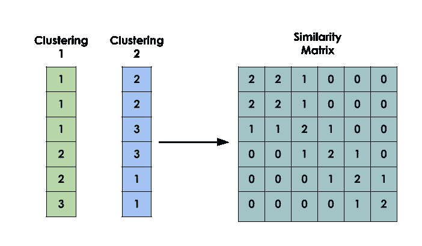
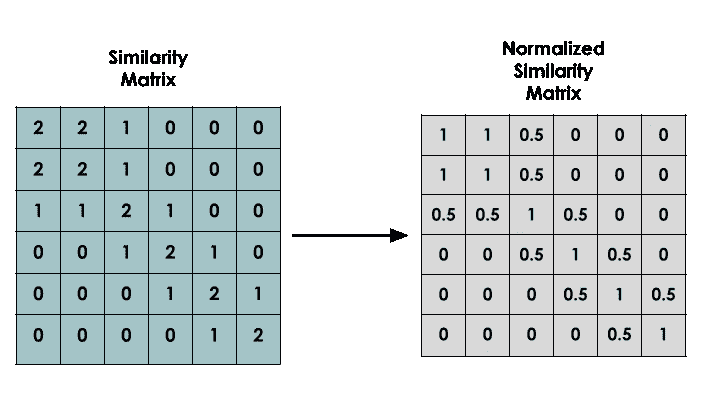
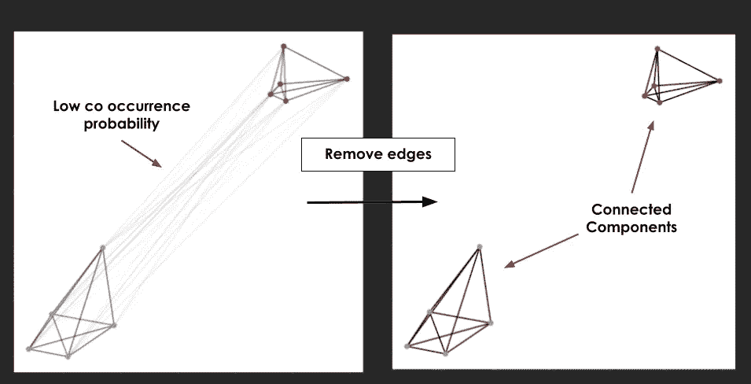
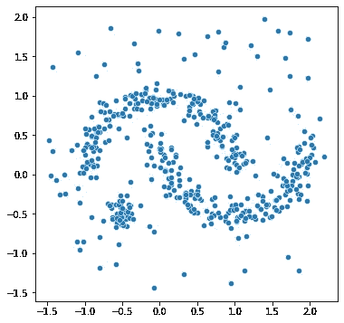
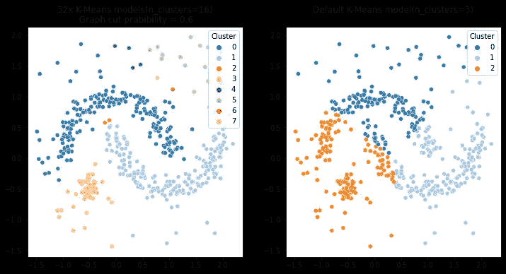
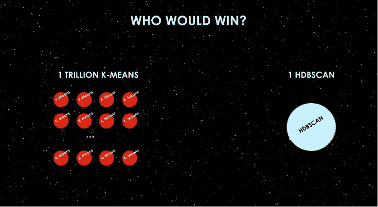
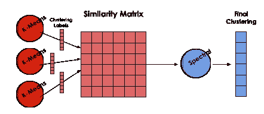
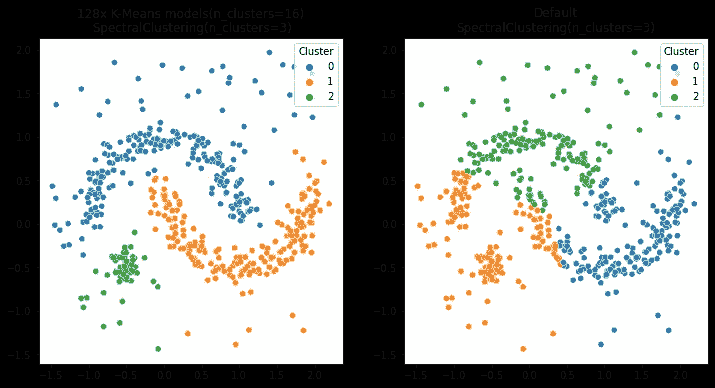
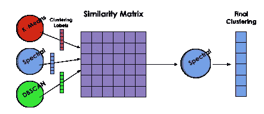

# 如何集成聚类算法

> 原文：<https://towardsdatascience.com/how-to-ensemble-clustering-algorithms-bf78d7602265>

## 意思是你从未见过的


照片由[杜凡](https://unsplash.com/@miinyuii?utm_source=medium&utm_medium=referral)在 [Unsplash](https://unsplash.com?utm_source=medium&utm_medium=referral) 上拍摄

# 介绍

在人工智能背景下，集成是一种试图通过聚合多个机器学习模型的预测来提高性能的技术。它可以被认为是一种元学习，其中外部代理通过判断其他代理的单独预测来计算最终预测。

有几种方法可以集成监督算法，如 bagging 和 boosting。特别是，boosting 技术(尤其是 XGBoost)成为任何机器学习应用程序中不可或缺的工具。

另一方面，在无监督的问题中，我们没有听到很多关于集成技术。那么，有可能在聚类算法中使用这种技术吗？这不仅是可能的，而且这些年来已经发展了许多策略[1]。这篇文章探讨了其中的两个。

# 相似矩阵

与监督方法不同，在监督方法中，集成可以通过将学习者堆叠在其他学习者之上来直接完成，聚类不是那么简单。

在聚类中，数据的最终标签本身没有意义，一个点是在聚类 1 中还是在聚类 2 中并不重要，重要的是谁也在这个聚类中。因此，连接两个不同聚类结果的信息并不像在分类中比较最终标签是否相同那样简单。需要某种方法来计算不同分区上存在多少一致性。

相似性矩阵是将这些信息转换成数据结构的简单方法。它的构造如下:

考虑到我们的数据集上有 *n* 个点，相似性矩阵将是一个 *n* x *n* 矩阵，其中位置( *i，j)* 包含点 I 和 j 在同一个聚类中落了多少次。下图显示了该矩阵的一个示例。



相似性矩阵示例。图片由作者提供。

表示这些信息的更好方法是使用百分比而不是固体计数。在这种归一化形式中，每个位置( *i，j* )表示 I 和 j 一起落在同一聚类中的概率。这种标准化是通过将每一行除以其对角线值(总计数)来获得的。



标准化相似性矩阵示例。图片由作者提供。

这种方法更适合机器学习，因为所有值都落在范围[0，1]内。标准化的相似性矩阵将是我们接下来部分的基本构建模块。

# 具有图连通分量的系综

“图形连接组件”看起来像一个七眼怪物，但却是一个非常简单的技术。这种方法认为出现在一起超过 X%的时间(例如 10%或 50%)的两个点(在同一聚类中)应该在同一最终聚类中。

如果我们将相似性矩阵视为一个图，其中每个点都是一个节点，并且来自(I，j)的边的权重等于矩阵中(I，j)的值，那么这种方法实质上是移除值低于阈值(X%)的边，断开节点。保持连接的节点组是我们的最终集群。这就是这种方法被称为“连接组件”的原因。



从图表中删除边。图片作者。

因为它基于简单的阈值创建新的聚类，所以可以认为它等同于用于监督模型的简单 bagging 集成方法。

让我们看一个 Python 中的例子。

第一步是创建聚类数据集。



聚类数据集。图片由作者提供。

下面的代码使用 K-Means 应用了这种集成聚类技术。

> 完整代码可在 [github](https://github.com/jaumpedro214/posts/blob/main/ensamble_clustering) 上获得，为了提高可读性，省略了实现细节。

我们来解释一下代码。

NUM_KMEANS=32 是集合中使用的 k 均值模型的总数。

该代码使用 MiniBatchKMeans 来减少训练时间。设置 n_init=1 是必不可少的，因为在默认情况下，sklearn 的 K-means 模型会执行多次，并且只保留最好的结果。因为我们希望存储所有结果，所以值 n_init=1 确保了这一点。减少 max_iter 和 batch_size 也可以提高代码速度。

ClusterSimilarityMatrix 只是一个创建相似性矩阵的简单模块。它接收聚类分区并迭代更新计数。相似矩阵建立后，进行归一化处理。

下面一行代码是模型的核心。

```
graph = (norm_sim_matrix>MIN_PROBABILITY).astype(int)
```

在这里，低于 MIN_PROBABILITY=0.6 的概率变成 0(从图中移除边)，而高于 MIN _ PROBABILITY = 0.6 的概率变成 1(保持图中的边)。

MIN_PROBABILITY 的值作为一个*超参数*，应该被细化以达到预期的结果。如果它的值设置得太高(0.9–1.0)，数据可能会分布在许多小簇中，如果它设置得太低(0.2–0.4)，它可能会找到大簇。

在那之后，只是找到图的连通部分的问题。幸运的是，scipy 包已经给了我们代码。

所以，让我们看看结果。



k 均值图结果。图片作者。

正如我们所看到的，集成技术的结果与数据应该如何划分的预期更加一致。

这个技术挺有意思的。众所周知，K-means 只能找到球状星团，使用预定义的 k 值将空间划分为 Voronoi 单元。但是，通过在这种简单的集合技术中应用 k-means 的*大军，他们能够找到更复杂形状的星团，如 HDBSCAN。*



世卫组织会赢吗？图片由作者提供。

# 与其他聚类模型集成

许多聚类算法利用数据的中间表示，例如邻居图或距离矩阵，以便找到最终的聚类。例如，著名的 HDBSCAN 使用*最小生成树*来表示数据。

因此，许多聚类算法接受相似性/距离矩阵作为输入，而不是常规的点列表。因此，前面介绍的相似性矩阵可以输入其中。

这种方法背后的思想是使用一组“较弱的”聚类算法为后面的算法创建一个“较强的”基础。这种方法类似于监督机器学习中的推进技术。



K-均值和谱的集成。图片作者。

让我们看下面的例子，在这个例子中，我们使用常规的 K-Means 来“提高”谱聚类算法的性能。

> 重要的是要记住“改进”和“更好”的概念在集群中可能是棘手的，因为没有集群是/应该是什么样子的明确绝对定义[2]。

像以前一样，创建了一组 NUM _ 均值 K 均值模型。aggregator_clt 是负责聚类相似性矩阵的算法，创建最终的聚类标签。

128 个 K 均值模型被用作“较弱”的学习器，谱聚类被用作聚合器。设置 affinity="precomputed "很重要，这样模型才能理解相似性矩阵是为*传递的。*合体()【法。

> ***注* :**
> 谱聚类算法接受相似性矩阵，但并非所有超参数(sklearn)中具有 affinity="precomputed "或 metric="precomputed "的聚类模型都是如此。有的需要一个*距离矩阵*，正好相反。将归一化相似度矩阵转换为距离矩阵的简单方法是应用对数变换，距离= -log(相似度)，只需使用一些技术来避免 0≥相似度或相似度> 1

EnsembleClustering 是一个简单的类，用于封装相似性矩阵的创建和模型的训练。

所以，让我们看看结果。



集合 K-均值+光谱与光谱独奏。图片由作者提供。

谱聚类不是像 k-means 那样简单的模型，(奇怪的是，它可以使用 K-Means 作为实现的一个步骤)，但是它不能找到我们想要的聚类。集成方法在视觉上比单独的谱聚类执行得更好。

重要的是要记住，这篇文章使用迷你批处理 k-means 只是为了提高执行速度。任何聚类算法都可以用来构建相似性矩阵(只是要小心离群值)。因此，作为家庭作业，我建议尝试使用一组*异构*聚类算法运行代码，如下图所示。



使用不同来源构建相似性矩阵。图片由作者提供。

# 结论

集成技术在许多监督机器学习任务中达到了最先进的水平。另一方面，在集群中，它们不太出名，实现起来也不那么简单。希望这篇文章能让我们了解如何在聚类上进行集成。

我们能够使用 K-means 模型(最简单的聚类模型之一)来执行非球状聚类，而不需要传递 K 值。它还能够“改进”另一种聚类算法的结果。

当然，像生活中的一切一样，没有什么灵丹妙药，这篇文章也不是由“集群合奏公司”赞助的。

这篇文章的主要目的是介绍集成聚类的技术。尽管它们非常简单，但我希望这篇文章中涉及的技术能够帮助您理解这个过程是如何工作的。

这篇短文只是触及了聚类集成主题的表面，请在下面的参考资料中搜索更多信息。包含代码的 Github 存储库也在参考资料部分。

感谢您的阅读！:)

# 参考

> GitHub 上的代码:
> [https://GitHub . com/jaumpedro 214/posts/tree/main/ensamble _ clustering](https://github.com/jaumpedro214/posts/tree/main/ensamble_clustering)

[1]t .布恩戈恩和 n .伊姆翁(2018 年)。集群集成:最近扩展和应用的方法综述。 *计算机科学评论*， *28* ，1–25。
[2]亨宁，C. (2015)。[什么是真正的集群？](https://www.google.com.br/)。*模式识别字母*， *64* ，53–62。
【3】Scikit-Learn，[聚类算法官方文档](https://scikit-learn.org/stable/modules/clustering.html)
【4】维基百科文章，[组件(图论)](https://en.wikipedia.org/wiki/Component_(graph_theory))。