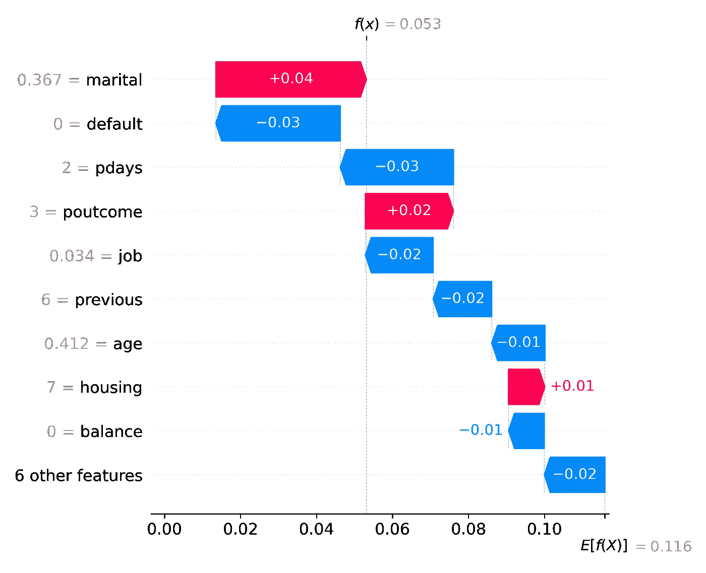

# 如何确保你能解释为什么你的模型做出预测

> 原文：<https://towardsdatascience.com/how-to-ensure-you-can-explain-why-your-model-makes-predictions-d2c769270e>

## 从模型中提取信息来解释为什么会做出预测的技术


由[在](https://unsplash.com/@77hn?utm_source=medium&utm_medium=referral) [Unsplash](https://unsplash.com?utm_source=medium&utm_medium=referral) 上拍摄的 77 人需求系统

可解释性是你可以在机器学习和数据科学中学习和应用的最重要的主题之一。建立一个表现良好的模型是一回事，帮助你和其他人理解**为什么**一个模型会产生它所产生的结果是另一回事。

我们举个例子。假设您正在构建一个机器学习模型，该模型将预测客户购买产品的可能性。我们可能有关于他们的不同的人口统计信息，我们可能有关于他们消费的其他产品的信息，我们可能有关于他们的营销信息。仅仅预测客户购买产品的可能性是不够的，我们需要了解他们为什么购买。

通过了解该模型的**关键驱动因素**，我们或许能够通过关注这些关键驱动因素来提高销售转化率。例如，我们知道人们在一个月或一天中的特定时间更有可能改变信仰；我们可以将我们的销售努力集中在那些更有成效的时间窗口。

现在回想一下你的基础统计学课程和学习简单的线性回归。我们大概都记得一条线的方程:`Y = MX + B`。我们利用这个等式和系数来预测`Y`的新值。许多机器学习模型也是如此。如果我们能解释一个模型的每个特征如何影响结果，我们就能帮助其他人理解它是如何工作的。关于简单线性回归的更多内容，请查看我的文章:[了解 Excel 强大的线性回归工具](/i-bet-you-didnt-know-excel-could-do-a-linear-regression-like-this-a82af6e1dce0)。我们将从三个主要方面来解释你的模型。让我们跳进来吧！

1.  线性和逻辑回归系数
2.  特征重要性
3.  SHAP 价值观

# 数据和导入

对于我们今天的演示，我们将使用**银行营销 UCI** 数据集，您可以在 [Kaggle](https://www.kaggle.com/c/bank-marketing-uci) 上找到该数据集。该数据集包含有关营销活动中银行客户的信息，以及可以在分类模型中使用的目标变量。该数据集位于 CC0:公共领域下的公共领域，可用于任何目的。

有关构建分类模型的更多信息，请查看:[构建令人惊叹的二进制分类器所需要知道的一切](/everything-you-need-to-know-to-build-an-amazing-binary-classifier-590de3482aad)和[通过多类和多标签模型超越了二进制分类](/go-beyond-binary-classification-with-multi-class-and-multi-label-models-6ce91ca08264)。此外，查看一篇密切相关的文章 [4 在机器学习模型中增强特征选择的方法](/4-methods-to-power-feature-engineering-for-your-next-ml-model-5d32fffbe511)。

我们将从导入必要的库和加载数据开始。我们将利用 Scikit-Learn 来学习每一种不同的技术。

```
import pandas as pd

from sklearn.model_selection import train_test_split
from sklearn.ensemble import RandomForestClassifier
from sklearn.linear_model import LogisticRegression
from sklearn.preprocessing import MinMaxScaler
from sklearn.compose import ColumnTransformer
from sklearn.preprocessing import LabelEncoder
from sklearn.preprocessing import OrdinalEncoder
from sklearn.compose import make_column_selector as selector
from sklearn.pipeline import Pipeline

import xgboost
import shap

import matplotlib.pyplot as plt
import seaborn as sns

df = pd.read_csv("bank.csv", delimiter=";")

# This column has too much effect on the model, so we'll drop it
df = df.drop(["duration"], axis=1)
```

# 数据准备

我们需要对这个数据集做的第一件事是将我们的目标变量从其余数据中分离出来。因为它位于最后一列，所以我们可以使用`iloc`函数来分隔它。

```
# Separate the target variable from the rest of the data
X = df.iloc[:, :-1]
y = df.iloc[:,-1]
```

像往常一样，我们希望为机器学习准备数据。这意味着对分类值进行编码、对文本进行矢量化(如果合适的话)以及对数值进行缩放。我总是使用管道来确保数据的一致转换。查看我的文章，[停止一步一步地构建你的模型。利用管道实现流程自动化！](/using-pipelines-in-sci-kit-learn-516aa431dcc5)，了解更多关于管道的信息。

我们将利用一个`ColumnTransformer`并将`MinMaxScaler`应用于数字数据，将`OrdinalEncoder`应用于分类数据。有许多编码数据的策略，例如`OneHotencoder`。然而，出于解释的目的，我们将通过简单地使用序号编码器得到一个更易解释的结果模型集，因为对于每个分类值，列将保持为单个列，而不是多个列。

```
column_trans = ColumnTransformer(transformers=
        [('num', MinMaxScaler(), selector(dtype_exclude="object")),
        ('cat', OrdinalEncoder(),selector(dtype_include="object"))],
        remainder='drop')
```

利用我们的`y`值上的`LabelEncoder`来确保它被编码为一个数值也是一个最佳实践。

```
# Encode the target variable
le = LabelEncoder()
y = le.fit_transform(y)
```

最后，在我们开始之前，我们将把我们的数据分成**训练**和**测试**组。

```
# Split the data into 30% test and 70% training
X_train, X_test, y_train, y_test = train_test_split(X, y, test_size=0.3, random_state=0)
```

# 线性和逻辑回归系数

正如在引言中提到的，线性和逻辑模型是非常好解释的。我们可以很容易地提取每个特征的系数，并用它们来解释模型。如果你的数据适合线性或逻辑回归，它们往往是解释能力的最佳模型之一。您可以根据每个要素对结果的影响对其应用数学权重。让我们看一个数据集上的例子。

我们将从创建我们的**分类器**和**管道**和**的实例开始，使**适合我们的训练数据。

```
# Create a random forest classifier for feature importance
clf = LogisticRegression(random_state=42, 
                             max_iter=1000, 
                             class_weight='balanced')

pipeline = Pipeline([('prep',column_trans),
                        ('clf', clf)])

# Fit the model to the data
pipeline.fit(X_train, y_train)
```

现在我们有了 fit 管道，我们可以从中提取一些信息。这里，我们通过调用管道中分类器的`coef_`属性来提取每个特征的系数。

```
pipeline['clf'].coef_[0]
```

```
array([0.75471553, -1.11473323, -0.0714886 , -3.2587945 , 1.78373751,
        2.61506079,  0.02806859,  0.13490259,  0.1151557 ,  0.09080435,
       -0.47980448, -0.82908536, -0.5171127 ,  0.01441912,  0.14207762])
```

您可以看到数据集中每一列的每个系数，正的或负的。我们一会儿会让它更容易阅读。在此之前，我们先来看看`intercept_`。

```
pipeline['clf'].intercept_[0]
```

```
-0.5418635990682154
```

让我们以更易读的格式显示系数。我们将首先创建一个包含系数和列名的数据框。

```
feat_list = []
total_importance = 0
# Make a data frame of Coefficients and Feature Names
for feature in zip(X, pipeline['clf'].coef_[0]):
    feat_list.append(feature)
    total_importance += feature[1]

# create DataFrame using data
df_imp = pd.DataFrame(feat_list, columns =['FEATURE', 'COEFFICIENT']).sort_values(by='IMPORTANCE', ascending=False)
df_imp.sort_values(by='IMPORTANCE', ascending=False)
```

```
 FEATURE  COEFFICIENT
5     balance     2.615061
4     default     1.783738
0         age     0.754716
14   poutcome     0.142078
7        loan     0.134903
8     contact     0.115156
9         day     0.090804
6     housing     0.028069
13   previous     0.014419
2     marital    -0.071489
10      month    -0.479804
12      pdays    -0.517113
11   campaign    -0.829085
1         job    -1.114733
3   education    -3.258795
```

现在我们可以很容易地看到每个特性对模型结果的影响。例如**平衡**的系数为`2.615061`。这意味着平衡每增加一个单位，正面结果的几率就会增加`2.615061`。我们还可以看到**教育**有一个`-3.258795`的系数。这意味着教育每增加一个单位，积极成果的概率就会减少`-3.258795`。

在这种情况下，你可以与销售和营销人员沟通的一种方式是“*关注平衡水平较高的人，避开教育水平较低的人*”。

# 特征重要性

接下来，对于基于树的分类器和回归器，我们可以输出**特征重要性**。这是一个极好的功能，既可以选择最有影响力的功能，也可以帮助解释模型。让我们看一个使用数据集的例子。我们将以与之前相同的方式开始，创建分类器和管道的实例，然后使其适合我们的训练数据。

```
# Create a random forest classifier for feature importance
clf = RandomForestClassifier(random_state=42, 
                             n_jobs=6, 
                             class_weight='balanced')

pipeline = Pipeline([('prep',column_trans),
                        ('clf', clf)])

pipeline.fit(X_train, y_train)
```

类似于逻辑回归的`coef_`属性，我们有一个`feature_importances_`属性为我们提供相对重要性。与系数不同，特征重要性是每个特征重要性的相对度量。所有特征重要性的总和等于 1。您可以将这些视为相对重要性，而不是数学权重。

```
pipeline['clf'].feature_importances_
```

```
array([0.15169613, 0.1668886 , 0.13429024, 0.07288524, 0.05647985,
       0.02818437, 0.07880281, 0.03797838, 0.04328934, 0.00404282,
       0.02838248, 0.02165701, 0.04896554, 0.09215941, 0.03429777])
```

让我们用一种更易读的格式来显示特性的重要性。我们将首先创建一个数据框，其中包含要素重要性、列名以及所有要素重要性的累积和。

```
feat_list = []

total_importance = 0
# Print the name and gini importance of each feature
for feature in zip(X, pipeline['clf'].feature_importances_):
    feat_list.append(feature)
    total_importance += feature[1]

# create DataFrame using data
df_imp = pd.DataFrame(feat_list, columns =['FEATURE', 'IMPORTANCE']).sort_values(by='IMPORTANCE', ascending=False)
df_imp['CUMSUM'] = df_imp['IMPORTANCE'].cumsum()
df_imp
```

```
 FEATURE  IMPORTANCE    CUMSUM
1         job    0.166889  0.166889
0         age    0.151696  0.318585
2     marital    0.134290  0.452875
13   previous    0.092159  0.545034
6     housing    0.078803  0.623837
3   education    0.072885  0.696722
4     default    0.056480  0.753202
12      pdays    0.048966  0.802168
8     contact    0.043289  0.845457
7        loan    0.037978  0.883436
14   poutcome    0.034298  0.917733
10      month    0.028382  0.946116
5     balance    0.028184  0.974300
11   campaign    0.021657  0.995957
9         day    0.004043  1.000000
```

我们可以看到**工作**是最重要的特征，其次是**年龄**和**婚姻**。再次注意，这和我们看系数的方式有点不同。例如，**年龄**很容易用系数来解释，因为数字越大，人的年龄就越大，但是对于**工作**，我们有一个编码特征，它不是真正有序的，这使得它对系数意义不大，但对特征重要性意义更大。这是你的管道和**编码策略**需要考虑的事情——你将如何解释结果？

# SHAP 价值观

**SHAP** ，代表 **SHapley 加法解释**，是最先进的机器学习解释能力。该算法于 2017 年由 [Lundberg 和 Lee](https://arxiv.org/abs/1705.07874) 首次发表，是一种对任何预测算法的输出进行逆向工程的方法。

SHAP 基于博弈论的一个概念，我们有复制模型结果的**游戏**，而**玩家**是模型中包含的特征。SHAP 量化了每个玩家对游戏的贡献。

让我们看看 SHAP 是如何处理我们的数据集的。我们将首先创建一个分类器实例，在本例中是非常流行的 XGBoost 和 pipeline，然后使它适合我们的训练数据。

```
clf = xgboost.XGBRegressor()

pipeline = Pipeline([('prep',column_trans),
                        ('clf', clf)])

pipeline.fit(X_train, y_train);
```

```
model = pipeline['clf']

# explain the model's predictions using SHAP
explainer = shap.Explainer(model, 
                           pipeline['prep'].transform(X_train), 
                           feature_names=X_train.columns)
shap_values = explainer(pipeline['prep'].transform(X_train))

# visualize the first prediction's explanation
fig = shap.plots.waterfall(shap_values[1])
plt.tight_layout()
plt.savefig('explainability_01.png', dpi=300);
```



作者图片

瀑布图显示了对单个预测的解释。每一行都显示了每个要素的正(红色)或负(蓝色)贡献如何移动本次预测的预期模型输出值。

看 x 轴，可以看到**期望值**是`E[f(x)] = 0.112`。该值是所有观测值的平均预测值。结束值为`f(x) = 0.053`，是本次观测的预测数。在本例中，我们有一个二进制目标值，因此该预测非常接近于`0`或在营销活动中无法转化的客户)。SHAP 值是介于两者之间的所有值。例如，**婚姻**状态的积极变化将增加`0.04`产生积极结果的概率。

# 结论

机器学习中的模型可解释性是你可以在实践中学习和实现的最重要的概念之一。理解如何解释为什么您的模型会以这种方式执行，可以转化为更好的业务决策和对您的模型的更多信任。在这篇文章中，我们看了几种解释我们模型的方法。我们查看了逻辑回归的**系数**，随机森林模型的**特征重要性**，以及 XGBoost 模型的 **SHAP 值**。您可以使用这些方法来解释您的模型，并帮助您理解为什么您的模型会做出这样的预测。快乐模型建筑！

这篇文章的所有代码都可以在 GitHub 上找到。

如果你喜欢阅读这样的故事，并想支持我成为一名作家，考虑注册成为一名媒体成员。一个月 5 美元，让你可以无限制地访问成千上万篇文章。如果您使用 [*我的链接*](https://medium.com/@broepke/membership) *注册，我将为您赚取一小笔佣金，无需额外费用。*