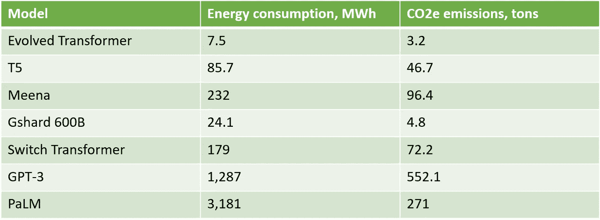
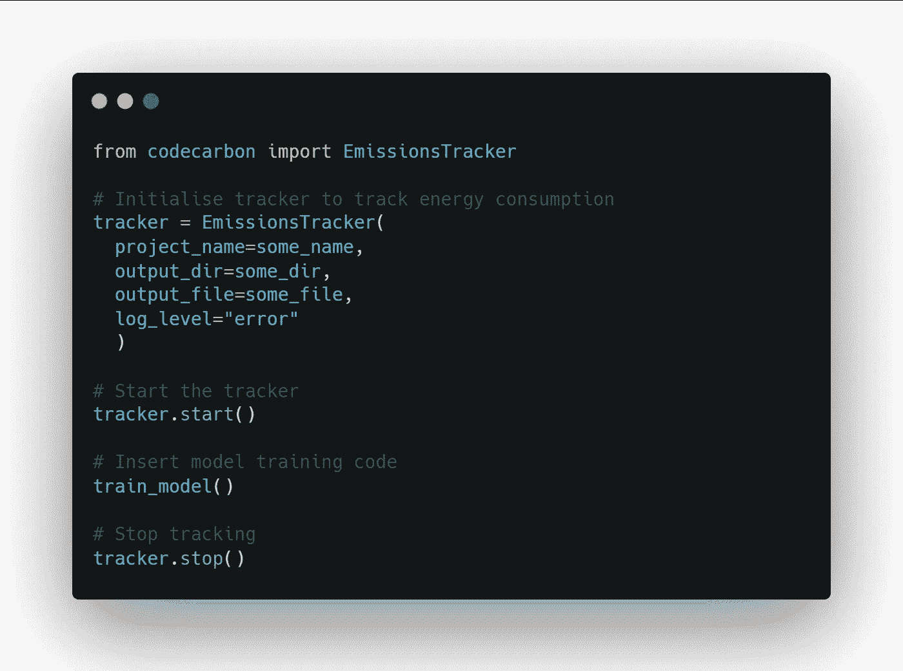
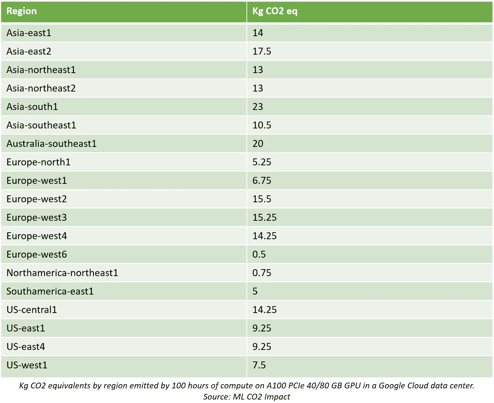
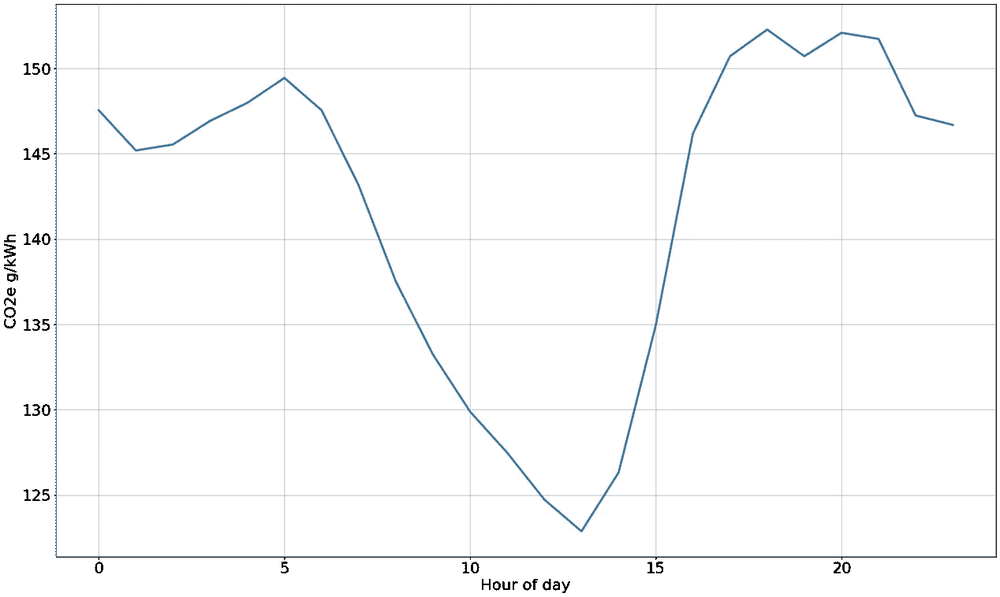
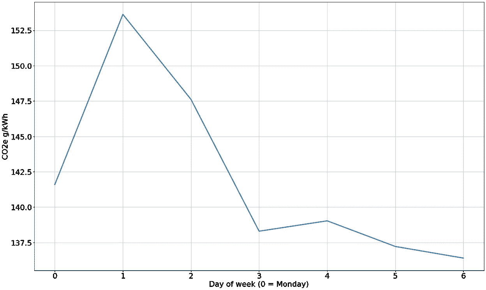
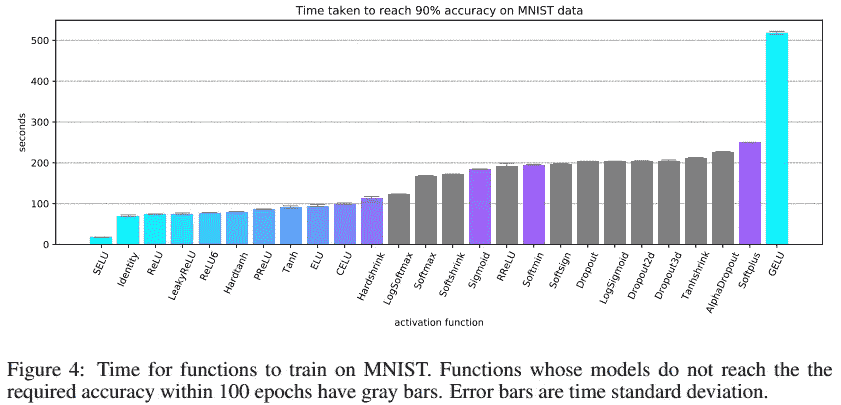
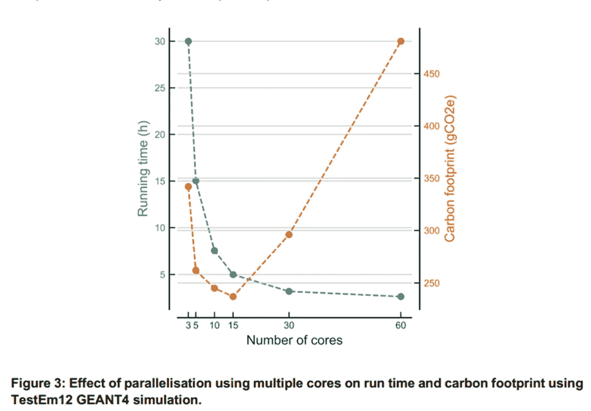
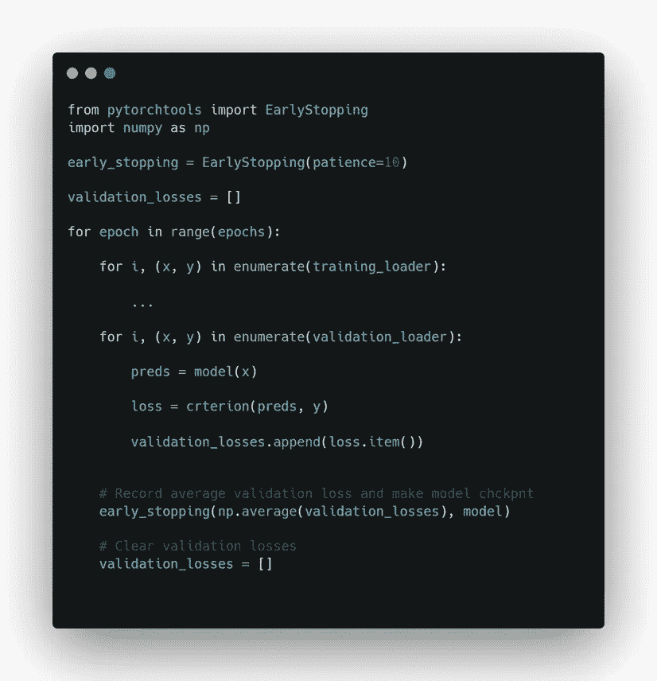

# 如何估计和减少机器学习模型的碳足迹

> 原文：<https://towardsdatascience.com/how-to-estimate-and-reduce-the-carbon-footprint-of-machine-learning-models-49f24510880>

## 轻松估算机器学习模型碳足迹的两种方法和如何减少碳足迹的 17 个想法

照片由[在](https://unsplash.com/@appolinary_kalashnikova?utm_source=medium&utm_medium=referral) [Unsplash](https://unsplash.com?utm_source=medium&utm_medium=referral) 上的卡拉什尼科夫拍摄

机器学习模型的环境影响越来越受到关注，但主要来自学术界。在这里，对话往往集中在语言模型的碳足迹上，这些语言模型不一定代表一般的机器学习领域，并且对机器学习模型的操作阶段的环境影响关注不够。

此外，关于机器学习的环境影响这一主题的现有材料对如何实际估计和减少环境影响的强调太少。本文试图解决这些问题，是为从事机器学习实践的从业者和研究人员而写的。虽然这篇文章是考虑到机器学习而写的，但其中的一些内容也适用于一般的软件工程。

这篇文章的结构如下:

1.  首先，我们来看一些来自机器学习的碳排放的具体例子。
2.  然后，我将介绍两种工具，它们可以用来估计机器学习模型的碳足迹。
3.  在第三部分，我将提出 17 个想法，告诉你如何减少机器学习相关工作的碳足迹。
4.  最后，我将介绍一些机器学习可持续性的考虑因素，这些考虑因素在这里没有直接提到，但仍然很重要。

在我们开始之前，我想强调的是，这篇文章不是用来指责或者说教的。这样做的目的只是为了展示你可能会发现或可能不会发现与你的日常活动相关的信息。

# 1.数据科学和机器学习对环境的影响

所有软件——从运行在我们手机上的应用程序到运行在云中的数据科学管道——都消耗电力，只要我们的电力不是全部由可再生能源产生，电力消耗就会产生碳足迹。这就是为什么机器学习模型可以有碳足迹。

我将使用术语“碳足迹”来指代 CO₂e 的排放量，其中“e”是“当量”的缩写由于甲烷、一氧化二氮甚至水蒸气等其他气体也具有变暖效应，为了简化起见，CO₂-equivalents (CO₂e)通常提供一种标准化的方法来描述一定量的气体会产生多大的变暖效应。

据我所知，在撰写本文时，还没有报告试图估算机器学习领域的总碳足迹。这个结论最近得到了[1]的呼应。

然而，在估计全球数据中心行业的总电力消耗方面已经进行了多种尝试。2015 年和 2016 年报告的数据中心全球能耗估计值在全球电力消耗的 3-5%之间[2][3]。最近，一些人声称数据中心占全球用电量的 1%[4][5]。根据我对这一主题的一些文献的回顾，我的印象是 1 %的估计比 5 %的估计更准确。

如果我们看看组织层面上机器学习的能耗，谷歌说公司总能耗的 15 %用于研究、开发和生产中与机器学习相关的计算[6]。NVIDIA 估计 80–90%的机器学习工作量是推理处理[7]。类似地，Amazon Web Services 已经声明云中 90%的机器学习需求是用于推理的[8]。这远远高于一家未透露姓名的大型云计算提供商在最近的经合组织报告[1]中提出的估计。这家提供商估计，企业客户在计算基础设施上的总支出中有 7-10%用于人工智能应用，其中 3-4.5%用于训练机器学习模型，4-4.5%用于推理。

现在让我们来看看机器学习模型碳足迹的一些具体例子。

表 1 显示了一些大型语言模型的估计能耗和碳足迹的概况。碳足迹从 3.2 吨到 552 吨 CO₂e.不等。现在你可能会注意到，PaLM 的能耗明显大于 GPT-3，尽管 GPT-3 的估计碳足迹是 PaLM 的两倍多。这可能是由于用于训练模型的电力的碳强度的差异。为了客观地看待这些大型语言模型的碳足迹，平均每个美国人一年产生 16.4 吨 CO₂e 排放量[9]，平均每个丹麦人产生 11 吨 CO₂e 排放量[10]。因此，GPT 3 号的碳足迹大约相当于 50 个丹麦人一年的碳足迹。

表 1:7 个大型深度学习模型的能耗。改编自[6]和[11]

查看几个使用语言模型进行推理的碳足迹示例，脸书估计他们基于转换器的文本翻译通用语言模型的碳足迹主要由推理阶段控制，使用的推理资源(65%)比训练(35%)多得多[40]。脸书的 ML 训练任务的平均碳足迹是现代对话代理中使用的 Meena 的 1.8 倍，是 GPT-3 的 0.3 倍。

BigScience 的开源语言模型 BLOOM 在 18 天内处理了 230，768 个请求，消耗了 914 千瓦时的电力，排放了 360 千克的二氧化碳，相当于每个请求大约消耗 1.56 gco₂e[41]。

这些大型语言模型在碳足迹方面是极端的情况，很少有数据科学家会从头开始训练这样的大型模型。因此，现在让我们考虑一个可能更接近大多数数据科学家和 ML 工程师日常生活的案例。我最近在法兰克福的 GPU 上训练了一个用于时间序列预测的 [Transformer 模型](/how-to-make-a-pytorch-transformer-for-time-series-forecasting-69e073d4061e)3 个小时。这消耗了 0.57 千瓦时的电力，碳足迹为 340 克 CO₂e，大约相当于一个丹麦人年碳足迹的 0.003 %。

从历史上看，获得最先进结果所需的计算量每 3.4 个月就会翻一番[12]，因此这个问题可能会变得更加复杂——这是[13]中的一个担忧——尽管一些人预计由于算法和硬件的改进，能耗会降低[6]。

综上所述，由于缺乏数据，很难描绘出机器学习领域碳足迹的全貌，但特定的模型，特别是语言模型，可能会有很大的碳足迹，一些组织在机器学习相关活动上花费了相对较大的总能耗。

 [## 8 集关于机器学习对气候影响的播客

### 这里有一个精心策划的列表，列出了 8 个关于机器学习的环境足迹以及如何…

towardsdatascience.com](/8-podcast-episodes-on-the-climate-impact-of-machine-learning-54f1c19f52d) 

# 2.如何估计机器学习模型的碳足迹

在我们深入研究可以估计机器学习模型碳足迹的工具的细节之前，熟悉一下计算碳足迹的公式是有帮助的。这非常简单:

> 碳足迹= E * C

其中 *E* 是在一些计算过程中消耗的电力单位的数量。这可以量化为千瓦时(kWh)。 *C* 是指生产一单位电能所排放的 CO₂e 量。这可以量化为每千瓦时电力排放的千克 CO₂e，有时也称为电力的碳强度。碳强度因地理区域而异，因为能源来源因区域而异。一些地区有大量的可再生能源，一些地区则较少。给定这个等式，我们现在可以看到，任何估计一些计算程序的碳足迹的工具必须测量或估计 *E* 和 *C.*

有几种工具可以用来估计机器学习模型的碳足迹。根据我的经验，这些工具分为两类:

1.  从*估算碳足迹的工具估算*的 *E (* 能源消耗)
2.  从*测量值*到 *E (* 能源消耗)估算碳足迹的工具

在本帖中，我们将仔细看看两个这样的工具:

1.  ML CO2 影响，依赖于 *E* 的*估计值*，因此属于上述第 1 类
2.  CodeCarbon 依赖于 *E* 的*测量值*，因此属于上述类别 2

请注意，其他软件包，例如*carbon tracker*【14】和*experiment-impact-tracker*【15】提供了与 CodeCarbon 类似的功能，但我选择关注 CodeCarbon，因为这个软件包似乎在不断更新和扩展，而最近对 *carbontracker* 和*experiment-impact-tracker*的提交是很久以前的事了。

必须注意的是，本文中介绍的工具仅估算了一些计算过程中所使用的电力的碳足迹。例如，他们没有考虑与制造运行代码的硬件相关的排放。

## 2.1.用 ML CO2 影响估计机器学习模型碳足迹

基于网络的免费工具 ML CO2 Impact [16]通过估计训练过程的电力消耗来估计机器学习模型的碳足迹。要使用此工具估算碳足迹，您只需输入以下参数:

1.  硬件类型(例如 A100 PCIe 40/80 GB)
2.  硬件使用的小时数
3.  使用了哪个云提供商
4.  计算发生在哪个云区域(例如“欧洲-北方 1”)

该工具然后输出你的机器学习模型排放了多少千克 CO₂e。其计算方法如下:

基于当地电网的功耗*时间*碳排放量，例如:

250 瓦 x 100h 小时= **25 千瓦时** x 0.56 千克当量。二氧化碳/千瓦时= **14 公斤 CO₂e**

该工具还显示了碳密度较低的云区的排放量。

像 ML CO2 Impact 这样的工具的好处是，它可以事后用于估计你自己或其他人的模型的碳足迹，而你不必编辑你的脚本来计算估计值。

像 ML CO2 Impact 这样的工具的缺点是，它依赖于对能源消耗的估计，这自然意味着它对碳足迹的估计可能是错误的。事实上，这样的工具可以以 2.42 的比率关闭，如下图 1 所示。

图 1 [17]

## 2.2.用 CodeCarbon 估计机器学习模型的碳足迹

CodeCarbon [18]是一个适用于 Python 和其他语言的软件包，可以通过在命令提示符下运行`pip install codecarbon`来安装。CodeCarbon 是这样计算代码的碳足迹的:

CodeCarbon 以固定的时间间隔(例如 15 秒)直接测量执行代码的 GPU、CPU 和 RAM 的耗电量。请注意，CodeCarbon 既可以在本地机器上运行，也可以在云机器上运行。该软件包还监控代码执行的持续时间，并使用这些信息来计算代码的总耗电量。然后，CodeCarbon 会检索您的硬件所在地理位置的电力碳强度信息。如果您在云中训练，CodeCarbon 会自动检索您的云实例的位置信息。然后将电力的碳强度乘以该代码消耗的电量，以提供该代码消耗的电力的总碳排放量的估计值。

可以通过几种方式在您的代码中使用该工具。一种方法是初始化跟踪器对象。当跟踪器对象停止时，CodeCarbon 的默认行为是将结果保存到一个. csv 文件中，该文件将包含有关您的代码消耗了多少电力(以 kWh 为单位)以及该电力释放了多少 CO₂e(以 kg 为单位)的信息。代替写入文件系统，信息可以被发送到记录器[30]。假设您有一个执行模型训练的函数`train_model()`，那么您可以像这样使用 CodeCarbon:

另一种方法是使用 CodeCarbon 作为上下文管理器，如下所示:

最后，CodeCarbon 可以用作函数装饰器:

注意，如果构造函数的参数`log_level`被设置为默认值，CodeCarbon 会在每次对你的硬件进行能量消耗测试时打印出几行文本。这将很快淹没您可能有兴趣在模型训练期间在终端中查看的其他信息。如果您改为设置`log_level="error"` CodeCarbon 将只在遇到错误时打印到终端。

还可以可视化能源消耗和排放，该工具还可以推荐碳强度较低的云区[19]。

**2.2.1。关于 CodeCarbon 方法的更多信息**

碳强度(C)是进行计算的能源网格中使用的能源(如煤、风)产生的排放的加权平均值。这意味着 CodeCarbon 报告的碳足迹不是*实际的*碳足迹，而是一个估计值。电力的碳强度每天都在变化，因此计算碳足迹更准确的方法是使用实时的电力碳强度。当地能源网使用的能源被称为*能源组合*。该方案假设一种能源的碳强度相同，而不管这种能源是在世界上哪个地方生产的，例如，在日本和德国，煤的碳强度被认为是相同的。所有可再生能源的碳强度都是 0。

*消耗的功率* *(E)* 以 kWh 为单位进行测量，并通过以频繁的时间间隔跟踪硬件的电源来获得。默认值是每 15 秒一次，但是可以用`measure_power_secs`构造函数参数进行配置。

 [## 10 种最节能的编程语言

### 在一项对 27 种编程语言的能效调查中，C 高居榜首，Python 位居第二…

kaspergroesludvigsen.medium.com](https://kaspergroesludvigsen.medium.com/the-10-most-energy-efficient-programming-languages-6a4165126670) 

# 3.如何减少你的机器学习模型的碳足迹

在我们仔细研究如何减少机器学习模型的碳足迹之前，让我们确保我们在术语方面保持一致。

在下文中，我有时会区分训练机器学习模型的碳足迹和使用机器学习模型的碳足迹。前者将被称为“模型训练”或“模型开发”后者将被称为机器学习模型生命周期的“操作”阶段，或者使用该模型进行推理。

我还想指出，我有意不触及碳补偿。这不是因为我反对补偿，而是因为我想通过消除来减少碳排放。查看 [Asim Hussain](https://www.linkedin.com/in/jawache/) 关于碳足迹术语的精彩演讲，了解抵消和消除之间的更多区别【20】。

## 3.1.开始估计你工作的足迹

第一个建议很简单，不是关于如何减少单个模型的足迹，而是如何减少你的工作的足迹:开始估计你的模型的碳足迹。如果这样做，您将能够在选择型号时考虑这些信息。我最近遇到了这样一种情况，我的最佳型号比第二好的型号获得了低 13 %的 MAE，但与此同时，最佳型号的碳足迹却大了大约 9000%。你应该用模型误差的减少来换取碳足迹的大幅增加吗？嗯，这显然非常依赖于上下文，最终可能应该由企业根据您(数据科学家或 ML 工程师)提供的数据来决定。

## 3.2.指定碳足迹预算模型

*页面权重预算*是 web 开发中的一个术语。页面权重预算指定了一个网站被允许“加权”多少千字节的文件。具体来说，它是网页加载时通过互联网传输的文件的大小[21]。重要的是，在开发开始之前就要指定页面权重预算，并且该预算应该在从设计到实现的整个过程中充当一个导航星。

在数据科学中，我们可以培养一个类似的概念，例如，通过设置一个限制，我们将允许机器学习模型在其生命周期内排放多少。一个更简单的衡量标准是每个推论的碳足迹。

## 3.3.如果滑板可以带你去你想去的地方，就不要造跑车

下一个建议听起来似乎很简单，但我认为它值得我们不时提醒自己，你并不总是需要非常复杂的解决方案来解决你的问题。

当你开始一个新项目时，从计算一个合理的，但是便宜的基线开始。对于时间序列预测，这样的基线可以使用在 *t-n* 的值(n 可以是 24，如果您的数据具有每小时的分辨率并显示每日的季节性)作为 *t.* 的预测值。在自然语言处理中，一个合理的基线可以是作为正则表达式实现的一些启发式方法。在回归中，一个好的基线可能是使用你的目标变量的平均值，潜在地由一些其他变量分组。

一旦你有了一个合理的基线，你就可以与之比较，看看更复杂的解决方案是否值得额外的工作和碳排放。

## 3.3.测试如果你变小会发生什么

如果您决定神经网络架构适合您的问题，不要盲目选择 2048 的前馈层维度，因为这是研究论文所做的。最近，我用一个非常小的层(每层少于 256 个神经元，有时少得多)的模型在准确性上胜过了一个大型模型。这两个模型有相同的层数和类型——一个只有很小的层数。除了更准确之外，它在推理过程中也更快。

## **3.4。火车模型*哪里*能源更清洁**

如果你使用的是 Google Cloud、AWS 或 Azure 等云提供商，你可以选择在哪个地区运行你的计算程序。研究表明，仅仅通过在使用更多可再生能源的地区进行实验，排放量就可以减少 30 倍[22]。下面的表 2 显示了在不同地区的谷歌云平台上使用 100 个 GPU 计算 100 小时排放了多少千克二氧化碳当量。很明显，电力的碳强度在不同地区之间差异很大。

表二。来源:[毫升二氧化碳影响](https://mlco2.github.io/impact/?#compute)

## **3.5。火车模型*当*能源更清洁**

如下图 2 和图 2 所示，电力的碳强度每天都在变化，甚至每小时都在变化，图 2 和图 2 显示了 2022 年 1 月 1 日至 2022 年 10 月 7 日期间丹麦东部每天和每天每小时的平均碳足迹(g/kWh)。与普遍的看法相反，该数据显示，中午左右的电力比晚上更干净。

你可以通过将繁重的工作安排在能源更清洁的时段来减少工作的碳足迹。如果你不急着训练一个新的模型，一个简单的想法是当你的云区域的电力碳强度低于某个阈值时开始你的模型训练，当碳强度高于某个阈值时暂停训练。使用 PyTorch，您可以轻松地[保存和加载](https://pytorch.org/tutorials/beginner/saving_loading_models.html)您的模型。您可以硬编码或手动提供您所在地区拥有清洁能源的时间，或者您可以从付费服务中获取数据，如[电力地图](https://electricitymap.org/?utm_source=app.electricitymap.org&utm_medium=referral)，该地图提供对各地区电力碳强度的实时数据和预测。

图二。丹麦东部一天中每小时电力的平均碳强度。作者配图。来自[https://www.energidataservice.dk/tso-electricity/CO2Emis](https://www.energidataservice.dk/tso-electricity/CO2Emis)的数据

图 3。丹麦东部每天的平均电力碳强度。作者配图。来自[https://www.energidataservice.dk/tso-electricity/CO2Emis](https://www.energidataservice.dk/tso-electricity/CO2Emis)的数据

## 3.6.优化能耗和模型准确性的超参数

当您运行超参数优化程序时，您可以定义一个双目标优化问题，在该问题中，您可以针对模型精度和能耗进行优化。这将在运营阶段减少模型的能源消耗，从而减少碳足迹。Dercynski 等人[23]使用转换器架构和贝叶斯超参数优化，在掩蔽语言建模任务中规定了困惑(NLP 中的准确性度量)和能量消耗的组合测量。为了在不牺牲复杂度或能耗的情况下确定无法进一步优化的模型，他们确定了帕累托最优模型。他们发现，最重要的参数似乎是隐藏层数、激活函数和位置嵌入类型。

## 3.7.注意你的激活功能

激活函数的选择会极大地影响模型的训练时间。如下图 4 所示，Dercynski [24]证明了在 MNIST 数据集上将影像分类模型训练到 90 %准确率所需的时间从几秒钟到 500 秒以上不等。除了证明激活函数的选择会影响训练时间，Dercynski 还发现

1.  在一次对较小的集合进行推理的情况下，激活函数的选择似乎更有效
2.  如果要避免特别昂贵的激活功能，应该在目标硬件上分析和调整应用程序

图 4。[24]

## 3.8.提取大型模型

通过提炼大型模型，你可以减少模型在生产中的碳足迹。模型提炼可以被认为是将知识从一个较大的模型转移到一个较小的模型的过程。有时这是通过训练一个较小的模型来模仿一个较大的、已经训练好的模型的行为来实现的。

蒸馏的预训练语言模型的一个例子是 DistilBERT。与未经提炼的版本 BERT 相比，DistilBert 的参数数量减少了 40 %，推理速度提高了 60 %，同时保持了 97 %的语言理解能力[25]。模型提取也已经成功地应用于图像识别[26]，我敢说它也可以用于其他领域，例如用神经网络进行时间序列预测。

模型提取是一种有效的方法，可以在不牺牲准确性的情况下产生计算效率更高的模型。但是，如果您应用模型蒸馏的目的是减少模型的碳足迹，请注意蒸馏过程产生的额外碳排放不会超过模型生产期间您将获得的排放节省。

## 3.9.不要盲目地用更多计算机来解决你的问题

我想我们大多数人会直觉地认为减少某个过程的执行时间会减少它的碳足迹。我的理解是，如果你通过简单地编写执行得更快的更好的代码来加速你的代码，情况就是这样。然而，通过投入更多的计算能力来加速你的程序只会在一定程度上让它更环保——至少根据图 5 来源的研究结果是这样的。

作者测量了在具有不同数量内核的 CPU 上运行粒子物理模拟的处理时间和碳足迹。他们的结果显示在图 5 中。绿线显示运行时间，即运行模拟需要多长时间。橙色线显示了运行模拟产生的碳足迹。值得注意的是，当他们将模拟中使用的 CPU 内核数量从 30 个增加到 60 个时，执行时间几乎没有减少，碳足迹从大约 300 gCO₂e 增加到超过 450 gCO₂e.

由此作者得出结论，一般来说，如果运行时间的减少低于内核数量的相对增加，分配计算将恶化碳足迹。对于任何并行计算，都可能有一个特定的最佳内核数量来实现最小的 GHG 排放。

图 5。[27]

## **3.10。如果你的模特表现不佳或表现停滞不前，尽早停止模特训练**

你可以做的另一件事是减少你的碳足迹，确保你没有浪费资源去训练一个不收敛或者已经收敛并且可能不会进一步改善的模型。实现这一点的工具是 Bjarte Sunde 的*pytorchtools*【28[】](https://github.com/Bjarten/early-stopping-pytorch/blob/master/pytorchtools.py)的提前停止模块。它非常容易使用。创建一个 EarlyStopping 对象，在每个时期之后，将模型的平均损失与模型一起传递给该对象。如果丢失有所改善，EarlyStopping 对象会创建模型的检查点，这意味着它会保存给定时期的模型参数。如果在通过构造函数参数“耐心”定义的多个时期内损失没有改善，则退出训练循环。

## **3.11。不要使用网格搜索进行超参数调谐**

超参数是“烦人的”[29，第 7 页]，但却是控制训练算法行为的非常重要的旋钮。它们对你的机器学习模型的性能有很大的影响，因此必须仔细调整。一种方法是通过指定一组超参数来试验和训练该组中可能组合的模型。这被称为网格搜索，并且对于大网格来说计算量非常大，因为模型是为每个可能的组合训练的。幸运的是，存在更有效的方法，如随机搜索和贝叶斯优化。除了计算效率更高之外，它们还被证明可以带来更好的模型性能[30]。Hyperopt [31]、Bayesian Optimization [32]和 Ray Tune [33]是一些 Python 包，可以让您进行高效的超参数调整。

## 3.12.在专门的数据中心接受培训

云数据中心的能效是典型数据中心的 1.4 到 2 倍，ML 专用硬件的能效是现成系统的 2 到 5 倍。例如，与英伟达的特斯拉 P100 处理器相比，谷歌定制的 TPU v2 处理器在训练一些大型语言模型时使用的能源分别减少了 1.3 倍和 1.2 倍。[17].使用高效的数据中心将减少开发和运营阶段的碳足迹。

## 3.13.小规模实例调试

减少机器学习模型开发的碳足迹的一个简单方法是减少模型训练程序运行的次数。通过在开始整个训练过程之前对数据的小子集进行试验，您可以更快地发现错误，并减少模型开发过程中的能量消耗。

## 3.14.尽可能使用预先训练的语言模型

这是显而易见的。除非万不得已，否则不要从头开始训练大型语言模型。相反，对已经可用的进行微调，例如通过 Huggingface [34]。作为一个斯堪的纳维亚人和开源爱好者，我想对我的董事会同事 Dan Saatrup 的 *ScandEval* 大声疾呼，它对大量开源的斯堪的纳维亚语言模型进行了基准测试[35]。

## 3.15.让您的服务仅在特定时间可用

最近的一篇文章表明，部署了大型语言模型的云实例的能耗相对较高，即使模型没有主动处理请求[41]。因此，考虑一下您的服务是否必须 24/7/365 可用，或者您是否可以有时关闭它。例如，如果你已经开发了一个基于 ML 的服务供组织内部使用，在某些情况下，你可以合理地预期没有人会在晚上使用这个服务。因此，运行服务的计算资源可以在夜间的几个小时关闭，并在早上再次启动。

## **3.16。使用稀疏激活的神经网络**

神经网络可能需要大量的计算来训练，但稀疏激活的网络可以以更低的能耗产生相同的性能。稀疏网络可以定义为只存在一定百分比的可能连接的网络[36]。

> 大型但稀疏激活的 dnn 消耗的能量不到大型密集 dnn 的 1/10，尽管使用了同样多甚至更多的参数，但仍不会牺牲精度[17，第 1 页]

在我看来，稀疏神经网络是一个复杂的主题，在机器学习模型脱碳树上还有其他悬得较低的成果，但如果你想进一步探索这一点，这里有一些资源可以开始:

 [## 用 RigL 改进稀疏训练

### 现代深度神经网络架构通常是高度冗余的[ 1，2，3]，使得有可能消除一个…

ai.googleblog.com](https://ai.googleblog.com/2020/09/improving-sparse-training-with-rigl.html)  [## 基于稀疏推理的移动和网络加速神经网络

### 神经网络的设备上推理实现了各种实时应用，如姿态估计和背景…

ai.googleblog.com](https://ai.googleblog.com/2021/03/accelerating-neural-networks-on-mobile.html) 

## 3.17.将数据移动到低能耗存储解决方案

当然，这不是一个专门针对机器学习模型的建议，但它是一个关于如何减少整个应用程序的碳足迹的想法。一些数据存储解决方案比其他解决方案更节能。AWS Glacier 是高效数据归档解决方案的一个例子[37，~02:50]。从像 AWS Glacier 这样的解决方案中检索数据需要一段时间，但它比更快的存储解决方案更节能。

# 4.机器学习从业者和研究人员的其他可持续性考虑

在这一节中，我将简要指出一些本文没有直接涉及的其他可持续性考虑因素。

如果我们作为机器学习实践者和研究人员——通过提高我们对软件碳足迹的认识——激励数据中心所有者和运营商不断用更高效的硬件替换他们的硬件，那么在这种高效硬件上运行所节省的碳排放可能会被硬件的内含排放所抵消。

此外，碳足迹并不是与机器学习的环境可持续性相关的唯一因素，也不是更广泛的 IT 行业值得关注的因素。

其他考虑因素包括生物多样性评估和机器学习对其他地球边界的影响(如土地系统变化和淡水使用)，来自制造、运输和报废影响的直接自然资源影响，以及来自机器学习应用的间接影响[1]。

我们也不能忘记，机器学习模型运行在硬件上，这些硬件是复杂价值链的结果。价值链上的环境影响包括土壤污染、毁林、侵蚀、生物多样性退化、有毒废物处置、地下水污染、水资源利用、放射性废物和空气污染[38]。

以上是机器学习的所有与环境相关的影响，但也存在其他影响，如社会影响[39]。

# 结论

这篇文章表明，虽然很难确定机器学习作为一个领域的环境影响，但从业者可以很容易地通过 CodeCarbon 或 ML CO2 影响来估计他们的机器学习模型的碳足迹。这篇文章还展示了如何减少机器学习模型碳足迹的 17 个具体想法。其中一些想法是非常容易实现的，而另一些则需要更多的专业知识。

就是这样！我希望你喜欢这篇文章🤞

请留下评论让我知道你的想法🙌

关注更多与可持续数据科学相关的帖子。我也写时间序列预测，比如这里的或者这里的。

此外，请务必查看[丹麦数据科学社区](https://ddsc.io/)的[可持续数据科学](https://github.com/Dansk-Data-Science-Community/sustainable-data-science)指南，了解更多关于可持续数据科学和机器学习的环境影响的资源。

并随时在 [LinkedIn](https://www.linkedin.com/in/kaspergroesludvigsen/) 上与我联系。

# 参考

[1][https://www . OECD-I library . org/science-and-technology/measuring-the-environmental-impact-of-artificial-intelligence-compute-and-applications _ 7 babf 571-en](https://www.oecd-ilibrary.org/science-and-technology/measuring-the-environmental-impacts-of-artificial-intelligence-compute-and-applications_7babf571-en)

[2][https://www . independent . co . uk/climate-change/news/global-warming-data-centers-to-consuming-triple-as-do-power-in-next-decade-experts-warn-a 6830086 . html](https://www.independent.co.uk/climate-change/news/global-warming-data-centres-to-consume-three-times-as-much-energy-in-next-decade-experts-warn-a6830086.html)

[3][https://www . climatechangenews . com/2017/12/11/tsunami-data-consume-fifth-global-electricity-2025/](https://www.climatechangenews.com/2017/12/11/tsunami-data-consume-one-fifth-global-electricity-2025/)

[3][https://pisrt . org/PSR-press/journals/easl-vol-3-issue-2-2020/new-perspectives-on-internet-electricity-use-in-2030/](https://pisrt.org/psr-press/journals/easl-vol-3-issue-2-2020/new-perspectives-on-internet-electricity-use-in-2030/)

[4][https://www . border step . de/WP-content/uploads/2020/04/border step-data center-2018 _ en . pdf](https://www.borderstep.de/wp-content/uploads/2020/04/Borderstep-Datacenter-2018_en.pdf)

[5][https://www . science direct . com/science/article/pii/s 0306261920304694](https://www.sciencedirect.com/science/article/pii/S0306261920304694)

[6][https://arxiv.org/ftp/arxiv/papers/2204/2204.05149.pdf](https://arxiv.org/ftp/arxiv/papers/2204/2204.05149.pdf)

[7][https://www . HPC wire . com/2019/03/19/AWS-upgrades-its-GPU-backed-ai-inference-platform/](https://www.hpcwire.com/2019/03/19/aws-upgrades-its-gpu-backed-ai-inference-platform/)

[8][https://AWS . Amazon . com/blogs/AWS/Amazon-ec2-update-in f1-instances-with-AWS-inferentia-chips-for-high-performance-cost-effective-inferencing/](https://aws.amazon.com/blogs/aws/amazon-ec2-update-inf1-instances-with-aws-inferentia-chips-for-high-performance-cost-effective-inferencing/)

[9][https://www . Forbes . com/sites/robto EWS/2020/06/17/deep-learning-climate-change-problem/？sh=1ed2fd916b43](https://www.forbes.com/sites/robtoews/2020/06/17/deep-learnings-climate-change-problem/?sh=1ed2fd916b43)

[10][https://kefm . dk/aktuelt/nyheder/2021/apr/foerste-officielle-vurdering-af-danmarks-globale-klimaaftryk](https://kefm.dk/aktuelt/nyheder/2021/apr/foerste-officielle-vurdering-af-danmarks-globale-klimaaftryk)

[11][https://arxiv.org/pdf/2204.02311.pdf](https://arxiv.org/pdf/2204.02311.pdf)

[https://openai.com/blog/ai-and-compute/](https://openai.com/blog/ai-and-compute/)

[13][https://towards data science . com/deep-learning-and-carbon-emissions-79723 D5 BC 86 e](/deep-learning-and-carbon-emissions-79723d5bc86e)

[https://github.com/Breakend/experiment-impact-tracker](https://github.com/Breakend/experiment-impact-tracker)

[https://github.com/lfwa/carbontracker](https://github.com/lfwa/carbontracker)

[16][https://mlco2.github.io/impact/](https://mlco2.github.io/impact/)

【https://arxiv.org/ftp/arxiv/papers/2104/2104.10350.pdf 

[18]https://github.com/mlco2/codecarbon

[19][https://medium . com/BCG gamma/ai-computing-emisses-co % E2 % 82% 82-we-started-measuring-how-amount-807 dec 8 c 35 e 3](https://medium.com/bcggamma/ai-computing-emits-co%E2%82%82-we-started-measuring-how-much-807dec8c35e3)

https://www.youtube.com/watch?v=HXEnbi64TdQ&ab _ channel = DevoxxUK

【21】[https://www . whole grain digital . com/blog/how-to-page-weight-budget/#:~:text = What % 20 is % 20a % 20 page % 20 weight，when % 20a %网页%20is%20loaded](https://www.wholegraindigital.com/blog/how-to-page-weight-budget/#:~:text=What%20is%20a%20page%20weight,when%20a%20webpage%20is%20loaded)

[https://arxiv.org/pdf/2002.05651.pdf](https://arxiv.org/pdf/2002.05651.pdf)

[https://aclanthology.org/2021.sustainlp-1.12.pdf](https://aclanthology.org/2021.sustainlp-1.12.pdf)

[https://arxiv.org/pdf/2006.07237.pdf](https://arxiv.org/pdf/2006.07237.pdf)

[https://arxiv.org/abs/1910.01108](https://arxiv.org/abs/1910.01108)

[26][https://arxiv.org/abs/1503.02531](https://arxiv.org/abs/1503.02531)

[https://arxiv.org/ftp/arxiv/papers/2007/2007.07610.pdf](https://arxiv.org/ftp/arxiv/papers/2007/2007.07610.pdf)

[28][https://github . com/Bjarten/early-stopping-py torch/blob/master/pytorchtools . py](https://github.com/Bjarten/early-stopping-pytorch/blob/master/pytorchtools.py)

[29][https://arxiv.org/abs/1206.5533](https://arxiv.org/abs/1206.5533)

[30][https://www.jmlr.org/papers/v13/bergstra12a.html](https://www.jmlr.org/papers/v13/bergstra12a.html)，[https://wandb . ai/site/articles/Bayesian-hyperparameter-optimization-a-primer](https://wandb.ai/site/articles/bayesian-hyperparameter-optimization-a-primer)

[31]http://hyperopt.github.io/hyperopt/

[32][https://github.com/fmfn/BayesianOptimization](https://github.com/fmfn/BayesianOptimization)

[https://docs.ray.io/en/latest/tune/index.html](https://docs.ray.io/en/latest/tune/index.html)

[https://huggingface.co/models](https://huggingface.co/models)

[35][https://scandeval.github.io/](https://scandeval.github.io/)

[36][https://numenta . com/blog/2020/10/30/case-for-sparsity-in-neural-networks-part-2-dynamic-sparsity #:~:text = We % 20 define % 20a % 20 sparse % 20 neural，some % 20 of % 20 the % 20 connections % 20 missing](https://numenta.com/blog/2020/10/30/case-for-sparsity-in-neural-networks-part-2-dynamic-sparsity#:~:text=We%20define%20a%20sparse%20neural,some%20of%20the%20connections%20missing)

[37][https://open.spotify.com/episode/52KcC2NUvFkgzij1cbbQnS?si=ezFjjfwRTt6-I2yTZ5IQEw](https://open.spotify.com/episode/52KcC2NUvFkgzij1cbbQnS?si=ezFjjfwRTt6-I2yTZ5IQEw)

[38][https://anatomyof.ai/](https://anatomyof.ai/)

[39][https://www.mdpi.com/2071-1050/13/5/2668](https://www.mdpi.com/2071-1050/13/5/2668)

[https://arxiv.org/pdf/2111.00364.pdf](https://arxiv.org/pdf/2111.00364.pdf)

[https://arxiv.org/pdf/2211.02001.pdf](https://arxiv.org/pdf/2211.02001.pdf)