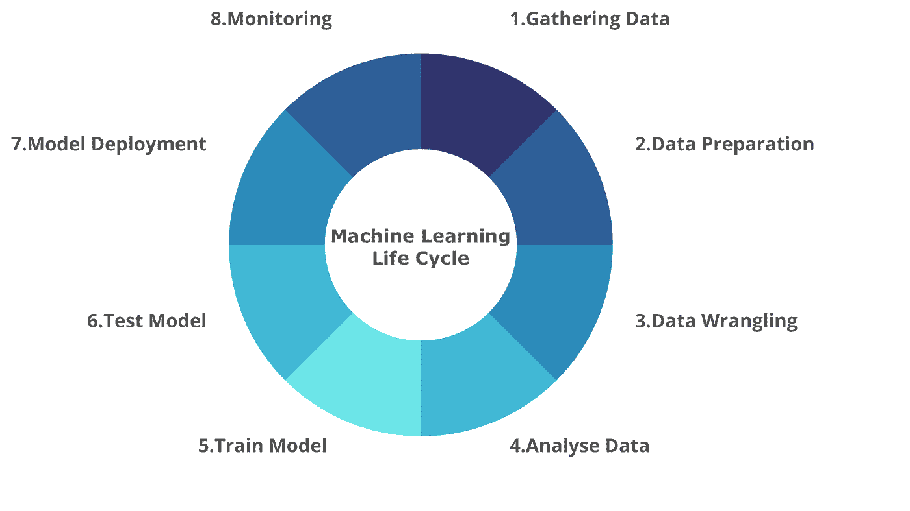
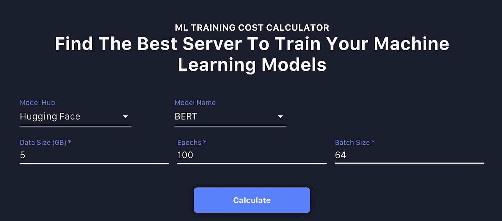
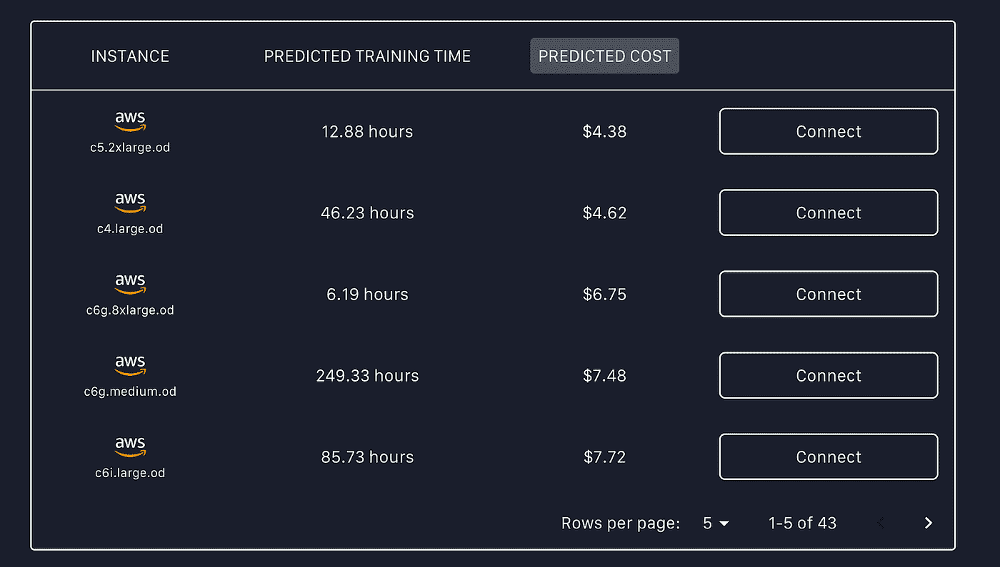

# 如何估计训练机器学习模型的时间和成本

> 原文：<https://towardsdatascience.com/how-to-estimate-the-time-and-cost-to-train-a-machine-learning-model-eb6c8d433ff7>

照片由 RODNAE Productions 从 [Pexels](https://www.pexels.com/photo/man-in-black-suit-working-7821702/) 拍摄。

训练机器学习(ML)模型是一个过程，在这个过程中，机器学习算法被输入数据，以从中学习来执行特定的任务(例如分类)，并最终具有进行预测的能力。术语“机器学习模型”是指作为训练过程的结果而产生的模型工件。

在本文中，您将学习如何估计训练机器学习模型的时间和成本。

[机器学习生命周期](/the-machine-learning-lifecycle-in-2021-473717c633bc)的核心是模型训练，机器学习团队努力让算法适合数据。目的是创建一个训练有素的机器学习模型，具有良好的性能，可以对新的或未知的数据进行预测。

作者创建的图像

机器学习模型在许多方面都对企业有益，包括快速分析大量数据，定位异常，以及发现人类难以单独完成的模式。

有几种类型的机器学习模型，包括监督学习和非监督学习。

**监督学习**是通过使用带标签的数据集来教导算法如何正确地对数据进行分类或预测结果。随着数据被输入到机器学习算法中，其权重被改变，直到模型正确拟合。监督学习模型可以帮助公司大规模解决各种现实世界的问题，例如检测电子商务平台上的欺诈交易。

**无监督学习**涉及利用算法在不包含标记数据点的数据集中发现模式的过程。这种类型的学习被称为“没有监督的学习”。这些算法揭示了以前未知的模式或数据分组，而不需要数据科学家的任何参与。它非常适合于客户细分以及推荐系统，因为它能够发现信息中的相似性和差异，

# 为什么估计训练机器学习模型的时间和成本很重要？

对训练机器学习模型所需的时间和成本做出准确的估计是至关重要的。当您在云环境中针对大量数据训练模型时，尤其如此。如果你正在从事一个机器学习项目，了解训练期的长度可以帮助你做出重要的决定。

例如，如果**训练周期**比您预期的要长，您可以选择调整算法的参数或选择一个替代算法来实现，以缩短训练您的模型所需的时间。当你计划在短时间内运行各种机器学习实验时，这是非常重要的。

有很多机器学习从业者对找出训练一个机器学习模型需要多长时间感兴趣。例如，下面是在[堆栈交流论坛](https://stats.stackexchange.com/questions/81985/how-to-estimate-training-time-prior-to-training-machine-learning-neural-netw)中提出的问题。

*“我想提前知道我的培训是 8 小时、8 天还是 8 周。(显然，8 是我任意选择的一个数字)。有没有可靠的方法估计一下需要的时间？我能把训练 20 万人所需的时间推断为训练 10 万人所需时间的两倍吗？如果能够估计这将需要几个小时、几天甚至几周的时间，那将会很有帮助，因为这样我就可以提前调整参数。”— by* [*Chowza*](https://stats.stackexchange.com/users/37209/chowza)

您也可以通过以下链接阅读其他问题:

*   [训练深度神经网络需要多长时间？个人在 MNIST 数据集上复制深度神经网络的性能是否可行？](https://www.quora.com/How-long-does-it-take-to-train-deep-neural-networks-Would-it-be-feasible-for-an-individual-to-replicate-the-performance-of-deep-neural-networks-on-the-MNIST-dataset)
*   [一个图像分类深度学习网络需要多长时间训练？](https://www.quora.com/How-long-does-an-image-classification-deep-learning-network-take-to-train)

**云实例**具有不同的特性和**成本**。根据您的工作负载和特定数据，您可能会选择为高性能实例支付更多费用，或者通过使用低成本实例来节省资金。对于有经验和无经验的数据科学家来说，知道可以选择哪个云实例来训练机器学习模型都是一项挑战。

有时你可以选择使用价格低廉的云实例，但它可能会支持长时间训练你的机器学习模型，最终会增加比你计划花费更多的成本。另一方面，高性能云实例的成本可能会高得多，但它有助于更快地训练你的机器学习模型。

估计训练机器学习模型的成本可以帮助您规划预算，并为您的机器学习项目购买合适的云实例。

# 如何估算机器学习模型训练时间和成本

Aipaca 团队目前正在开发一个强大的开源工具，称为[训练成本计算器(TCC)](https://github.com/aipaca-mlops/ML-training-cost-calculator) ，它可以帮助您预测完成神经网络(Tensorflow 和 Pytorch)训练过程所需的时间，方法是使用:

*   模型的特征
*   软件环境
*   计算硬件

它还能够预测不同云实例上各种机器学习任务的云计算成本。TCC 是一个很好的资源，您可以使用它来预算您的计算成本并减少您的支出。

[Aipaca 网站](https://aipaca.ai/)上的演示可以向你展示如何找出训练你的机器学习模型所需的时间和成本。

在演示部分，您必须填写以下与您想要在云环境中训练的机器学习模型相关的功能。

***注:*** *演示结果随机生成，仅供概念验证之用。*

**1。模型中枢** 这是一个预先训练好的自包含深度学习模型的集合，适用于广泛的应用。您可以选择以下模型中枢之一:

*   拥抱脸
*   Pytorch 中心
*   张量流集线器

**2。模型名称** 这是您希望用于项目的预训练模型的名称。以下是您可以从演示中选择的预训练模型列表。

*   伯特
*   蒸馏 2
*   GPT2
*   罗伯塔

**3。数据大小** 你要指定数据集的大小，你要在这个数据集上训练你的机器学习模型。大小必须是千兆字节格式。比如 2 GB 或者 3.45 GB。

**4。时期**
这是一个超参数，它定义了学习算法在整个训练数据集中训练的次数。例如，您可以将历元数定义为 100。

**5。批量大小** 批量大小是一个超参数，指定在更新模型参数之前要运行多少个样本。例如，您可以将批次大小指定为 64 个样本。

现在您已经知道了所有必要的特征，您需要指定它们的值，以便估计训练您的机器学习模型的时间和成本。下一步是在演示中填入这些值。

例如:

*   **模特 Hub:** 抱紧脸
*   **型号名称:**伯特
*   **数据大小:** 5 GB
*   **历元数** : 100
*   **批量:** 64

点击[此处](https://aipaca.ai/)打开演示部分并填写数值。

来自演示的截图

点击**计算**按钮获得结果。

完成计算过程后，您可以查看结果，其中将包括云实例的名称、预测的训练时间和预测的成本。

来自演示的截图

从上面的结果可以看出，一个名为 **c6g.8xlarge.od** 的 AWS 云实例将花费 **6.19 小时**来训练机器学习模型，总成本为 **$6.75。**与其他云实例相比，成本可能很高，但如果你计划运行多个机器学习实验，你将节省大量时间。

# 贡献者

训练成本计算器(TCC)对于机器学习项目来说是一个非常好的提高生产力的工具。TCC 将使您能够快速确定适合您的项目的理想训练时间和云实例，而不是根据您的经验来估计训练您的模型需要多长时间以及要利用哪些云实例。

培训成本计算器(TCC)的第一个版本将很快发布，其中包含更多关于如何在您自己的环境中尝试估计云实例的培训时间和成本的功能和细节。

这是一个 100%开源的项目，我们渴望看到更多的贡献者加入我们的社区。

当 TCC 的第一个版本发布时，更多的细节将被添加到 Github 库。请参考资源库以获取未来的更新，或联系我们以了解任何问题。

如果你学到了新的东西或者喜欢阅读这篇文章，请考虑分享给其他人阅读。