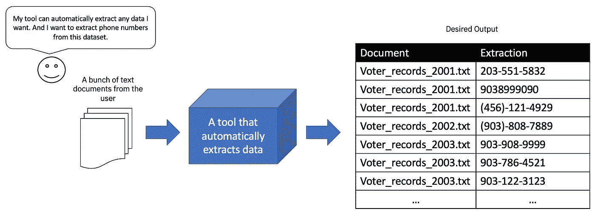

# 如何用用户研究评估一个交互系统

> 原文：<https://towardsdatascience.com/how-to-evaluate-an-interactive-system-with-a-user-study-d8fdb9b69afa>

## 简要总结各种研究者如何设计用户研究，以评估从机器学习到数据提取的不同交互系统的有效性

近年来，交互系统的开发出现了热潮，例如应用程序、网站和端到端工具。交互式系统旨在帮助用户完成某些任务，如清除大型数据集中的错误或从成千上万的文档中快速提取表格。公司在这些项目上花费数千美元，而工程师花费数百小时来构建这些系统。然而，当他们将这些系统展示给用户或客户使用时，用户的反应可能从“这个系统非常难用”到“这个系统太棒了！”。

虽然很难预测你的用户会说什么，但是通过量化你的交互系统的有效性和有用性来减轻用户体验的问题是很重要的。阅读技术文献描述其他人如何进行用户研究来评估他们系统的有效性。

如何使用用户研究来评估交互系统的有效性？具体来说，系统在帮助用户完成目标任务方面有多大用处？

例如，假设你已经建立了一个系统，学习从用户给出的文本例子中自动提取数据。当用户提供电话号码的例子时，你的系统学习从数百个其他文档中提取电话号码。

但是，如何评价该工具是否真的帮助用户快速准确地提取文本呢？图片作者。

*如何评价这样的系统是否真正帮助用户快速准确地提取文本？*

大多数系统评估要么是基于 T2 算法的，要么是基于 T4 用户的。当您基于算法实现进行评估时，度量标准和方法与对用户进行评估时不同，后者需要招募和观察使用您系统的人。

这篇文章的重点是我所说的比较用户评估。这些评估将您的系统与*基准系统*进行比较。目标是根据一些选择的标准证明您的系统优于一些基线系统。招募人类，要求他们完成系统上的某些任务，并观察用户执行任务的情况。

我将简要提及十篇论文，它们对调试系统、机器学习系统以及数据转换和数据提取系统进行了比较评估。我将描述这些论文的比较用户评价的一些相似之处和不同之处。希望这篇简短的评论描绘出一个如何进行比较用户评估的总体思路。

# 选择一个基准系统来比较您的系统

运行比较用户评估包括将用户在您的系统上的表现与*基准系统进行比较。*

*   基线系统可以是实际系统的“基本”版本，其核心特性——那些帮助用户完成任务的特性——被剥离了。
*   或者基线系统可以具有实际系统的一些特征子集。
*   或者基线系统可能是一个完全不同的系统，可能没有您的系统所具有的有用功能。

这种系统，无论是不同配置的系统还是完全不同的系统，也被称为实验*的*条件*。*

## 与您系统的基本版本进行比较

例如， [WhyFlow](https://openreview.net/forum?id=uO07BC54cW) 是一个交互式可视化调试系统，其基线是 WhyFlow 的基本版本，其自动生成的错误解释功能被禁用。这个基线旨在模拟手动调试，因为这种自动生成的解释功能并不存在。

## 对比不同版本的系统

另一种类型的基线可以是系统本身的不同版本，以及启用或禁用的某些功能的组合。这方面的一个例子是在名为 [DataPlay](https://dl.acm.org/doi/10.1145/2380116.2380144) 的系统上进行的评估。DataPlay 是一个交互式数据库查询系统，支持试错查询规范。在评估中，用户被要求修复 SQL 查询中的错误。DataPlay 与 Dataplay 本身的两个不同版本进行了比较:

*   DataPlay 的一个版本仅启用了一个称为*直接操作*的功能。
*   DataPlay 的另一个版本，只启用了一个名为*自动查询修正*的特性。

## 与完全不同的系统相比

另一个选择是将你的系统与一个完全不同的系统进行比较，一个完成相同任务的系统。这个系统应该算是*最先进的*，你的目标是证明你的系统比最先进的系统更好。系统 [RxFiddle](https://dl.acm.org/doi/10.1145/3180155.3180156) 就是这样一个实验的例子。

RxFiddle 的用户不得不使用专门为调试*反应式*程序而设计的可视化工具来调试反应式程序中的错误。由于反应式程序的非线性执行和事件驱动的性质，调试反应式程序比在其他编程范例中调试稍微更具挑战性。当输出异步发生时，这使得用户很难识别错误的来源。由于用户传统上使用 Chrome 的开发工具来调试此类程序，RxFiddle 的对比用户评估是针对 Chrome 的开发工具进行的。

WhyFlow 和 RxFiddle 的相似之处在于它们与传统的调试系统进行了比较，传统的调试系统没有一些关键功能，例如可视化、自动生成的错误解释。

# 实验类型:受试者内部和受试者之间的用户研究

虽然用户研究设计有很多种，但我将特别关注进行*主题内*或*主题间*用户研究的论文:

*   受试者内用户研究:你招募的每个用户都将作为他们自己的基线。换句话说，同一个人测试*系统的所有条件。*
*   **受试者间用户研究**:与受试者内用户研究不同，您招募的每个用户不会测试每个条件。换句话说，不同的用户测试每个条件。

例如，WhyFlow 进行了一项主题内用户研究。所有 10 名被招募的用户都暴露在 WhyFlow 的所有条件下。另一方面，RxFiddle 进行了一项受试者之间的用户研究。他们的一些用户被指示使用 RxFiddle 来完成调试任务。他们招募的其余用户被指示使用传统的调试工具(Chrome Dev Tools)来完成调试任务。

倾向于首选受试者内部用户研究。然而，由于每个被招募的用户都必须暴露于系统的每个条件下，大多数受试者内的用户研究通常会占用大量时间。例如，在 WhyFlow 的例子中，每个用户平均花费 2 个小时，因为每个用户为系统的每个条件花费大约一个小时。受试者内用户研究通常不会招募很多用户(少于 20 个，取决于系统的条件数量)。

受试者之间的用户研究占用每个用户更少的时间，因为他们只暴露于系统的一个条件下。在实验条件下，RxFiddle 用户平均总共花费 40 分钟来完成任务。跨学科用户研究通常会招募很多用户。RxFiddle 的用户研究共招募了 111 名用户。

然而，受试者内部的用户研究具有潜在的*学习效应*，其中将用户暴露在一种条件下的效应可能会溢出到用户在以下条件下的表现。在审查的受试者内用户研究中，他们通过随机化条件的顺序来降低潜在的学习效果:“工具顺序被随机化以分布可转移知识的影响”。此外，用户的任务在每种情况下都是不同的。

# 十个比较用户评估摘要

在这一节中，我们提供了十个在系统调试、机器学习和数据提取方面进行的比较用户评估的简要总结。请参见下表，对于每个系统的比较用户评估，我们列出了以下表格:

*   **任务**:**分配给用户的任务，如调试、标注机器学习模型、完成抽取任务等。**
*   **比较**:进行比较的系统或特性。
*   **受试者内** : *Y* 表示该研究为受试者内实验，否则 *N* 表示受试者间实验。
*   **用户数**:招募用户总数。
*   **总时间** : 一个用户学习会话的总持续时间。这些持续时间中的一些包括用户阅读和签署同意书所需的时间、训练用户理解任务和系统所需的时间以及用户回答任何初步和/或研究后问卷所需的时间。
*   **收集的指标**:作者在实验过程中记录的一些指标。流行的度量标准包括用户完成分配任务的持续时间以及任务完成的正确性、准确性或百分比。
*   **统计检验**:我简单记下了用来比较样本的统计检验，这是一个单独的话题。

10 个比较用户研究表。图片作者。

# 观察

[标记并学习](https://dl.acm.org/doi/10.1145/3025171.3025208)、 [iSeqL](https://dl.acm.org/doi/10.1145/3377325.3377503) 和[尺子](https://aclanthology.org/2020.findings-emnlp.181)是帮助构建机器学习产品的系统。 [SEER](https://dl.acm.org/doi/10.1145/3025453.3025540) 、 [ChartSense](https://www.microsoft.com/en-us/research/publication/chartsense-interactive-data-extraction-chart-images/) 、 [Wrangler](https://dl.acm.org/doi/10.1145/1978942.1979444) 、 [Rousillon](https://dl.acm.org/doi/abs/10.1145/3242587.3242661) 和 [Table Repair](https://dl.acm.org/doi/10.1145/3290605.3300523) 是提取数据的系统。我们将在后面详细描述这些系统。

请注意，大多数用户评估都是受试者内部的实验。一个用户会话的持续时间最长为 2 小时。招募的用户数量一般在 10 到 20 左右。

大多数研究收集了用户完成任务所需的持续时间。这个标准通常被用来证明用户使用目标系统比使用基线系统更快地完成分配的任务。大多数研究还收集关于用户表现的*准确性指标*。这里的准确性指标指的是用户对所分配任务的回答的正确性。

对于输出某种*模型*的系统，无论是机器学习模型还是数据提取模型(提取文本、表格、图像等的程序。根据文档)，他们记录了传统的度量标准，如精确度、召回率和 F1 分数。

## 机器学习系统的比较用户评价

我们审查的机器学习(ML)系统侧重于帮助用户理解 ML 模型或标记训练 ML 模型所需的数据:

*   Label-and-learn:一个可视化工具，帮助开发人员在标记数据集和训练 ML 分类器时深入了解他们的数据集。在给定训练数据的某个子集及其在测试集上的性能的情况下，它可视化分类器的预测。
*   iSeqL:一个交互式工具，用于快速定制 ML 模型，以提取特定领域的概念，如药物评论数据集中包含药物不良反应的短语。用户迭代地标记数据并训练模型，直到它能够提取特定于领域的概念。
*   标尺:自动生成*标注规则*的交互系统。标注规则可以快速标注数千个数据点，为手动标注提供了一种替代方法。传统上，标记规则是由人类手工编写的。Ruler 通过观察用户提供的演示来综合标注规则，从而自动化了这一过程。

**对研究设置的评论。**虽然在这篇论文样本中，受试者内实验很受欢迎，但 iSeqL 是通过在线进行的受试者间实验进行评估的，就像 RxFiddle 一样。有两种情况:(1)模型预测对用户可见的 iSeqL 版本，以及(2)预测不可见的 iSeqL 版本。这种设置允许 iSeqL 的创建者评估他们关于交互界面的一些设计决策。具体来说，在标注界面中显示模型的预测是否有助于用户识别将提高 ML 模型性能的相关短语？招募的用户的任务是建立一个 ML 模型，并通过提供相关短语来迭代改进它。

另一方面，标签学习和尺子的用户研究是受试者内部的实验。当用户标记训练数据时，标记和学习可视化了 *ML 分类器的*成功的可能性。Label-and-learn 的用户研究将其用于探索和标注数据的全功能可视化和界面与仅包含文本信息的基本版本的标注界面进行了比较。

我发现标签学习的用户任务与 Ruler 和 iSeqL 的任务不同。每个用户被要求标记 500 个数据点来训练一个二元分类器。在用户标记了 50、100、200 和 400 个实例之后，设置了一个检查点；为了评估用户对二元分类器的心理模型，给用户一个简短的测验。该测验测试了用户对分类器决策的理解。

与帮助人类用户标记数据的 Label-and-learn 和 iSeqL 不同，Ruler 专注于*自动*生成标记规则。标签规则传统上是在一个叫做 Jupyter 的系统中手工制作的。用户研究的设置很简单:将尺子生成的标注规则与 Jupyter 中手工制作的标注规则进行比较。用户的任务是编写标签规则，以训练垃圾邮件检测和情感分类的 ML 模型。他们记录了标签功能的个人和集体表现。

## 用户对数据提取系统的比较评价

我们审查的数据提取系统帮助其用户快速准确地执行数据提取或数据转换:

*   SEER:通过从用户突出显示的示例中自动生成*提取规则*来自动提取文本。
*   ChartSense:一个半自动交互式图表数据提取工具。它集成了可以检测标记的算法，例如条形图中的条、线形图中的标记等。用户可以与系统交互以修复提取中的任何错误。
*   Wrangler:一个用于清理和转换数据的交互系统。系统从用户演示的数据操作中学习数据转换。
*   Rousillon:一个编程系统，它从用户提供的提取内容的演示中学习编写复杂的 web 自动化脚本。
*   表修复:交互式表修复管道。管道自动提取表格，并附带一个界面友好的手机和平板电脑用户可以轻松修复表格提取中的错误。

**对研究设置的评论。**大多数数据提取工具的对比用户研究的设置非常简单。用户被指示完成一组提取任务。所有的研究都是受试者内部的实验。这些系统与一个类似的系统进行了比较，后者缺少帮助用户快速准确完成任务的关键功能。

SEER 实验的用户的任务是提取文本实体，如日期和百分比增加/减少。SEER 与用户通过拖放界面手动创建提取规则的系统进行了比较。

ChartSense 实验的用户被要求从条形图和折线图中提取数据。ChartSense 与一个类似但有限的图表提取系统进行了比较，该系统称为 WebPlotDigitizer(用于条形图和折线图的图表提取系统)。

牧马人实验的用户被要求执行*数据清理*任务，例如值提取、缺失值插补和表格重塑。Wrangler 与 Microsoft Excel 进行了比较，后者允许用户通过一定程度的手动工作来完成这些数据清理任务。

Rousillon 实验的用户被分配了*网页抓取*任务。网络抓取是指从网站中提取数据。Rousillon 与 Selenium 进行了比较，Selenium 是为编写 web 抓取脚本的用户提供的传统 web 自动化库。

表修复有一个相当不同的用户研究设置。表修复被描述为一个表提取管道，而其用户研究集中在一个伴随的接口的能力，以帮助用户快速和容易地修复在表提取系统中发现的错误。该管道是独一无二的(在撰写本文时)。用户研究的条件由支持的用户交互和设备(手机或平板电脑)的不同组合来定义。

# 结论

这还远远不够全面，只提供了我在阅读比较用户评估时的一些观察的简要概述。当我们投入大量的时间、金钱和精力来构建这些系统时，我们也应该意识到评估我们的系统是否帮助我们的用户和客户的量化方法。

# **参考文献**

*   [WhyFlow](https://openreview.net/forum?id=uO07BC54cW) :交互解释数据流中的错误
*   [RxFiddle](https://dl.acm.org/doi/10.1145/3180155.3180156) :调试反应式程序中的数据流
*   数据播放:交互式调整和图形数据库查询的实例驱动修正
*   [标记并学习](https://dl.acm.org/doi/10.1145/3025171.3025208):在数据标记期间可视化机器学习分类器成功的可能性
*   [iSeqL](https://dl.acm.org/doi/10.1145/3377325.3377503) :交互式顺序学习
*   [标尺](https://aclanthology.org/2020.findings-emnlp.181):文件贴标演示数据编程
*   [SEER](https://dl.acm.org/doi/10.1145/3025453.3025540) :从用户指定的例子中自动生成信息抽取规则
*   [ChartSense](https://www.microsoft.com/en-us/research/publication/chartsense-interactive-data-extraction-chart-images/) :从图表图像中交互式提取数据
*   [Wrangler](https://dl.acm.org/doi/10.1145/1978942.1979444) :数据转换脚本的交互式可视化规范
*   Rousillon :抓取分布式层次化的 Web 数据
*   [交互式修复从移动设备上的 PDF 文档中提取的表格](https://dl.acm.org/doi/10.1145/3290605.3300523)