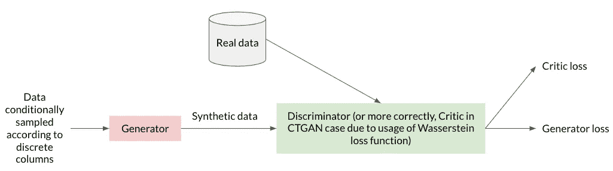
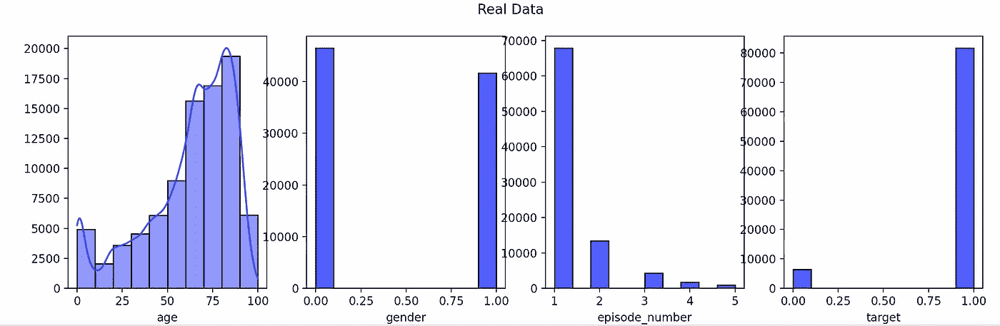
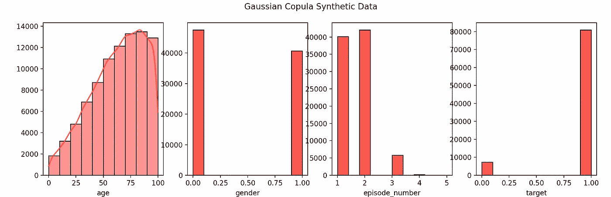
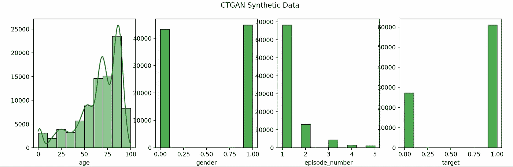
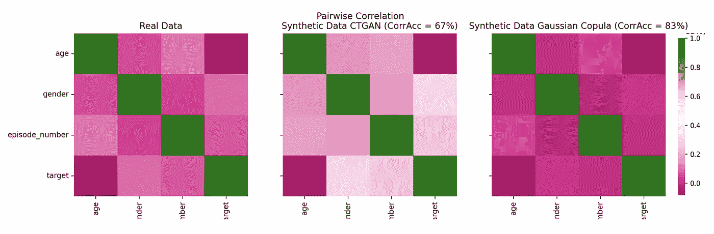
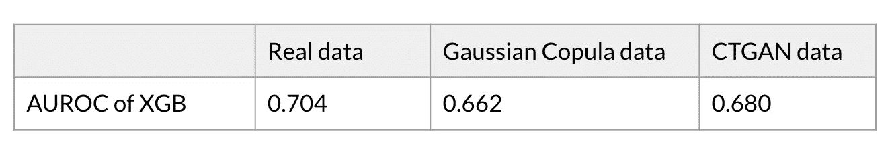
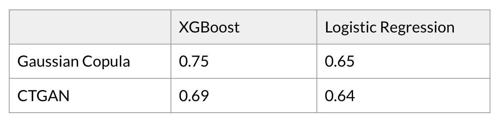

# 如何评估任何表格合成数据集

> 原文：<https://towardsdatascience.com/how-to-evaluate-any-tabular-synthetic-dataset-8865b7ee0c23>

## 一系列机制和测试，可用于从相似性和实用性角度评估任何表格合成数据集

照片由 [DeepMind](https://unsplash.com/@deepmind?utm_source=medium&utm_medium=referral) 在 [Unsplash](https://unsplash.com?utm_source=medium&utm_medium=referral) 上拍摄

# 为什么是合成数据？

合成数据的一些主要优势包括:

*   **可扩展性**:真实的训练数据是以线性方式收集的，而合成数据可以产生大量，这缓解了复杂的 ML 任务需要获取大量高质量训练数据的问题。
*   **隐私**:由于复杂的隐私要求，数据可用性仍然是一个挑战，尤其是在医疗保健领域。医疗保健研究人员通常很难获得用于次要目的的高质量个体水平数据(例如，测试新的假设，建立统计和 ML 模型)。使用合成数据可以 ***潜在地*** 解决这一挑战。

但是，请注意，仅仅让数据“合成”并不能保证隐私。已经表明，合成数据生成并不总是和完全地保护每个人的隐私，尤其是使用非差别隐私数据生成技术。根据经验量化合成数据集的隐私性能也极其困难。单一的隐私度量只能解决某种攻击策略(例如:重新识别攻击、重构攻击或追踪攻击等)。).针对一种攻击表现较好的数据集并不一定意味着它可以抵御不同的攻击。

此外，很难估计攻击者可以获得的知识范围，我们需要假设他们可以获得哪些信息，以及他们试图获得哪些机密信息。更不用说，这些都是已知策略——攻击者可能采用的未知策略数不胜数。这意味着，能够根据经验量化合成数据集的一个(甚至多个)隐私度量的性能，并不足以说明数据集是完全隐私的。

也就是说，本文只关注合成数据集的效用性能。

# 高斯 Copula 和 CTGAN 数据生成器概述

## 高斯连接函数

高斯 Copula 是一种用于数据综合的统计建模技术。

Copula 允许我们将联合概率分布分解为变量的边际(根据定义，它们没有相关性)和一个将这些边际“耦合”在一起的函数。换句话说，Copula 是一个“耦合”函数，或者是一个嵌入了相关信息的多元分布。因此，高斯连接函数是一个具有已知相关性的多元正态分布。

该数据生成器的高级流程如下:

1.  学习每列的概率分布
2.  对它们应用标准正态的逆 CDF 变换(即，将列的分布转换为正态分布)
3.  了解这些新生成的随机变量的相关性，以构建 copula 模型
4.  来自多元标准正态分布的样本，具有学习到的相关性

## CTGAN

条件表格生成对抗网络(CTGAN)是一种深度学习数据合成技术。顾名思义，这是一种基于 GAN 的方法。

一个普通的 GAN 由两个神经网络组成:一个作为生成器，接受一些输入并从中生成合成数据。然后，有第二个神经网络作为鉴别器，看看他们是否能区分真实数据和合成数据。来自鉴别器的结果被反馈到发生器，以帮助发生器产生更好的合成输出。

非常高级的 CTGAN 架构概述。图片作者。

CTGAN 与普通 GAN 的区别在于:

1.  **Conditional**:CTGAN 架构引入了一个条件生成器，它根据某个离散列生成行，并根据该特定离散列的每个类别的对数频率对训练数据进行采样，而不是随机采样训练数据以输入到生成器中，这可能不足以表示高度不平衡的分类列的小类别。这有助于 GAN 模型均匀地(不一定均匀地)探索所有可能的离散值。
2.  **表格**:与通常正态分布的图像像素值不同，表格数据中的连续变量可以遵循非高斯和/或复杂的多模态分布。为了解决这个问题，CTGAN 使用特定于模式的规范化来表示连续列。

关于 CTGAN 如何工作的详细描述，请参考他们在[发表的论文](https://arxiv.org/pdf/1907.00503.pdf)。

# 合成数据的效用评估

在我们生成一些合成数据后，自然的问题是刚刚生成的数据有多好。具体来说:

*   合成数据是否保持与真实数据的统计相似性？合成数据保留单变量和多变量分布吗？(即相似性度量)。
*   在一些计划任务中，用合成数据获得类似的结果并得出与真实数据相同的结论，这可能吗？(即效用度量)。

本文介绍了一系列机制和测试，可以用来评估任何表格合成数据，主要是从保留原始数据的统计属性(相似性)和 ML 功效(效用)的角度。

所有评估都是在来自 UCI 机器学习知识库的[败血症存活最小临床记录数据集](https://archive.ics.uci.edu/ml/datasets/Sepsis+survival+minimal+clinical+records) (110，204 个实例 x 4 个属性)上进行的。我们使用来自[综合数据仓库](https://sdv.dev)实施的高斯 Copula 和 CTGAN 模型生成综合数据。

## 个体分布

鉴于年龄分布在原始数据集中有多种模式，CTGAN 在保持这一属性方面做得更好，而高斯 Copula 仅将分布转化为单一模式。

另一方面，高斯 Copula 比 CTGAN 更好地保持了性别和目标变量类别之间的比例。与高斯 Copula 相比，CTGAN 更好地再现了集数的分布。

所有变量在三个数据集上的分布:真实数据集、高斯 Copula 合成数据集和 CTGAN 合成数据集。图片作者。

## 缺少值

所有变量最初都没有任何缺失值，来自 CTGAN 和高斯 Copula 的合成数据集能够重现这一点。

## K-S 检验

双样本 Kolmogorov–Smirnov(K-S)用于检验两个样本是否来自同一分布。我们在真实和高斯 Copula 数据之间以及真实和 CTGAN 数据之间的所有变量上运行该测试。因为 KS 统计是两个 CDF 之间的最大距离，它越低，对我们的用例越好。

总体而言，与高斯 Copula 相比，CTGAN 的所有变量的平均 KS 统计量略小。

高斯 Copula 与真实数据以及 CTGAN 与真实数据的 2 样本 K-S 测试结果。图片作者。

## 成对相关

到目前为止，我们已经逐列研究了数据集。现在，让我们来看看两两之间的关系。

高斯 Copula 的成对 Pearsons 相关性的热图似乎与同一性数据的热图更相似。为了验证这一点，我们计算了相关精度。先将相关系数离散化为 6 个等级:[-1，-0.5)(强负)，[-0.5，-0.3)(中负)，[-0.3，-0.1)(低负)，[-0.1，0.1)(无相关性)，[0.1，0.3)(低正)，[0.3，0.5)(中正)，[0.5，1)(强正)。然后，计算合成数据集和原始数据集分配相同相关级别的配对的百分比。

高斯 Copula 的关联精度远大于 CTGAN (83% vs 67%)。

三个数据集之间成对相关的热图。图片作者。

## ML 功效

假设一方无法访问原始数据集，他们有可能解决基于合成数据的机器学习问题，并得出尽可能接近真实数据的见解吗？为了回答这个问题，我们使用合成数据集来训练 XGBoost 分类器，并使用它对原始数据进行预测。然后，将这个分数与我们在原始数据上训练 XGBoost 所获得的分数进行比较。

与高斯 Copula 相比，CTGAN 能够实现更接近我们用真实数据实现的预测性能。

XGBoost 分类器的 AUROC 在合成数据上进行训练，并在真实数据上进行评估，与我们在真实数据上训练分类器的结果进行比较。

## 检测能力

为了评估区分真实实例和合成实例的难度，我们将两个数据集混在一起，并使用标志来指示数据是真实的还是合成的。然后训练一个试图预测这个标志的 ML 模型。预测标记越容易，真实数据和合成数据之间的区别就越明显。

对于这个测试，我们将 XGBoost 和逻辑回归训练为检测器。与高斯 Copula 数据相比，CTGAN 合成数据对 XGBoost 和 Logistic 回归提出了更难区分的挑战，因为它们对应的检测器的 AUROC 更低。

XGBoost 和逻辑回归检测器的 AUROC 性能，尝试区分真实和合成实例。图片作者。

## 结论

对于这个特定的脓毒症公共数据集，从个体变量评估的角度来看，CTGAN 和高斯 Copula 是不分上下的。然而，高斯 Copula 具有令人惊讶的更好的成对相关准确性，而 CTGAN 实现了更好的 ML 功效，并且更不可能被检测到。