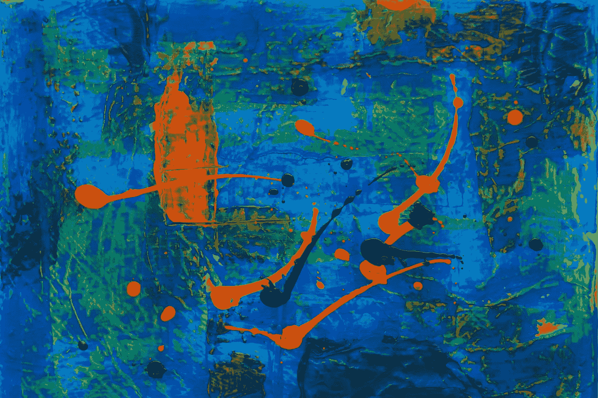
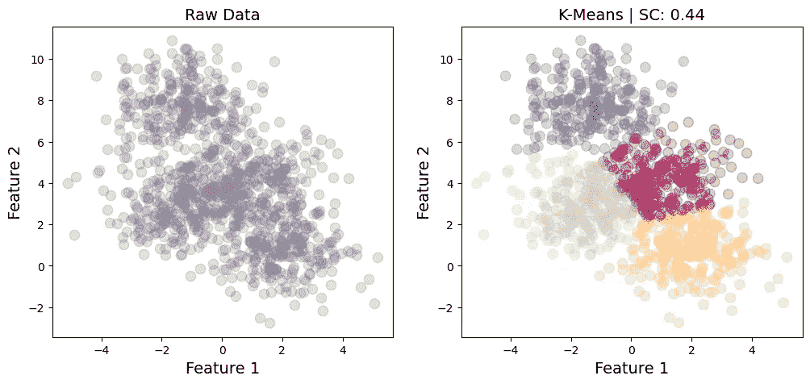
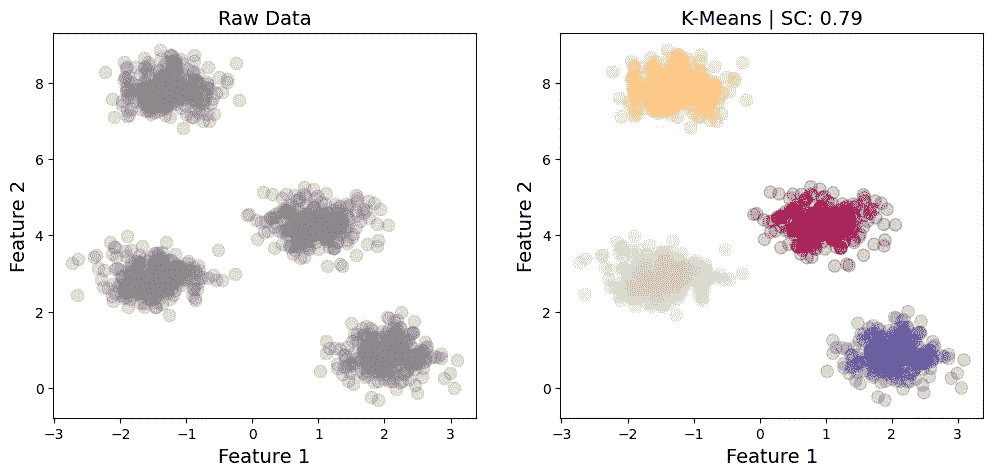
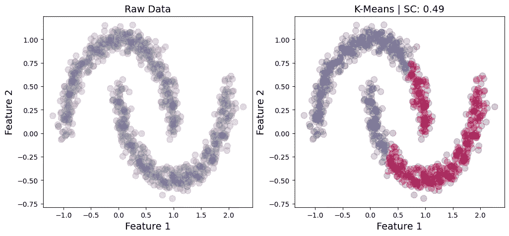
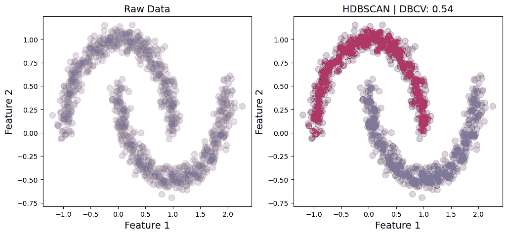
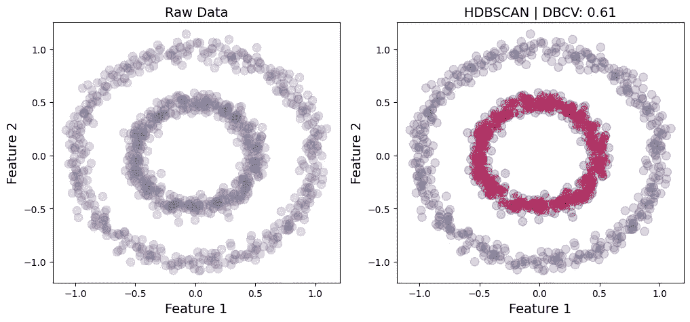
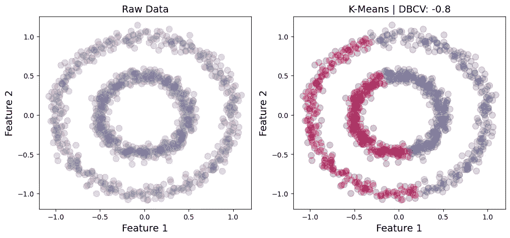

# 如何在没有基础事实标签的情况下评估聚类性能

> 原文：<https://towardsdatascience.com/how-to-evaluate-clustering-performance-without-ground-truth-labels-9c9792ec1c54>

## 基于群集构造选择适当有效性度量的说明性指南

在 [Unsplash](https://unsplash.com/photos/hzFK3KLVLkE) 上由 [steve_j](https://unsplash.com/@steve_j) 拍摄的照片

# 介绍

监督学习剧本中有许多方法可用于评估已知基本事实标签情况下的聚类性能。然而，当地面实况不可用时，性能评估就不那么简单了。在这种情况下，我们需要依赖有效性度量，这些度量给我们提供了一个关于如何定义集群的指示。这些有效性指标在很大程度上依赖于数据中聚类的基本构造。

对于由凸球状星团组成的数据，已经提出了多种有效性指标，最流行的是**轮廓系数**。其他指数包括卡林斯基-哈拉巴斯指数、戴维斯-波尔丁指数和邓恩指数。然而，并不是所有的数据都是由球状星团组成的。有些星系团可以呈现任意形状，由密度来分隔。在这种情况下，我们可以利用**基于密度的聚类验证**指标，或 DBCV。

*注:*下图中使用的数据是使用 scikit-learn 的 [make_blobs](https://scikit-learn.org/stable/modules/generated/sklearn.datasets.make_blobs.html) 、 [make_moons](https://scikit-learn.org/stable/modules/generated/sklearn.datasets.make_moons.html) 和 [make_circles](https://scikit-learn.org/stable/modules/generated/sklearn.datasets.make_circles.html) 函数生成的。

# 球状星团

对于主要为球状的星团，最常用[轮廓系数](https://scikit-learn.org/stable/modules/generated/sklearn.metrics.silhouette_score.html) [1]来评估性能。这是一种基于数据点与其自己的聚类相比与其他聚类的相似程度的度量。其值的范围从-1(表示不正确的聚类)到+1(表示高度密集的聚类和良好的分离)。接近 0 的值表示重叠的簇。一个非常适合识别球状星团的算法是 [K 均值](https://scikit-learn.org/stable/modules/generated/sklearn.cluster.KMeans.html)。

下面是一个由 4 个球状星团组成的数据示例(图 1)。这里聚类的标准偏差是 1.2，这导致一些聚类间重叠。然而，K-Means 仍然实现了体面的分离，轮廓系数为 0.44。

图 1:原始数据与 K 均值输出。剪影系数:0.44。

如果我们有非常明确的集群(图 2)，我们会期待一个更高的有效性得分。这正是我们在下面的例子中获得的结果，它实现了 0.79 的轮廓系数。本例中聚类的标准偏差为 0.4，产生了更好的可分性。

图 2:原始数据与 K 均值输出。剪影系数:0.79。

然而，如果集群不是由球状形状表征的，轮廓系数可能不是合适的有效性度量。此外，K-Means 可能不是合适的聚类算法，因为它通常更喜欢球形。在下面的例子中，K-Means 明显错误地分类了新月的部分，即使剪影系数仍然产生了令人误解的体面值 0.49。

图 3:非球状数据的 K-均值聚类。

# 任意形状的簇

对于具有任意形状和大小的聚类，[基于密度的聚类验证(DBCV)](https://github.com/christopherjenness/DBCV) [2]是优选的评估度量。它根据群集内和群集间的密度来评估群集质量。通过簇内的高密度和簇间的低密度可以获得良好的结果。与剪影系数类似，DBCV 的范围从-1 到+1，分数越高表示聚类质量越好。

有各种常用的聚类算法能够识别任意形状的聚类，如 DBSCAN、HDBSCAN 或 OPTICS。对于下图，我将使用 [HDBSCAN](https://hdbscan.readthedocs.io/en/latest/how_hdbscan_works.html) (针对有噪声的应用程序的基于层次密度的空间聚类)。

让我们看看 HDBSCAN 在两个新月上的表现:

图 4:月牙形星团上的 HDBSCAN。

由于这两个新月看起来可以通过密度来区分，因此毫不奇怪 HDBSCAN 可以很好地区分它们，相应的 DBCV 为 0.54。相比之下，基于 K 均值标签的 DBCV(图 3)为-0.76，表明如预期的那样，由于错误分类的数据点而导致不正确的聚类。

让我们看另一个任意形状的集群的例子:

图 5:圆形集群上的 HDBSCAN。

同样，这两个圆似乎可以按密度分开，因此，HDBSCAN 实现了 DBCV 为 0.61 的下降结果。相反，K-Means 很难将它们分开，结果，相关的 DBCV 是-0.8(图 6)。

图 6:圆形簇上的 K-均值。

# 结论

如果无法获得基本事实，就必须依赖基于模型的性能评估指标。虽然剪影系数对于由凸球状星团组成的数据来说是一个可靠的度量，但它通常不适用于任意形状的星团，并且尽管有明显的错误分类，但仍会产生令人迷惑的高分。在这种情况下，DBCV 是首选的度量标准，因为它可以更好地处理任意形状。

# 参考

[1]彼得·j·鲁瑟夫(1987 年)。"轮廓:聚类分析解释和验证的图形辅助工具."计算与应用数学 20:53–65。

[2] Moulavi，Davoud 等人(2014 年)。"基于密度的聚类验证."2014 SIAM 数据挖掘国际会议论文集。工业和应用数学学会。