# 如何评价生存分析模型

> 原文：<https://towardsdatascience.com/how-to-evaluate-survival-analysis-models-dd67bc10caae>

## 生存分析中最流行的性能评估指标介绍以及实际的 Python 示例

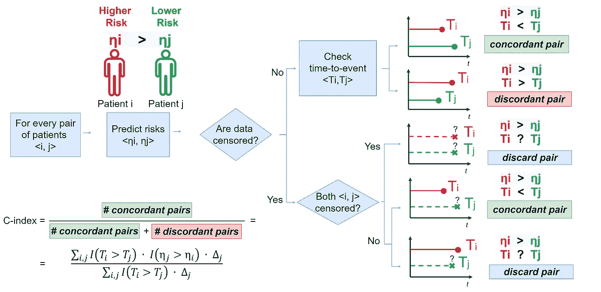

图片作者。

# 目录

1.  [简介](#cc9c)
2.  [审查](#e268)
3.  [考克斯比例风险模型](#a0a6)
4.  [评估生存模型](#7541)
    4.1 [和谐指数(Harrell ' s C)](#da2f)
    4.2[Uno ' s C](#521c)
    4.3[动态 AUC](#e5ec)
5.  [结论](#8873)
6.  [参考文献](#930f)

# **1。简介**

生存分析包括描述事件时间数据的统计方法的集合。

它源于临床研究，医生最感兴趣的是评估一种新疗法对对照组存活率的影响，或者某些特征如何及时代表不良事件的风险。

这篇文章介绍了与生存分析(审查)相关的挑战，并解释了评估生存模型的流行指标，同时分享了实用的 Python 示例。

# **2。审查**

让我们想象成为临床研究人员。在我们研究的开始，我们招募了所需数量的患者，并将他们分成两组:

*   *干预组*接受新的治疗。
*   *对照组*进行标准处理。

由于我们希望评估新治疗在预防不良事件(如死亡)方面的显著效果，因此我们对两组患者进行了一段时间的监测。不幸的是，我们可能无法观察到这一事件，原因有几个，例如:

*   在整个研究期间，患者不会经历该事件。
*   患者退出研究。
*   患者失访。

这种情况被称为**右删截**，是生存分析研究的一个共同特征。我们可以将其与**左审查**区分开来，后者发生在事件已经发生在登记之前(但时间未知)。

# 3.Cox 比例风险模型

现在让我们介绍一种流行的生存分析算法，Cox 比例风险模型。

首先，我们将*存活率*定义为一段时间后没有经历不良事件(死亡)的患者的百分比。Cox 比例风险模型可以评估变量和存活率之间的关联，并被定义为:

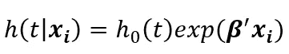

图片作者。

该公式表明，风险函数`h(t|**xᵢ**)`与基线风险函数`h₀(t)`和相对风险`exp(**β'xᵢ**)`成比例。

潜在风险函数`h₀(t)`不依赖于协变量。由于`h₀(.)`的形式未指定，该模型为半参数模型。而且，不估计`h₀(.)`也可以估计`β`。

Cox 模型的一个重要优势在于其系数的可解释性。为了解释它，我们可以考虑一个只有一个协变量的简化场景。让我们考虑一个危险因素`xᵢ`，例如*吸烟*，作为二元变量(0:不吸烟者对 1:吸烟者)。Cox 模型可表示为`h(t|xᵢ)= h₀(t)exp(βxᵢ)`，其中`exp(β)`表示吸烟与不吸烟相比，不良事件的**相对风险:**

*   吸烟带来的风险:
    `(xᵢ=1): h₀(t)exp(β⋅xᵢ) = h₀(t)exp(β⋅1) = h₀(t)exp(β)`
*   不吸烟带来的风险:
    `(xᵢ=0): h₀(t)exp(β⋅xᵢ) = h₀(t)exp(β⋅0) = h₀(t)`
*   相对风险=吸烟带来的风险/不吸烟带来的风险:
    `h₀(t)exp(β) / h₀(t) = exp(β)`

很清楚为什么这个模型在临床场景中受到高度赞赏:它允许医生根据患者的历史和行为来估计不良事件的可解释风险。

让我们用一个利用`scikit-survival`包的实际 Python 例子来试试，这个包在 *GNU GPL 3.0* 许可下可用。步骤如下:

*   导入所需的库:

```
from sksurv.datasets import load_whas500
from sksurv.linear_model import CoxPHSurvivalAnalysis
from sksurv.preprocessing import OneHotEncoder
from sklearn.pipeline import Pipelineimport numpy as np
import math
from tabulate import tabulate
```

*   加载并返回由`scikit-survival`提供的*伍斯特心脏病研究数据集* ⁴:

```
x, y = load_whas500()
```

*   该数据集有 500 个样本和 14 个特征:

```
x.head()
```

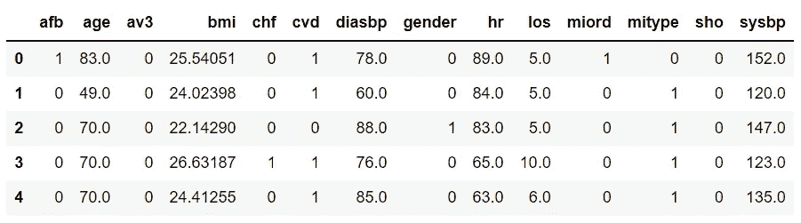

图片作者。

*   特征:
    - `afb`:房颤(0:否，1:是)
    - `age`:入院年龄(岁)
    - `av3`:完全性心脏传导阻滞(0:否，1:是)
    - `bmi`:体重指数(kg/m )
    - `chf`:充血性心脏并发症(0:否，1:是)
    - `cvd`:心血管疾病史(0:否 1:是)
    - `diasbp`:初始舒张压(mmHg)
    - `gender`:患者性别(0:男，1:女)
    - `hr`:初始心率(每分钟心跳数)
    - `los`:住院时间(天)
    - `miord` : MI 顺序(0:首次，1:复发)
    - `mitype` : MI 类型(0:非 Q 波，1: Q 波)【1】
*   终点是死亡，有 215 名患者死亡(43.0%):

```
status, counts = np.unique(
    ['Censored' if i[0] == False else 'Event' for i in y],
    return_counts = True)dict(zip(status, counts))
```

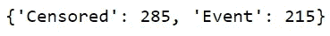

图片作者。

*   创建一个包含所有必需预处理步骤的管道，并符合 Cox 模型:

```
pipe = Pipeline([('encode', OneHotEncoder()),
                 ('cox_model', CoxPHSurvivalAnalysis())])pipe.fit(x, y)
```

*   对于每个协变量`xᵢ`，我们可以观察它的系数`β`和相对风险`exp(β)`:

```
table = np.array([
   x.columns,
   pipe['cox_model'].coef_,
   [math.exp(i) for i in pipe['cox_model'].coef_]
  ]).Tprint(tabulate(table, 
               headers = ['Risk Factor', 
                          'Coefficient [β]', 
                          'Relative Risk [exp(β)]'],
               tablefmt = 'fancy_grid',
               colalign = ('center', 'center', 'center'),
               floatfmt = '.3f'))
```

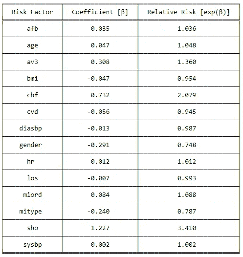

图片作者。

相对风险`exp(β)`可以是:

*   `>1`(或`β>0`)为**事件(死亡)的风险**增加。
*   `<1`(或`β<0`)为**降低风险**的事件。

我们注意到:

*   考克斯假设比例风险。这意味着预测的风险`exp(β)`与时间无关。
*   在现实应用中，医生感兴趣的是相对风险及其相关的 *p 值*和*置信区间*。在之前的 post⁵中，我们分享了包括这些概念的 Cox 回归模型的更详细的应用。
*   在这种情况下，Cox 模型被用作例子来达到我们的目的，即讨论评估生存模型的度量和方法。

既然我们将模型与我们的数据进行了拟合，我们想要确定这组相对风险是否可靠。此外，我们希望将该型号与其他型号的性能进行比较。

# **4。评估生存模型**

为了公平地评估与特定估计量相关的误差，一个好的做法是随机地将初始观察值集分成至少*个*个:

*   *训练集*:用于拟合模型的观测值子集。
*   *测试集*:仅用于评估模型性能的观测值子集。

这种策略背后的想法是，使用用于拟合模型的相同数据来估计模型性能会有偏差。

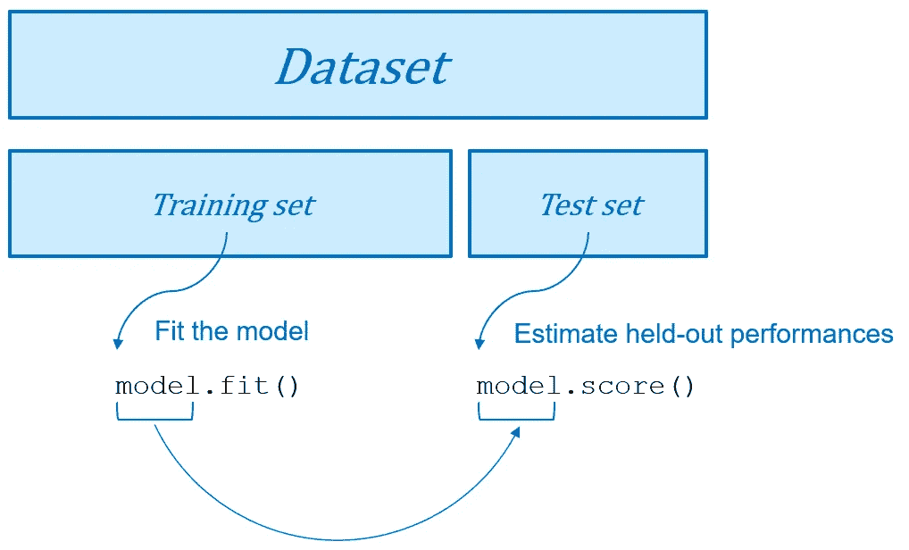

训练和测试设备。图片作者。

关于评估本身，我们知道像用于定量反应(回归)的 *MSE* 或用于分类反应(分类)的*准确性*这样的度量。生存分析问题与传统的回归和分类问题略有不同。此外，由于审查，我们还有一层额外的复杂性。我们可以采用什么标准来评估模型性能？

## 4.1 和谐指数

让我们考虑一对病人(`i, j`)。直觉上，风险**越高**应导致不良事件发生的时间**越短。因此，如果模型预测第一个患者(`ηᵢ > ηⱼ`)的风险评分较高，我们也预期与另一个患者(`Tᵢ < Tⱼ`)相比存活时间较短。**

从这个直觉出发，我们将满足这个期望的每对`<i, j>`(`ηᵢ > ηⱼ : Tᵢ < Tj`或`ηᵢ < ηⱼ : Tᵢ > Tⱼ`)定义为**和谐对**，否则为**不和谐**。大量的一致配对是模型质量的证据，因为与较低风险相比，预测的较高风险对应于有效较短的存活时间。

*一致指数* ⁶，也称为 *C 指数*或*哈氏 c 指数*，定义为一致对数除以可比对数:

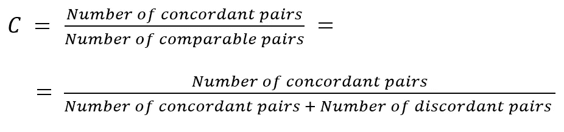

这就是审查被考虑的方式:

*   如果两个病人`i`和`j`都被**审查**，我们就没有关于`Tᵢ`和`Tⱼ`的信息，因此这一对被**丢弃**。
*   如果只有一名患者被审查，只有当另一名患者在审查时间之前经历了该事件时，我们才保留这对患者。否则，我们没有关于哪个患者可能首先经历了该事件的信息，并且该对被丢弃。

哈氏 C 的计算过程可以直观地表示如下:


图片作者。

我们现在可以表达 c 指数 as⁶:

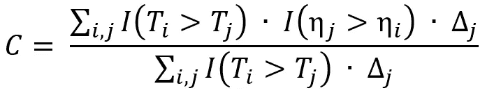

图片作者。

其中:

*   `i`和`j`识别一对患者，分别具有生存时间(`Tᵢ`、`Tⱼ`)和预测风险(`ηᵢ`、`ηⱼ`)。
*   `I(.)`是指标函数，如果其参数为真，则等于 1，否则等于 0。
*   变量`Δⱼ`指示`Tⱼ`是否已被完全观察到(`Δⱼ = 1`)或未被完全观察到(`Δⱼ = 0`)。因此，乘以`Δⱼ`允许丢弃不可比较的对，因为较小的存活时间被删除(`Δⱼ = 0`)。

让我们使用`scikit-survival`包在一个实际的 Python 示例中展示所描述的过程:

*   将数据集拆分为训练集和测试集。

```
from sklearn.model_selection import train_test_splitx_train, x_test, y_train, y_test = train_test_split(
     x,
     y,
     test_size = 0.2,
     random_state = 42)
```

*   在训练集上拟合 Cox 估计量。

```
pipe = Pipeline([('encode', OneHotEncoder()),
                 ('cox_model', CoxPHSurvivalAnalysis())])pipe.fit(x_train, y_train)
```

*   在测试集上评估模型性能(C-index)。

```
c_index = pipe.score(x_test, y_test)
```

在我们的例子中，我们在保留数据上获得了等于 0.709 的 C 指数。

C 指数的数值解释:

*   **C = 1** :风险与事件时间的完美一致**。**
*   ****C = 0** :风险与事件时间的完美**反协调**。**
*   ****C = 0.5** : **随机赋值**。该模型预测了风险和存活时间之间的关系，以及抛硬币的过程。**
*   **理想值的范围在 0.5 和 1 之间。越接近 1，模型越能区分早期事件(高风险)和后期事件(低风险)。**

**注意事项:**

*   **c 指数保持着对 time⁷.的隐性依赖**
*   **censoring⁸.的数量越多，c 指数就变得越偏(向上)**

**出于这些原因，随着时间的推移，提出了 C 指数和其他指标的变化，如时间相关的 C 指数分析(Longato 等人。⁹，2020)和基于截尾权重逆概率的 c 指数(Uno 等人。⁸, 2011).**

## ****4.2 优诺的 C****

**对具有删截的较小观察时间(`Δⱼ = 0`)的观察值对的处理导致一致性 probability⁷.估计值的向上偏差因此，Uno 等人。⁸ (2011 年)提出了哈勒尔 c 的一个变体，包括*审查权重的逆概率*。简而言之，我们引入基于估计的截尾累积分布的权重。**

**在审查量较高的情况下，Uno 的 C 优于 Harrell 的 C。**

**`scikit-survival`包在`sksurv.metrics.concordance_index_ipcw` ⁰.实现了这个 c 统计这里有一个它的用法的例子。**

**值得注意的是，Uno 的 C 使用卡普兰-迈耶估计量进行截尾分布。这意味着审查应该独立于变量。然而，正如 paper⁸所说:**

> **对于新的建议，我们假设删失分布是独立的协变量。在执行良好的临床研究中，这种假设并非不合理，尤其是当观察终点(例如，死亡或复合临床终点)时没有竞争风险，并且事件时间可能主要由于管理审查而被审查。[…].另一方面，**根据我们模拟研究的结果，即使在删失依赖于协变量**时，我们的建议似乎也相当稳健。**

## **4.3 **动态 AUC****

**在二元分类任务中， **ROC 曲线**(受试者工作特性曲线)绘制了不同分类阈值下的真阳性率(`TPR = TP / (TP + FN)`)与假阳性率(`FPR = FP / (FP + TN)`)的关系:**

**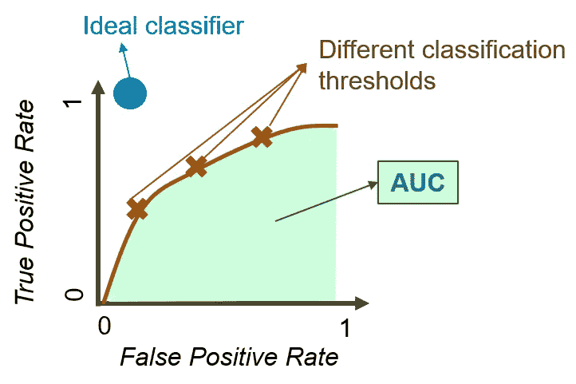**

**图片作者。**

****曲线下面积(AUC)** 测量 ROC 曲线下的面积。简而言之，它可以被解释为模型对随机正例的排序比随机负例更高的概率。给定一个模型`f`，AUC 可以表示为一个*威尔科克森-曼-惠特尼*统计量:**

**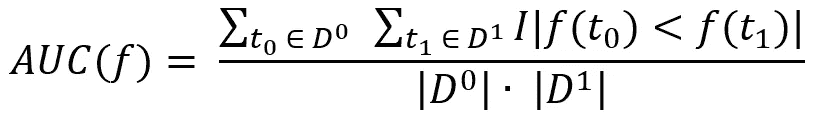**

**来自考尔德斯和西蒙(2007)。**

**在哪里**

*   **`I(.)`是指标函数(如果其参数为真，则为 1，否则为 0)。**
*   **`D₀`表示一组阴性(`Class 0`)观察值。**
*   **`D₁`表示一组阳性(`Class 1`)观察值。**

**在生存分析中，通过设计，真阳性率和假阳性率依赖于时间*。原本健康的患者(真阴性)随着时间的推移会经历不良事件(变成真阳性)。因此，AUC 的表达变得动态。***

**在文献中，可以找到右删失数据的动态 AUC 估计量的不同建议:**

*   **希格蒂和郑(2005)。**
*   **Uno 等人，⁴ (2007 年)。**
*   **洪和蒋(2010)。**

**我们可以通过`scikit-survival`包:`sksurv.metrics.cumulative_dynamic_auc` ⁶.来实现这个度量**

**给定一个估计患者`i`的风险评分`ηᵢ`的模型`f(xᵢ)`，我们可以将时间`t`的 AUC 定义为:**

**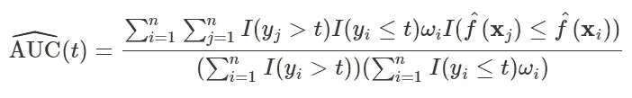**

**动态 AUC。来自 sci kit-⁶.生存文档**

**其中`wᵢ`代表审查权重的逆概率。**

**现在让我们根据之前的 Python 示例来估计不同随访时间的 AUC。**

**首先，我们应该考虑到`wᵢ`的存在需要从训练数据中估计删失分布。因此，测试集时间范围应在训练集时间范围内:**

**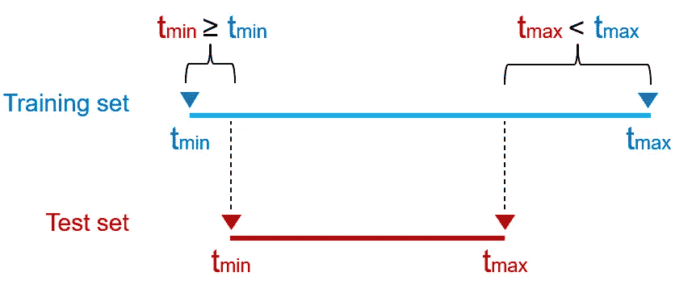**

**图片作者。**

```
mins = []
maxs = []
for split in [y_train, y_test]:
  mins.append(min(split, key = lambda t: t[1])[1])
  maxs.append(max(split, key = lambda t: t[1])[1])assert mins[0] <= mins[1] < maxs[1] < maxs[0], \
 'Test set time range must be contained in the train set time range'
```

**此外，在定义计算 AUC 的时间点时，我们还应选择最后一个时间点，以使之后被审查的*概率不为零*:**

```
import matplotlib.pyplot as plt
from sksurv.metrics import cumulative_dynamic_auc
plt.style.use('ggplot')**# Times <t> at which to calculate the AUC**
va_times = np.arange(1, 1500, 30)
**# where max(<t>) is chosen arbitrarily and < of follow-up time****# Risk scores <f(xi)> on test data**
cph_risk_scores = pipe.predict(x_test)**# AUC at times <t> and its average** cph_auc, cph_mean_auc = cumulative_dynamic_auc(
  y_train, y_test, cph_risk_scores, va_times
)**# Plot the dynamic AUC**
plt.figure(figsize = (12,8))
plt.plot(va_times, cph_auc, marker = 'o')
plt.axhline(cph_mean_auc, linestyle = '--')
plt.title('Test set AUC at different time points', fontsize = 20)
plt.xlabel('Follow-up Time')
plt.ylabel('Dynamic AUC')**# Draw textbox with average AUC**
textbox = 'Average: {:.3f}'.format(cph_mean_auc)
props = dict(boxstyle = 'round', facecolor = 'wheat', alpha = 0.9)
plt.text(1100, 0.55, textbox, fontsize = 18, bbox = props)
plt.grid(True)
```

**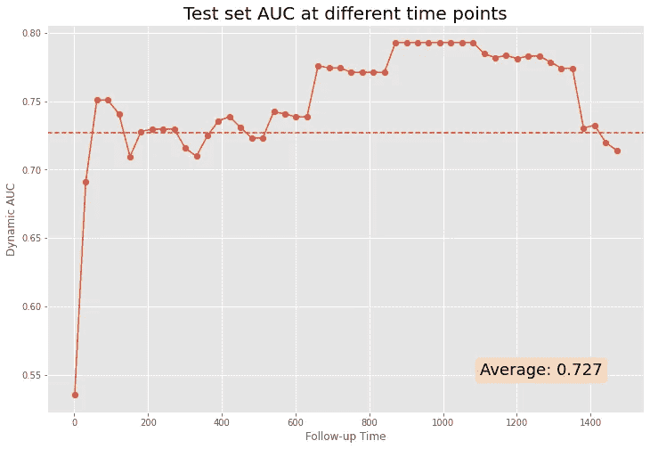**

**图片作者。**

# **5.结论**

**在本文中，我们讨论了用于评估生存分析模型性能的流行指标，并使用`scikit-survival`包提供了 Python 中的实际例子。官方文档和参考文献提供了更多关于该主题的示例和高级信息。**

# ****6。参考文献****

**[1] D. R. Cox，*回归模型和生命表*，皇家统计学会杂志。B 系列(方法学)，第 34 卷，第 2 期。，第 187-220 页，1972 年。**

**[2]s . pl sterl， *scikit-survival:一个建立在 scikit-learn* 之上的时间-事件分析库，机器学习研究杂志，第 21 卷，第 212 期，第 1–6 页，2020 ( [包网站](https://scikit-survival.readthedocs.io/en/stable/index.html))。**

**[3][https://github.com/sebp/scikit-survival/blob/master/COPYING](https://github.com/sebp/scikit-survival/blob/master/COPYING)**

**[4][https://sci kit-survival . readthedocs . io/en/stable/API/generated/sk surv . datasets . load _ whas 500 . html](https://scikit-survival.readthedocs.io/en/stable/api/generated/sksurv.datasets.load_whas500.html)**

**[5][https://towards data science . com/turning-web-browsing-activity-into-product-ratings-with-survival-analysis-5d 5842 af 2 a6d](/turning-web-browsing-activity-into-product-ratings-with-survival-analysis-5d5842af2a6d)**

**[6] F.E. Harrell Jr，R.M. Califf，D.B. Pryor，K.L. Lee，R.A. Rosati，*评估医学试验的产出*，Jama，247，1982 ( [链接](https://pubmed.ncbi.nlm.nih.gov/7069920/))。**

**[7] M.J. Pencina，R.B. D'Agostino，*总体 C 作为生存分析中的一种判别方法:模型特定人群值和置信区间估计*，统计。医学。2004 年 23 日([环节](https://doi.org/10.1002/sim.1802))。**

**[8] H. Uno，T. Cai，M.J. Pencina，R.B. D'Agostino，L.J. Wei，*关于使用删截生存数据评估风险预测程序总体充分性的 C 统计*，Stat .医学。，30，2011 ( [链接](https://doi.org/10.1002/sim.4154))。**

**[9] E. Longato，M. Vettoretti，B. Di Camillo，*对预测时间-事件模型的评估和选择的一致性指数的实用观点*，生物医学信息学杂志，第 108 卷，2020 年([链接](https://doi.org/10.1016/j.jbi.2020.103496))。**

**[10][https://sci kit-survival . readthedocs . io/en/stable/API/generated/sk surv . metrics . concordance _ index _ ipcw . html](https://scikit-survival.readthedocs.io/en/stable/api/generated/sksurv.metrics.concordance_index_ipcw.html)**

**[11][https://sci kit-survival . readthedocs . io/en/stable/user _ guide/evaluating-survival-models . html](https://scikit-survival.readthedocs.io/en/stable/user_guide/evaluating-survival-models.html#Time-dependent-Area-under-the-ROC)**

**[12] T. Calders，J. Szymon，*分类的有效 AUC 优化*，载于:J.N. Kok，J. Koronacki，R. Lopez de Mantaras，S. Matwin，D. Mladeni，A. Skowron，*(编辑)数据库中的知识发现:PKDD 2007* ，计算机科学讲义，柏林，海德堡，2007 ( [链接](https://doi.org/10.1007%2F978-3-540-74976-9_8))。**

**[13] Heagerty，P. J .和 Y. Zheng，*生存模型预测准确性和 ROC 曲线，生物统计学*，61，92–105，2005。**

**[14] Uno，h .、T. Cai、L. Tian 和 L. J. Wei，*用删失回归模型评估 t 年幸存者的预测规则，美国统计协会杂志*，102，527–537，2007 年。**

**[15] H. Hung 和 C. T. Chiang，*具有生存数据的时间相关 AUC 模型的估计方法*，加拿大统计杂志，第 38 卷，第 1 期，第 8-26 页，2010 年([链接](https://doi.org/10.1002/cjs.10046))。**

**[16][https://sci kit-survival . readthedocs . io/en/stable/API/generated/sk surv . metrics . cumulative _ dynamic _ AUC . html](https://scikit-survival.readthedocs.io/en/stable/api/generated/sksurv.metrics.cumulative_dynamic_auc.html)**