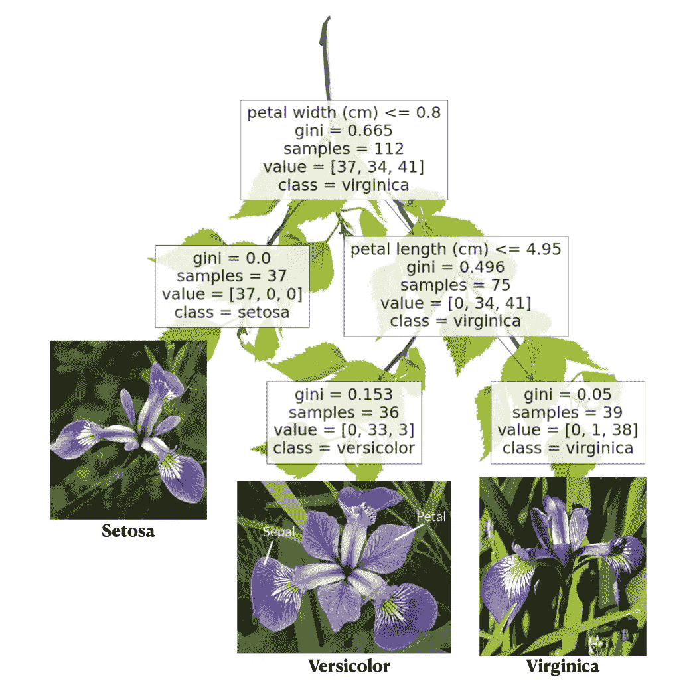
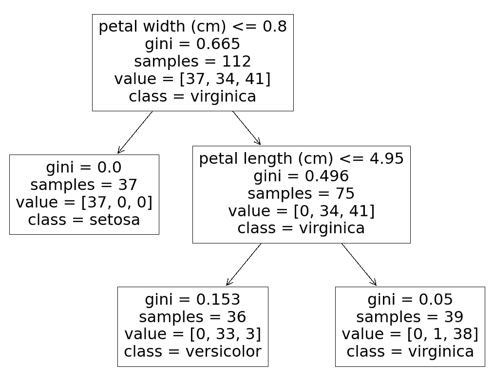

# 如何解释决策树的预测

> 原文：<https://towardsdatascience.com/how-to-explain-decision-trees-predictions-7a10834fe54d>

## [入门](https://towardsdatascience.com/tagged/getting-started)

# 如何解释决策树的预测

## 我们开发了一种方法来解释为什么一个学习过的树模型为一个给定的样本选择一个特定的类，提供了 Python 中的例子



从鸢尾数据集学习的决策树模型，其中花朵被分为三种不同的鸢尾属物种:Setosa、Versicolor 和 Virginica。下面的“可视化学习模型”中解释了这个情节。

随着机器学习模型在不同的用例中变得越来越流行，例如信用风险评估系统、诊断系统甚至节能应用；解释模型决策(或预测)的需要变得更加重要。如果拒绝向客户提供信贷，银行需要向客户解释拒绝信贷的原因；如果患者被诊断患有任何疾病，需要提供该诊断的理由；最后，如果节能应用程序关闭了某个房间的供暖，房主可能想知道为什么会发生这种情况。

一些模型的预测自然比其他模型更容易解释。一方面，神经网络可能在自然语言处理和计算机视觉等几项任务中表现出色，但为了做到这一点，必须训练数百万甚至数十亿个参数，这使得解释模型的输出成为一项非常困难的任务。另一方面，线性回归或决策树等简单模型更容易理解，因此它们的预测也更容易解释。正因为如此，在许多现代系统中，这些模型仍在使用。

在本文中，我们将关注决策树，以及如何解释用于分类的(经过训练的)决策树模型的输出。在接下来的部分中，我们将快速解释决策树是如何工作的，然后我们将看到如何根据导致给定输出的决策路径来解释决策树模型生成的预测。

## 决策树

决策树的目标是通过学习从数据特征(X)推断的简单决策规则来学习预测目标变量的值(我们的 Y 值或类)的模型。这里的关键是，我们的模型可以被视为一个流程图，其中每个节点代表非叶节点的一个条件或叶节点的一个标签。

我们可以很容易地使用 scikit-learn 训练一个决策树，如下所示。在这个例子中，我们将使用[虹膜数据集](https://archive.ics.uci.edu/ml/datasets/iris) —一个众所周知的(无聊的)数据集，通常用作 ML 的玩具示例。我们将把我们的方法应用于这个数据集，但是您可以很容易地修改代码，以应用于您选择的任何其他数据集。下面，我们首先进行必要的导入，然后加载 iris 数据集，并进行 train_test 分割，以创建一个训练集和一个测试集。然后，我们使用训练集训练决策树分类器，将叶节点的最大数量设置为 3，以提高学习模型的可解释性。这降低了我们模型的准确性，如果我们打印分数，我们会看到模型获得 0.964 的分数，而如果我们在没有“max_leaf_nodes”参数的情况下训练决策树，学习后的模型将获得 1.0 的分数(满分)——*哦，我们为提高模型的可解释性所做的牺牲*！尽管如此，0.964 是一个不错的分数，所以让我们继续下去。

## 可视化学习到的模型

我们现在可以使用 scikit-learn 中的一种简便方法来绘制我们学习到的模型。我们将首先导入 matplotlib，然后从 scikit-learn 导入名为“plot_tree”的方法。当我们调用该方法时，我们将学习到的模型作为参数发送，然后使用 Iris 数据集数据设置 feature_names 和 class_names 参数。这将把这些数据添加到图中，使它更容易理解。我们可以在下面看到代码和结果。



为我们学习的决策树模型调用 plot_tree()的结果[图片由作者提供]。

我们可以看到，不同的框按级别组织，箭头显示数据点可以遵循的路径。我们从根开始——最上面的盒子。每个框的第一行显示在该树节点中评估的条件；如果对数据点的条件的评估为真，则遵循左边的路径，否则，我们遵循右边的路径。如果一个框不包含条件，这意味着我们已经到达了一个叶子，该叶子将用框的最后一行中所示的类标签来标记数据点。

在每个节点中，我们还可以在“样本”中看到到达该节点的数据点的数量，在“值”中，我们可以看到这些样本与其类别标签相关的分布，其中每个第 I 个元素代表第 I 个类别标签的数据点的数量。此外，每个方框还显示了[基尼指数](https://medium.com/analytics-steps/understanding-the-gini-index-and-information-gain-in-decision-trees-ab4720518ba8):节点中“杂质”的一种度量。

## 解释决策树的每个预测

我们现在可以手动回答问题“为什么这个数据点被标记为 X？”通过查看数据点特征，然后沿着该数据点在学习模型中经过的路径。然而，我们可能仍然想要产生一个解释这个路径的自动文本，所以让我们这样做。

我在“[了解决策树结构](https://scikit-learn.org/stable/auto_examples/tree/plot_unveil_tree_structure.html)中采用并修改了 Scikit-learn 提供的代码，这样我们就可以打印出决策树中给定样本所遵循的路径。我们可以在下面的例子中看到代码及其输出。

```
Rules used to predict sample 0:
node 0, feature: petal width (cm), (actual value) 2.4 > 0.800000011920929 (threshold)
node 2, feature: petal length (cm), (actual value) 5.1 > 4.950000047683716 (threshold)
leaf reached, label: virginica
```

首先，我们声明一些数组，对于给定的样本，我们需要遍历决策树。这些数组中的每一个都有注释，但是如果您仍然不确定其中任何一个的含义，您可以查看 scikit-learn 文章以获得更详细的解释。其次，我们声明样本 id(由它在 X_test 数组中的位置给出)并获得样本的决策路径。

然后，我们迭代路径中包含的所有节点:对于分裂节点(或非叶节点)，我们打印节点的编号、条件中使用的特征、给定样本的该特征的值以及阈值，显示样本的值是大于“>”还是小于或等于“=

In the output we see a (somewhat rustic) explanation of why our model has predicted a certain label for the given sample: the petal width is greater than 0.8 and the petal length is greater than 4.95, which our tree model has learned to classify as virginica based on the samples included in the train set. If we check the tree plot, we see that a vast majority of the train samples that meet these conditions are indeed virginica, which explains the label predicted by our model.

## Conclusion

We have managed to provide a rustic explanation to a decision trees’ predictions. With this, we aim to improve the trust in our model because any person can now see why a sample was given a certain label or class by our model. We have to keep in mind that we need to use decision trees for this approach to work, which can condemn the performance of our model. In a future article, we will see how we can use other tools such as Shapley values to explain other models different than decision trees.

## Where to go from here

*   [”。了解决策树结构— Scikit-learn](https://scikit-learn.org/stable/auto_examples/tree/plot_unveil_tree_structure.html#sphx-glr-auto-examples-tree-plot-unveil-tree-structure-py) 。
    如果你想更深入地了解 scikit-learn 决策树，你可以阅读这篇非常有趣的文章。
*   如果你对可解释的 ML(或可解释的 AI)感兴趣，你可能会对这本书感兴趣，这本书以实用的方式解释了如何使用 Python 实现可解释的模型。