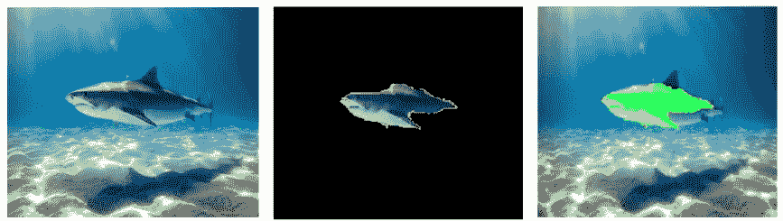
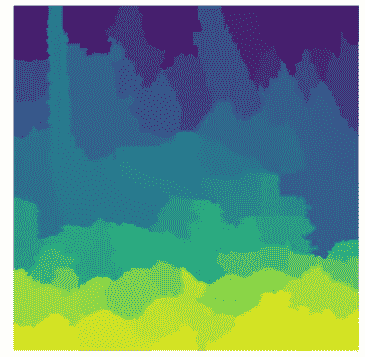
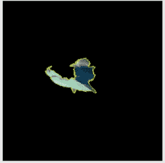
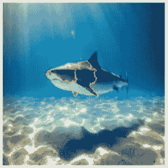
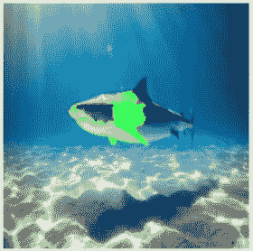
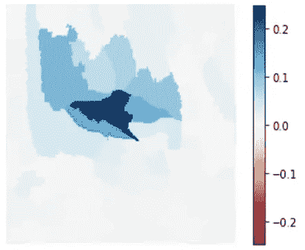

# 如何用石灰解释图像分类器

> 原文：<https://towardsdatascience.com/how-to-explain-image-classifiers-using-lime-e364097335b4>

## 学习如何应用流行的可解释人工智能(XAI)方法来解释图像分类器



用石灰解释图像(作者提供的图像)

**局部可解释模型不可知解释(LIME)** 是最流行的**可解释 AI (XAI)** 方法之一，用于解释机器学习和深度学习模型的工作。LIME 可以为解决回归和分类问题提供模型不可知的局部解释，它可以应用于结构化数据集，甚至可以应用于文本和图像等非结构化数据集。在本文中，您将更深入地了解如何使用 LIME 来解释基于深度学习的图像分类器以及代码演练。

如果你对 XAI 概念不太熟悉，我强烈推荐你观看过去在 2021 年 APAC 人工智能加速器节上发表的关于 XAI 的演讲:

你也可以浏览我的书 [**应用机器学习可解释技术**](https://amzn.to/3cY4c2h) 并看看[代码库](https://github.com/PacktPublishing/Applied-Machine-Learning-Explainability-Techniques/)以获得对其他 XAI 方法的实际接触。在本文中，我将参考《应用机器学习可解释技术》<https://amzn.to/3cY4c2h>****一书中提供的 LIME 在图像分类器中的实际应用。****

**<https://www.amazon.com/Applied-Machine-Learning-Explainability-Techniques/dp/1803246154?_encoding=UTF8&pd_rd_w=Wr6SJ&content-id=amzn1.sym.716a1ed9-074f-4780-9325-0019fece3c64&pf_rd_p=716a1ed9-074f-4780-9325-0019fece3c64&pf_rd_r=6P2PM599T97MRG7NZD9J&pd_rd_wg=m4qUW&pd_rd_r=6e349d93-5ba0-4bfe-9055-905c0153fe58&linkCode=li3&tag=adib0073-20&linkId=35506e1847de5c011fc57aa66c2b1d8e&language=en_US&ref_=as_li_ss_il>  

如果你想得到关于这本书的详细反馈，这个视频可能对你有用:

现在，让我们开始吧！

# 将石灰应用于图像分类器

使用传统的要素重要性方法和其他框架，如莱姆和 SHAP，解释表格数据集仍然很容易。然而，主要的挑战总是在解释基于图像等非结构化数据训练的复杂深度学习模型时出现。

通常，深度学习模型在图像数据上比传统的 ML 模型更有效，因为这些模型具有执行自动特征提取的能力。它们可以提取复杂的低级特征，如条纹、边缘、轮廓、拐角和图案，甚至更高级的特征，如较大的形状和物体的某些部分。这些高级特征通常被称为图像中的**感兴趣区域(RoI)** ，或**超像素**，因为它们是图像中覆盖图像特定区域的像素集合。

现在，低级特征不是人类可解释的，但是高级特征是人类可解释的，因为任何非技术终端用户都将关于高级特征来联系图像。石灰也以类似的方式工作。该算法试图突出显示图像中对模型决策过程有积极或消极影响的超像素。那么，让我们看看如何使用 LIME 来解释图像分类器。

<https://www.amazon.com/Applied-Machine-Learning-Explainability-Techniques/dp/1803246154?_encoding=UTF8&pd_rd_w=Wr6SJ&content-id=amzn1.sym.716a1ed9-074f-4780-9325-0019fece3c64&pf_rd_p=716a1ed9-074f-4780-9325-0019fece3c64&pf_rd_r=6P2PM599T97MRG7NZD9J&pd_rd_wg=m4qUW&pd_rd_r=6e349d93-5ba0-4bfe-9055-905c0153fe58&linkCode=li3&tag=adib0073-20&linkId=35506e1847de5c011fc57aa66c2b1d8e&language=en_US&ref_=as_li_ss_il>  

# 设置所需的 Python 模块

在我们开始代码演练之前，请检查[代码库](https://github.com/PacktPublishing/Applied-Machine-Learning-Explainability-Techniques/blob/main/Chapter05/LIME_with_image_data.ipynb)中提供的笔记本。笔记本包含实际应用这些概念所需的必要细节。在这一节中，我将向您演示代码，并解释笔记本教程中涵盖的所有步骤。如果尚未安装 Python 库的升级版本，请使用以下命令进行安装:

```
**!**pip install --upgrade pandas numpy matplotlib seaborn tensorflow lime scikit-image
```

# 导入 Python Jupyter 笔记本中已安装的模块

```
**import** warnings
warnings**.**filterwarnings("ignore")
**import** os
os**.**environ['TF_CPP_MIN_LOG_LEVEL'] **=** '3'

**import** numpy **as** np
**import** matplotlib.pyplot **as** plt
**import** matplotlib.cm **as** c_map
**from** IPython.display **import** Image, display
**import** tensorflow **as** tf
**from** tensorflow **import** keras
**from** tensorflow.keras.applications.xception **import** Xception, preprocess_input, decode_predictions
**from** tensorflow.keras.preprocessing **import** image

**import** lime
**from** lime **import** lime_image
**from** lime **import** submodular_pick

**from** skimage.segmentation **import** mark_boundaries

np**.**random**.**seed(123)
```

您可以打印安装在您的设置中的 tensorflow 版本。

```
print(f" Version of tensorflow used: {tf**.**__version__}")Version of tensorflow used: 2.3.1
```

# 加载数据

因为我们更感兴趣的是检查如何使用 LIME 解释黑盒图像分类器，所以我们将只关注推理部分。让我们加载任何通用的图像数据。对于这个例子，我们将从这个来源获取数据:[https://unsplash.com/photos/GBDkr3k96DE](https://unsplash.com/photos/GBDkr3k96DE)

```
**def** load_image_data_from_url(url):
    '''
    Function to load image data from online
    '''
    *# The local path to our target image*
    image_path **=** keras**.**utils**.**get_file(
    "shark.jpg", url
    )

    display(Image(image_path))
    **return** image_path

image_path **=** load_image_data_from_url(url **=** "[https://images.unsplash.com/photo-1560275619-4662e36fa65c?ixlib=rb-1.2.1&ixid=MnwxMjA3fDB8MHxwaG90by1wYWdlfHx8fGVufDB8fHx8&auto=format&fit=crop&w=1200&q=80](https://images.unsplash.com/photo-1560275619-4662e36fa65c?ixlib=rb-1.2.1&ixid=MnwxMjA3fDB8MHxwaG90by1wYWdlfHx8fGVufDB8fHx8&auto=format&fit=crop&w=1200&q=80)")
```


图片来源—Unsplash—[https://unsplash.com/photos/GBDkr3k96DE](https://unsplash.com/photos/GBDkr3k96DE)

我们将对图像进行一些初始数据预处理。

```
IMG_SIZE **=** (299, 299)
**def** transform_image(image_path, size):
    '''
    Function to transform an image to normalized numpy array
    '''
    img **=** image**.**load_img(image_path, target_size**=**size)
    img **=** image**.**img_to_array(img)*# Transforming the image to get the shape as [channel, height, width]*
    img **=** np**.**expand_dims(img, axis**=**0) *# Adding dimension to convert array into a batch of size (1,299,299,3)*
    img **=** img**/**255.0 *# normalizing the image to keep within the range of 0.0 to 1.0*

    **return** img

normalized_img **=** transform_image(image_path, IMG_SIZE)
```

# 使用预先训练的张量流模型作为我们的黑盒模型

对于本教程，我们使用预训练的 TensorFlow Keras 异常模型作为我们的黑盒模型。该模型在 ImageNet 数据集([https://www.image-net.org/](https://www.image-net.org/))上进行预训练，这是最流行的图像分类基准数据集之一。预训练模型可以加载以下代码行:

```
from tensorflow.keras.applications.xception import Xceptionmodel = Xception(weights="imagenet")
```

现在让我们使用预训练的 XceptionNet 模型来生成预测。

```
**def** get_model_predictions(data):
    model_prediction **=** model**.**predict(data)
    print(f"The predicted class is : {decode_predictions(model_prediction, top**=**1)[0][0][1]}")
    **return** decode_predictions(model_prediction, top**=**1)[0][0][1]

plt**.**imshow(normalized_img[0])
pred_orig **=** get_model_predictions(normalized_img)
```

这将预测以下输出:

```
The predicted class is : tiger_shark
```

图像被预测为*虎鲨*，这是正确的预测，并且黑盒模型能够成功地给出正确的预测。现在，让我们看看前 5 个预测以及模型置信度。

```
model_prediction **=** model**.**predict(normalized_img)
top5_pred **=** decode_predictions(model_prediction, top**=**5)[0]
**for** pred **in** top5_pred:
    print(pred[1])
```

该模型生成的前 5 个预测是:

```
tiger_shark
great_white_shark
hammerhead
scuba_diver
sturgeon
```

正如我们所看到的，尽管该模型被很好地训练以产生正确的预测，但该模型有可能不只是查看图像中的主要对象，而是查看周围的背景。这一点从*水肺 _ 驾驶员*出现在前 5 预测列表的预测中可见一斑。因此，理解模型用来进行预测的图像的关键组件或部分对我们来说很重要。

<https://www.amazon.com/Applied-Machine-Learning-Explainability-Techniques/dp/1803246154?_encoding=UTF8&pd_rd_w=Wr6SJ&content-id=amzn1.sym.716a1ed9-074f-4780-9325-0019fece3c64&pf_rd_p=716a1ed9-074f-4780-9325-0019fece3c64&pf_rd_r=6P2PM599T97MRG7NZD9J&pd_rd_wg=m4qUW&pd_rd_r=6e349d93-5ba0-4bfe-9055-905c0153fe58&linkCode=li3&tag=adib0073-20&linkId=35506e1847de5c011fc57aa66c2b1d8e&language=en_US&ref_=as_li_ss_il>  

# 用石灰解释模型

在本小节中，我们将了解如何使用 LIME 框架从模型使用的图像中识别超像素或区域，以预测具体结果。我们首先需要定义一个图像解释器对象:

```
explainer **=** lime_image**.**LimeImageExplainer()
```

接下来，我们需要将推断数据(normalized_img[0])传递给 explainer 对象，并使用 LIME 框架来突出显示对模型预测有最大积极和消极影响的超像素:

```
exp **=** explainer**.**explain_instance(normalized_img[0], 
                                 model**.**predict, 
                                 top_labels**=**5, 
                                 hide_color**=**0, 
                                 num_samples**=**1000)
```

我们的 explainer 对象已经准备好了，但是让我们来可视化由 LIME 算法创建的各种解释片段。

```
plt**.**imshow(exp**.**segments)
plt**.**axis('off')
plt**.**show()
```



由 LIME 生成的热图图像对我们推断的 sharp 图像(图片由作者提供)

现在，让我们使用顶部片段或超级像素来识别模型用来进行预测的图像的感兴趣区域。

```
**def** generate_prediction_sample(exp, exp_class, weight **=** 0.1, show_positive **=** **True**, hide_background **=** **True**):
    '''
    Method to display and highlight super-pixels used by the black-box model to make predictions
    '''
    image, mask **=** exp**.**get_image_and_mask(exp_class, 
                                         positive_only**=**show_positive, 
                                         num_features**=**6, 
                                         hide_rest**=**hide_background,
                                         min_weight**=**weight
                                        )
    plt**.**imshow(mark_boundaries(image, mask))
    plt**.**axis('off')
    plt**.**show()generate_prediction_sample(exp, exp**.**top_labels[0], show_positive **=** **True**, hide_background **=** **True**)
```



LIME 拾取的最重要的超级像素预测输出为虎鲨*(图片由作者提供)*

从上图中我们可以看到，模型能够识别正确的区域，这表明模型对结果的预测是正确的。

```
generate_prediction_sample(exp, exp**.**top_labels[0], show_positive **=** **True**, hide_background **=** **False**)
```



由 LIME 拾取的最重要的超像素，用于预测输出，如带有背景图像的虎鲨*(图片由作者提供)*

正如我们从前面的图像中看到的，我们也可以只突出超像素的轮廓，并包括背景。但是我们也可以突出正超像素和负超像素。

```
generate_prediction_sample(exp, exp**.**top_labels[0], show_positive **=** **False**, hide_background **=** **False**)
```



由 LIME 拾取的最重要的超像素预测输出为虎鲨，背景图像和绿色覆盖突出显示正面区域*(作者提供的图像)*

上述示例向我们展示了如何隐藏或显示背景以及超像素，甚至勾勒或突出显示超像素，以识别模型用于进行预测的感兴趣区域。我们从这里看到的确实有意义，也确实让我们增加了对黑盒模型的信任。我们还可以形成一个热图来显示每个超像素对于获得更精细的解释能力有多重要。

```
**def** explanation_heatmap(exp, exp_class):
    '''
    Using heat-map to highlight the importance of each super-pixel for the model prediction
    '''
    dict_heatmap **=** dict(exp**.**local_exp[exp_class])
    heatmap **=** np**.**vectorize(dict_heatmap**.**get)(exp**.**segments) 
    plt**.**imshow(heatmap, cmap **=** 'RdBu', vmin  **=** **-**heatmap**.**max(), vmax **=** heatmap**.**max())
    plt**.**colorbar()
    plt**.**show()

explanation_heatmap(exp, exp**.**top_labels[0])
```



使用石灰的解释热图(图片由作者提供)

<https://www.amazon.com/Applied-Machine-Learning-Explainability-Techniques/dp/1803246154?_encoding=UTF8&pd_rd_w=Wr6SJ&content-id=amzn1.sym.716a1ed9-074f-4780-9325-0019fece3c64&pf_rd_p=716a1ed9-074f-4780-9325-0019fece3c64&pf_rd_r=6P2PM599T97MRG7NZD9J&pd_rd_wg=m4qUW&pd_rd_r=6e349d93-5ba0-4bfe-9055-905c0153fe58&linkCode=li3&tag=adib0073-20&linkId=35506e1847de5c011fc57aa66c2b1d8e&language=en_US&ref_=as_li_ss_il>  

# 摘要

正如我们在本笔记中清楚看到的，LIME 可以轻松地用于解释图像分类器。下次，每当你致力于训练深度学习模型来对图像进行分类时，我会强烈建议你尝试用 LIME 来解释你的模型，并了解模型是否正在研究图像的正确区域，以做出最终预测！如果你喜欢这篇文章，并想了解更多关于如何应用 LIME 来解释 ML 模型的信息，我推荐阅读这本书: [**【应用机器学习可解释技术】**](https://amzn.to/3cY4c2h) 并探索 [GitHub 资源库](https://github.com/PacktPublishing/Applied-Machine-Learning-Explainability-Techniques)以获得实际操作的代码示例。

# 作者关于 TDS 的其他 XAI 相关文章:

1.  [用于在文本数据上训练的模型的可解释机器学习:将 SHAP 与变压器模型相结合](/explainable-machine-learning-for-models-trained-on-text-data-combining-shap-with-transformer-5095ea7f3a8)
2.  [EUCA——一个有效的 XAI 框架，让人工智能更贴近终端用户](/euca-an-effective-xai-framework-to-bring-artificial-intelligence-closer-to-end-users-74bb0136ffb1)
3.  [理解可解释人工智能中使用的 SHAP 和沙普利值的工作原理](/understand-the-working-of-shap-based-on-shapley-values-used-in-xai-in-the-most-simple-way-d61e4947aa4e)

<https://www.amazon.com/Applied-Machine-Learning-Explainability-Techniques/dp/1803246154?_encoding=UTF8&pd_rd_w=Wr6SJ&content-id=amzn1.sym.716a1ed9-074f-4780-9325-0019fece3c64&pf_rd_p=716a1ed9-074f-4780-9325-0019fece3c64&pf_rd_r=6P2PM599T97MRG7NZD9J&pd_rd_wg=m4qUW&pd_rd_r=6e349d93-5ba0-4bfe-9055-905c0153fe58&linkCode=li3&tag=adib0073-20&linkId=35506e1847de5c011fc57aa66c2b1d8e&language=en_US&ref_=as_li_ss_il>  

# 参考

1.  GitHub 中的 LIME 开源 Python 框架—[https://github.com/marcotcr/lime](https://github.com/marcotcr/lime)
2.  应用机器学习解释技术
3.  GitHub repo 自《应用机器学习可解释技术》——[https://GitHub . com/packt publishing/Applied-Machine-Learning-explability-Techniques/](https://github.com/PacktPublishing/Applied-Machine-Learning-Explainability-Techniques/)**