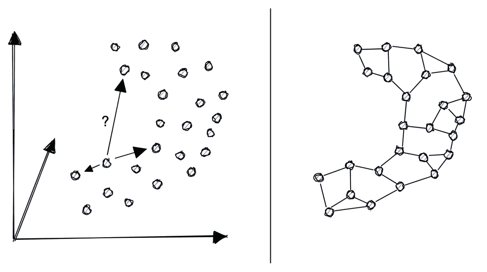
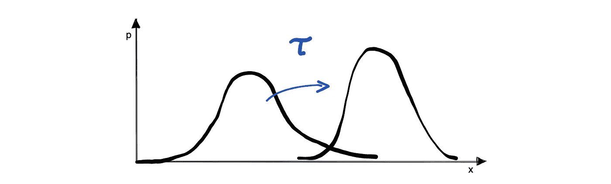
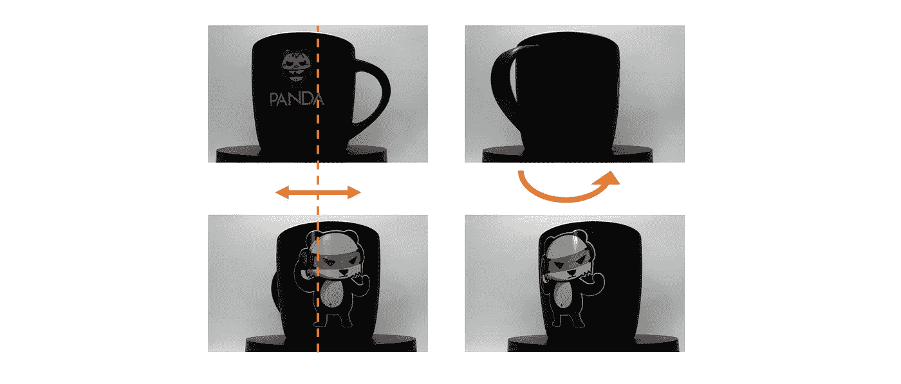
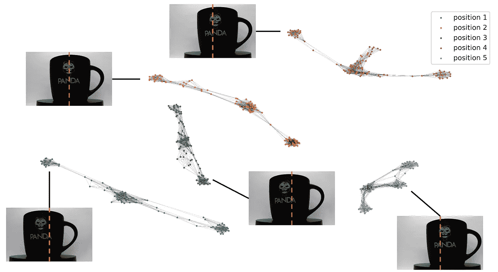
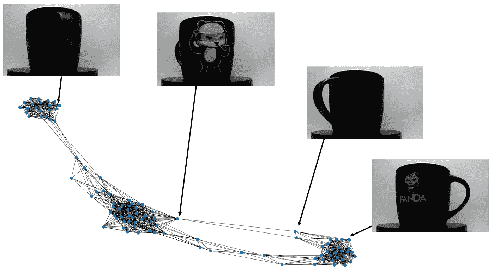

# 如何用图论探索图像数据集

> 原文：<https://towardsdatascience.com/how-to-explore-a-dataset-of-images-with-graph-theory-fd339c696d99>

## 组合特征提取、相似性度量和最近邻图

k-最近邻图示例(图片由作者提供)

当你开始处理一个由图片组成的数据集时，你可能会被问到这样的问题:你能检查图片是否好吗？有什么异常吗？一个快速而简单的解决方案是手动逐个查看数据，并尝试对它们进行分类，但这可能是一项繁琐的工作，具体取决于您获得的图片数量。

例如，在制造业中，您可以从由不同类型和大小的电池组成的生产线上获得包含数千张图片的样本。你必须手动浏览所有图片，并按照类型、大小甚至颜色进行排列。

另一方面，另一个更有效的选择是走计算机视觉路线，找到一种可以自动排列和分类图像的算法——这是本文的目标。

但是我们怎样才能自动完成一个人的工作，也就是说，两个两个地互相比较图片，并根据相似性进行分类？这个问题没有统一的答案。尽管如此，我们可以将问题分成更容易的子问题，并逐一解决它们:从每幅图像中提取相关特征，定义特征之间的相似性度量，并根据相似性对它们进行排序。

为了解决每个子问题，我们将在本文中使用以下方法:

1.  方向梯度直方图(HOG)提取特征
2.  测量直方图之间相似性的 Wasserstein 距离
3.  K-最近邻图(K-NNG ),以便根据相似性对图像进行排序

# 方向梯度直方图

任何计算机视觉问题的第一步都是从图片中提取有用的特征。在我们的例子中，我们希望比较图像，并根据相似性对它们进行排序。所以我们希望我们的特征能够区分相似和不太相似的图像。目标检测中经常使用的一个特征是梯度方向直方图(HOG)。

HOG 特征是将图像表示为矢量，其中矢量中的每个元素都是定向梯度的直方图。推荐阅读[这篇文章](https://medium.com/analytics-vidhya/a-gentle-introduction-into-the-histogram-of-oriented-gradients-fdee9ed8f2aa)了解 HOG 算法的工作原理。

为了从图像中提取 hog 特征，我们可以使用 Scikit-image 库中的 HOG()函数。以下是在黑白图片上提取的渐变的视觉示例:

方向梯度直方图示例

既然我们已经从图像中提取了特征，我们需要定义这些特征之间的相似性度量。机器学习中常用的相似性度量是欧几里德距离，但是在我们的例子中，我们将使用 Wasserstein 度量来给出两个分布之间的距离度量。

# 瓦瑟斯坦距离

Wasserstein 度量，也称为推土机距离，是两个概率分布之间的距离度量。它基于测量将一种分布转换成另一种分布所需的“工作量”的思想。

Wasserstein 距离示例(图片由作者提供)

使用 Wasserstein 度量标准有很多原因。一个原因是它是概率度量空间中一个非常自然的度量。这是一个非常通用的指标，可以用来比较不一定相同的分布。

寻找特征向量之间的良好距离度量是许多机器学习算法的基本步骤。在我们的例子中，Wasserstein 度量测量两个直方图之间的距离，因此提供了两个图片之间的相似性度量。

HOG 从图片中提取特征，Wasserstein 度量提供每个特征之间的距离。下一步是绘制数据并探索数据集。对于这个任务，k-最近邻图因其简单性和可解释性而成为自然的选择。

# K-最近邻图(K-NNG)

简单地说，K-最近邻图是每个节点都与其 K 个最近邻相连的图。K-NNG 有助于发现数据中的模式。例如，如果您有一个人的身高和体重的数据集，您可以使用 K-最近邻图来找出数据中是否有任何模式。

对于我们的最后一个例子，我创建了自己的玩具数据集，其中有一个杯子的 500 张照片，有几种位置和旋转。

具有不同位置和旋转的杯子数据集(图片由作者提供)

为了发现数据的全局结构，我们可以使用流形学习，例如 t-分布式随机邻居嵌入(t-SNE)来将 HOG 描述符的维度降低到仅二维。

通过这种布局，我们获得了一个分隔节点的图，如下图所示。

30-cup 数据集的最近邻图(图片由作者提供)

我们可以用这种方法轻松地分离不同类型的数据，但我们也可以探索数据集的底层结构。对于杯子的例子，我们能够区分五个水平位置，也能够区分杯子在图片中的旋转。

第一个位置的编码旋转(图片由作者提供)

# 结论

HOG 特征是一个强大的特征描述符，可用于各种计算机视觉应用。然而，它也是一个高维特征向量，可能很难处理。

然而，我们使用 Wasserstein 度量来计算每个直方图之间的距离，这在计算上是昂贵的，但是在比较两个分布时是自然的选择。

为了改进这种方法，我们可以降低 HOG 特征的维度。例如，我们可以使用更少数量的箱、更粗糙的宁滨方案或更小范围的值，但我们将在另一篇文章中讨论这一点。

最后，通过 K 近邻图，我们了解数据。这包括理解数据代表什么以及数据集的整体结构，这是迭代和细化探索性分析的良好起点。

好奇想了解更多关于 Anthony 的工作和项目吗？在[媒体](https://medium.com/@anthonycvn)、 [LinkedIn](https://www.linkedin.com/in/anthonycavin/) 、 [Twitter](https://twitter.com/Anthony66333223) 上关注他。

*需要技术写手？将您的请求发送到*[*https://amigo CCI . io*](https://amigocci.io/blog/mlops-at-medium-scale/)*。*