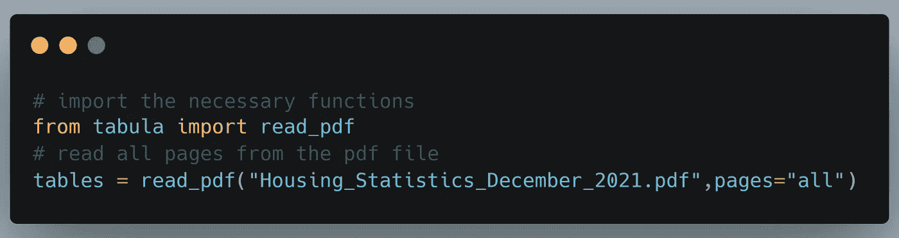
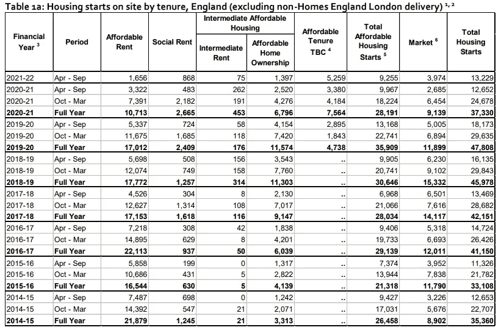
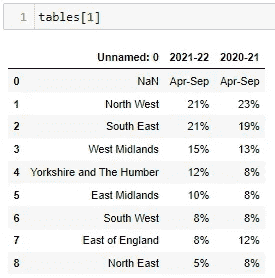
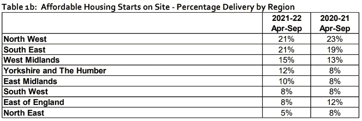

# 如何从 PDF 文件提取表格并将其转换为 Pandas 数据框架

> 原文：<https://towardsdatascience.com/how-to-extract-and-convert-tables-from-pdf-files-to-pandas-dataframe-cb2e4c596fa8>

## 因此，您有一些包含表格的 pdf 文件，并希望将它们读入熊猫数据框。让我告诉你怎么做。

约翰内斯·格罗尔在 [Unsplash](https://unsplash.com?utm_source=medium&utm_medium=referral) 上的照片

# 设置

出于本文的目的，我们将从英国住房协会于 12 月 2 日发布的住房统计文件中提取表格。pdf 文件的副本可以在[这里](https://assets.publishing.service.gov.uk/government/uploads/system/uploads/attachment_data/file/1037739/Housing_Statistics_December_2021.pdf)找到。

我们将使用 **tabula-py** 库从 pdf 文件中提取表格。运行`pip install tabula-py`进行安装

确保您的系统中安装了 Java。如果遇到任何安装错误，请参考库的[文档。](https://tabula-py.readthedocs.io/en/latest/getting_started.html#installation)

好了，我们都准备好撤离了！😎

# Tabula:将 Pdf 表格提取到数据框

现在假设感兴趣的 pdf 文件在同一个工作目录中，让我们尝试从中提取表格。要做到这一点，我们需要做的是:

使用 Tabula 从 pdf 文件中读取表格的 Python 代码。(来源:作者)

如您所见，代码非常简单，不言自明。该代码为提取的每个单独的表返回 pandas 数据框的列表。

您可以通过运行`len(tables)`快速查看提取的表的数量，对于这个例子，T1 应该返回`9`。如果您看一下本文使用的 pdf 文件，整个文档中有 9 个表格。

现在，我们要做的就是对列表进行索引，将每个表作为一个数据框。例如，`tables[0]`应该返回第一个表，`tables[1]`应该返回第二个表。

使用 tables[0]从 pdf 文件中提取的第一个表格。(来源:作者)

从 pdf 文件中提取的第一个表格的实际版本。(来源:作者)

使用表[1]从 pdf 文件中提取的第二个表。(来源:作者)

从 pdf 文件中提取的第二个表格的实际版本。(来源:作者)

# 记住

从上面两个提取表格的例子可以看出，tabula 库在从 pdf 中提取表格方面做得非常好。但是，它并不总是干净和精确的。有时，我们必须进行一些手动清洁，以:

*   更正表格的标题
*   删除不必要的行和列
*   拆分合并在一起的列。

这些问题通常在嵌套标题表中很突出，并且很容易解决。😄

# 最后的想法

在本文中，我们看到了使用 Tabula 库从 pdf 文件中提取表格并将其作为 pandas 数据框加载是多么容易。该库在提取表格方面做得很好，但是我们必须总是直观地验证表格的不一致性。大多数时候，任何不一致都很容易解决。

为了完整起见，值得一提的是用于 pdf 表格提取的另一个库: [Camelot](https://camelot-py.readthedocs.io/en/master/) 。虽然这里没有涉及，但它是白板的一个很好的替代品。两者之间没有偏好，因为两者都做得很好。

现在您已经有了作为数据框的表格，可以随心所欲地操纵它们。😄

**🚀希望这篇文章对你有用。** **如果你愿意支持我，可以考虑使用我的** [**推荐链接**](https://saedhussain.medium.com/membership) **加入 medium。这将让你在这个平台上看到我所有的文章以及更多来自其他了不起的作者的文章！🙏**

*我写的其他文章，你可能会喜欢:*

</documenting-your-python-code-9e69671f046a>  </machine-learning-model-as-a-serverless-app-using-google-app-engine-b760de59156>  </machine-learning-model-as-a-serverless-endpoint-using-google-cloud-function-a5ad1080a59e>  </how-to-schedule-a-serverless-google-cloud-function-to-run-periodically-249acf3a652e> 