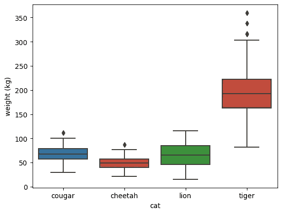
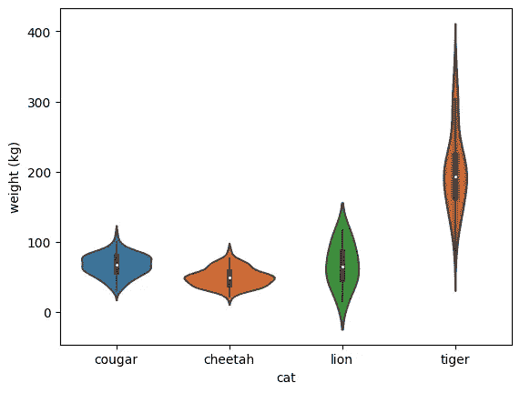
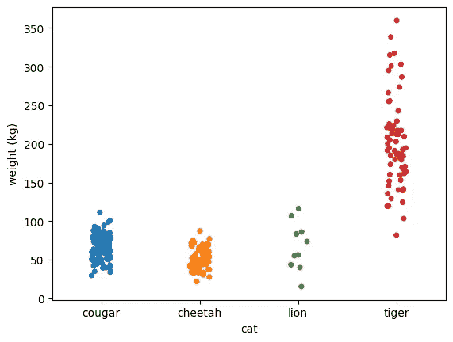
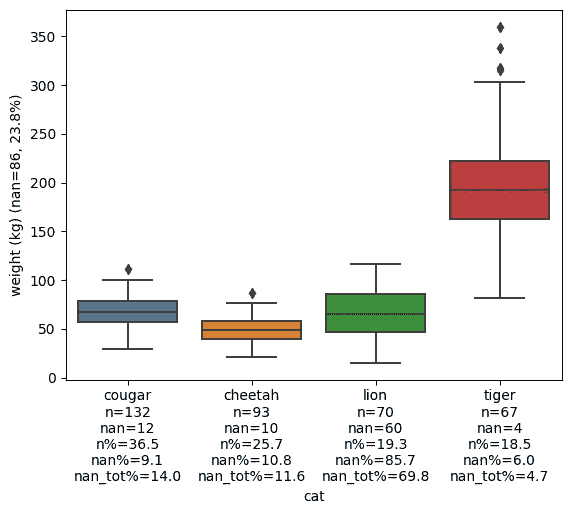
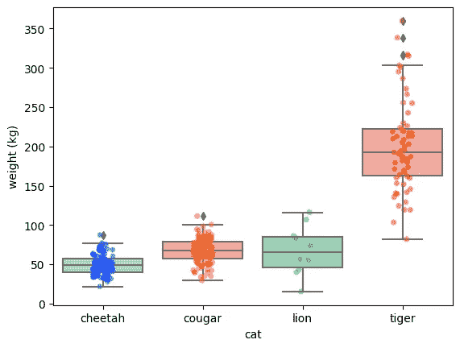
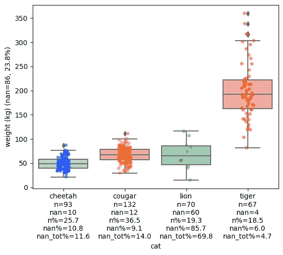

# 如何从分类图中提取更多信息

> 原文：<https://towardsdatascience.com/how-to-extract-more-information-from-categorical-plots-8ffac1133eb0>

## 通过使用这两种方法，可以轻松地深入了解分类数据


约翰·施诺布里奇在 Unsplash[上的照片](https://unsplash.com?utm_source=medium&utm_medium=referral)

当将分类数据的分布与数字目标变量进行比较时，三种最常用的图通常是箱线图、紫线图和条带图。让我们看看这些使用 Python 的 [seaborn](https://seaborn.pydata.org/) 库绘制的图表，并分析我们如何从这些图表中提取更多信息。我们将使用一个关于大型猫科动物及其体重的假想数据集[，这是我从维基百科](https://gist.github.com/sTomerG/8afadb83269a147189a9ebea615e7b50)中使用它们的体重统计数据生成的。

```
import seaborn a sns
import pandas as pddf = pd.read_csv('big_cats.csv')sns.boxplot(df, x='cat', y='weight (kg)')
```



箱线图(作者提供的图表)

从这些箱线图中，我们可以提取以下信息:

*   每种大型猫科动物数据点的 50%的重量(彩色方框)。这也被称为四分位距(IQR)。
*   每种大型猫科动物的平均体重，看 IQR 中间的水平线。
*   第 25 和第 75 百分位分别称为 Q1 和 Q3。大型猫科动物中最轻的 25%在彩色盒子的前面，最重的 25%在彩色盒子的上面。
*   任何异常值，即重量分别小于或大于 Q1 和 Q3 的 1.5 倍 IQR 的物种中的个别大型猫科动物。

正如大多数人可能知道的那样，老虎是大型猫科动物中最大的(也是最重的)，这一点在剧情中得到了清晰的体现。然而，老虎和狮子的体重差异似乎太大了:在这个数据集中，超过 75%的老虎比任何狮子都重。这里发生了一些奇怪的事情，但是箱线图并没有给我们更多的信息。让我们用`sns.violinplot`试试小提琴



Violinplot(作者提供的图表)

violinplot 在 boxplot 的顶部添加了一个层，其中 violin 的厚度意味着数据的密度。尽管如此，这并没有回答我们的问题，为什么这个数据集中的狮子是如此之轻。我们可以尝试使用另一个图:stripplot，它绘制单个数据点:



剥离图(作者提供的图表)

最后，我们似乎可以假设为什么狮子的体重出乎意料:只有几个数据点。也许数据集中所有的狮子都是母狮子，它们通常比公狮子轻，或者也许数据集中的几只狮子都是幼狮，还没有发育完全。

现在，当然，我们可以对每个分类变量应用箱线图和剥离图，但这不是一个非常有效的解决方案。

这个问题的一个简单解决方案是使用 e [xtra-datascience-tools](https://extra-datascience-tools.readthedocs.io/en/latest/) 包中的`add_count_info_to_xticks`，并将其应用于我们的第一个箱线图:

(作者要点)



带计数信息的箱线图(按作者分类的图表)

通过添加计数信息，我们可以很容易地发现 lion 数据中出现了一些奇怪的情况。70 个观察中，60 个是*南*，占 85.7%。这意味着 lion 的箱线图仅基于 10 个数据点，考虑这一点很重要，这也是我们需要在前面绘制剥离图的原因。我们还可以提取其他信息，如有多少数据点是 lions (19.3%)，所有 *nan* 值中有多少来自 lions (69.8%)，以及总数据集有多少 *nan* 值:86，即 23.8%(见 y 轴标签)。

使用`add_count_info_to_xticks`和它的兄弟`add_count_info_to_yticks`,我们可以从单个图中提取更多的信息，同时仍然选择我们喜欢的图。

因为可视化仍然很好，也许更漂亮一点，我们也可以使用 extra-datascience-tool 的`stripboxplot`来创建下面的情节:



条形箱线图(作者提供的图表)

使用这个带状盒状图，我们既可以提取盒状图可以给我们的所有信息，也可以提取关于每个类别的单个数据点和数量的信息。使用`stripboxplot`的`count_info`参数，我们可以更容易地将计数统计数据添加到图表中:

```
import pandas as pd
from extra_ds_tools.plots import stripboxplot

df = pd.read_csv('big_cats.csv')
stripboxplot(df, x_col='cat', y_col='weight (kg)', count_info=True)
```



带计数信息的条形盒图(按作者分类的图表)

## 结论

箱线图、紫线图和带状图对于比较分类分布非常有用。尽管如此，每个都有自己的优势和劣势。使用轴上的[条形盒图](https://extra-datascience-tools.readthedocs.io/en/latest/notebooks/tutorial.html#stripboxplot)和/或[额外计数信息有助于从单个图中提取比使用标准图更多的相关信息！](https://extra-datascience-tools.readthedocs.io/en/latest/notebooks/tutorial.html#add_counts_to_xticks)

如果你仍然对如何在分类变量上应用新的探索性数据分析方法感兴趣，请务必阅读我的另一篇文章:

[](https://medium.com/@tomergabay/advancedvaluecounts-for-eda-2f80e2c74ce1) [## 高级值计数:探索分类变量的新方法

### 一个基于熊猫的 Python 包。值计数()

medium.com](https://medium.com/@tomergabay/advancedvaluecounts-for-eda-2f80e2c74ce1)