# 如何用熊猫填补缺失数据

> 原文：<https://towardsdatascience.com/how-to-fill-missing-data-with-pandas-8cb875362a0d>

## *初学者指南*


马特·霍夫曼在 [Unsplash](https://unsplash.com?utm_source=medium&utm_medium=referral) 上的照片

# 介绍

处理缺失数据是任何数据科学工作流的重要组成部分。处理缺失数据的常用方法包括(a)忽略缺失数据，(b)删除缺失数据的记录，或(c)填充缺失数据。在本文中，我们将使用一个包含 2021 年 1 月 4 天水果价格的玩具数据集，研究各种填充熊猫库缺失数据的方法。

让我们生成我们的玩具数据集。

```
df = pd.DataFrame({'date':['2021-01-01', '2021-01-02', '2021-01-03', '2021-01-04','2021-01-01', '2021-01-02', '2021-01-03', '2021-01-04'], 'fruit':['apple', 'apple', 'apple', 'apple', 'mango', 'mango', 'mango', 'mango'], 'price': [0.80, None, None, 1.20, None, 2.10, 2.00, 1.80]})
df['date'] = pd.to_datetime(df['date'])
```

在该数据集中，有 4 条记录的缺失值用“NaN”表示，并且苹果的价格通常低于芒果的价格。

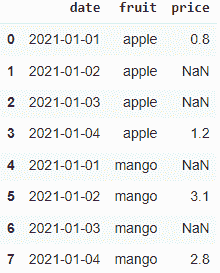

作者图片

# 方法

## 用常数值填充

让我们用用户定义的价格 0.85 来填充缺失的价格。“价格”列中所有缺少的值都将用相同的值填充。

```
df['price'].fillna(value = 0.85, inplace = True)
```

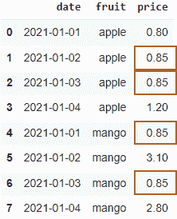

作者图片

## 用列的平均值/中值填充

我们可以用整个列的平均价格或中间价格来填充缺失的价格。

```
# mean
df['price'].fillna(value = df.price.mean(), inplace = True)# median
df['price'].fillna(value = df.price.median(), inplace = True)
```

`df.price.mean()`和`df.price.median()`分别返回平均价格(1.975)和中间价格(2.0)。`.fillna()`方法用给定的平均值或中间值估算缺失的价格。

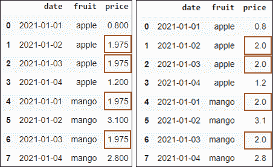

左图:用平均值估算缺失价格。右图:用中位数估算缺失价格。作者图片

这些价格对于苹果价格来说可能太高，对于芒果价格来说可能太低，因此我们可能不想用所有水果的平均价格来估算苹果的价格。相反，我们可能想用苹果的平均(或中间)价格来估算苹果的缺失价格，并对芒果做同样的事情。这就引出了下一种用特定组内的平均值(或中值)填充缺失值的方法。

## 用组的平均值/中值填充

我们可以通过以下方式使用组级统计来填充缺失值。

```
# mean
df['price'].fillna(df.groupby('fruit')['price'].transform('mean'), inplace = True)# median
df['price'].fillna(df.groupby('fruit')['price'].transform('median'), inplace = True)
```

让我们把上面的代码分成两步。

第一步:计算每种水果的平均价格，并返回一个与原始数据帧行数相同的序列。苹果和芒果的平均价格分别为 1.00 英镑和 2.95 英镑。

```
df.groupby('fruit')['price'].transform('mean')
```

第 2 步:根据第 1 步的结果填充缺失的值。

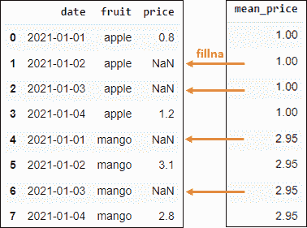

作者图片

## 向前填充

向前填充，简称为“ffill ”,沿着数据帧的选定轴向前传播最后一个有效观察值(在我们的示例中，沿着列向下)。

```
df['price'].fillna(method = 'ffill', inplace = True)
```

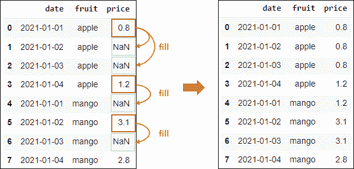

作者图片

我们可以通过使用`limit`参数来限制传播最后一个有效观察的行数。以下示例显示，传播仅限于最后一次有效观察后的 1 步。苹果 2021-01-03 缺少的价格没有填写，因为它是在最后一次有效观察之后 2 步。

```
df['price'].fillna(method = 'ffill', limit = 1, inplace = True)
```

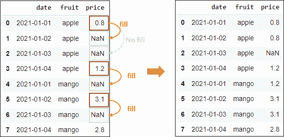

作者图片

向前填充用 2021 年 1 月 4 日的苹果价格替换 2020 年 1 月 1 日缺失的芒果价格。这没有意义，因为这不是苹果之间的比较(没有双关语的意思)。因此，我们可能希望对每个水果分别应用向前填充。我们可以通过使用熊猫分组前向填充方法来实现。

## 组内正向填充

正向填充可以与 groupby 结合使用，在特定组内执行正向填充。

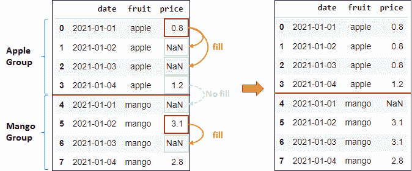

作者图片

```
df['price'] = df.groupby('fruit')['price'].ffill()
```

请注意，2021–01–01 上缺失的芒果价格没有被 2021–01–04 上的苹果价格填充，因为苹果和芒果现在被视为不同的组。与前面的例子类似，我们也可以设置`limit`参数来限制 ffill 传播。

```
df['price'] = df.groupby('fruit')['price'].ffill(limit = 1)
```

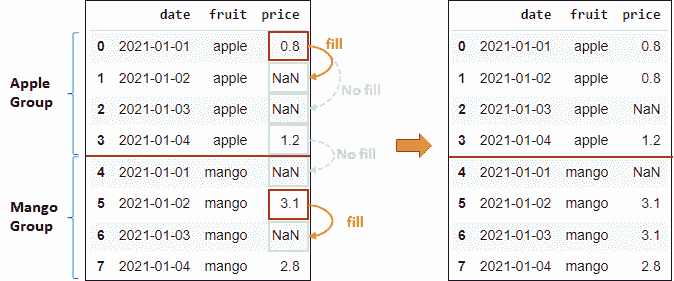

作者图片

## 后面充填物

回填也简称为“bfill ”,是正向回填的反义词。在“NaN”值之后的第一个有效观察被识别，并沿着所选的轴向后传播(在我们的例子中是向上的列)。

```
df['price'].fillna(method = 'bfill', inplace = True)
```

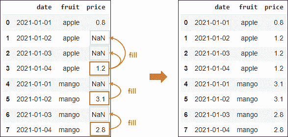

作者图片

类似地，我们也可以使用`limit`参数来限制有效观察传播的行数。

```
df['price'].fillna(method = 'bfill', limit = 1, inplace = True)
```

## 组内回填

与前向填充类似，我们也可以仅在特定组内执行后向填充，并限制其传播。

```
# backfill without propagation limit
df['price'] = df.groupby('fruit')['price'].bfill()# backfill with propagation limited to 1
df['price'] = df.groupby('fruit')['price'].bfill(limit = 1)
```

## FFill 和 BFill 的组合

我们也可以通过方法链接用前向填充填充一个列，然后用后向填充填充。

```
df['price'] = df.groupby('fruit')['price'].ffill().bfill()
```

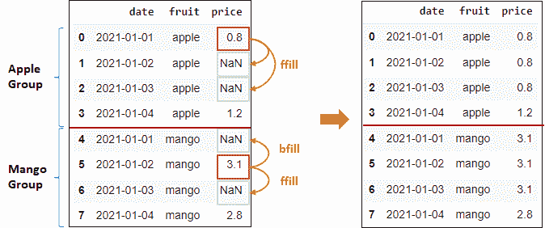

作者图片

注意`.ffill()`和`.bfill()`的顺序很重要。如果我们交换顺序，将首先执行回填，然后执行向前回填，从而产生不同的结果。

```
df['price'] = df.groupby('fruit')['price'].bfill().ffill()
```

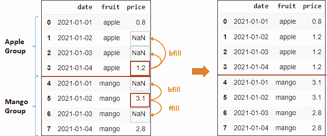

作者图片

## 插入

插值是一种估计位于一系列已知离散数据点之间的新数据点的值的方法。我们可以通过以下方式对熊猫应用线性插值

```
df['price'].interpolate(method = 'linear', inplace = True)
```

线性插值假设这些值的间距相等。苹果在 2021 年 1 月 2 日和 2021 年 1 月 3 日缺少的值被填充为 0.933 和 1.067，其中价格以 0.133 的间隔增加。

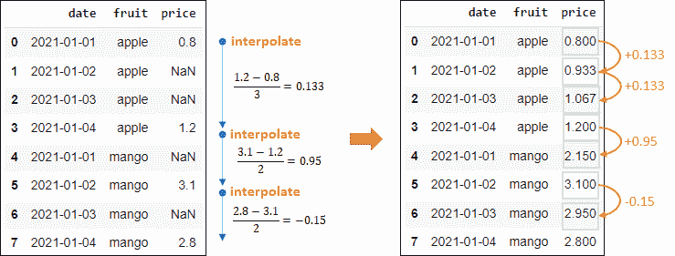

作者图片

以这种方式使用线性插值来填充 2021 年 1 月 1 日缺失的芒果价格是没有意义的，因为我们是基于 2021 年 1 月 4 日的苹果价格和 2021 年 1 月 2 日的芒果价格进行插值的。让我们试着对每个水果分别进行插值。

## 在组内插值

我们可以按以下方式在特定组内执行插值

```
df['price'] = df.groupby('fruit')['price'].apply(lambda x: x.interpolate(method='linear'))
```

芒果在 2021 年 1 月 1 日的价格是“Nan ”,因为没有足够的数据点来执行插值。线性插值需要至少 2 个已知数据点，但是没有芒果在 2021 年 1 月 1 日之前的数据点。

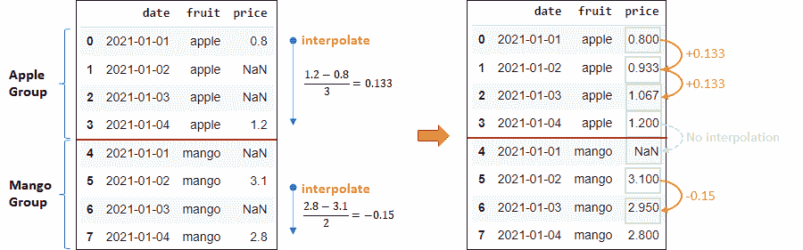

作者图片

假设 2021 年 1 月 1 日和 2021 年 1 月 2 日的芒果价格相同，我们可以使用回填来填充缺失的价格。让我们通过将两种方法链接在一起来依次执行插值和回填。

```
df['price'] = df.groupby('fruit')['price'].apply(lambda x: x.interpolate(method='linear')).bfill()
```

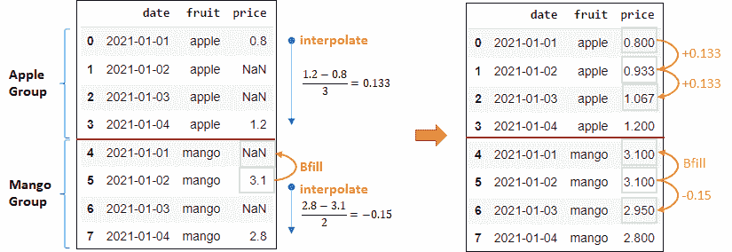

作者图片

## 基于条件的填充值

在某些情况下，我们可能希望根据其他列中的值来定义如何填充缺失值。例如，水果的价格在周末可能比平日更贵。因此，我们希望用以下方式来填补缺失的价格:

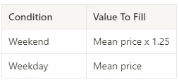

作者图片

首先，我们需要通过创建一个布尔列来确定哪些日期是周末和工作日，其中`True`表示工作日，`False`表示周末。

```
df['weekday'] = df['date'].apply(lambda x: False if x.day_name() in ['Saturday', 'Sunday'] else True)
```

然后我们确定每种水果的平均价格

```
mean_price = df.groupby('fruit')['price'].transform('mean')
```

最后我们根据给定的条件用熊猫`.where()`方法填充缺失值。

```
df['price'].fillna((mean_price).where(cond = df.weekday, other = mean_price*1.25), inplace = True)
```

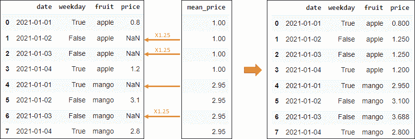

作者图片

# 结论

在本文中，我们研究了以下使用熊猫填充缺失值的方法。

*   菲尔娜
*   向前填充
*   后面充填物
*   插入文字

填充方法的选择取决于假设和问题的背景。例如，用苹果和芒果的平均价格来填充芒果的缺失值可能不是一个好主意，因为苹果和芒果在我们的玩具数据集中具有相当不同的价格。

我们还将看到如何将每个方法与 pandas `.groupby()`方法结合使用，分别为每个组填充缺失值。

*   [加入灵媒](https://medium.com/@edwin.tan/membership)阅读更多这样的故事
*   关注我关于熊猫的教程