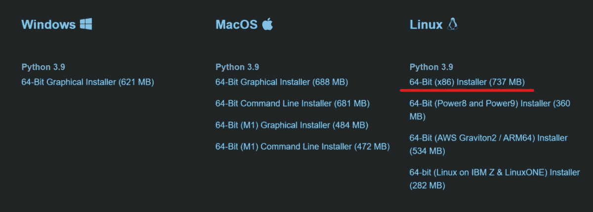
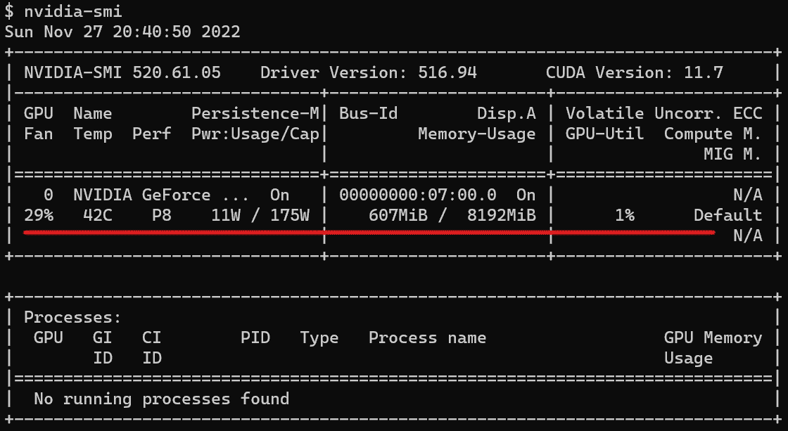
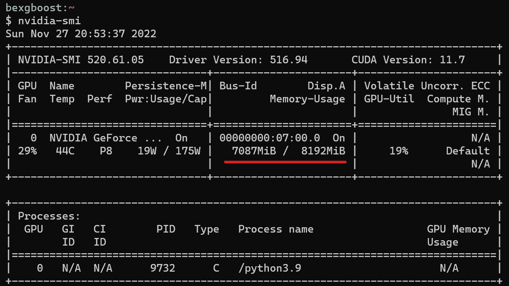

# 如何(最终)在 WSL2 上安装 TensorFlow GPU

> 原文：<https://towardsdatascience.com/how-to-finally-install-tensorflow-gpu-on-wsl2-7be59e278f92>

## 从此再也不用担心 TensorFlow 安装失败


照片由[奥努汉·凯斯金](https://www.pexels.com/photo/a-close-up-shot-of-a-geforce-rtx-graphics-card-11808177/)拍摄

在我关于在 Windows 上安装 TensorFlow GPU 的文章走红并成为 Google 上的特色片段后，我决定为 Windows 子系统 Linux (WSL2)编写相同的教程。完成本文后，您将能够在 WSL2 安装的 GPU 支持下训练 TensorFlow 模型。

## 1.确保在 Windows 端安装了 TensorFlow GPU

首先，确保您遵循我的第一篇文章中所写的步骤:

</how-to-finally-install-tensorflow-gpu-on-windows-10-63527910f255>  

在 WSL2 上安装 TensorFlow 的 GPU 支持是建立在 Windows 端的 NVIDIA CUDA 驱动程序之上的。因此，您必须完成第一篇文章中的步骤。如果您可以从 Windows 命令行运行以下命令并得到相同的输出，那么您就可以开始了:

```
# Create an env for TensorFlow or use an existing one
$ conda create -n tf python=3.9 -y
$ conda activate tf

$ pip install tensorflow==2.10
$ python
>>> import tensorflow as tf
>>> len(tf.config.list_physical_devices('GPU'))
1
```

获得由强大的 AI-Alpha 信号选择和总结的最佳和最新的 ML 和 AI 论文:

<https://alphasignal.ai/?referrer=Bex>  

## 2.检查您的 WSL2 安装

还没有安装 WSL2 吗？不用担心；在这方面我也帮你搞定了。仔细阅读我上一篇文章中关于安装它的综合文章。

</how-to-create-perfect-machine-learning-development-environment-with-wsl2-on-windows-10-11-2c80f8ea1f31>  

如果你已经安装了 WSL2，但还没有为机器学习工作进行配置，那么继续阅读。

## 3.在 WSL2 上安装 Anaconda

我首选的包管理器是 Anaconda。让我们把它安装在 WSL2 上。首先，转到[https://www.anaconda.com/products/distribution](https://www.anaconda.com/products/distribution)并向下滚动到 Anaconda 安装程序部分:



作者图片

复制突出显示的安装程序的链接。注意，我们选择 Linux，因为 WSL2 不能与 Windows 的`.exe`可执行文件一起工作。

然后，转到您的 Linux 终端，下载根路径中带有`wget`(`~`)的文件:

```
$ wget [https://repo.anaconda.com/archive/Anaconda3-2022.10-Linux-x86_64.sh](https://repo.anaconda.com/archive/Anaconda3-2022.10-Linux-x86_64.sh)
```

该命令将下载一个名为`Anaconda3-2022.10-Linux-x86_64.sh`的 Linux 可执行文件。要运行它，您将使用`bash`命令:

```
$ bash Anaconda3-2022.10-Linux-x86_64.sh
```

按照说明操作(只需按 ENTER 和“yes”)。之后，您可以删除该文件:

```
$ rm -rf Anaconda3-2022.10-Linux-x86_64.sh
```

通过运行`conda --version`确保一切顺利。

```
$ conda --version
conda 22.9.0
```

## 4.为 WSL2 安装 CUDA 和 cuDNN 驱动程序

现在，最关键的步骤——安装兼容的 GPU 驱动程序。继[我的第一篇文章](/how-to-finally-install-tensorflow-gpu-on-windows-10-63527910f255)之后，你知道 TensorFlow 的最新版本需要 11.2 和 8.1 版本的 CUDA 和 cuDNN。在从 Windows 端安装了这些版本之后，WSL2 需要相同的版本。

要安装它们，请仔细执行以下步骤。

首先，移除旧的 NVIDIA GPG 签名密钥并更新/升级库:

```
$ sudo sudo apt-key del 7fa2af80
$ sudo apt update && sudo apt upgrade
```

接下来，下载 CUDA Ubuntu 存储库 pin 并将其移动到相关的目的地，并下载新的签名密钥:

```
$ wget https://developer.download.nvidia.com/compute/cuda/repos/wsl-ubuntu/x86_64/cuda-wsl-ubuntu.pin
$ sudo mv cuda-wsl-ubuntu.pin /etc/apt/preferences.d/cuda-repository-pin-600

$ sudo apt-key adv --fetch-keys https://developer.download.nvidia.com/compute/cuda/repos/ubuntu2004/x86_64/3bf863cc.pub
$ sudo apt-key adv --fetch-keys https://developer.download.nvidia.com/compute/machine-learning/repos/ubuntu2004/x86_64/7fa2af80.pub
```

然后，下载 WSL2 CUDA 工具包存储库(需要一段时间):

```
$ sudo add-apt-repository "deb https://developer.download.nvidia.com/compute/cuda/repos/wsl-ubuntu/x86_64/ /"
```

更新/升级软件包:

```
$ sudo apt update && sudo apt upgrade
```

现在，安装 CUDA 存储库(这需要一些时间):

```
$ sudo apt-get -y install cuda
$ sudo apt update && sudo apt upgrade
```

最后，我们用以下命令安装 cuDNN 库:

```
$ sudo apt-get install libcudnn8
$ sudo apt-get install libcudnn8-dev
$ sudo apt-get update && sudo apt-get upgrade
```

> 请注意，这些步骤仅适用于 WSL Ubuntu 2004，WSL2 的 x86_64 发行版。对于其他发行版，用你的替换上面三个链接中的`$distro`和`$arch`。例子:`[https://developer.download.nvidia.com/compute/cuda/repos/$distro/$arch/3bf863cc.pub](https://developer.download.nvidia.com/compute/cuda/repos/$distro/$arch/3bf863cc.pub)`

## 5.在 conda 环境中安装 TensorFlow

最后，打造 TensorFlow 专用的 conda 环境。在这里，我将创建一个名为`tf`的:

```
$ conda create -n tf python=3.9 -y
$ conda activate tf
```

现在，用 pip 安装 TensorFlow 并检查安装情况:

```
$ pip install tensorflow==2.10
$ python
>>> import tensorflow as tf
>>> len(tf.config.list_physical_devices('GPU'))
1
```

您也可以从终端运行`nvidia-smi`命令:



作者图片

中间的单元格显示 8GB 中使用了 607MB 的 GPU VRAM。太好了！

现在，让我们训练一个样本模型来看看 GPU 的运行情况。

## 6.检查运行中的 GPU

在新的 Python 脚本中，粘贴以下代码:

```
import tensorflow as tf

mnist = tf.keras.datasets.mnist

(x_train, y_train), (x_test, y_test) = mnist.load_data()
x_train, x_test = x_train / 255.0, x_test / 255.0

model = tf.keras.models.Sequential(
    [
        tf.keras.layers.Flatten(input_shape=(28, 28)),
        tf.keras.layers.Dense(128, activation="relu"),
        tf.keras.layers.Dropout(0.2),
        tf.keras.layers.Dense(10),
    ]
)

loss_fn = tf.keras.losses.SparseCategoricalCrossentropy(from_logits=True)
model.compile(optimizer="adam", loss=loss_fn, metrics=["accuracy"])

model.fit(x_train, y_train, epochs=5)
```

当脚本运行时，再次键入`nvidia-smi`命令。如果中间的单元格显示正在使用更多的 GPU 资源，如下所示，那么恭喜你！您的 TensorFlow 安装现在在 GPU 支持下完全可用。



请注意，当您从 WSL2 使用 GPU 时，GPU 使用统计数据不会正确显示在任务管理器中。这就是为什么推荐使用`nvidia-smi`命令的原因。

## 结论

这就是本教程的内容。请务必[关注我](https://ibexorigin.medium.com/)和[订阅我的电子邮件列表](https://ibexorigin.medium.com/subscribe)，获取我即将发表的关于在 Windows 和 WSL2 上安装支持 GPU 的 PyTorch 的文章。

感谢您的阅读！

<https://ibexorigin.medium.com/membership>  

## 我的更多故事

</how-to-boost-pandas-speed-and-process-10m-row-datasets-in-milliseconds-48d5468e269>  </a-complete-shap-tutorial-how-to-explain-any-black-box-ml-model-in-python-7538d11fae94>  </comprehensive-guide-to-deploying-any-ml-model-as-apis-with-python-and-aws-lambda-b441d257f1ec> [## 使用 Python 和 AWS Lambda 将任何 ML 模型部署为 API 的综合指南

towardsdatascience.com](/comprehensive-guide-to-deploying-any-ml-model-as-apis-with-python-and-aws-lambda-b441d257f1ec)