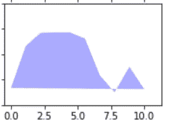
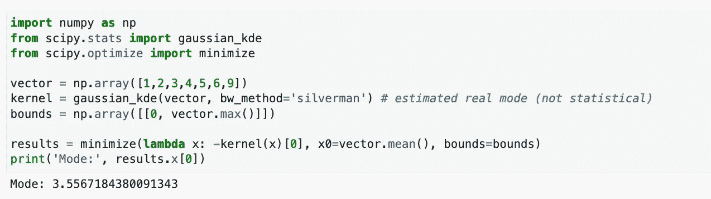
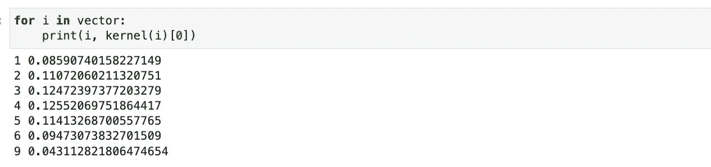
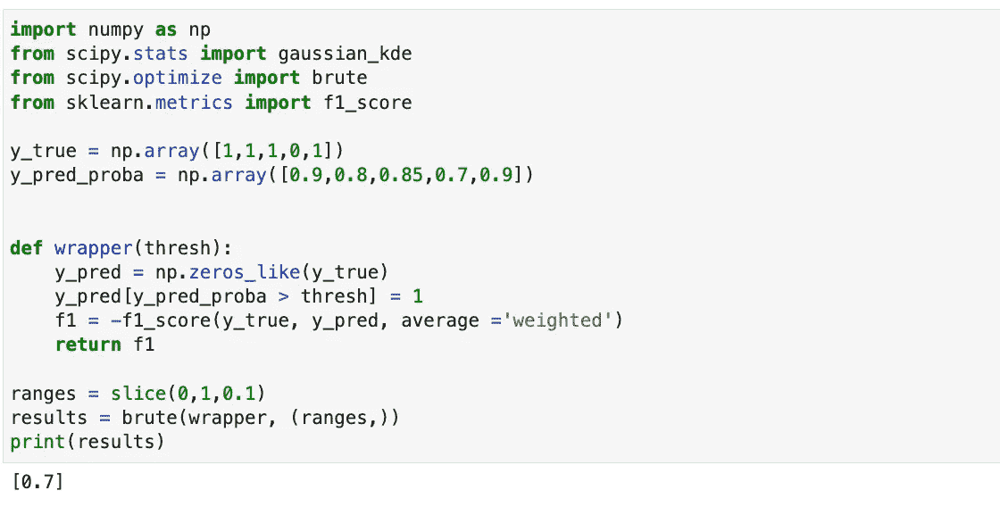

# 如何找到任何函数的最优值

> 原文：<https://towardsdatascience.com/how-to-find-any-functions-optimum-a8d713bf1d25>

## 优化指标、模型和功能的聪明方法

图 1:最小-最大值，“增长-增加-体积”，Tumisu， [Pixabay](https://pixabay.com/photos/growth-increase-volume-sales-4822683/)

直接使用优化器，无论是最小化器还是最大化器，是一个很少被讨论的主题。这些工具可以很容易地用来寻找，例如，任何函数的局部或全局最小值。我们将深入研究几个示例，第一个示例估计模式，第二个示例找到驱动最高 F1 分数的最佳值。请记住，这种方法可以推广，并且在搜索任何函数曲面上的最小值(或最大值)时非常有效。让我们开始吧。

## 估计模式

在这个例子中，我们将使用[核密度估计](https://docs.scipy.org/doc/scipy/reference/generated/scipy.stats.gaussian_kde.html) (KDE)来估计真实模式，这是一种以非参数方式估计随机变量的概率密度函数(PDF)的方法。我们将使用具有高斯内核的 KDE(图 2 ),并在其负内核输出上使用最小化器。换句话说，我们正在尝试使用极小值来搜索模式的分布。

图 2:[1，2，3，4，5，6，9]的高斯 KDE 图

下面是用于这个例子的代码，它非常简单，很容易修改，就像我们将看到的其他问题一样。在图 3 中，我们可以看到一个“向量”,然后由高斯 KDE 估计，并使用负输出值在最小化函数中搜索模式。极小值从平均值开始，不超过它的界限。这一数值分布的平均值为 3.556。

图 3:最小化高斯核 KDE 的代码

我们可以看到，值 3.556 介于向量的第三和第四个成员之间，这是高斯 KDE 的最高输出(图 4)，也就是说，在使用最小值时，代码中的负值最低。

图 4:每个向量项的核值。

## 为 F1 分数优化

再举个例子，有点类似。在这个例子中，我们试图找到逻辑回归边界的最佳阈值，使用强力优化器和 F1 分数函数，它试图找到全局最小值。

在这段代码中，我们有一个真实概率向量和预测概率向量的例子。我们有一个包装器函数，它使用阈值计算可能的 y_pred 向量，这是蛮力搜索通过的。这是在 brute()函数内部完成的。我们针对所有可能的预测向量计算真实值的 F1，并且蛮力函数 bookeeps 最好的最小结果恰好是阈值 0.7。我们期望优化器找到阈值 0.7，这将产生与 y_true 相同的 y_pred 向量(基于 y_pred_proba)，如图 5 所示。

图 5:理论 LogReg 模型输出的 F1 强力优化器。

## 摘要

我希望这篇短文能说服您使用这个不常见但非常有用的工具来优化任何函数，无论是度量、模型、算法还是其他。我要感谢 Natanel Davidovits 在很多年前向我介绍了这个想法并提供了上面的代码。

Ori Cohen 博士拥有计算机科学博士学位，主要研究机器学习。他是 [ML & DL 纲要](https://book.mlcompendium.com/)和[StateOfMLOps.com](http://www.stateofmlops.com)的作者，并且对 AIOps & MLOps 领域很感兴趣。现在，他是 Justt.ai 数据科学的高级数据总监。