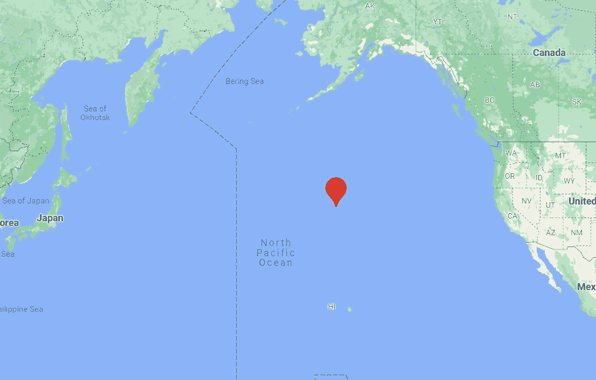
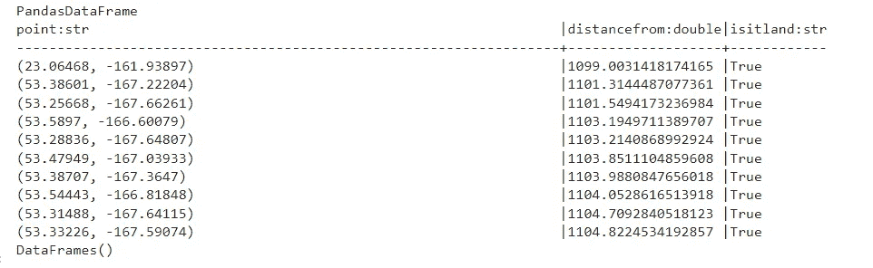
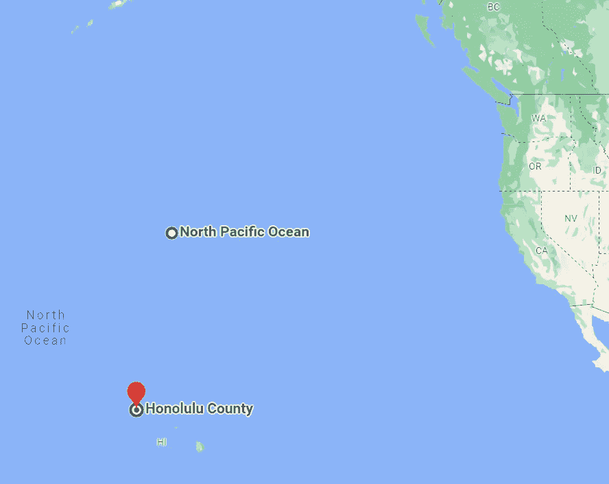

# 如何使用 python 在海上找到陆地

> 原文：<https://towardsdatascience.com/how-to-find-land-when-youre-at-sea-using-python-48111e5d9795>

## 从海洋中的任何一点发现最近的陆地的分析脚本

尼霍阿岛——图片来自[维基百科](https://en.wikipedia.org/wiki/Nihoa)

# 介绍

令人惊讶的是，我在网上找不到任何解决这个问题的工具。在有人问之前，我不是水手或探险家。至少现在还没有。我对这个问题很好奇，因为我和我的妻子将在几个月后有一个孩子，并且正处于试图决定给她取什么名字的绝望阶段。

我妻子来自中国，我来自美国，所以在一次深夜搜索名字的狂欢中，我们中的一个人想到了从我们出生的医院中找出地理中点。两个医院之间最短距离的中点在哪里？我们用谷歌上的工具很快地搜索了一下，结果是这样的:

谷歌地图

嗯，那没什么帮助，是吗？唯一的婴儿名字选择是“太平洋”,这是一个太大的区域，没有任何特别的感觉。所以我们的下一个想法，也是这篇文章的中心点是“离这个点最近的陆地是什么”。也许它会给我们一些有趣的婴儿名字的想法。

当然，我们可以看看上面的地图，有个大概的概念。它要么是北边的阿拉斯加群岛，要么是南边的夏威夷群岛，甚至可能是东边加利福尼亚海岸的某个地方。但是我太挑剔了，不能接受这样一个大概的猜测。我想知道最近的大陆*确切地说是*。

# Python 脚本

我搜索了 google、stack overflow、github 和其他各种资源，都没有找到我们问题的解决方案。那时我决定是时候推迟名称搜索并编写一个 python 脚本了！

从上面可以看到，这个脚本的起点是(38.666067，-158.305948)。这就是之前展示的太平洋中部的点。*边注:我了解到有 6 个小数位的 GPS 坐标精度在一厘米以内。就是这么精确！*

对于那些对脚本本身感兴趣的人来说，代码中有解释每个步骤的注释。包括导入的模块在内的整个脚本都包含在我的 github 中，你可以在那里找到更多的细节。该脚本运行的基本结构是:

1.  选择地球上任意一个 GPS 坐标
2.  测量随机坐标离起点有多远(以英里为单位)
3.  使用 [global_land_mask](https://pypi.org/project/global-land-mask/) 模块发现那个点是海洋还是陆地，玩起来非常有趣。
4.  在一个循环中迭代数百万次。执行的迭代次数越多，结果就越精确。
5.  最后，我们查询数据帧，仅按陆地点过滤，并按找到的最近距离排序。

看起来离我们在太平洋的起点最近的陆地是(23.06468，-161.93897)位置，如下面的查询结果所示。那原来是尼霍阿岛，一个远离夏威夷主岛的无名小岛。如果没有参与这个项目，我永远不会知道这个小岛的存在。下面所有以“53”开头的点都是我们起点以北的阿拉斯加岛串的一部分。

# 结论

发现这个岛非常令人兴奋。这个岛只有 0.27 平方英里，所以我很惊讶剧本竟然把它捡起来了，再次表扬了全球陆地面具模块。事实上，它只在我们的查询中出现过一次(尽管有 500 万次迭代),这表明它有多小。阿拉斯加群岛有数百个点几乎与我们的岛一样近，但不完全在那里。

Nihoa 和我们的起点相比

“Nihoa”绝对有给宝宝起名字的潜力，尤其是在做了这么多工作之后。这是一个有点“与众不同”的名字，但它肯定在我们的列表中。显然，这个名字在夏威夷语中的意思是“锯齿状的边缘”,因为山脉的边缘看起来非常尖锐。无论我们是否选择这个名字，在这个项目之后，我永远不会忘记 Nihoa 岛。

> **更新**:我对这个项目做了一些编辑，在另一篇[文章](/calculating-closest-landmass-between-two-points-on-earth-214f73b48fdc)中会详细讨论。如果你觉得这个有趣，请检查一下。

考虑通过我的推荐链接加入 Medium:[https://andrewhershy.medium.com/membership](https://andrewhershy.medium.com/membership)

如果你觉得这篇文章有帮助/有趣，请看看我的其他文章:

[*我写了一个 python 脚本帮我玩彩票*](/understanding-mega-millions-lottery-using-python-simulation-d2b07d30a7cc)

[*基尼指数 vs 信息熵*](/gini-index-vs-information-entropy-7a7e4fed3fcb)

[*Alteryx 是否是你数据分析需求的正确选择？*](https://link.medium.com/Kq9FcRFB8mb)

[*利用数学和 python 优化你的投资组合*](https://link.medium.com/fk39T8NB8mb)

[*Excel vs SQL:概念上的比较*](https://link.medium.com/8ZJSKcWB8mb)