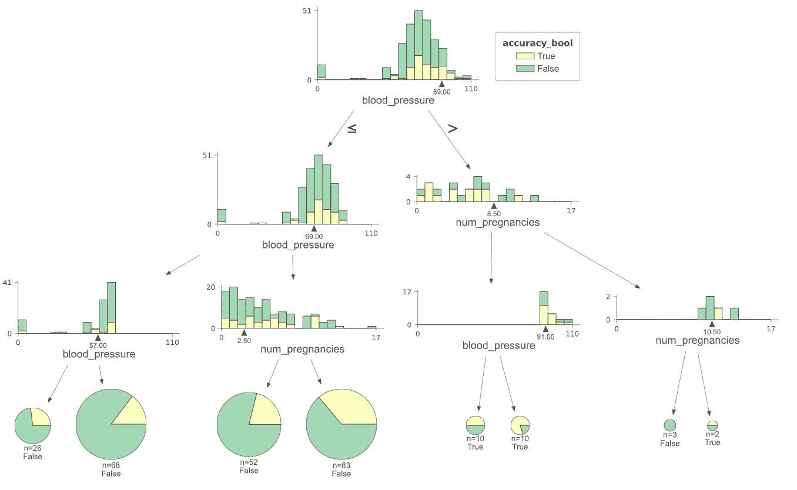
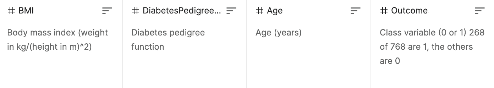
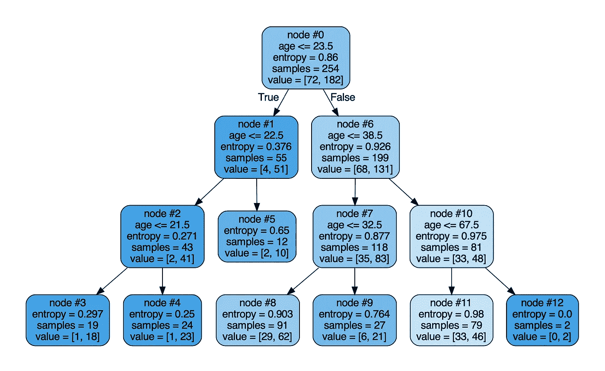
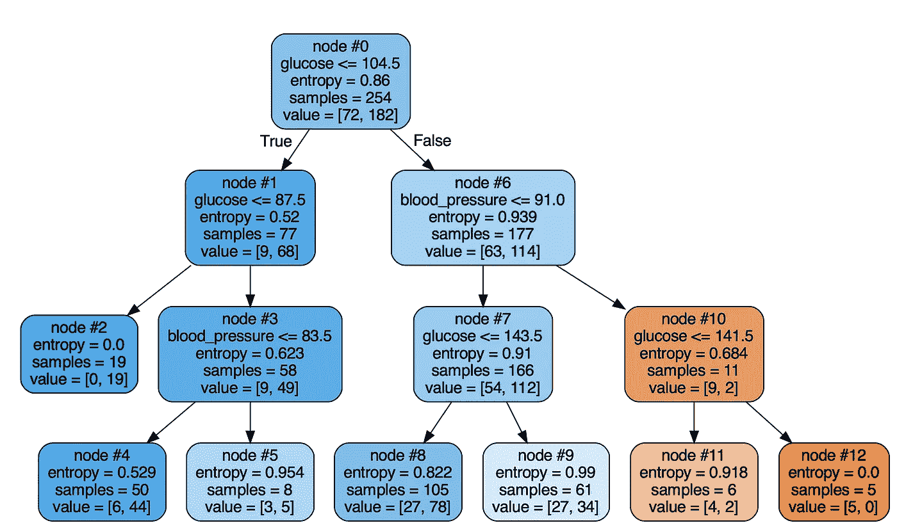
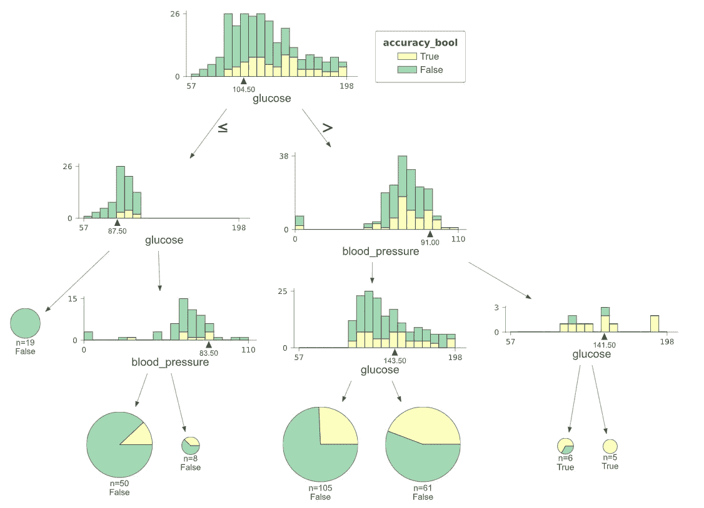
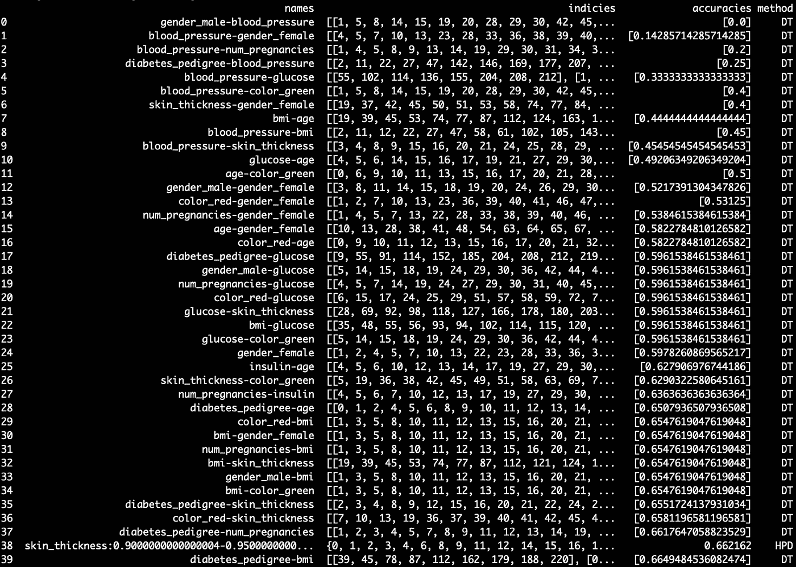

# 如何在你的机器学习模型中找到弱点

> 原文：<https://towardsdatascience.com/how-to-find-weaknesses-in-your-machine-learning-models-3bcce3c7d71e>

## IBM 的 FreaAI 的一种可能实现

任何时候使用汇总统计简化数据，都会丢失信息。模型精度也不例外。当将模型简化为汇总统计数据时，您将无法确定哪里的性能最低/最高以及原因。



图 1:使用 IBM FreaAI 的 POC 训练的最低精度决策树。图片作者。

在这篇文章中，我们讨论了 IBM 的 FreaAI 背后的代码，这是一种识别低精度数据切片的有效方法。在以前的帖子中，我们在高层次上讨论了[方法](/how-to-find-weaknesses-in-your-machine-learning-models-ae8bd18880a3)，并深入利用 [HPD 来找到模型弱点的区域](/highest-prior-density-estimation-for-diagnosing-black-box-performance-c16447a96b7)。在这里，我们将通过一个二进制分类器论文的 MVP 实现。

事不宜迟，我们开始吧。

# 0 —技术概述

FreaAI 是确定表现不佳的数据区域的有效方法。它通过利用[最高先验密度(HPD)方法](/highest-prior-density-estimation-for-diagnosing-black-box-performance-c16447a96b7)和决策树来搜索我们的特征空间，并找到精确度最低的地方。从那里，可解释的数据切片被返回给工程师。

FreaAI 提出了一个解决方案来模拟可解释性、偏差和概化。

# 1 —设置

在第 1 部分，我们将快速回顾一下我们在之前的[帖子](/highest-prior-density-estimation-for-diagnosing-black-box-performance-c16447a96b7)中所涵盖的内容。

## 1.1 —获取数据

首先，我们需要在这里下载我们的分类数据[。这是](https://github.com/mberk06/DS_academic_papers/tree/master/DiabetesData) [CC0 授权](https://www.kaggle.com/uciml/pima-indians-diabetes-database)的，属于公有领域。数据如下图 2 所示…



图 2:数据集的最后 4 列— [src](https://www.kaggle.com/uciml/pima-indians-diabetes-database) 。图片作者。

```
import pandas as pd
df = pd.read_csv('DiabetesData/pima-indians-diabetes.data.csv', header=None)
```

我们还将创建一些虚拟分类列，它们应该会产生非常嘈杂的结果…

```
# add some more columns for fun (one hot encoded categorical)
np.random.seed(0)
enc_df = pd.DataFrame(dict(
        color=['red' if x > 0.25 else 'green' for x in np.random.rand(len(df.index))],
        gender=['male' if x > 0.55 else 'female' for x in np.random.rand(len(df.index))]
))enc = OneHotEncoder(handle_unknown='ignore')
enc_df = pd.DataFrame(enc.fit_transform(enc_df[['color','gender']]).toarray())df = pd.concat([df, enc_df], ignore_index=True, axis=1)df.columns = ['num_pregnancies','glucose','blood_pressure','skin_thickness','insulin','bmi','diabetes_pedigree','age','outcome', 'color_red','color_green','gender_male','gender_female']
```

## 1.2 —训练一个黑盒模型

接下来，我们训练一个 XGBoost 模型…

```
# split data into X and y
mask = np.array(list(df)) == 'outcome'
X = df.loc[:,~mask]
Y = df.loc[:,mask]# split data into train and test sets
seed = 7
test_size = 0.33
X_train, X_test, y_train, y_test = train_test_split(
                                     X, Y,
                                     test_size=test_size, 
                                     random_state=seed)# fit model no training data
model = XGBClassifier()
model.fit(X_train, y_train)# make predictions for test data
y_pred = model.predict(X_test)
predictions = [round(value) for value in y_pred]# evaluate predictions
accuracy = accuracy_score(y_test, predictions)
print("Accuracy: %.2f%%" % (accuracy * 100.0))# add accuracy and return
out = pd.concat([X_test, y_test], axis=1, ignore_index=True)
out.columns = list(df)accuracy_bool = (np.array(y_test).flatten() ==
                 np.array(predictions))out['accuracy_bool'] = accuracy_bool
out
```

使用上述配置，该模型实现了约 71%的准确性。为了使这种准确性具有可操作性，我们还创建了一个列`accuracy_bool`，如果标签预测正确，它就是`True`的布尔值，否则就是`False`。

太好了，我们都赶上了。

# 2-训练可解释的决策树

好了，让我们慢一点，真正理解我们代码中的决策树(DT)部分。与最高先验密度方法一样，我们希望找出数据中表现出异常低准确性的区域。因此，我们训练了一个决策树，其中我们的…

*   **特性**是 XGBoost 模型中使用的一个或两个特性。
*   **目标变量**是上面创建的`accuracy_bool`列。

我们限制一个或两个特性的原因是为了确保数据切片是可解释的，从而是可用的。让我们看一个例子…

首先，我们创建一个简单的助手来训练我们的决策树。

```
def fit_DT(df, predictors = ['age']):
    """ Fit binary classifier""" X = df[predictors] 
    y = df['accuracy_bool'] model = DecisionTreeClassifier(max_depth=3, 
                                   criterion='entropy',
                                   random_state=1)
    model.fit(X, y) preds = model.predict(X)
    acc = accuracy_score(y, preds) return model, preds, acc, X
```

有了这个助手，我们能够将感兴趣的特性传递给`predictors`参数，并(希望)得到低精度的分割。

## 2.1 —单变量决策树

作为一个例子，让我们使用数字列`age`，然后使用 sklearn 中的 [export_graphviz](https://scikit-learn.org/stable/modules/generated/sklearn.tree.export_graphviz.html) 函数将其可视化。



图 3:根据年龄训练的决策树。图片作者。

在图 3 中，每个节点(蓝框)对应一个数据片。叶子最有可能有“小”的`sample`大小和最极端的`entropy`，所以我们关注它们。更具体地说，我们在寻找…

1.  具有低熵(高节点纯度)
2.  有足够的样本量是有用的
3.  相对于我们 71%的基线显示出较低的准确性

贯穿以上逻辑，我们可以看到节点 3、4、12 有熵< 0.3\. Node 12 we can immediately throw out because it has 2 samples, making it pretty useless. Nodes 3 and 4 have sufficient sample size, however their accuracy is 94.7% and 95.8% respectively, indicating they **突出模型优势而不是弱势。**

也许我们选择了一个非常健壮的列，所以让我们继续看另一个例子。

## 2.2 —二元决策树

这里，我们将利用决策树处理多个特性的能力，这有助于我们理解**特性交互**。在这个例子中，感兴趣的特征是`diabetes_pedigree`和`blood_pressure`。



图 4:在血压和葡萄糖上训练的决策树。图片作者。

利用 sklearn 的 graph_viz 库中的`filled=True`参数，我们可以看到，在图 4 中，橙色节点在第一个索引中的`values`比第二个索引中的多，这表明我们的错误分类比分类多。

同样，通过上述标准，我们正在寻找具有足够样本量和低精度的纯叶。节点 10、11 和 12 清楚地显示了低准确度的区域，但是它们具有相对较低的样本大小。使用`values[1] / sum(values)`计算的节点 9 的准确率为 55%,比我们的基线 71%低 16 个百分点。应该进一步探索这些节点。

然而，在深入之前，让我们停下来欣赏一下这个决策树中模型/特性的可解释性。

*   对于`glucose` ≤ 104.5 的人，我们展示了 88%的准确率，如我们的根节点所示。如果`glucose` ≤ 87.5，我们展示 100%的准确性，如节点 2 所示。**葡萄糖在其分布的左侧是一个极其有用的特征。**
*   对于`glucose` > 104.5、`blood_pressure` > 91.0 的人，我们的准确率下降到 18%。**无论是高** `**blood_pressure**` **还是** `**glucose**` **都是我们数据的噪音区。**

我不是糖尿病专家，但理想情况下，如果你正在做这样的项目，你(或你的队友)可以评估这些结论，看看它们是否有意义。如果没有，可能是数据有问题。

现在，尽管我们缺乏糖尿病知识，但我们可以通过利用来自 [dtreeviz](https://github.com/parrt/dtreeviz/blob/master/testing/gen_samples.py) 库的可视化来继续分析…



图 5:数据绘图决策树适合血压和葡萄糖。图片作者。

在图 5 中，我们有与图 4 完全相同的决策树，但是这次我们在每个节点/叶绘制数据分布。

很快，我们就能发现一些异常。对于我们最右边的决策路径，我们可以看到我们最右边的叶子对应于葡萄糖非常高的 5 个错误分类，这与先前树的结论一致。此外，我们在最左边的叶子上获得了一张非常好的高精度区域的图片——这只是根分布的一部分，其中`glucose` ≤ 87.5。

太好了！现在我们已经讨论了关键的可视化，让我们讨论这个二元特征空间的下一步。我们的[代码](https://github.com/parrt/dtreeviz/blob/master/testing/gen_samples.py)返回我们有问题的数据片的索引。

例如，对于节点 11，这 6 个数据点的行索引是:*【58，87，105，108，222，230】*。从那里，好的老式 EDA 将有望产生更多的见解。

为了简洁起见，我们不会涉及这些步骤，但希望您能有所了解。

# 3-识别精确度差的切片

现在，我们已经走过了一个非常具体的例子，让我们把所有的东西放在一个元分析我们的模型。

在本节中，我们将为每个变量以及变量的所有组合创建一个可视化的树。然而，为了减少查看每个可视化的手动负担，我们将精度输出到一个可排序的数据框中。



图 6:我们的元分析的输出。图片作者。

如图 6 所示，我们的输出包括 4 列:

1.  `names`:HPD 的特征名称或百分位数
2.  `indices`:该数据切片的行索引
3.  `accuracies`:数据切片的准确性
4.  `method`:我们是否使用了决策树(DT)或最高先验密度(HPD)

首先，你会注意到最低精度的分割来自二元决策树。我们创建了一些虚拟列(`gender`和`color`)来测试分类变量拟合，正如所料，它们显示了许多低精度区域。

或者第一个“真正的”有问题的交互来自于`blood_pressure`和`num_pregnancies`。如果我们有兴趣深入研究，我们可以研究数据框中返回的索引，看看决策树认为哪些行有问题。

我们还可以看到，HPD 的当前实现对于确定低精度切片不是非常有效——最弱的切片表现出 66%的精度。虽然 HPD 超级有效，但被训练来根据节点纯度进行分割的决策树会发现较弱的切片是有道理的。

最后，这只是一个拙劣地拼凑成 POC 的虚拟示例。这个基线可以得到显著的改进，IBM 的 FreaAI 实现无疑有更多的功能和优化。随意使用[这个代码](https://github.com/mberk06/DS_academic_papers/blob/master/32_freaai_potential_implementation.py)作为起点:)

# 4 —总结和后续步骤

概括地说，在这篇文章中，我们介绍了 IBM 的 FreaAI 的一个潜在实现。该方法在黑盒模型性能较低的地方找到可解释的数据片段。然后将这些返回给工程师进行纠正。

这个实现对于我们的玩具例子是有效的，但是还有许多可能的改进，这里列出了其中的一些…

*   支持多类分类
*   支持回归
*   数据切片上的统计显著性计算(带 FDR 校正)
*   模块化成类

*感谢阅读！我会再写 19 篇文章，把学术研究带到 DS 行业。查看我的评论，链接到这篇文章的主要来源和一些有用的资源。*