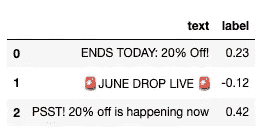
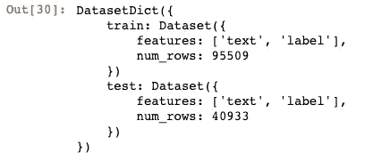
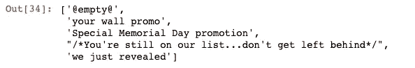
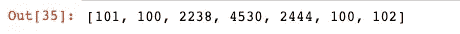
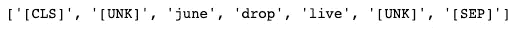
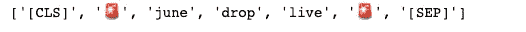

# 如何使用转换器微调 NLP 回归模型

> 原文：<https://towardsdatascience.com/how-to-fine-tune-an-nlp-regression-model-with-transformers-and-huggingface-94b2ed6f798f>

## 从数据预处理到使用的完整指南


照片由 [DeepMind](https://unsplash.com/@deepmind?utm_source=unsplash&utm_medium=referral&utm_content=creditCopyText) 在 [Unsplash](https://unsplash.com/?utm_source=unsplash&utm_medium=referral&utm_content=creditCopyText) 上拍摄

像 [HuggingFace](https://huggingface.co/) 这样的在线图书馆为我们提供了最先进的预训练人工智能模型，可以用于数据科学的许多不同应用。在本帖中，我们将向您展示如何使用预先训练好的模型来解决回归问题。我们将使用的预训练模型是 DistilBERT，它是著名的 BERT 的更轻、更快的版本，其性能为 95%。

假设我们有来自在线广告的文本，并且它的响应率被广告集标准化了。我们的目标是创建一个可以预测广告效果的机器学习模型。

让我们通过导入必要的库并导入我们的数据来开始编码:

```
import numpy as np
import pandas as pdimport transformers
from datasets import Dataset,load_dataset, load_from_disk
from transformers import AutoTokenizer, AutoModelForSequenceClassificationX=pd.read_csv('ad_data.csv')
X.head(3)
```



**文本**代表广告文本，而**标签**是标准化回复率。

# 熊猫到数据集

为了使用我们的数据进行训练，我们需要将 **Pandas 数据帧**转换为“**数据集**格式。此外，我们希望将数据分为训练和测试，以便我们可以评估模型。这些可以通过运行以下命令轻松完成:

```
dataset = Dataset.from_pandas(X,preserve_index=False) 
dataset = dataset.train_test_split(test_size=0.3) dataset
```



如您所见，数据集对象包含训练集和测试集。您仍然可以访问如下所示的数据:

```
dataset['train']['text'][:5]
```



# 令牌化&如何添加新令牌

我们将使用一个预训练的模型，因此我们需要导入它的标记器并标记我们的数据。

```
tokenizer = AutoTokenizer.from_pretrained("distilbert-base-uncased")
```

让我们来标记一个句子，看看我们得到了什么:

```
tokenizer('🚨 JUNE DROP LIVE 🚨')['input_ids']
```



我们可以解码这些 id 并看到实际的令牌:

```
[tokenizer.decode(i) for i in tokenizer('🚨 JUNE DROP LIVE 🚨')['input_ids']]
```



**【CLS】**和**【SEP】**是特殊的标记，总是出现在句子的开头和结尾。如你所见，代替表情符号的是🚨是**【UNK】**令牌，表示令牌未知。这是因为预先训练好的模型**蒸馏器**的单词袋里没有表情符号。但是，我们可以向标记器添加更多的标记，以便在我们根据数据调整模型时可以对它们进行训练。让我们给我们的符号化器添加一些表情符号。

```
for i in ['🚨', '🙂', '😍', '✌️' , '🤩 ']:
    tokenizer.add_tokens(i)
```

现在，如果你将句子符号化，你会看到表情符号仍然是表情符号，而不是[UNK]符号。

```
[tokenizer.decode(i) for i in tokenizer('🚨 JUNE DROP LIVE 🚨')['input_ids']]
```



下一步是对数据进行标记。

```
def tokenize_function(examples):
    return tokenizer(examples["text"], padding="max_length", truncation=True)tokenized_datasets = dataset.map(tokenize_function, batched=True)
```

# 微调模型

是时候导入预先训练好的模型了。

```
model = AutoModelForSequenceClassification.from_pretrained("distilbert-base-uncased", num_labels=1)
```

根据文档，对于回归问题，我们必须通过 **num_labels=1** 。

现在，我们需要调整令牌嵌入的大小，因为我们向令牌化器添加了更多的令牌。

```
model.resize_token_embeddings(len(tokenizer))
```

# 度量函数

在回归问题中，您试图预测一个连续值。因此，您需要度量预测值和真实值之间距离的指标。最常见的指标是 MSE(均方误差)和 RMSE(均方根误差)。对于这个应用程序，我们将使用 RMSE，我们需要创建一个函数在训练数据时使用它。

```
from datasets import load_metric def compute_metrics(eval_pred):
    predictions, labels = eval_pred
    rmse = mean_squared_error(labels, predictions, squared=False)
    return {"rmse": rmse}
```

# 训练模型

```
from transformers import TrainingArguments, Trainertraining_args = TrainingArguments(output_dir="test_trainer",
                                  logging_strategy="epoch",
                                  evaluation_strategy="epoch",
                                  per_device_train_batch_size=16,
                                  per_device_eval_batch_size=16,
                                  num_train_epochs=3,
                                  save_total_limit = 2,
                                  save_strategy = 'no',
                                  load_best_model_at_end=False
                                  ) trainer = Trainer(
    model=model,
    args=training_args,
    train_dataset=tokenized_datasets["train"],
    eval_dataset=tokenized_datasets["test"],
    compute_metrics=compute_metrics
)
trainer.train()
```

# 保存并加载预训练的模型和标记器

要保存和加载模型，请运行以下命令:

```
# save the model/tokenizermodel.save_pretrained("model")
tokenizer.save_pretrained("tokenizer")# load the model/tokenizerfrom transformers import AutoModelForTokenClassification
model = AutoModelForSequenceClassification.from_pretrained("model")
tokenizer = AutoTokenizer.from_pretrained("tokenizer")
```

# 如何使用模型

一旦我们加载了记号赋予器和模型，我们就可以使用 Transformer 的**训练器**从文本输入中获得预测。我创建了一个函数，它将文本作为输入并返回预测。我们需要做的步骤如下:

1.  将数据帧中的文本添加到名为 text 的列中。
2.  将数据帧转换为数据集。
3.  将数据集标记化。
4.  使用培训师进行预测。

当然，你可以不用一个函数来处理多个输入。这样，它会更快，因为它使用批次做预测。

```
from transformers import Trainer
trainer = Trainer(model=model)def tokenize_function(examples):
    return tokenizer(examples["text"], padding="max_length", truncation=True) def pipeline_prediction(text):
    df=pd.DataFrame({'text':[text]})
    dataset = Dataset.from_pandas(df,preserve_index=False) 
    tokenized_datasets = dataset.map(tokenize_function)
    raw_pred, _, _ = trainer.predict(tokenized_datasets) 
    return(raw_pred[0][0])pipeline_prediction("🚨 Get 50% now!")-0.019468416
```

# 总结一下

在这篇文章中，我们向您展示了如何使用预先训练好的模型来解决回归问题。我们使用 Huggingface 的 transformers 库来加载预训练的模型 DistilBERT，并根据我们的数据对其进行微调。我认为 transformer 模型非常强大，如果使用得当，可以比 word2vec 和 TF-IDF 等更经典的单词嵌入方法产生更好的结果。

**想从我这里得到更多？:** [在媒体](https://medium.com/@billybonaros) 上关注我在
中链接的[上添加我通过使用](https://www.linkedin.com/in/billybonaros/) [**我的推荐链接**](https://billybonaros.medium.com/membership) 注册媒体来支持我。