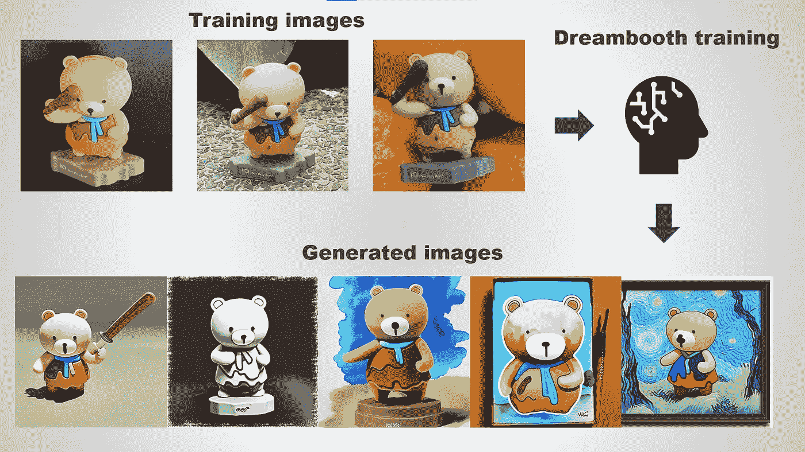
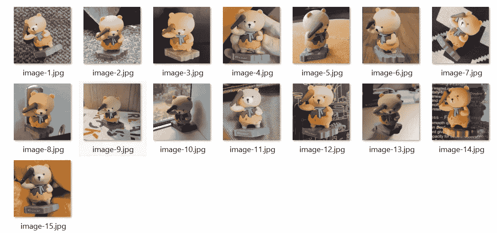
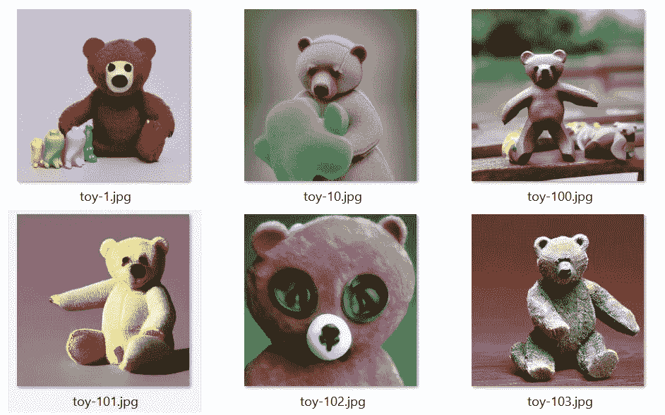
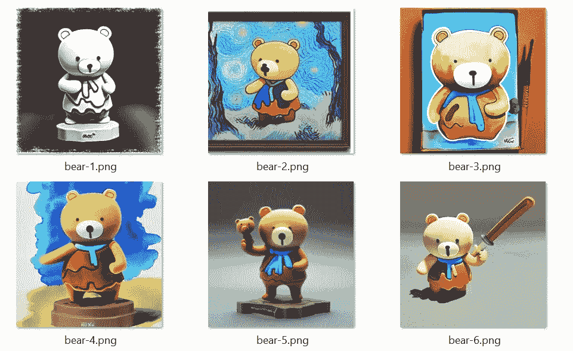

# 如何使用 Dreambooth 微调稳定扩散

> 原文：<https://towardsdatascience.com/how-to-fine-tune-stable-diffusion-using-dreambooth-dfa6694524ae>

## 带有自定义样式或对象的个性化生成图像



作者图片

之前，我已经写过一篇关于使用文本反转对稳定扩散进行微调的文章。本教程重点介绍如何使用另一种叫做 [Dreambooth](https://dreambooth.github.io/) 的方法来微调稳定扩散。与只训练嵌入而不修改基本模型的文本反转方法不同，Dreambooth 微调整个文本到图像模型，以便它学习将唯一标识符与特定概念(对象或样式)绑定。因此，与文本反转相比，生成的图像对于对象或风格来说更加个性化。

本教程基于 HuggingFace 的 Dreambooth 实现的[分叉版本](https://github.com/ShivamShrirao/diffusers/tree/main/examples/dreambooth)。最初的实现需要大约 16GB 到 24GB 来微调模型。维护者 [ShivamShrirao](https://github.com/ShivamShrirao) 优化了代码，将 VRAM 的使用减少到 16GB 以下。根据您的需求和设置，您可以使用 10GB 至 16GB 的 GPU 对模型进行微调。我亲自测试了在特斯拉 T4 GPU 上的训练是可行的。

> 请注意，所有现有的实现都不是由 Dreambooth 的原作者实现的。因此，在再现性方面可能会有细微的差别。

让我们继续下一部分来设置所有必要的模块。

# 设置

建议在继续安装之前创建一个新的虚拟环境。

## Python 包

在您的工作目录中，使用以下代码创建一个名为`requirements.txt`的新文件:

```
accelerate==0.12.0
torchvision
transformers>=4.21.0
ftfy
tensorboard
modelcards
```

激活您的虚拟环境，并逐一运行以下命令来安装所有必需的模块:

```
pip install git+https://github.com/ShivamShrirao/diffusers.git
pip install -r requirements.txt
```

> 注意:你需要使用上面的网址安装`*diffusers*`，而不是直接从`*pypi*`安装。

## bitsandbytes 包

有一个名为`bitsandbytes`的可选包，可以进一步减少 VRAM 的使用。但是，它仅支持 CUDA 版本 10.2–11.7，并且您的机器必须满足以下要求:

*   `LLM.int8()`:英伟达图灵(RTX 20xx；T4)或安培 GPU(RTX 30xx；a4-A100)；(2018 年或更老的一款 GPU)。
*   `8-bit optimizers and quantization`:英伟达 Maxwell GPU 或更新(> =GTX 9XX)。

您可以按如下方式安装它:

```
pip install bitsandbytes
```

## 变压器包

对于 GPU 小于 24GB 的用户，您需要安装`xformers`包来进一步减少 VRAM 的使用。在撰写本文时，安装`xformers`并不是那么简单，因为缺乏开发者的支持。

您可以按如下方式安装软件包:

```
pip install xformers
```

如果您在使用上面的命令时遇到错误，请运行以下命令直接从存储库构建软件包:

```
pip install git+https://github.com/facebookresearch/xformers.git@main#egg=xformers
```

> 如果你有 CUDA 版本的问题，确保你安装了与你的机器兼容的 CUDA 的最新版本。遵循[跟随链接](https://developer.nvidia.com/cuda-downloads?target_os=Linux&target_arch=x86_64&Distribution=Ubuntu&target_version=20.04&target_type=deb_local)的指示。

## 加速设置

下一步是初始化一个`Accelerate`环境。运行以下命令:

```
accelerate config
```

终端会有多个提示。结合自己的用例来回答。看看下面的例子作为参考:

```
In which compute environment are you running? ([0] This machine, [1] AWS (Amazon SageMaker)): 0
Which type of machine are you using? ([0] No distributed training, [1] multi-CPU, [2] multi-GPU, [3] TPU [4] MPS): 0
Do you want to run your training on CPU only (even if a GPU is available)? [yes/NO]:no
Do you want to use DeepSpeed? [yes/NO]: no
Do you wish to use FP16 or BF16 (mixed precision)? [NO/fp16/bf16]: fp16
```

## 拥抱脸的模型

如果你已经有了稳定扩散的`diffusers`模型(v1.4/v1.5)，可以跳过这一节。对于那些

> 你必须使用`diffusers`模型而不是`ckpt`文件进行微调。您可以使用[下面的脚本](https://github.com/huggingface/diffusers/blob/main/scripts/convert_original_stable_diffusion_to_diffusers.py)将您的`ckpt`文件转换为`diffusers`模型。

在 HuggingFace 中注册一个新帐户，并在下载或使用重量之前接受模型许可。

*   [v1.4](https://huggingface.co/CompVis/stable-diffusion-v1-4)
*   [v1.5](https://huggingface.co/runwayml/stable-diffusion-v1-5)

一旦完成，请参考文档的[这一部分来启用访问令牌。](https://huggingface.co/docs/hub/security-tokens)

运行以下命令并传递您的令牌进行身份验证:

```
huggingface-cli login
```

它会在初次运行时将权重下载到缓存文件夹中。

# 数据集

您需要收集高质量的数据集，以获得一致和良好的结果。训练图像应该与预期的输出相匹配，并且分辨率调整为 512 x 512。

请注意，运动模糊或低分辨率等伪像会影响生成的图像。这适用于训练数据集中任何不需要的文本、水印或图标。请务必注意您用于培训的数据集。

根据您的使用情况，您可以使用以下准则:

## 目标

使用带有普通背景的物体图像。透明背景可能会在对象周围留下边缘或边框。所有训练图像应仅聚焦于物体，并在以下方面有所变化:

*   照像镜头视角
*   姿态
*   道具(服装、发型等。)
*   背景(在不同地点拍摄)

训练图像的数量应该在 5 到 20 左右。您可能需要裁剪图像，以便只关注对象。

## 风格

使用你喜欢的风格的图片。可以是你自己的艺术收藏，也可以是风格一致的公共电影/动画/电视剧。所有的训练图像应该集中在风格上，而不是一个特定的对象。

为了更好地概括它，您应该确保同一个对象不会在训练图像中出现超过一次(每个角色一个)。如果你的目标是生成同一风格的不同角色。包括带有字符的训练图像。否则，在训练数据集中包括风景、物体和其他相关图像。

## 训练图像

在本教程中，我将使用以下训练图像:



作者图片

本教程对训练数据集使用以下术语。

*   `Instance images` —代表 dreambooth 培训特定概念的自定义图像。您应该根据您的用例收集高质量的图像。
*   `Class images` —正则化先前保存损失的图像，以防止过拟合。您应该直接从基础预训练模型生成这些图像。您可以选择自己生成它们，或者在运行培训脚本时动态生成它们。

# 培养

前往下面的 Github 库中的[并将](https://github.com/ShivamShrirao/diffusers/tree/main/examples)`[train_dreambooth.py](https://github.com/ShivamShrirao/diffusers/blob/main/examples/dreambooth/train_dreambooth.py)`文件下载到您的工作目录中。

## 训练命令

以下是应根据您的使用情况进行修改的常见参数列表:

*   `pretrained_model_name_or_path` —从 huggingface.co/models 到预训练模型或模型标识符的路径
*   `pretrained_vae_name_or_path` —从 huggingface.co/models.到预训练 vae 或 vae 标识符的路径您可以微调带或不带 vae 的模型
*   `instance_data_dir` —包含实例图像训练数据的文件夹
*   `class_data_dir` —包含类别图像的训练数据的文件夹
*   `instance_prompt` —带有指定实例的标识符的提示
*   `class_prompt` —提示指定与提供的实例图像在同一类中的图像
*   `num_class_images` —先前保存损失的最小类别图像
*   `output_dir`-将写入模型预测和检查点的输出目录
*   `max_train_steps` —要执行的训练步骤总数。建议设置为`N * 100`，其中`N`代表实例图像的数量。
*   `learning_rate` —要使用的初始学习率(在潜在的预热期之后)
*   `lr_scheduler` —要使用的调度程序类型。在[ `linear`、`cosine`、`cosine_with_restarts`、`polynomial`、`constant`、`constant_with_warmup`之间选择
*   `lr_warmup_steps`—lr 调度程序中预热的步骤数。使用`polynomial`时使用`max_train_steps / 10`或使用`constant`时使用`0`。
*   `save_interval` —每 N 步保存一次重量。确保你有足够的存储空间。每个重量在 4GB 左右。

您可以使用以下标志设置自定义值:

```
--pretrained_vae_name_or_path="stabilityai/sd-vae-ft-mse"
```

用先前保存损失进行训练有助于防止过度拟合。按如下方式启用它:

```
--with_prior_preservation --prior_loss_weight=1.0
```

此外，您可以随`unet`一起微调`text_encoder`。然而，这将大大增加 VRAM 的使用。用以下标志设置它:

```
--train_text_encoder
```

对于对象训练，可以用下面的例子作为`instance_prompt`和`class_prompt`的参考。请根据您的用例随意试验不同的字符串。

```
# Woman
--instance_prompt="photo of zwx woman" \
--class_prompt="photo of a woman" \

# Black man
--instance_prompt="photo of zwx black man" \
--class_prompt="photo of a black man" \

# Dog
--instance_prompt="photo of zwx dog" \
--class_prompt="photo of a dog" \
```

> 您可以使用自己的自定义字符串作为唯一标识符。在早期的实现中，大多数例子使用`sks`作为惟一标识符。然而，`sks`是一种半自动步枪的已知代币。强烈建议使用不同的唯一标识符，该标识符不是原始稳定扩散数据集中使用的令牌的一部分。

此外，唯一标识符不限于单个字符串。一些用户报告了良好的表现，并提示进行以下风格训练:

```
# Style 1
--instance_prompt="modern disney style" \
--class_prompt="artwork style" \

# Style 2
--instance_prompt="classic animation style" \
--class_prompt="illustration style" \
```

关于学习率和调度器，敬请参考 HuggingFace 的[以下博客](https://huggingface.co/blog/dreambooth)。

## 培训示例

看一下上面训练图像的示例训练命令(在 16GB 内存的特斯拉 T4 上测试):

```
accelerate launch train_dreambooth.py \
  --pretrained_model_name_or_path="runwayml/stable-diffusion-v1-5" \
  --pretrained_vae_name_or_path="stabilityai/sd-vae-ft-mse" \
  --instance_data_dir="./instance-images/" \
  --class_data_dir="./class-images/" \
  --output_dir="./output-models/" \
  --with_prior_preservation --prior_loss_weight=1.0 \
  --instance_prompt="photo of zwx bear toy" \
  --class_prompt="photo of bear toy" \
  --resolution=512 \
  --train_batch_size=1 \
  --train_text_encoder \
  --mixed_precision="fp16" \
  --use_8bit_adam \
  --gradient_accumulation_steps=1 \
  --gradient_checkpointing \
  --learning_rate=1e-6 \
  --lr_scheduler="constant" \
  --lr_warmup_steps=200 \
  --num_class_images=300 \
  --max_train_steps=2000 \
  --save_interval=500
```

> 根据您的工作目录相应地修改数据目录。

如果您的内存不足，请关闭`text_encoder`训练:

```
accelerate launch train_dreambooth.py \
  --pretrained_model_name_or_path="runwayml/stable-diffusion-v1-5" \
  --instance_data_dir="./instance-images/" \
  --class_data_dir="./class-images/" \
  --output_dir="./output-models/" \
  --with_prior_preservation --prior_loss_weight=1.0 \
  --instance_prompt="photo of zwx bear toy" \
  --class_prompt="photo of bear toy" \
  --resolution=512 \
  --train_batch_size=1 \
  --mixed_precision="fp16" \
  --use_8bit_adam \
  --gradient_accumulation_steps=1 \
  --gradient_checkpointing \
  --learning_rate=1e-6 \
  --lr_scheduler="constant" \
  --lr_warmup_steps=0 \
  --num_class_images=300 \
  --max_train_steps=2000 \
  --save_interval=500
```

> 请确保不要过度训练您的模型，因为 Dreambooth 方法往往会很快过度拟合。如果您的模型不能很好地概括您的提示，或者上面有工件，这很可能意味着您过度训练了您的模型。请减少训练步数或使用较低的学习率进行较高的步数训练。

而且，最新的训练脚本接受了一个名为`concept_list`的新参数。它表示包含字典列表的 JSON 文件的路径。它将覆盖`instance_prompt`、`class_prompt`等参数。您可以使用它将多个概念同时训练到一个模型中。例如，给出下面的`concept_list.json`文件:

```
[
    {
        "instance_prompt":      "photo of zwx dog",
        "class_prompt":         "photo of a dog",
        "instance_data_dir":    "./instance-images/",
        "class_data_dir":       "./class-images/"
    }
]
```

您可以在 training 命令中使用以下参数:

```
--concepts_list ./concepts_list.json
```

只需在列表中添加一个新词典，同时训练另一个概念。

当您第一次运行它时，它将生成类图像。您可以在后续培训中重复使用相同的课程图像，只要您引用的是相同的概念。只需将`class_data_dir`设置为与您之前的培训相同的目录。因此，在为特定风格进行训练时，您可以重用大多数生成的类图像。

以下是为本教程生成的一些类图像:



作者图片

## 培训产出

该脚本将根据 `save_interval`的值在每个间隔上保存一个新的权重。在每个新生成的权重文件夹中，应该有以下文件和文件夹:

```
|- feature_extractor
|  |- preprocessor_config.json
|- scheduler
|  |- scheduler_config.json
|- text_encoder
|  |- config.json
|  |- pytorch_model.bin
|- tokenizer
|  |- merges.txt
|  |- special_tokens_map.json
|  |- tokenizer_config.json
|  |- vocab.json
|- unet
|  |- config.json
|  |- diffusion_pytorch_model.bin
|- vae
|  |- config.json
|  |- diffusion_pytorch_model.bin
|- args.json
|- model_index.json
```

# 推理

现在，在您的工作目录中创建一个名为`inference.py`的新 Python 文件。在其中追加以下代码:

```
from diffusers import StableDiffusionPipeline, DDIMScheduler
import torch

device = "cuda"
# use DDIM scheduler, you can modify it to use other scheduler
scheduler = DDIMScheduler(beta_start=0.00085, beta_end=0.012, beta_schedule="scaled_linear", clip_sample=False, set_alpha_to_one=True)

# modify the model path
pipe = StableDiffusionPipeline.from_pretrained(
    f"./output-models/1500/",
    scheduler=scheduler,
    safety_checker=None,
    torch_dtype=torch.float16,
).to(device)

# enable xformers memory attention
pipe.enable_xformers_memory_efficient_attention()

prompt = "photo of zwx bear toy"
negative_prompt = ""
num_samples = 4
guidance_scale = 7.5
num_inference_steps = 50
height = 512
width = 512

images = pipe(
    prompt,
    height=height,
    width=width,
    negative_prompt=negative_prompt,
    num_images_per_prompt=num_samples,
    num_inference_steps=num_inference_steps,
    guidance_scale=guidance_scale
).images

count = 1
for image in images:
    # save image to local directory
    image.save(f"img-{count}.png")
    count += 1
```

> 一些用户报告称，使用`xformers`生成图像会导致不确定的结果。这意味着您不能使用相同的设置(种子、图像大小等)复制相同的图像。).请自行试验，并根据您的用例相应地修改代码。

完成后，运行下面的命令，使用新调整的模型生成图像。

```
python inference.py
```

以下是一些示例输出(没有包括提示，因为我犯了一个错误，最初没有跟踪它们):



作者图片

考虑一下我关于训练有条件/无条件图像生成模型的其他文章:

*   [如何使用文本反转微调稳定扩散](https://medium.com/towards-data-science/how-to-fine-tune-stable-diffusion-using-textual-inversion-b995d7ecc095)
*   [使用扩散器无条件生成图像的初学者指南](https://betterprogramming.pub/beginners-guide-to-unconditional-image-generation-using-diffusers-c703e675bda8)
*   [如何使用 LoRA 微调稳定扩散](https://medium.com/p/85690292c6a8)

# 结论

Dreambooth 是一种用特定概念(对象或样式)微调稳定扩散模型的好技术。

随着人工智能研究和开发的进步，现在普通人可以微调他们自己的定制模型。然而，对于艺术行业来说，这可能是一把机遇和挑战并存的双刃剑。

如果你是艺术家行业的一员，建议你接受并使用这项技术来简化你的工作流程。此外，如果每个人都能明智地使用这项技术来造福人类，那就太好了。

不幸的是，目前我没有足够的内存来使用图像和标题对整个模型进行微调。

感谢你阅读这篇文章。祝你有美好的一天！

# 参考

1.  [抱紧面部扩散器 Github](https://github.com/huggingface/diffusers)
2.  [shivamshriao 的 Dreambooth Github](https://github.com/ShivamShrirao/diffusers/tree/main/examples/dreambooth)