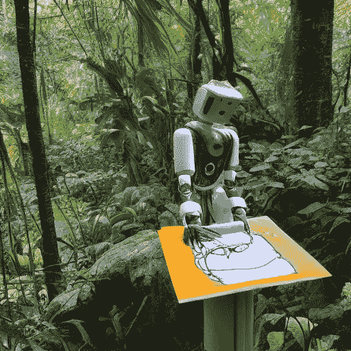
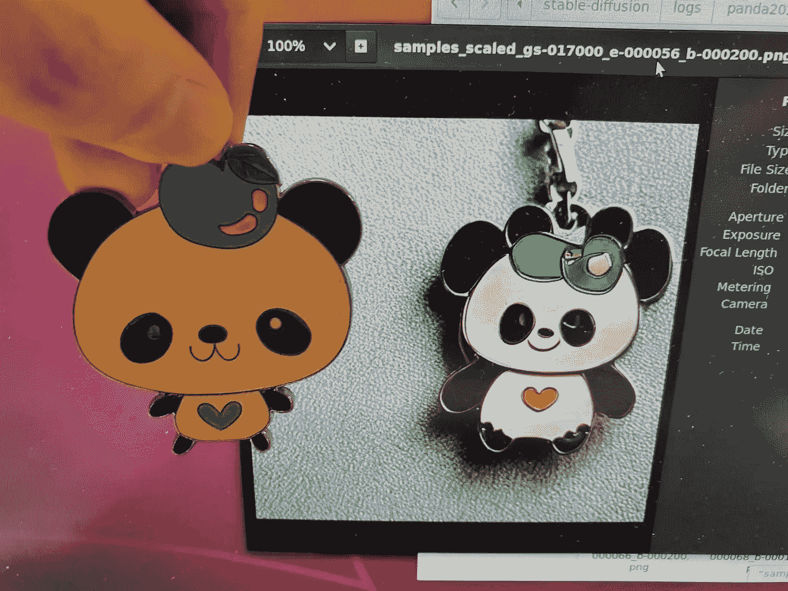
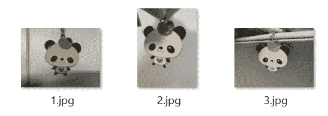
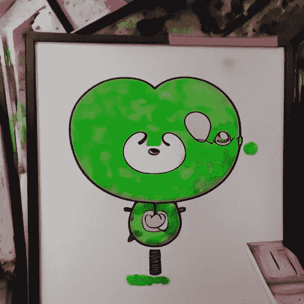
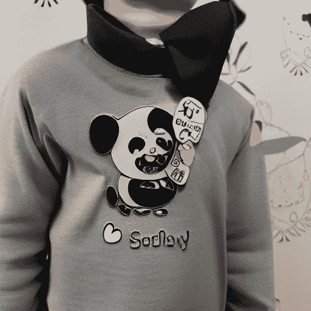

# 如何使用文本反转微调稳定扩散

> 原文：<https://towardsdatascience.com/how-to-fine-tune-stable-diffusion-using-textual-inversion-b995d7ecc095>

## 带有自定义样式或对象的个性化生成图像



人工智能使用提示“一张机器人在野外、自然、丛林中绘画的照片”生成图像

2022 年 8 月 22 日，稳定。艾宣布[稳定扩散](https://stability.ai/blog/stable-diffusion-public-release)公开发布，强大的潜文本到图像扩散模型。给定任何文本或图像作为输入，该模型能够生成图像的不同变体。

请注意

> …该车型将在 [Creative ML OpenRAIL-M 许可](https://huggingface.co/spaces/CompVis/stable-diffusion-license)下发布。该许可证允许商业和非商业使用。合乎道德地使用模型是开发人员的责任。这包括模型的导数。

本教程侧重于如何微调嵌入，以创建基于自定义样式或对象的个性化图像。我们可以在模型的嵌入空间中将自定义样式或对象表示为新单词，而不是重新训练模型。因此，新单词将以直观的方式指导新图像的创建。

看看下面真实生活对象和使用稳定扩散模型和微调嵌入生成的图像之间的比较:



作者图片

让我们继续下一节的设置和安装。

# 装置

请注意，本教程是基于[稳定扩散](https://github.com/invoke-ai/InvokeAI)的分叉版本，它集成了[文本反转以个性化图像生成](https://github.com/rinongal/textual_inversion)。官方资源库[推荐使用 Anaconda](https://github.com/invoke-ai/InvokeAI#installation) 进行安装。

请参考以下指南来安装所有必需的依赖项:

*   [窗户](https://invoke-ai.github.io/InvokeAI/installation/INSTALL_WINDOWS/)
*   [Linux](https://invoke-ai.github.io/InvokeAI/installation/INSTALL_LINUX/)
*   麦金塔电脑

如果您打算通过`pip install`安装依赖项，请使用下面的[需求文件](https://gist.github.com/wfng92/0a41b9a13563e9bc67fd5c1fdc8b1ae5):

```
pip install -r requirements.txt
```

如果安装有问题，请参考以下故障排除指南中的[。](https://github.com/invoke-ai/InvokeAI#troubleshooting)

> 确保在工作目录或中有所有需要的模型和检查点。缓存文件夹。

或者，你可以在 Google Colab 上使用下面的[稳定扩散 AI 笔记本](https://colab.research.google.com/github/lstein/stable-diffusion/blob/main/notebooks/Stable_Diffusion_AI_Notebook.ipynb)进行测试。按照说明在隔离环境中运行稳定扩散。

# 数据准备

首先，在根目录下创建一个名为`training_data`的文件夹(stable-diffusion)。我们将把所有的训练图像放在里面。您可以将它们命名为您喜欢的任何名称，但它必须具有以下属性:

*   图像尺寸为 512 x 512
*   图像应该是垂直的
*   大约 3 到 5 个图像可获得最佳效果(如果使用太多图像，模型可能不会收敛)
*   图像应该有相似的上下文信息。对于基于风格的微调，配色方案和艺术风格应保持一致。对于基于对象的微调，不同视角的图像应该是同一对象(建议对前后不同的对象保持相同的朝向)。

出于演示目的，我将使用我的个人钥匙串作为基于对象的微调的训练数据。



图片由作者提供

上面的图片是用我的手机相机拍摄的。因此，我必须将它们的大小调整为 512 x 512。我在`training_data`文件夹中创建了两个新文件夹:

*   `raw` —用于需要调整大小的原始图像
*   `key` —所有训练图像的实际子文件夹(512 x 512)

您可以使用以下脚本作为调整训练图像大小的参考:

# 配置

前往`<root>/configs/stable-diffusion/`文件夹，你应该会看到以下文件:

*   v1-finetune.yaml
*   v1-finetune_style.yaml
*   v1-推论. yaml

`v1-finetune.yaml`文件用于基于对象的微调。对于基于样式的微调，您应该使用`v1-finetune_style.yaml`作为配置文件。

> 建议创建配置文件的备份，以防您弄乱了配置。

默认配置要求至少 20GB VRAM 用于培训。我们可以通过降低批处理大小和工人数量来减少内存需求。修改以下几行

```
data:
  target: main.DataModuleFromConfig
  params:
    batch_size: 2
    num_workers: 16...lightning:
  callbacks:
    image_logger:
      target: main.ImageLogger
      params:
        batch_frequency: 500
        max_images: 8
```

到下面

```
orkers. Modify the following linesdata:
  target: main.DataModuleFromConfig
  params:
    batch_size: 1
    num_workers: 8...lightning:
  callbacks:
    image_logger:
      target: main.ImageLogger
      params:
        batch_frequency: 500
        max_images: 1
```

*   `batch_size`从 2 到 1
*   `num_workers`从 16 岁到 8 岁
*   `max_images`从 8 点到 1 点

> 我已经测试了在 GeForce RTX 2080 上工作的新配置。

您可以在`first_state_config`下更改训练图像分辨率以减少内存。根据您的 GPU 设备，建议使用 256 或 512。

```
first_stage_config:
      target: ldm.models.autoencoder.AutoencoderKL
      params:
        embed_dim: 4
        monitor: val/rec_loss
        ddconfig:
          double_z: true
          z_channels: 4
          resolution: 256
```

此外，您将需要更改`initializer_words`作为嵌入输入的一部分。它接受字符串列表:

```
# finetuning on a toy image
initializer_words: ["toy"]# finetuning on a artstyle
initializer_words: ["futuristic", "painting"]
```

# 培养

完成后，运行以下命令:

在命令行中指定`--no-test`，在微调过程中忽略测试。您可以使用`--init_word`参数来更改`initializer_words`。请注意，这只适用于单个字符串。如果您打算使用多个字符串，您需要在配置文件中修改它们。

> 在撰写本文时，您只能进行单个 GPU 培训，并且在指定 GPU 时需要在数字末尾包含一个逗号字符。

如果一切设置正确，训练将开始，并将创建一个`logs`文件夹。在其中，您可以找到一个文件夹，其中包含您进行的每项培训，以及以下文件夹:

*   `checkpoints` —包含输出嵌入和训练检查点
*   `configs`—YAML 格式的配置文件
*   `images` —示例提示文本、提示图像和生成的图像
*   `testtube` —与测试相关的文件

训练将无限期运行，或者根据您在配置文件中设置的`max_steps`的数量运行:

```
trainer:
  benchmark: True
  max_steps: 4000
```

> 检查`[v1-finetune.yaml](https://github.com/lstein/stable-diffusion/blob/main/configs/stable-diffusion/v1-finetune.yaml)`作为参考，因为该配置不包括在`v1-finetune_style.yaml`中。省略它可以无限期地运行培训。

您应该检查`images`文件夹以了解性能。前缀为`sample_scaled_`的图像代表生成的样本，如果训练顺利，它应该与您的训练数据有一些相似之处。一旦达到 5000 到 7000 步，你就可以停止训练。

在 checkpoints 文件夹中，您应该会看到相当多的文件:

*   `embeddings_gs-5699.pt` —第 5699 步的嵌入文件
*   `epoch=000010.ckpt`—10 个时期的训练检查点
*   `last.ckpt` —上一个纪元的训练关卡
*   `embeddings.pt` —最后一步的嵌入文件

`ckpt`文件用于恢复训练。`pt`文件是应该与稳定扩散模型一起使用的嵌入文件。只需复制所需的嵌入文件，并将其放在方便推断的位置。

# 推理

## 交互式终端

对于命令行的使用，只需在运行`./scripts/invoke.py`时指定`embedding_path`标志。

```
python ./scripts/invoke.py --embedding_path /path/to/embeddings.pt
```

然后，在交互式终端中对 text2image 使用以下提示:

```
invokeai> "a photo of *"
```

除此之外，您还可以通过设置`init_img`标志来执行图像 2 成像:

```
invokeai> "waterfall in the style of *" --init_img=./path/to/drawing.png --strength=0.7
```

## 简化的 API

或者，您可以使用`ldm.generate`模块以编程方式运行推理。它带有`prompt2image`功能，作为 text2image 和 image2image 任务的单一端点。

请注意，旧版本包含以下功能，这些功能已被弃用，但仍然有效:

*   txt2img
*   img 2g img

关于输入参数的更多信息，请参考 [Python 脚本](https://github.com/invoke-ai/InvokeAI/blob/main/ldm/generate.py)。

您可以在以下要点中找到完整的推理代码以供参考:

# 结果

请注意，大多数时候结果可能并不好。这个想法是生成大量的图像，并使用适合您的用例的图像。让我们看看我在微调嵌入后得到的结果。



人工智能生成的图像使用提示“水彩画的*与树木”


人工智能生成的图像使用提示“一个袋包风格的*”



人工智能使用提示“带有*标志的衬衫”生成图像

此外，我已经测试了 image2image 任务，并获得了以下输出:


图片由作者提供。右边的图像是使用提示“沙滩上的三个”生成的

考虑一下我关于训练有条件/无条件图像生成模型的其他文章:

*   [如何使用 Dreambooth 微调稳定扩散](/how-to-fine-tune-stable-diffusion-using-dreambooth-dfa6694524ae)
*   [使用扩散器无条件生成图像的初学者指南](https://betterprogramming.pub/beginners-guide-to-unconditional-image-generation-using-diffusers-c703e675bda8)
*   [如何使用 LoRA 微调稳定扩散](https://medium.com/p/85690292c6a8)

# 结论

稳定扩散的发布为全世界的开发者提供了巨大的潜力和机会。这肯定会对大多数现有行业产生重大影响，影响人工智能的力量可以实现的目标。

在一周的时间内，我看到世界各地的开发人员一起构建他们自己的开源项目，从 web UI 到动画。

我期待着来自开源社区的更多伟大的工具和最先进的模型。

感谢你阅读这篇文章。祝你有美好的一天！

# 参考

1.  [稳定。AI —稳定扩散公开发布](https://stability.ai/blog/stable-diffusion-public-release)
2.  [Github——梦幻机器人风格界面中的稳定扩散](https://github.com/invoke-ai/InvokeAI)
3.  [Github —文本倒置](https://github.com/rinongal/textual_inversion)