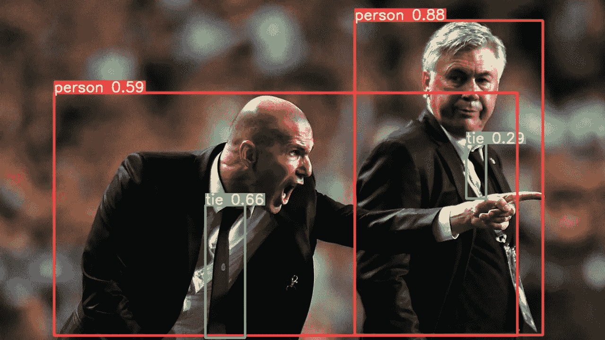

# 如何在多个 GPU 上微调 YOLOv5

> 原文：<https://towardsdatascience.com/how-to-finetune-yolov5-in-a-multi-gpu-environment-ada1935193d3>


插图照片由[伊万·巴比多夫](https://www.pexels.com/@babydov?utm_content=attributionCopyText&utm_medium=referral&utm_source=pexels)从[派克斯](https://www.pexels.com/photo/magnifying-glass-placed-on-yellow-background-7788351/?utm_content=attributionCopyText&utm_medium=referral&utm_source=pexels)拍摄

## 众所周知，深度学习模型往往对适当的超参数选择敏感。同时，当您搜索最佳配置时，您希望使用最大的资源…

对象检测是任何 ML/AI 尚未完全掌握的高级计算机视觉(CV)任务之一。简而言之，该任务由图像中给定对象的定位和识别/分类组成。

[](https://machinelearningmastery.com/object-recognition-with-deep-learning/)  

目标检测仍然是研究领域的一个热门话题。此外，在许多实际应用的生产中，例如场景中的人物检测或商店货架上物品的识别，使用这种人工智能模型的需求相对较高。这自然会产生一个更大的模型架构集合，甚至更多的实现作为开源项目公开共享。其中之一是 [YOLO v5](https://github.com/ultralytics/yolov5) ，它声称在性能(准确度/精确度)和推理时间之间有最好的比例。

除了训练和推理，该项目还提供了基于进化算法调整的运行[超参数搜索。简而言之，该算法分代进行，因此它运行一些短期训练，并根据它们的性能选择最佳的。然后这些最好的混合一些微小的随机变化，再次训练。](https://docs.ultralytics.com/tutorials/hyperparameter-evolution/)

# 简单的屏幕微调

搜索超参数的最简单方法是使用启用的 evolution `--evolve <number>`参数运行训练。但这最多只使用了一个 GPU，那么我们拥有的其余部分呢？

```
python train.py \
    --weights yolov5s6.pt \
    --data /home/user/Data/gbr-yolov5-train-0.1/dataset.yaml \
    --hyp data/hyps/hyp.finetune.yaml \
    --epochs 10 \
    --batch-size 4 \
    --imgsz 3000 \
    --device 0 \
    --workers 8 \
    --single-cls \
    --optimizer AdamW \
    --evolve 60
```

最终，我们可以进行多种培训，但是我们如何推动他们进行合作呢？幸运的是，他们可以共享一个包含转储训练结果的文件，并从中抽取新的群体。由于下一代的随机性，这看起来像是在探索一个更大的群体，正如[作者所说](https://github.com/ultralytics/yolov5/issues/918#issuecomment-1034818168)。

[](https://github.com/ultralytics/yolov5/issues/918)  

插图来自 [Ultralytics 教程](https://colab.research.google.com/github/ultralytics/yolov5/blob/master/tutorial.ipynb)经 [**许可格伦·约彻**](https://github.com/glenn-jocher) **。**

# 有哪些选择？

使用不同的 GPU 运行多个训练过程可以通过在`--device <gpu-index>`参数中指定来设置。但是如何维护众多的进程，并且在你注销或意外断开互联网连接时不丢失它们。

## [nohup](https://linuxhint.com/how_to_use_nohup_linux/)

这是保持流程运行的第一个也是最简单的方法。

```
nohup python train.py ... > training.log
```

不幸的是，[没有简单的方法将](https://serverfault.com/questions/367634/reattaching-a-process-started-with-nohup/367642#367642)连接回[曾经调度过的进程](https://askubuntu.com/questions/57477/bring-nohup-job-to-foreground/57480#57480)，所以它主要与重定向流到一个文件结合使用。然后，您可以不断刷新文件，但它仍然不总是能很好地播放进度条，因为进度条可能会延伸到许多行。

## [屏幕](https://linuxize.com/post/how-to-use-linux-screen/)

这个 Unix 应用程序在许多情况下都很方便，在这里，它可以在屏幕上旋转每个进程，以后您可以在所有进程之间进行遍历。在每个屏幕中，您都可以完全控制或终止特定的进程。

```
screen -S training
python train.py ...
```

## [码头工人](https://docs.docker.com/engine/)

另一种方法是使用具有共享卷的 docker 容器。其优势在于，您可以在固定的环境中准备客户 docker 映像，最终可以在任何地方运行，甚至在另一个服务器/集群上运行…

```
docker build -t yolov5 .
docker run --detach --ipc=host --gpus all -v ~:$(pwd) yolov5 \
  python train.py ...
docker ps
```

上面的命令首先从项目文件夹构建一个 docker 映像。稍后，它旋转一个容器，并立即分离它，对 GPU 完全可见，并将容器中的用户 home 映射到您的本地项目文件夹。最后一个命令是列出所有正在运行的容器。

# 旋转多个协作码头

您需要单独创建每个屏幕，并在屏幕中启动特定的培训过程。这些额外的工作很容易因为选择了错误的或者已经在使用的设备而被破坏。

docker 的一个优点是，我们可以快速编写一个循环，在旋转任何 docker 容器时启动与 GPU 一样多的容器。唯一的限制可能是足够的 RAM，这也可以在 docker 端用`--memory 20g`参数来限制。要正确利用实验的共享数据，需要修复`project/name`，设置`exist-ok`和`resume`参数。

```
for i in 1 2 3 4 5; do
  sudo docker run -d --ipc=host --gpus all \
    -v ~:/home/jirka \
    -v ~/gbr-yolov5/runs:/usr/src/app/runs \
    yolov5 \
  python /usr/src/app/train.py \
    --weights yolov5s6.pt \
    --data /home/jirka/gbr-yolov5-train-0.1-only_annotations/dataset.yaml \
    --hyp /usr/src/app/data/hyps/hyp.finetune.yaml \
    --epochs 10 \
    --batch-size 4 \
    --imgsz 3000 \
    --workers 8 \
    --device $i \
    --project gbr \
    --name search \
    --exist-ok \
    --resume \
    --evolve 60
done
```

稍后，为了重新连接到正在运行的容器，例如，为了监视进程，您可以通过将[输入容器:](https://www.baeldung.com/ops/docker-attach-detach-container#3-background-mode)

```
sudo docker ps
sudo docker attach --sig-proxy=false <container-id>
```

然后使用 CTRL+c 分离回您的用户终端。

最后一种情况是，您不想让培训结束，或者您需要终止您调用的所有正在运行的容器:

```
sudo docker kill $(sudo docker ps -q)
```

**敬请关注，关注我了解更多！**

[](https://www.kaggle.com/jirkaborovec/starfish-detection-flash-efficientdet)  

# 关于作者

[**Jirka Borovec**](https://medium.com/@jborovec) 拥有 CTU 的计算机视觉博士学位。他已经在几家 IT 创业公司和公司从事机器学习和数据科学工作几年了。他喜欢探索有趣的世界问题，用最先进的技术解决它们，并开发开源项目。