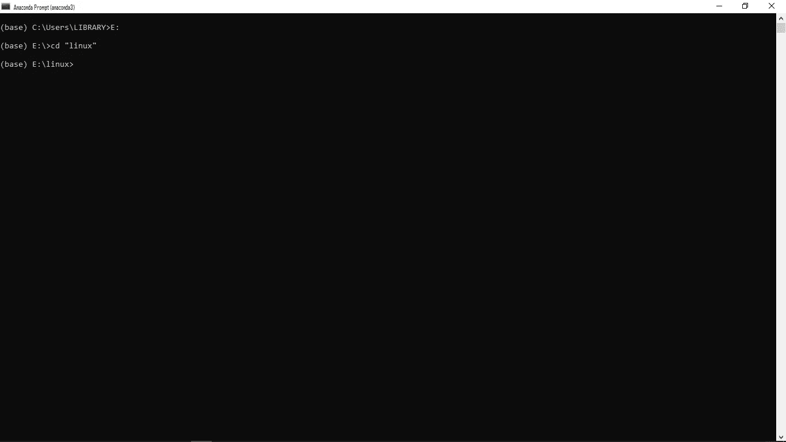
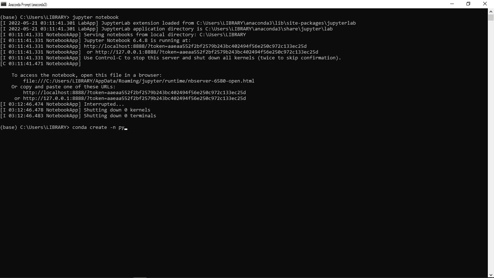
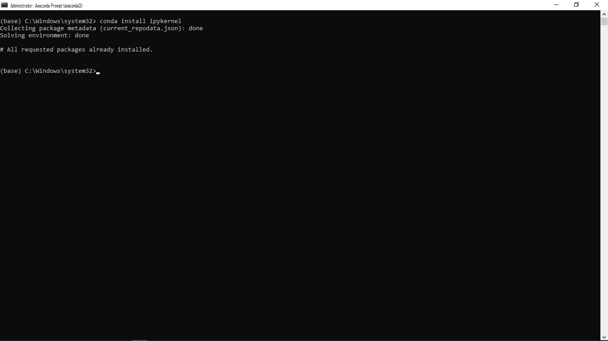
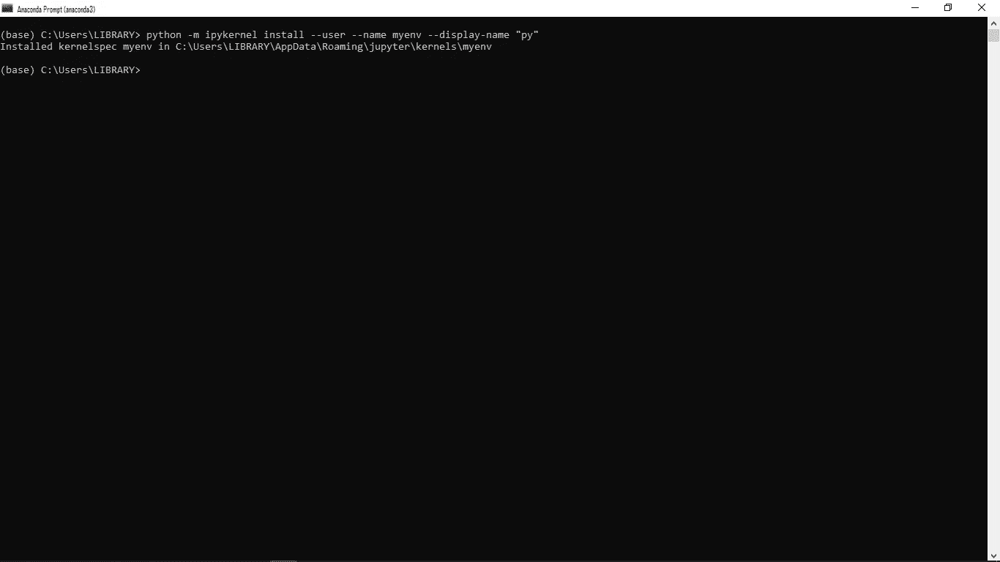

# 如何修复 Jupyter 笔记本的内核错误

> 原文：<https://towardsdatascience.com/how-to-fix-kernel-error-in-jupyter-notebook-81619e195703>

## 让您的 python 代码运行顺畅


马特·里德利在 [Unsplash](https://unsplash.com/s/photos/innovation?utm_source=unsplash&utm_medium=referral&utm_content=creditCopyText) 上的照片

数据科学涉及技术编程工具的使用。大多数时候，由于分析中的错误、系统兼容性、技术困难或软件开发人员的错误，这些工具变得很复杂。

所有开发人员都必须熟悉 [Anaconda Navigator](https://anaconda.org/anaconda/anaconda-navigator#:~:text=Anaconda%20Navigator%20is%20a%20desktop,to%20use%20command%20line%20commands.) ，对吧？

最通用的编程软件之一，因为它携带了精通所有数据科学项目所需的最流行的工具、库和包。

在这些图书馆中有一本 Jupyter 笔记本。用于创建、开发和共享包含实时代码、可视化和叙述性文本的文件的工具。

但是，使用笔记本电脑会出现一些错误。在启动或处理项目时，很有可能会遇到内核错误。

在我们进入解决方案之前，**什么是内核错误？**

当您尝试在错误的目录中打开 python 3 文件时，基本上会发生内核错误。事实是 Jupyter 和 Python 是两种完全不同的软件。因此，当 Jupyter 无法连接特定版本的 Python 时，就会出现内核错误。

当系统在定位某些程序运行的路径时遇到困难，这个错误在 Jupyter Notebook 中被称为内核错误。

现在，我们已经熟悉了 Jupyter Notebook 以及错误是怎么回事，让我们深入了解解决方案。

理论够了，来点实际的吧。

# **1。进入工具的后端。**

我们大多数人使用的 Jupyter 笔记本在 Anaconda 上运行。所以要进入后端，打开 Anaconda 命令提示符。因为您的系统中已经安装了 Anaconda，**单击搜索栏，键入 Anaconda 提示符并以管理员身份运行。**

以管理员身份运行该提示符非常重要，这将使系统准备好对您的软件进行必要的更改。


作者截图。

# **2。打开基本环境并选择您的目录。**

该目录是您希望存储所有当前和未来项目的地方。用*不太专业的*术语来说，它就像一个巨大的文件夹，可以方便地保存你的笔记、文本文件和图书馆，以供回忆和转移。

黑屏包含一个预设目录`c:/windows/system32`。但是，建议您在笔记本上运行代码之前切换到首选目录。

我的大部分开发和分析都是在我的`e:drive`上完成的，在`linux`文件夹下。这是我将进一步研究库和其他分析项目的地方。**输入命令，更改笔记本的目录。**



作者截图。

# **3。为您的笔记本创建另一个环境。**

大多数内核错误通常是由于笔记本无法连接其他版本的 Python 而导致的。

默认情况下，除了 Python 3，Jupyter Notebook 中没有其他虚拟环境。

按`CTRL + C`并使用该代码创建一个新的虚拟环境。

```
conda create -n py
```

在本教程中，我们将使用`py`,你可以使用任何你喜欢的环境，不一定非得是`py`,只要确保在运行命令时用你的环境替换我的环境。



作者截图。

# **4。激活您刚刚创建的环境。**

使用下面的代码激活它

```
conda activate py
```

激活后，您可以观察到环境已经从基本状态变为`py`状态，这证实了新环境的激活工作正常。

接下来呢。

# **5。安装 ipykernel。**

使用下面的代码安装 ipykernel。

```
conda install ipykernel
```

我相信你一定在想，ipykernel 是什么？

在其早期阶段，Jupyter 笔记本曾被称为 Ipython 笔记本。因此 ipykernel 基本上是一种连接和管理所有不同内核的方法。



作者截图。

# **6。将内核添加到新环境中。**

现在我们将运行下一行代码，将内核合并到我们的虚拟环境中，并为这个用户安装它。

```
python -m ipykernel install — user — name myenv — display-name “py”
```



作者截图。

这就是解决内核错误相关问题的全部内容。如果你想立即测试这些变化，你可以重启 Jupyter Notebook，或者你可以在这个新环境中安装一些你想要的有价值的库。

使用以下代码:

```
conda install azureconda install pandasconda install backports
```

## 资源:

[安装 IPython 内核](https://ipython.readthedocs.io/en/stable/install/kernel_install.html)