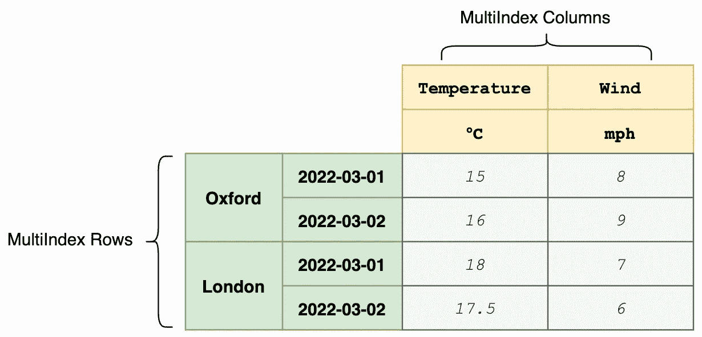
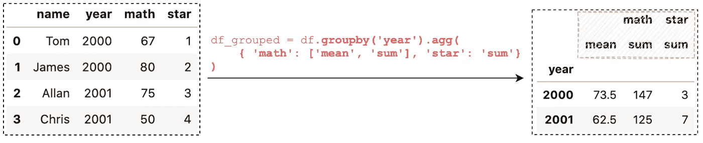
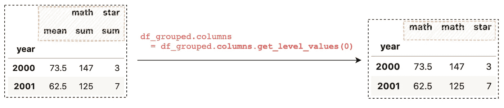
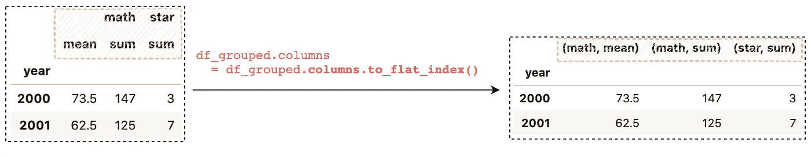
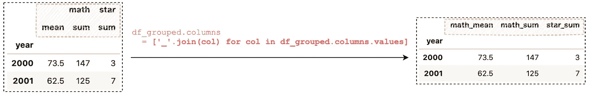
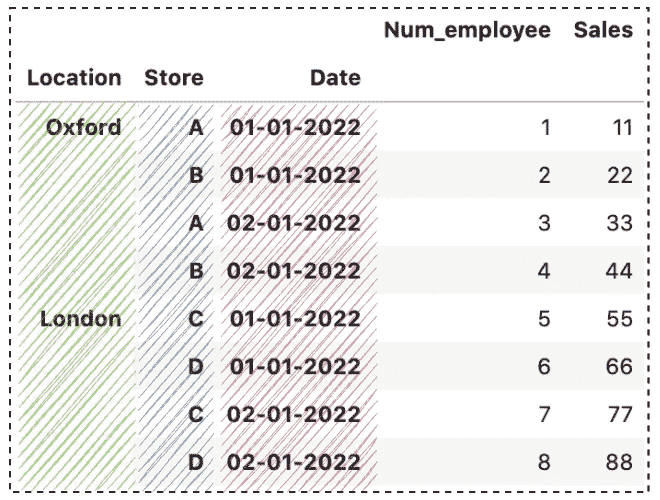
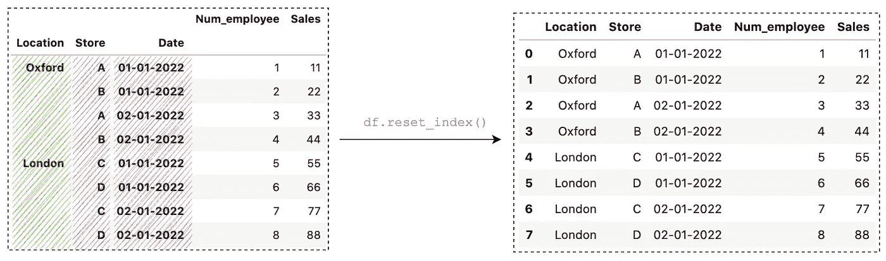
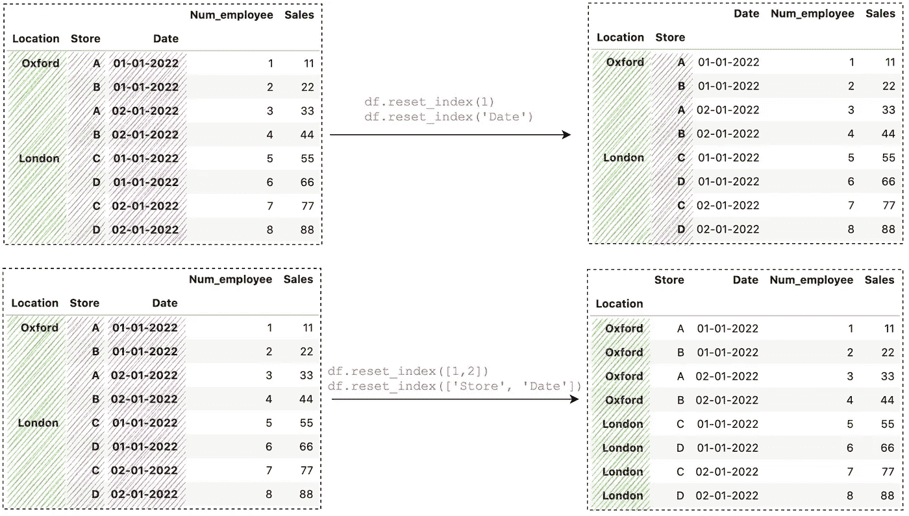
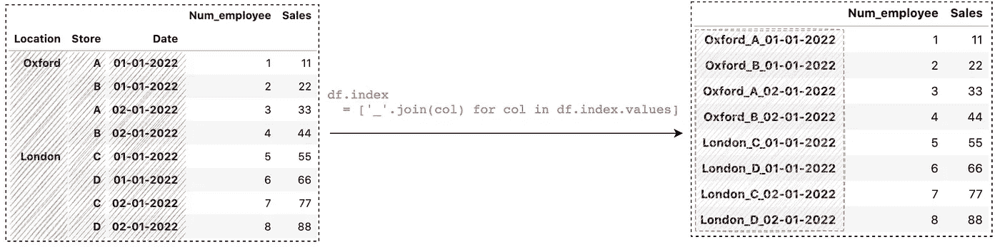

# 如何在 Pandas 中展平多索引列和行

> 原文：<https://towardsdatascience.com/how-to-flatten-multiindex-columns-and-rows-in-pandas-f5406c50e569>

## 在 Pandas 数据框架中有效展平多索引列和行的 6 个技巧


安娜斯塔西娅·切平斯卡在 [Unsplash](https://unsplash.com/s/photos/row-and-column?utm_source=unsplash&utm_medium=referral&utm_content=creditCopyText) 上拍摄的照片

一个 **MultiIndex** (也称为层次索引)数据帧允许您将多个列作为一个行标识符，将多个行作为一个标题标识符。



熊猫多指数数据框架示例(图片由作者提供)

MultIndex 对于复杂的数据分析非常有用，尤其是在处理高维数据时。Pandas 有多种方法可以输出多索引数据帧，例如，`[groupby()](/all-pandas-groupby-you-should-know-for-grouping-data-and-performing-operations-2a8ec1327b5)`、`[melt()](/reshaping-a-dataframe-using-pandas-melt-83a151ce1907)`、`[pivot_table()](/a-practical-introduction-to-pandas-pivot-table-function-3e1002dcd4eb)`、`[stack()](/reshaping-a-dataframe-with-pandas-stack-and-unstack-925dc9ce1289)`等。然而，有时在数据帧中使用单级索引会更容易。

在本文中，您将了解如何扁平化多索引列和行。本文组织如下:

1.  展平列:使用`get_level_values()`
2.  展平列:使用`to_flat_index()`
3.  展平列:连接列标签
4.  展平行:展平所有标高
5.  展平行:展平特定标高
6.  展平行:连接行标签

> 请查看[笔记本](https://github.com/BindiChen/machine-learning/blob/main/data-analysis/069-pandas-flatten-multiIndex/flatten-multiindex.ipynb)获取源代码。更多教程可从 [Github Repo](https://github.com/BindiChen/machine-learning) 获得。

# 1.多索引列:使用`get_level_values()`

首先，让我们创建一个示例 DataFrame 并调用`groupby()`来创建一个多索引列:

```
df = pd.DataFrame({
    'name': ['Tom', 'James', 'Allan', 'Chris'],
    'year': ['2000', '2000', '2001', '2001'],
    'math': [67, 80, 75, 50],
    'star': [1, 2, 3, 4]
})df_grouped = df.**groupby('year')**.agg(
    { 'math': ['mean', 'sum'], 'star': 'sum'}
)
```



多索引数据框(图片由作者提供)

运行`df_grouped.columns`，我们可以看到我们有一个多索引列

```
df_grouped.columnsMultiIndex([('math', 'mean'),
            ('math',  'sum'),
            ('star',  'sum')],
           )
```

展平多索引列的最简单方法是将`columns`设置为特定级别，例如，将`columns`设置为顶级:

```
df_grouped.columns = df_grouped**.columns.get_level_values(0)**
```



扁平化多索引数据框架(图片由作者提供)

`get_level_values(0)`返回顶层，我们将该值赋给`df_grouped.columns`。这当然有效，但是您可能已经注意到结果有 2 个数学列。

# 2.展平列:使用`to_flat_index()`

从 Pandas 版本 0.24.0 开始，`to_flat_index()`将 MultiIndex 转换为包含级别值的元组索引:

```
df_grouped.**columns.to_flat_index()**# output
Index(**[('math', 'mean'), ('math', 'sum'), ('star', 'sum')]**, dtype='object')
```

通过将结果分配给`df_grouped.columns`，结果将如下所示:

```
df_grouped.columns = df_grouped**.columns.to_flat_index()**
```



扁平化多索引数据框架(图片由作者提供)

# 3.展平列:连接列标签

如果您想要一个更好的人类可读的单级索引，您可以连接 MultiIndex 中的值:

```
**['_'.join(col) for col in df_grouped.columns.values]**# output
['math_mean', 'math_sum', 'star_sum']
```

通过将结果赋值给`df_grouped.columns`，结果将如下所示:

```
df_grouped.columns 
  = ['_'.join(col) for col in df_grouped.columns.values]
```



扁平化多索引数据框架(图片由作者提供)

# 4.展平行:展平所有标高

假设我们有以下包含多索引行的数据帧:

```
multi_index = pd.MultiIndex.from_tuples([
  ('Oxford', 'A', '01-01-2022'), 
  ('Oxford', 'B', '01-01-2022'), 
  ('Oxford', 'A', '02-01-2022'),
  ('Oxford', 'B', '02-01-2022'),
  ('London', 'C', '01-01-2022'), 
  ('London', 'D', '01-01-2022'),
  ('London', 'C', '02-01-2022'),
  ('London', 'D', '02-01-2022')], 
  names=['Location','Store', 'Date']
)data = {
  'Num_employee': [1,2,3,4,5,6,7,8],
  'Sales': [11,22,33,44,55,66,77,88]
}df = pd.DataFrame(data, index=multi_index)
```



多索引数据框架(图片由作者提供)

我们可以简单地调用`reset_index()`来展平 MultiIndex 的每个级别:

```
df.reset_index()
```



扁平化多索引数据框架(图片由作者提供)

# 5.展平行:展平特定标高

`reset_index()`中的第一个参数控制要展平的级别。默认为`None`展平所有级别。要展平一个级别或一个级别列表，我们可以传递一个数字/字符串或一个列表:

```
# Flatten 'Date' level
df.reset_index(**2**)
df.reset_index(**'Date'**)# Flatten 'Store' and 'Date'
df.reset_index(**[1, 2]**)
df.reset_index(**['Store', 'Date']**)
```



扁平化多索引数据框架(图片由作者提供)

# 6.展平行:连接行标签

类似地，我们可以连接 MultiIndex 中的值来创建一个更好的人类可读的单一索引:

```
['_'.join(col) for col in df.index.values]# output
['Oxford_A_01-01-2022',
 'Oxford_B_01-01-2022',
 'Oxford_A_02-01-2022',
 'Oxford_B_02-01-2022',
 'London_C_01-01-2022',
 'London_D_01-01-2022',
 'London_C_02-01-2022',
 'London_D_02-01-2022']
```

通过将结果分配给`df.columns`，结果将如下所示:

```
df.index = ['_'.join(col) for col in df.index.values]
```



扁平化多索引数据框架(图片由作者提供)

# 结论

在本文中，我们讨论了关于在 Pandas 中展平多索引列和行的 6 个用例。希望这篇文章能帮你节省分析数据的时间。

感谢阅读。请查看[笔记本](https://github.com/BindiChen/machine-learning/blob/main/data-analysis/069-pandas-flatten-multiIndex/flatten-multiindex.ipynb)获取源代码，如果您对机器学习的实用方面感兴趣，请继续关注。更多教程可从 [Github Repo](https://github.com/BindiChen/machine-learning) 获得。