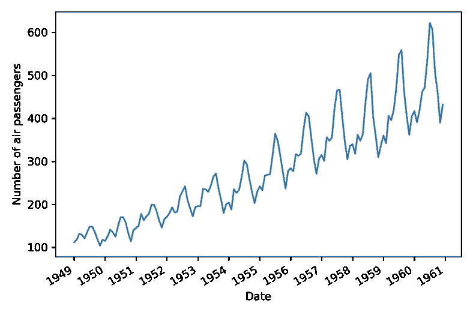
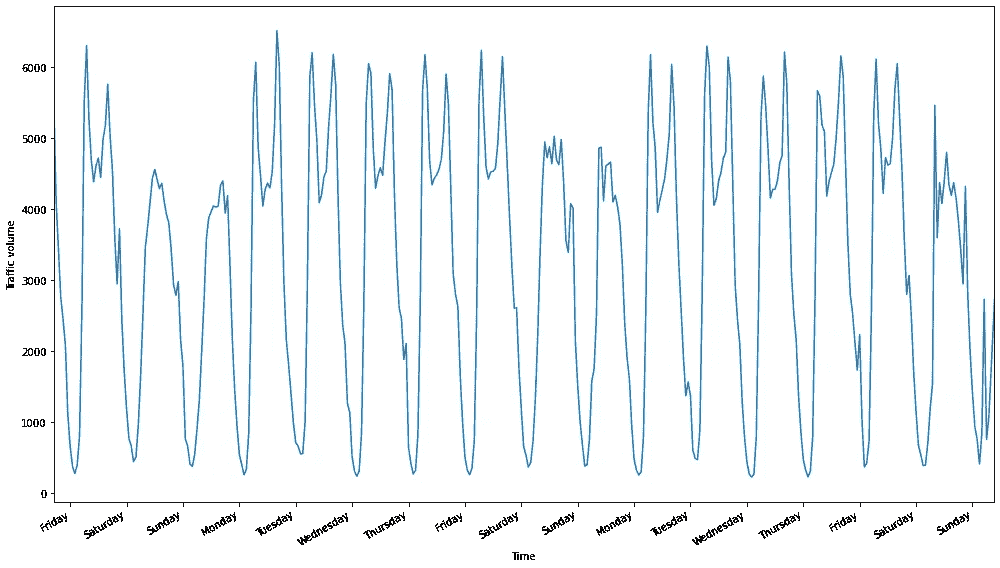
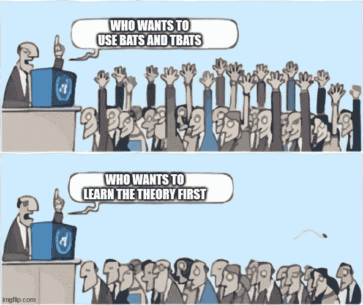
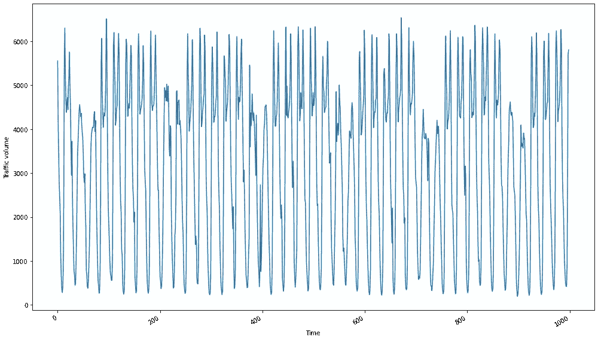
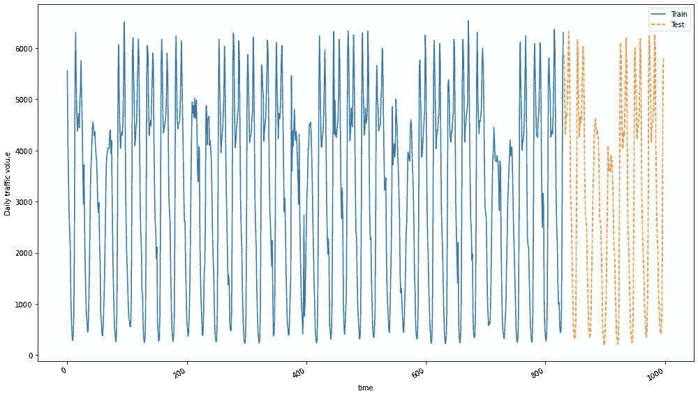
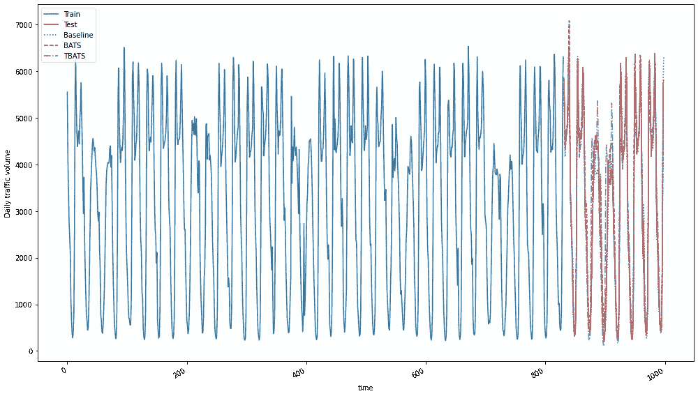
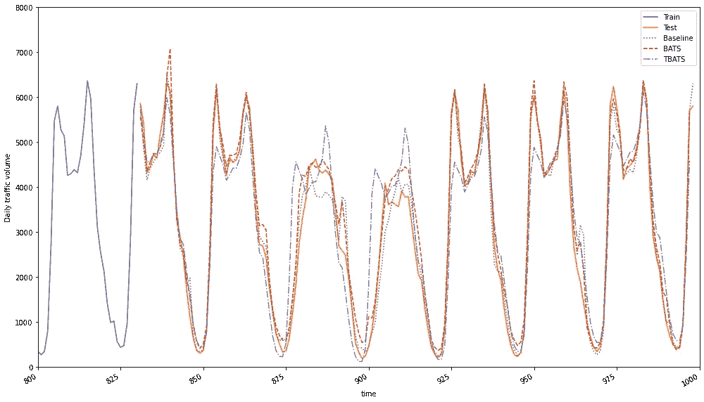
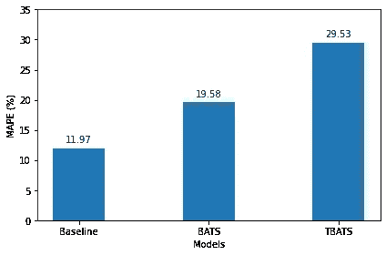

# 如何预测具有多重季节性的时间序列

> 原文：<https://towardsdatascience.com/how-to-forecast-time-series-with-multiple-seasonalities-23c77152347e>

## 在 Python 中使用 BATS 和 TBATS 模型的实践示例


阿里·科卡布在 [Unsplash](https://unsplash.com?utm_source=medium&utm_medium=referral) 上的照片

在处理时间序列时，我们经常会遇到季节性。**季节性**在我们的系列中被定义为周期性变化。在我们的系列中，这是一个在固定周期内发生的循环。例如，让我们看看下面显示的流行的航空公司数据集。



一家航空公司从 1949 年 1 月到 1960 年 12 月的每月乘客总数。我们注意到这个系列有一个明显的季节性模式，更多的人在六月、七月和八月旅行(图片由作者提供)

在这里，我们可以清楚地看到一个季节性周期，因为每年的 7 月份左右，航空旅客人数达到高峰，然后再次下降。

为了预测这个系列，我们可以简单地使用一个 [SARIMA 模型](/time-series-forecasting-with-sarima-in-python-cda5b793977b)，因为只有一个长达一年的季节周期。

现在，当我们处理高频数据时，事情变得复杂了。例如，每小时的时间序列可以表现出每日、每周、每月和每年的季节性，这意味着我们现在有多个季节周期。看看下面 94 号州际公路每小时的交通量。



明尼苏达州明尼阿波利斯 94 号州际公路西行每小时交通量。在这里，我们既可以看到每日的季节性(白天行驶的汽车比晚上多)，也可以看到每周的季节性(周一至周五行驶的汽车比周末多)。作者图片

看上面的数据，我们可以看到我们有两个季节周期！首先，我们有一个每日季节性，因为我们看到更多的汽车在白天行驶，而不是在晚上。第二，我们有一个周季节性，因为交通流量在工作日高于周末。

在这种情况下，不能使用 SARIMA 模型，因为我们只能指定一个季节周期，而我们的数据中肯定有两个季节周期:每日季节性和每周季节性。

因此，我们将注意力转向**球棒**和**球棒**型号。使用这些模型，我们可以拟合和预测具有多个季节周期的时间序列。

在本文中，我们首先探索 bat 和 TBATS 背后的理论，然后应用它们来预测未来七天的每小时交通量。我们开始吧！

> 通过 Python 中的[应用时间序列分析，学习最新的时间序列分析技术。课程涵盖统计和深度学习模型，你将使用 Python 和 TensorFlow！](https://www.datasciencewithmarco.com/offers/tdU2mtVK)

# 蝙蝠和蝙蝠背后的直觉

在我们深入项目之前，让我们先了解一下蝙蝠和 TBATS 是如何在幕后工作的。



我保证这个理论没那么糟糕(图片由作者提供)

## 蝙蝠

首字母缩写 BATS 指的是该方法:具有 **B** ox-Cox 变换、 **A** RMA 误差、 **T** rend、 **S** 季节分量的指数平滑状态空间模型。这里有很多需要剖析的地方，所以我们一步一步来。

*   指数平滑法是一种预测方法。这些预测方法背后的一般思想是，未来值是过去值的加权平均值，随着我们回到过去，权重呈指数衰减。预测方法包括简单指数平滑法、双指数平滑法或霍尔特法(用于有趋势的时间序列)，以及三指数平滑法或霍尔特-温特法(用于有趋势和季节性的时间序列)。
*   状态空间建模是一个框架，在这个框架中，时间序列被视为一组受一组未观察到的因素影响的观察数据。然后，状态空间模型表示这两个集合之间的关系。同样，这必须被视为一个框架，因为 ARMA 模型可以表示为一个状态空间模型。
*   Box-Cox 变换是一种幂变换，它通过稳定一段时间内的方差和均值来帮助使序列平稳。
*   ARMA 误差是我们对时间序列的残差应用 ARMA 模型以发现任何无法解释的关系的过程。通常，模型的残差应该是完全随机的，除非模型没有捕捉到某些信息。这里，我们使用 ARMA 模型来捕捉残差中的任何剩余信息。
*   趋势是时间序列的一个组成部分，它解释了序列平均值的长期变化。当我们有一个积极的趋势，那么我们的系列是随着时间的推移而增加。如果趋势为负，则该系列会随着时间的推移而减少。
*   季节因素解释了序列中的周期性变化。

总之，BATS 是指数平滑方法的扩展，它结合了 Box-Cox 变换来处理非线性数据，并使用 ARMA 模型来捕捉残差中的自相关。

使用 BATS 的优势在于它可以处理非线性数据，解决残差中的自相关问题，因为它使用了 ARMA 模型，并且它可以考虑多个季节周期。

但是，季节周期必须是整数，否则不能应用 bat。例如，假设您有带有年度季节性的周数据，那么您的周期是 365.25/7，大约是 52.2。那样的话，蝙蝠就被排除了。

此外，如果季节周期非常长，BATS 可能需要很长时间来拟合，这意味着如果您有每月的小时数据(周期将是 730)，则不适合。

因此，开发了 TBATS 模型来解决这种情况。

## TBATS

缩写 TBATS 代表 **T** rigonometric 季节性， **B** ox-Cox 变换， **A** RMA 误差， **T** 趋势，以及 **S** 季节性成分。

它使用与 BATS 模型相同的组件，但是它将每个季节周期表示为基于傅立叶级数的三角表示。这使得模型能够适应大的季节周期和非整数的季节周期。

因此，在处理高频数据时，它是一个更好的选择，并且通常比 bat 更适合。

在这里，我故意避开数学，以避免任何混淆。关于蝙蝠和 TBATS 的详细数学解释，我建议你阅读[这篇论文](https://www.researchgate.net/profile/Naragain-Phumchusri/publication/337650959_Hotel_daily_demand_forecasting_for_high-frequency_and_complex_seasonality_data_a_case_study_in_Thailand/links/614c708e3c6cb310698802f4/Hotel-daily-demand-forecasting-for-high-frequency-and-complex-seasonality-data-a-case-study-in-Thailand.pdf)。

现在我们对这两个模型的工作原理有了一个直觉，让我们应用它们来预测未来七天的每小时交通量。

# 在 Python 中应用 bat 和 TBATS

让我们看看这两个模型在预测每小时交通量时的作用。你可以参考 [GitHub](https://github.com/marcopeix/time-series-analysis) 上的完整源代码。

## 探测

首先，我们导入这个项目所需的库。

```
import pandas as pd
import numpy as np
import matplotlib.pyplot as plt
```

然后，我们读取包含数据的 CSV 文件。注意，你也可以从 [GitHub](https://github.com/marcopeix/time-series-analysis) 下载。

```
data = pd.read_csv(‘daily_traffic.csv’)
data = data.dropna()
```

太好了！完成后，我们现在可以可视化我们的数据。

```
fig, ax = plt.subplots(figsize=(14, 8))ax.plot(data['traffic_volume'])
ax.set_xlabel('Time')
ax.set_ylabel('Traffic volume')fig.autofmt_xdate()
plt.tight_layout()plt.show()
```



明尼苏达州明尼阿波利斯市 94 号州际公路每小时的交通量(图片由作者提供)

从上图中，我们可以清楚地看到我们有两个季节周期。让我们放大并标记一周中的每一天，以标识这两个时间段。

```
fig, ax = plt.subplots(figsize=(14, 8))ax.plot(data['traffic_volume'])
ax.set_xlabel('Time')
ax.set_ylabel('Traffic volume')plt.xticks(np.arange(7, 400, 24), ['Friday', 'Saturday', 'Sunday', 'Monday', 'Tuesday', 'Wednesday', 'Thursday', 'Friday', 'Saturday', 'Sunday', 'Monday', 'Tuesday', 'Wednesday', 'Thursday', 'Friday', 'Saturday', 'Sunday'])
plt.xlim(0, 400)fig.autofmt_xdate()
plt.tight_layout()plt.show()
```


明尼苏达州明尼阿波利斯 94 号州际公路西行每小时交通量。在这里，我们既可以看到每日的季节性(白天行驶的汽车比晚上多)，也可以看到每周的季节性(周一至周五行驶的汽车比周末多)。作者图片

当然，我们从本文开始就认识到了这个情节，并注意到周末的交通量确实比平日低。此外，我们看到了每日的季节性，白天的交通比晚上更繁忙。

因此，我们有两个时段:日时段的长度为 24 小时，周时段的长度为 168 小时。让我们在继续建模时记住这一点。

## 建模

我们现在准备开始建模我们的数据。这里我们用的是 [*sktime*](https://www.sktime.org/en/stable/) 包。我刚刚发现了这个框架，它为时间序列带来了许多统计和机器学习方法。它还使用了与 *scikit-learn* 相似的语法约定，使其易于使用。

第一步是定义我们的目标和预测范围。这里，目标是交通量本身。对于预测范围，我们希望预测一周的数据。因为我们有每小时的数据，所以我们必须预测未来的 168 个时间步(7 * 24)。

```
y = data['traffic_volume']fh = np.arange(1, 168)
```

然后，我们将数据分成训练集和测试集。我们将保留上周的数据作为测试集，以便评估我们的预测。

这里，我们使用来自 *sktime* 的*temporal _ train _ test _ split*函数。

```
from sktime.forecasting.model_selection import temporal_train_test_splity_train, y_test = temporal_train_test_split(y, test_size=168)
```

可选地，我们可以可视化我们的测试集。

```
fig, ax = plt.subplots(figsize=(14, 8))ax.plot(y_train, ls='-', label='Train')
ax.plot(y_test, ls='--', label='Test')
ax.set_xlabel('time')
ax.set_ylabel('Daily traffic volu,e')
ax.legend(loc='best')fig.autofmt_xdate()
plt.tight_layout()plt.show()
```



可视化训练集和测试集。测试只是最后一周的数据，如橙色虚线所示。剩下的用于拟合模型(图片由作者提供)。

**基线模型**

在我们实现更复杂的 bat 和 TBATS 模型之前，拥有一个基线模型总是一个好主意。这样，我们可以确定我们更复杂的预测方法实际上是否有效。

在这里，我能想到的最简单的基线就是简单地将训练集中上周的数据重复到未来。

```
y_pred_baseline = y_train[-168:].values
```

**使用球棒**

现在我们有了一个基线，让我们继续实现 BATS 模型。

我们首先从 *sktime* 导入 BATS 模型。然后，我们指定模型的参数进行训练。在这里，我们希望使用 Box-Cox 变换来处理非线性数据。然后，由于我们的数据集没有明显的趋势，我们从模型中删除这些组件。最后，我们指定季节周期，即 24(表示每日季节性)和 168(表示每周季节性)。

一旦指定了模型，我们只需将其放在训练集上，并在预测范围内生成预测。

上面概述的所有步骤都转化为下面的代码。

```
from sktime.forecasting.bats import BATSforecaster = BATS(use_box_cox=True,
                  use_trend=False,
                  use_damped_trend=False,
                  sp=[24, 168])
forecaster.fit(y_train)y_pred_BATS = forecaster.predict(fh)
```

**应用 TBATS**

使用 TBATS 进行预测就像使用蝙蝠一样，只是现在，嗯…我们使用 TBATS！

```
from sktime.forecasting.tbats import TBATSforecaster = TBATS(use_box_cox=True,
                   use_trend=False,
                   use_damped_trend=False,
                   sp=[24, 168])
forecaster.fit(y_train)y_pred_TBATS = forecaster.predict(fh)
```

## 评估绩效

在这一点上，我们有来自基线模型、蝙蝠和 TBATS 的预测。然后我们准备好可视化预测，看看哪个模型表现最好。

可视化的预测给出了下面的图。

```
fig, ax = plt.subplots(figsize=(14, 8))ax.plot(y_train, ls='-', label='Train')
ax.plot(y_test, ls='-', label='Test')
ax.plot(y_test.index, y_pred_baseline, ls=':', label='Baseline')
ax.plot(y_pred_BATS, ls='--', label='BATS')
ax.plot(y_pred_TBATS, ls='-.', label='TBATS')
ax.set_xlabel('time')
ax.set_ylabel('Daily traffic volume')
ax.legend(loc='best')fig.autofmt_xdate()
plt.tight_layout()plt.show()
```



预测未来 168 小时的交通量。我们可以看到，所有模型似乎都产生了类似的预测，因为这些线相互重叠。看剧情很难知道哪种模式表现最好。(图片由作者提供)

看上面的图，似乎我们所有的模型都产生了非常相似的预测，因为线是重叠的。仅仅通过查看图很难确定哪个模型表现最好。

我们可以有选择地放大测试集，以便更好地可视化预测。



放大测试集。在这里，蝙蝠似乎在模拟两个季节方面做得很好，而 t BATS 有时会过冲或欠冲。请注意，基线也很好地遵循了实际值。(图片由作者提供)

看上面的图，我们首先注意到两个模型确实模拟了双重季节性，这本身就很好！此外，蝙蝠似乎在预测未来方面做得更好，因为 t BATS 有时似乎过冲或欠冲。还要注意基线模型紧密地跟随实际值的曲线。

我们现在计算一个误差度量来确定最佳模型并比较它们的性能。在这种情况下，为了便于解释，我们使用平均绝对百分比误差(MAPE)。回想一下，MAPE 越接近 0，性能越好。

MAPE 还没有在 *scikit-learn* 中实现，所以我们自己定义函数。

```
def mape(y_true, y_pred):
    return round(np.mean(np.abs((y_true - y_pred) / y_true)) * 100,2)
```

然后，我们简单地计算每个模型的性能，并在条形图中显示出来。

```
mape_baseline = mape(y_test, y_pred_baseline)
mape_BATS = mape(y_test, y_pred_BATS)
mape_TBATS = mape(y_test, y_pred_TBATS)print(f'MAPE from baseline: {mape_baseline}')
print(f'MAPE from BATS: {mape_BATS}')
print(f'MAPE from TBATS: {mape_TBATS}')fig, ax = plt.subplots()x = ['Baseline', 'BATS', 'TBATS']
y = [mape_baseline, mape_BATS, mape_TBATS]ax.bar(x, y, width=0.4)
ax.set_xlabel('Models')
ax.set_ylabel('MAPE (%)')
ax.set_ylim(0, 35)for index, value in enumerate(y):
    plt.text(x=index, y=value + 1, s=str(round(value,2)), ha='center')plt.tight_layout()
```



所有模特中的 MAPE。这里，基线模型实现了最佳性能，因为它具有最低的 MAPE。(图片由作者提供)

从上图中，我们可以看到蝙蝠比蝙蝠表现得更好，正如我们从图中观察到的那样，这是意料之中的。但是，我们看到基线模型是性能最好的模型，实现了 11.97%的 MAPE。

这有点虎头蛇尾，但让我们了解一下为什么会发生这种情况。

有可能我们的数据集太小了。可能我们用于测试的样本最终会支持基线模型。验证的一个方法是预测多个 168 小时范围，看看基线模型是否仍然优于其他模型。

还有，可能是我们对模型的参数要求太严格了。在这里，我们强迫两个模型都使用 Box-Cox 变换，并删除趋势成分。然而，我们可以不指定这些参数，并且模型将尝试每个参数的两种可能性，并且选择具有最低 [AIC (Akaike 的信息标准)](/advanced-time-series-analysis-with-arma-and-arima-a7d9b589ed6d)的一个。虽然这使得训练过程更长，但也可能导致蝙蝠和 TBATS 更好的表现。

然而，关键的一点是，建立基线模型对于任何预测项目都是非常重要的。

# 结论

在本文中，我们学习了 BATS 和 t BATS 模型，以及如何使用它们来预测具有多个季节周期的时间序列，在这种情况下，不能使用 SARIMA 模型。

我们应用这两个模型来预测每小时的交通量，但结果表明我们的基线仍然是表现最好的模型。

然而，我们看到蝙蝠和 t BATS 确实可以模拟具有复杂季节性的时间序列。

## 潜在的改进

*   预测多个 168 小时范围，看看基线是否确实是性能最好的模型。你可以使用[原始数据集](https://archive.ics.uci.edu/ml/datasets/Metro+Interstate+Traffic+Volume)，它包含的数据比我们处理的要多得多。
*   不指定参数 *use_box_cox* 、 *use_trend* 和 *use_damped_trend* ，让模型根据 AIC 做出最佳选择。

## 关键要点

*   在预测时，总是建立一个基线模型
*   bat 和 TBATS 可用于建模具有复杂季节性的时间序列
*   BATS 在周期较短且为整数时工作良好
*   TBATS 的训练速度比 bat 快，并且可以处理非整数的季节周期

感谢阅读，我希望学到一些有用的东西！如果你想了解更多关于 Python 中使用统计和深度学习模型进行时间序列预测的知识，可以查看我的[时间序列课程](https://www.datasciencewithmarco.com/offers/tdU2mtVK)！

干杯！🍺