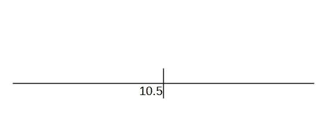
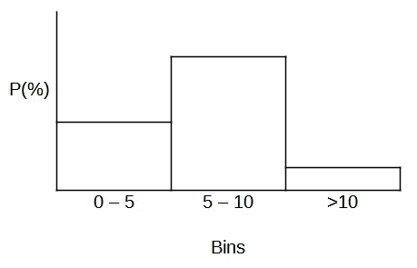
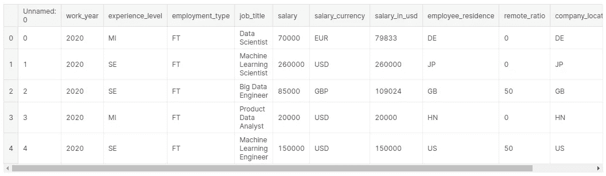
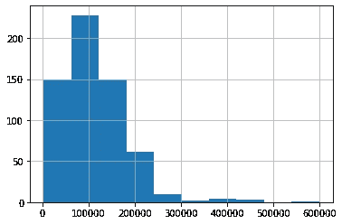
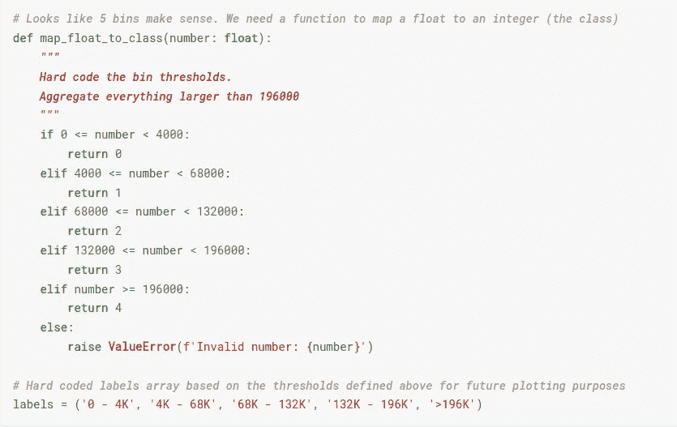
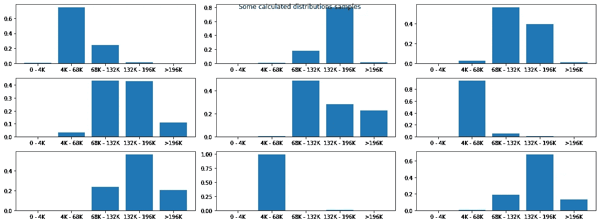

# 如何将回归问题框架化为分类问题以解释不确定性

> 原文：<https://towardsdatascience.com/how-to-frame-a-regression-problem-as-a-classification-problem-to-account-for-uncertainty-63fb8269486e>


foto de Vladislav Vasnetsov:[https://www . pexels . com/es-es/foto/cubos-de-basura-de-plastico-de-varios-colores-2682683/](https://www.pexels.com/es-es/foto/cubos-de-basura-de-plastico-de-varios-colores-2682683/)

**利弊，以及一个工作实例**

我敢打赌你去过那里:你有一些数据，你也有一个目标列，你需要使用一些 ML 技术来估计。你能想到的:给定一些财务数据估计价格，一些客户信息估计它的终身价值，一些机械信息估计磨损或使用。这是一个回归问题，目标是在给定一组特征的情况下精确定位连续变量的值。有趣的部分来了。你对这个价值有多大把握？

让我们用第一个例子。您正在向销售经理展示一个价格估算模型，在给定输入的情况下，它估计价格应该是$51.53。你有信心，因为评估 RMSE 是 1.8 美元；对于这个价格范围来说已经足够好了，但是对于$5 到$10 的价格范围来说是一个相当大的问题。这里的问题是，误差在价格范围之间不是均匀分布的。该模型在某些范围内会更准确，而在其他范围内就不那么准确了，RMSE 不会让你知道它对某个估计有多准确。换句话说，你不知道模型的不确定性。

金融领域也有相似之处。你有 100 美元，想在 3 种可能的资产中决定投资方向。如果有人来告诉你把所有的钱都投资到一个单一的资产上，这将是很奇怪的，因为你会期望得到一些建议，比如“把 60%倒过来，30%倒过来，最后 10%倒过来”。

我敢打赌，你可以看到问题的走向。在给定的回归问题中，您可以确定一个预测值，比如 10.5 美元，或者以“该值有 20%的可能性在 0 到 5 之间，有 70%的可能性在 5 到 10 之间，只有 10%的可能性大于 10”的形式提供分布。

下图显示了这一点。



解决回归问题的传统方法是:确定预期的结果。图片由作者提供。



考虑到不确定性的另一种分布式解决方案。图片由作者提供。

这两种方法各有利弊。

**精确定位一个值**

赞成

*   告诉某人期望值是 10.5 美元，这意味着什么就不会有疑问了。优点是一个数字很容易理解。

欺骗

*   如前所述。你对这个价值有多大把握？训练 RMSE 不会告诉你太多关于这个特殊的情况。缺点是你不知道一个特定的预测有多准确。

**显示一个分布图**

赞成

*   你知道模型在预测中有多确定。例如，如果模型告诉您某个容器有 90%的可能性，您可以确信它在相应的范围内。另一方面，如果模型给你的值接近 30%,你肯定什么都不知道。甚至知道你什么都不知道也没用。这里的优点是模型考虑了不确定性。

欺骗

*   这种方法的主要问题可能是可解释性。任何知道概率分布概念的人都会很容易理解如何处理这个结果。如果你足够幸运，能与精明的股东打交道，那你就大功告成了。然而，如果他们不这么做，你将面临更大的挑战。

此时，您可能想知道分类部分在哪里。嗯，看上面的直方图。你明白了吗？如果你没有，就在这里。

> 不要精确定位值，而是估计它的值属于某个箱的概率，这是:将每个样本分类到一个箱中。

现在让我们用一些代码和一个真实的例子来阐明这个想法。首先，我们将训练一个回归变量来精确定位工资，然后进行修改以将回归问题构建为一个分类问题。

## 回归任务

我们将使用 Kaggle 上提供的[数据科学职位工资](https://www.kaggle.com/datasets/ruchi798/data-science-job-salaries) [1]。

数据集看起来像这样。



数据集预览。图片由作者提供。

我不会深入讨论清理和准备数据的细节，但是一般来说，这些步骤包括删除未使用的列、处理分类数据和缩放数据集值。最后，我们将使用[XGBoost](https://xgboost.readthedocs.io/en/stable/index.html)[2]来训练一个回归变量。

```
*# Prepare data*X = df.drop(['Unnamed: 0','salary', 'salary_currency','salary_in_usd'], axis=1)
X = pd.get_dummies(X)

y = df['salary_in_usd']*# Split into train test sets*X_train, X_test, y_train, y_test = train_test_split(X, y, test_size=0.20, random_state=1)
*# Scale data*
t = MinMaxScaler()
t.fit(X_train)
X_train = t.transform(X_train)
X_test = t.transform(X_test)*# Fit model no training data*from xgboost import XGBRegressor
model = XGBRegressor()
model.fit(X_train, y_train)*# Make predictions for test data*y_pred = model.predict(X_test)
predictions = [round(value) for value **in** y_pred]from sklearn.metrics import mean_squared_error

rms = mean_squared_error(y_test, y_pred, squared=False)

*# Not quite good but doing this to compare to the distributive approach*# Output: 41524.12746933382
```

如果我们看一下前五个预测，它们看起来像这样。

```
[71284, 44957, 131146, 165507, 100765]
```

对于每个元素，回归变量旨在精确定位相应薪金的数值。果然不出所料。我不知道是不是我，但当我看着这些数字时，我觉得缺乏一些背景。我有多确定这些数字是正确的？

回归变量实现了 41，524 的 RMSE。我打赌我们可以做得更好，然而，目的不是训练一个超级精确的分类器，而是对比将问题框架化为回归问题或分类问题之间的差异。现在让我们来看分类部分。

## 分类问题

前面我们说过，将回归问题构建为分类问题的核心思想是，不精确确定数值，而是估计样本属于一组固定箱的概率，即，将每个样本分类到一个箱中。

因此，第一个显而易见的步骤是确定固定箱的集合。为了实现这一点，我们需要查看我们拥有的训练数据的直方图。



描述工资分布的直方图。图片由作者提供。

这就是了。现在我们清楚地知道了大部分工资的位置，最低工资和最高工资。

现在让我们来定义箱子。为了做到这一点，我们将只考虑一个使分类问题更容易的原则:确保数据集不是非常不平衡。我们将通过仔细选择箱的数量来做到这一点，以便属于每个类的元素的计数大致相似。

现在，让我们选择 5 个箱的计数来找到每个箱的极限和元素计数。

```
*# Let’s calculate the numeric histogram from the actual test target*
hist, bin_edges = np.histogram(y_test, bins=5)
hist, bin_edges
```

输出

```
(array([33, 45, 28, 15,  1]),
 array([  4000.,  68000., 132000., 196000., 260000., 324000.]))
```

第一个箱的数量相当平衡，但是，最后一个箱有一个问题，我们将通过聚合这些箱中的数据来解决。

请注意，此时我们在 *y* 中的目标只是一堆浮动数字(工资)，不适合分类任务，因为这种任务需要一个样本和一个标签，表明样本属于哪个类别。所以接下来的任务是写一些代码来将一个浮点数映射成一个整数标签。

所以看一下下面的代码。



一个简单的函数，将一个数字映射到一个类中。图片由作者提供。

简单吧？我们接收一个浮点数，并根据它的值返回一个标签。代码是不言自明的，只需注意最后的 *elif* 语句:这是聚合发生的地方。该代码表示“大于 196，000 的所有内容都将被分配一个标签 4”。

我听到你问为什么这些值是硬编码的。答案是因为这只是一个例子。我敢打赌有更明智的方法来选择框的边界，但是，我只是想保持简单，以保持快速移动。

现在让我们再次使用 XGBoost 训练分类。但是首先，我们需要将*浮动 y 目标*转换成一组分布式 y 目标。这段代码就可以了。

```
# convert each y in training and test sets to a classy_train_distributive = [map_float_to_class(y) for y in y_train]
y_test_distributive = [map_float_to_class(y) for y in y_test]
```

现在训练真正的分类任务。

```
# Import the classifierfrom xgboost import XGBClassifier
from sklearn.metrics import accuracy_scoremodel = XGBClassifier()# Train to get a labelmodel.fit(X_train, y_train_distributive)# Get the labelspredictions = model.predict(X_test)# How good does it workaccuracy_score(y_test_distributive, predictions)# Output: 0.5327868852459017
```

使用默认参数，我们得到了 0.53 的精度，你打赌它可以得到改善。现在，让我们继续。

如果我们看一下前五个预测，它们看起来像这样。

```
array([1, 1, 2, 3, 2])
```

它们只是标签…不太能说明问题。我们感兴趣的不是哪个标签被选中，而是被选中的标签是在哪个底层分布中被挑选出来的。

这段代码将完成这个任务。

```
# Instead of the labels get the probability distributionspredictions = model.predict_proba(X_test)
```

前五个预测是这样的。

```
array([[2.76227575e-03, 8.35917711e-01, 1.60156339e-01, 8.88690702e-04,
        2.75029975e-04],
       [2.02982640e-03, 7.47869253e-01, 2.40976274e-01, 8.92745517e-03,
        1.97156842e-04],
       [9.52042465e-04, 4.67287423e-03, 4.85075146e-01, 2.80507535e-01,
        2.28792369e-01],
       [7.99451722e-04, 8.09144005e-02, 1.74629122e-01, 7.32445538e-01,
        1.12115145e-02],
       [1.12233951e-03, 8.29923898e-02, 8.98771644e-01, 1.67797077e-02,
        3.33951320e-04]], dtype=float32)
```

嗯…我们有更多的信息！由于一幅图像胜过千言万语(在这种情况下是数组)，我们应该更好地制作一个图表。

```
# Plot some of the predicted salary distributionsfig, ax = plt.subplots(3, 3)
fig.set_size_inches(16, 6)# Random indexes picked
ax[0, 0].bar(labels, predictions[1])
ax[0, 1].bar(labels, predictions[5])
ax[0, 2].bar(labels, predictions[8])ax[1, 0].bar(labels, predictions[10])
ax[1, 1].bar(labels, predictions[15])
ax[1, 2].bar(labels, predictions[20])ax[2, 0].bar(labels, predictions[40])
ax[2, 1].bar(labels, predictions[47])
ax[2, 2].bar(labels, predictions[52])plt.tight_layout()
fig.suptitle("Some calculated distributions samples")
plt.show()
```

这是输出。我发现这种解决方案比没有上下文的简单浮点数更有表现力。对于一个样本，模型返回一个分布，从这个分布中，你可以获得很多信息。



计算所得预测值的随机子集的预测工资分布。图片由作者提供。

看一下第 1 行和第 0 列。如果你刚刚使用了第一个分类器提供的标签，你可能会犯错误，因为特定样本属于这两个较大类别的概率之间的差异非常小。在这种情况下，也许你应该深入了解候选人的个人资料，然后再做决定。

相比之下，看看第 2 行和第 1 列。该模型非常确定在这个范围内的工资是正确的。

现在，看第 0 行和第 2 列。该模型对工资应该在第二个箱中的某个位置有 3 倍的信心，然而第三个箱是非常相关的。选哪个？你可以获取一些其他数据来做出最终决定:也许招聘部门的人员轮换率很高，更高的薪水可能有助于减少轮换，或者从另一方面来说，这种职位需求很大，因此，你可以在较低的范围内招聘。

我们可以对剩下的分布进行类似的分析，但底线是一样的:与单个值相比，分布提供了更多的数据来进行决策。自己判断。

# 结论

在这篇文章中，我讨论了通过一个自定义函数将一个回归问题转化为一个分类问题的好处，这个自定义函数将浮点值映射到一个由整数描述的类中。每一类代表一个值域，即一个固定的支持。因此，它提供了固定支持的一组概率，而不是有一个在给定样本的情况下精确定位值的模型。

分布式模型的优点是它提供了更多的决策环境，缺点是它不能提供单一的解决方案。一个人不可能拥有一切。

您是否有此解决方案可能有用的应用？

你可以在这里查看 [Kaggle 笔记本。如果你觉得这个帖子有趣，请关注我并分享！](https://www.kaggle.com/code/jonathan0001/medium-classification-and-regression)

## 参考

[1]数据科学岗位工资(2022 年更新)。Kaggle 数据集。[https://www . ka ggle . com/datasets/ruchi 798/data-science-job-sales/metadata](https://www.kaggle.com/datasets/ruchi798/data-science-job-salaries/metadata)

[2] XGBoost 文档(2022 年更新)。【https://xgboost.readthedocs.io/en/stable/index.html 