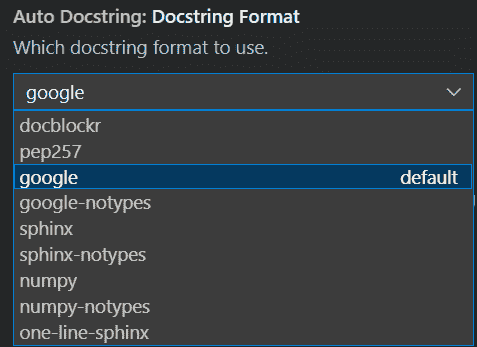
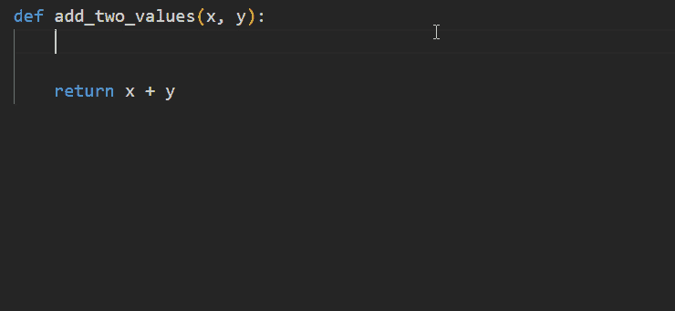

# 如何为数据科学项目生成文档字符串

> 原文：<https://towardsdatascience.com/how-to-generate-docstrings-for-data-science-projects-bb78c56fd539>

## 在几秒钟内生成清晰且格式良好的 python 文档字符串


照片由[凯蒂·赫尔](https://unsplash.com/@helenatheactress?utm_source=medium&utm_medium=referral)在 [Unsplash](https://unsplash.com?utm_source=medium&utm_medium=referral) 拍摄

# 介绍

"我 6 个月前写了这个函数，现在我不记得它是做什么的了！"这听起来熟悉吗？在赶时间的过程中，我们经常忽略了好的文档(又名 docstrings)对于我们创建的类、方法和函数的重要性。

那么什么是 docstrings 呢？

文档字符串也称为文档字符串，是描述 python 类、函数或方法的字符串文字。这里有一个 Google docstring 格式的函数的 docstring 的例子。

```
def add_two_values(x:int, y:int = 0) -> int:
    """Add two values and return the sum. Args:
        x (int): first value
        y (int, optional): second value. Defaults to 0. Raises:
        TypeError: x and y must be integers Returns:
        int: summation of x and y
    """ if not all([isinstance(i, int) for i in [x,y]]):
        raise TypeError('inputs must be integer')
    else:
        z = x + y return z
```

上面的 docstring 提供了对`add_two_values`函数的一般描述，随后是对输入参数`x`和`y`、输出`z`和引发的错误的描述。Docstrings 为试图使用您开发的类、函数或方法的开发人员提供了指南。

在本文中，我们将研究常见的 python docstring 格式，以及如何使用 [autoDocstring](https://github.com/NilsJPWerner/autoDocstring) 和 VSCode 为 python 函数、类和类方法生成自动化的 docstring。

# 常见的 Python 文档字符串格式

下面是一些常用的 python docstring 格式[1]。通常，文档字符串格式包括以下元素:

*   对该函数功能的描述
*   参数:说明和数据类型
*   返回值:说明和数据类型
*   出现的错误的描述

**谷歌**

```
def abc(a: int, c = [1,2]):
    """_summary_ Args:
        a (int): _description_
        c (list, optional): _description_. Defaults to [1,2]. Raises:
        AssertionError: _description_ Returns:
        _type_: _description_
    """
    if a > 10:
        raise AssertionError("a is more than 10") return c
```

**NumPy**

```
def abc(a: int, c = [1,2]):
    """_summary_ Parameters
    ----------
    a : int
        _description_
    c : list, optional
        _description_, by default [1,2] Returns
    -------
    _type_
        _description_ Raises
    ------
    AssertionError
        _description_
    """
    if a > 10:
        raise AssertionError("a is more than 10") return c
```

**狮身人面像**

```
def abc(a: int, c = [1,2]):
    """_summary_ :param a: _description_
    :type a: int
    :param c: _description_, defaults to [1,2]
    :type c: list, optional
    :raises AssertionError: _description_
    :return: _description_
    :rtype: _type_
    """
    if a > 10:
        raise AssertionError("a is more than 10") return c
```

**PEP257**

```
def abc(a: int, c = [1,2]):
    """_summary_ Arguments:
        a -- _description_ Keyword Arguments:
        c -- _description_ (default: {[1,2]}) Raises:
        AssertionError: _description_ Returns:
        _description_
    """
    if a > 10:
        raise AssertionError("a is more than 10") return c
```

# 在 VsCode 中生成自动文档字符串

在本节中，我们将通过示例演示如何在 VSCode 中生成自动化的 docstring。

## 设置

要在 VSCode 中生成自动化的 docstring，我们需要

1.  虚拟代码
2.  [安装了 autoDocstring](https://marketplace.visualstudio.com/items?itemName=njpwerner.autodocstring) VSCode 扩展
3.  Python 3.5 及以上版本

## VSCode 设置

autoDocstring 允许我们从 VSCode 的用户设置中选择一系列常用的 Docstring 格式。



作者图片

对于其余的例子，我们将使用默认的 Google docstring 格式。

## 函数的文档字符串

让我们写一个简单的函数将两个整数值相加。

```
def add_two_values(x, y): return x + y
```

要生成 docstring，将光标放在函数定义正下方的行中(即在`def`关键字下方),并执行以下任一步骤:

1.  用三个双引号或三个单引号开始 docstring，然后按下`Enter`键
2.  windows 使用键盘快捷键`CTRL+SHIFT+2`，mac 使用`CMD+SHIFT+2`
3.  使用 VsCode 命令面板中的`Generate Docstring`



作者 GIF

这将以如下方式填充函数体。

```
def add_two_values(x, y):
    """_summary_ Args:
        x (_type_): _description_
        y (_type_): _description_ Returns:
        _type_: _description_
    """
    return x + y
```

`_summary_`、`_type_`和`_description_`是占位符，我们需要用实际的描述来替换它们。

autoDocString 可以通过从类型提示推断参数类型来自动填充`_type_`占位符。让我们在函数中包含参数和返回值的类型提示。

```
def add_two_values(x:int, y:int)->int: return x + y
```

生成 docstring 后，函数体将按以下方式填充。

```
def add_two_values(x:int, y:int)->int:
    """_summary_ Args:
        x (int): _description_
        y (int): _description_ Returns:
        int: _description_
    """
    return x + y
```

请注意，`_type_`占位符现在填充了参数和返回值的数据类型。

大多数 docstring 格式还包括对出现的错误的描述。如果`x`或`y`参数不是整数，我们就抛出一个`TypeError`。

```
def add_two_values(x:int, y:int)->int: if not all([isinstance(i, int) for i in [x,y]]):
        raise TypeError('inputs must be integer')
    else:
        return x + y
```

新生成的 docstring 将包含一个描述出现的错误的子部分。这是我们在替换了`_description_`和`_summary_`占位符后得到的结果。

```
def add_two_values(x:int, y:int)->int:
    """Add two values and return their sum. Args:
        x (int): first value
        y (int): second value Raises:
        TypeError: input values must be integers Returns:
        int: sum of input values
    """
    if not all([isinstance(i, int) for i in [x,y]]):
        raise TypeError('inputs must be integer')
    else:
        return x + y
```

## 类和类方法的 Docstring

类似的方法可以扩展到类和类方法 docstrings。


作者 GIF

# 结论

在本文中，我们研究了以下内容:

1.  文档字符串的重要性
2.  常见的文档字符串格式
3.  使用 AutoDocString 在 VsCode 中自动生成文档字符串

文档字符串是任何代码的重要组成部分，因为它有助于开发人员理解函数、类和模块的整体功能。想象一下，如果 scikit-learn、pandas 和 NumPy 等数据科学库没有 docstrings，会有多混乱！快乐记录！

加入 Medium 阅读更多这样的文章！

[](https://medium.com/@edwin.tan/membership) [## 加入我的介绍链接-埃德温谭媒体

### 阅读埃德温·谭(以及媒体上成千上万的其他作家)的每一个故事。你的会员费直接支持埃德温…

medium.com](https://medium.com/@edwin.tan/membership) 

# 参考

[1][https://github . com/NilsJPWerner/autoDocstring/tree/master/docs](https://github.com/NilsJPWerner/autoDocstring/tree/master/docs)