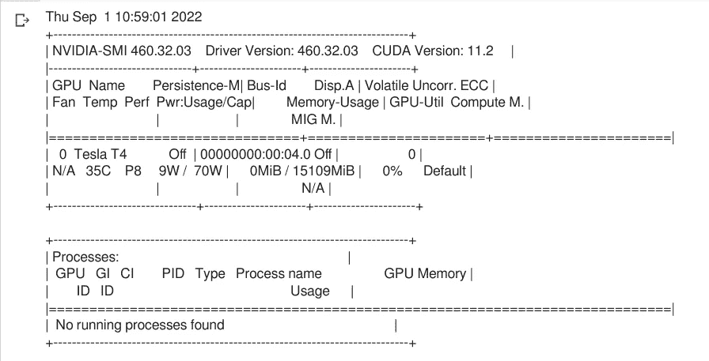

# 如何用稳定的扩散模型从文本生成图像

> 原文：<https://towardsdatascience.com/how-to-generate-images-from-text-with-stable-diffusion-models-ea9d1cb92f9b>


图片由作者提供。[由拥抱脸创作的 colab 笔记本代码生成。](https://colab.research.google.com/github/huggingface/notebooks/blob/main/diffusers/stable_diffusion.ipynb#scrollTo=yEErJFjlrSWS)

## 快速介绍使用拥抱脸的扩散包文本到图像的生成

***在这篇文章中，我将向你展示如何使用 Hugging Face 的扩散器包，使用稳定的扩散模型开始文本到图像的生成。***

# 从 DALLE 到稳定扩散

不久前，我获得了 OpenAI 的 [DALLE-2 模型，它允许你从文本中创建令人惊叹的图像。所以，我开始摆弄它，并产生了一些相当惊人的图像。](https://openai.com/dall-e-2/)


图片由作者提供。用 [DALL-E 2](https://openai.com/dall-e-2/) 生成。

然而，我的学分用完了，所以我决定寻找替代品，并通过拥抱脸看到了这篇不可思议的文章，

[](https://huggingface.co/blog/stable_diffusion) [## 🧨扩散器的稳定扩散

### 使用🧨扩散器稳定扩散是由研究人员和工程师创建的文本到图像的潜在扩散模型…

huggingface.co](https://huggingface.co/blog/stable_diffusion) 

这解释了如何使用他们的`diffusers`包运行稳定的扩散模型。

因此，让我们深入研究如何使用`diffusers`从文本生成图像！

# 用稳定的扩散管道从文本生成图像

先说第一件事， ***步骤用*** `***diffusers***` ***包从文本中生成图片有:***

1.  **确保你有 GPU 访问权限**
2.  **安装要求**
3.  **在 Google Colab 上启用外部小部件(适用于 Colab 笔记本)**
4.  **使用您的用户令牌登录拥抱脸**
5.  **初始化**
6.  **将管线移动到 GPU**
7.  **用 Pytorch 的** `**autocast**` **模块**运行推理

因此，对于这个项目，由于我或多或少地通过拥抱脸 ***来跟随 [colab 笔记本，我们将假设您可以访问具有 GPU 启用](https://colab.research.google.com/github/huggingface/notebooks/blob/main/diffusers/stable_diffusion.ipynb#scrollTo=zHkHsdtnry57)*** 的 colab 笔记本。我们开始吧！

## 1.确保您有 GPU 访问权限

```
!nvidia-smi# My Output
```



图片由作者提供。

好的，太好了！现在我们知道我们可以访问 GPU，让我们设置这个项目的要求。

## 2.安装要求

本项目有 5 个主要要求:

*   `diffusers==0.2.4` —运行管道的主要软件包
*   `transformers` —拥抱 Face 的套装中有许多预先训练好的文本、音频和视频模型
*   `scipy` —科学计算的 Python 包
*   `ftfy` —用于处理 unicode 问题的 Python 包
*   `ipywidgets>=7,<8` —用于在笔记本上构建小部件的包
*   `torch` — Pytorch 包(在 colab 不用安装)
*   `pillow` —用于处理图像的 Python 包(如果您在 colab 中，则无需安装)

要在 Google Colab 中安装您实际需要的所有东西，只需运行:

```
!pip install diffusers==0.2.4!pip install transformers scipy ftfy!pip install "ipywidgets>=7,<8"
```

## 3.在 Google Colab 上启用外部小部件(适用于 Colab 笔记本电脑)

```
# enabling widgets (to be able to login to hugging face)from google.colab import outputoutput.enable_custom_widget_manager()
```

## 4.使用您的用户令牌登录拥抱脸

```
# login to huggin face (get an access token etc...)from huggingface_hub import notebook_loginnotebook_login()
```

您应该会看到一个小部件，您将从拥抱脸输入您的[访问令牌。输入之后，您应该会看到类似这样的内容:](https://huggingface.co/docs/hub/security-tokens)

```
# Expected OutputLogin successful Your token has been saved to /root/.huggingface/token **Authenticated through git-credential store but this isn't the helper defined on your machine. You might have to re-authenticate when pushing to the Hugging Face Hub. Run the following command in your terminal in case you want to set this credential helper as the default  git config --global credential.helper store**
```

## 5.初始化`StableDiffusionPipeline`

```
import torchfrom diffusers import StableDiffusionPipelinepipe = StableDiffusionPipeline.from_pretrained("CompVis/stable-diffusion-v1-4", revision="fp16", torch_dtype=torch.float16, use_auth_token=True)
```

在这里，就像在他们的 colab 笔记本中一样，我们使用`v1-4`模型，我们将为其下载权重。一旦完成，我们就可以进入下一步。请随意试用其他型号进行比较！

## 6.将管道移动到 GPU

```
pipe = pipe.to("cuda")
```

## 7.使用 Pytorch 的`autocast`模块运行推理

```
from torch import autocastprompt = "photo of a panda surfing"with autocast("cuda"):
  image = pipe(prompt)["sample"][0] image.save(f"panda_surfer.png")image
```

***输出***


图片由作者提供。[由拥抱脸创作的 colab 笔记本代码生成。](https://colab.research.google.com/github/huggingface/notebooks/blob/main/diffusers/stable_diffusion.ipynb#scrollTo=yEErJFjlrSWS)

我们可以清楚地看到，结果令人难以置信。显然你会发现你得到的结果有一些可变性，但是 ***有一些参数你可以调整，比如*** `***guidance_scale***` ***、步数和设置随机种子*** (用于确定性输出)，这将帮助你得到更一致的结果。

# 最后的想法和建议

在官方 [colab 笔记本 by 抱脸](https://colab.research.google.com/github/huggingface/notebooks/blob/main/diffusers/stable_diffusion.ipynb#scrollTo=yEErJFjlrSWS)，(本文主要来源)他们有关于稳定扩散的清晰而简单的解释，以及让你更深入了解这个话题的资源，所以我推荐你去看看！我会给出一些额外的建议，看看这些资源:

*   [超赞扩散模型](https://github.com/heejkoo/Awesome-Diffusion-Models)
*   [Ari Seff 关于扩散模型的精彩介绍视频](https://www.youtube.com/watch?v=fbLgFrlTnGU&list=LL&index=3)
*   [论文:*理解扩散模型:统一视角*](https://arxiv.org/abs/2208.11970)

如果你喜欢视频形式，请点击这里查看我的 Youtube 视频:

如果你喜欢这篇文章，[加入媒体](https://lucas-soares.medium.com/membership)，[关注](https://lucas-soares.medium.com/)，[订阅我的时事通讯](https://lucas-soares.medium.com/subscribe)。还有，订阅我的 [youtube 频道](https://www.youtube.com/channel/UCu8WF59Scx9f3H1N_FgZUwQ)在 [Tiktok](https://www.tiktok.com/@enkrateialucca?lang=en) 、[推特](https://twitter.com/LucasEnkrateia)、 [LinkedIn](https://www.linkedin.com/in/lucas-soares-969044167/) 、 [Instagram](https://www.instagram.com/theaugmentedself/) 上和我联系！谢谢，下次再见！:)

# 参考

*   [https://openai.com/dall-e-2/](https://openai.com/dall-e-2/)
*   [https://huggingface.co/blog/stable_diffusion](https://huggingface.co/blog/stable_diffusion)
*   [https://colab . research . Google . com/github/hugging face/notebooks/blob/main/diffusers/stable _ diffusion . ipynb # scroll to = zhkhhsdtnry 57](https://colab.research.google.com/github/huggingface/notebooks/blob/main/diffusers/stable_diffusion.ipynb#scrollTo=zHkHsdtnry57)
*   https://github.com/heejkoo/Awesome-Diffusion-Models
*   【https://huggingface.co/docs/hub/security-tokens 