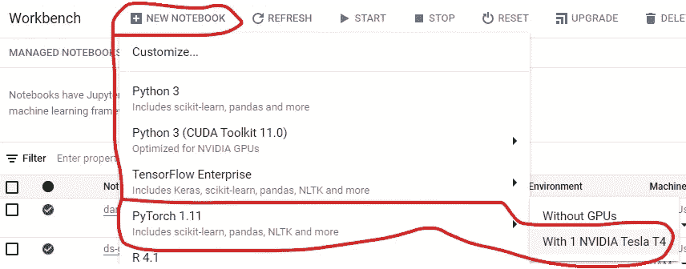
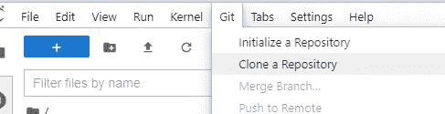
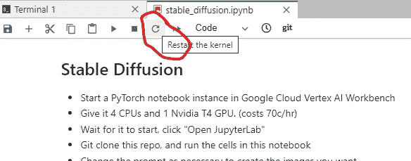
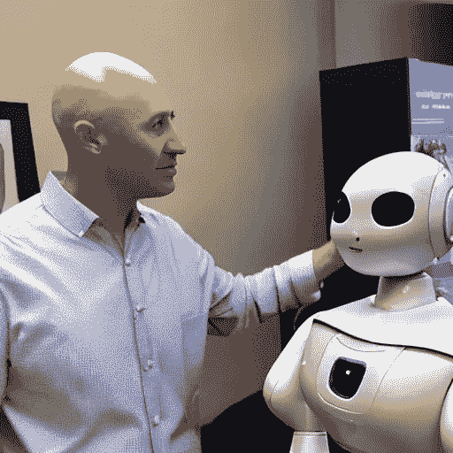
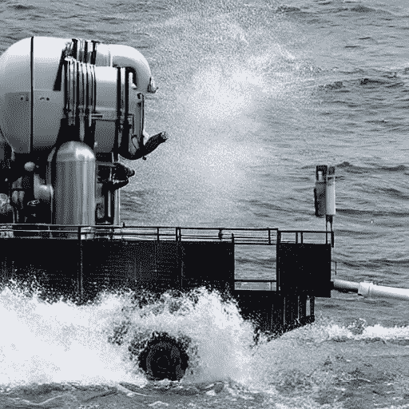
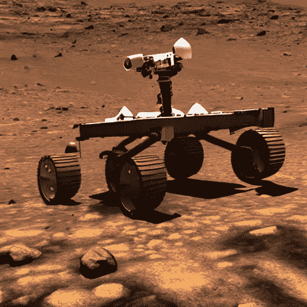
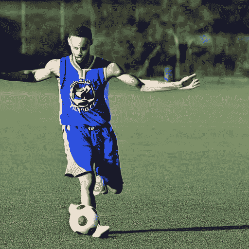

# 如何在几秒钟内生成稳定扩散的图像

> 原文：<https://towardsdatascience.com/how-to-generate-images-with-stable-diffusion-for-pennies-and-the-limitations-of-this-approach-d1cd4b4a4166>

## 以及局限性(今天！)的这种方法

一个潜在的文本到图像扩散模型[稳定扩散](https://github.com/CompVis/stable-diffusion#stable-diffusion-v1)的作者已经发布了该模型的权重，并且它在标准 GPU 上运行非常容易和便宜。这篇文章向你展示了如何用很少的钱生成图像(生成 30-50 张图像大约需要 65 美分)。

## 启动一个顶点 AI 笔记本

稳定扩散模型是用 Pytorch 编写的，如果您有超过 10 GB 的 RAM 和相当现代的 GPU，它会工作得最好。

在 Google Cloud 上，打开链接【https://console.cloud.google.com/vertex-ai/workbench 进入顶点 AI 工作台



在谷歌云中创建 PyTorch 笔记本

然后，创建一个新的顶点人工智能 Pytorch 笔记本电脑与英伟达特斯拉 T4。接受默认值。当我做这件事的时候，这个例子的成本是每小时 65 美分。

请记住，一旦使用完笔记本，请将其停止或删除。区别？如果你停止笔记本，你将被收取磁盘费(一个月几分钱，但它允许你下次更快地启动)。如果你删除了笔记本，你将不得不重新开始。在这两种情况下，您都不必为 GPU 付费，这是 65 美分/小时费用的主要部分。

*注意:*如果你无法访问谷歌云，找到你可以访问的带 GPU 的笔记本环境——也许是 AWS Sagemaker，或者谷歌 Colab Pro。免费的 Google Colab 不够强大。

当实例启动时，执行下一步。

## 注册一个拥抱脸账户

重量被释放在拥抱脸枢纽，所以你将需要创建一个帐户，并接受下重量被释放的条款。请通过以下方式完成:

*   访问[https://huggingface.co/](https://huggingface.co/)并注册一个账户。你需要它来获得重量。
*   接受[https://huggingface.co/CompVis/stable-diffusion-v1-4](https://huggingface.co/CompVis/stable-diffusion-v1-4)的许可条款
*   转到[https://huggingface.co/settings/profile](https://huggingface.co/settings/profile)并创建新的读取访问令牌。
*   将令牌复制到剪贴板。

## 克隆我的笔记本并创建 token.txt

我很方便地将本文中的代码放在了 GitHub 上，所以只需克隆我的笔记本:



在这个存储库中:

```
https://github.com/lakshmanok/lakblogs
```

并打开笔记本[stable diffusion/stable _ diffusion . ipynb](https://github.com/lakshmanok/lakblogs/blob/main/stablediffusion/stable_diffusion.ipynb)

右键单击导航窗格并创建一个新的文本文件。将其命名为 token.txt，并将您的访问令牌(来自上一节)粘贴到该文件中。

## 安装软件包

笔记本的第一个单元只是安装需要的 Python 包(逐个运行笔记本中的单元):

```
pip install --upgrade --quiet diffusers transformers scipy
```

使用笔记本上的按钮重新启动 IPython 内核:



## 读取访问令牌

还记得您粘贴到 token.txt 中的访问令牌吗？我们来读一下:

```
**with** open('token.txt') **as** ifp:
    access_token **=** ifp**.**readline()
    print('Read a token of length {}'**.**format( len(access_token) ))
```

## 加载模型权重

要加载模型权重，请使用名为“扩散器”的拥抱面库:

```
**def** load_pipeline(access_token):
    **import** torch
    **from** diffusers **import** StableDiffusionPipeline

    model_id **=** "CompVis/stable-diffusion-v1-4"
    device **=** "cuda"

    pipe **=** StableDiffusionPipeline**.**from_pretrained(model_id, 
                       torch_dtype**=**torch**.**float16, 
                       revision**=**"fp16", 
                       use_auth_token**=**access_token)
    pipe **=** pipe**.**to(device)
    **return** pipe
```

我在这里使用了一个稍微差一点的模型版本，这样它可以执行得更快。阅读 [Huggingface 文档](https://huggingface.co/CompVis)了解其他选项。

## 为文本提示创建图像

要为文本提示创建图像，只需调用上面创建的管道，传入文本提示。

```
**def** generate_image(pipe, prompt):
    **from** torch **import** autocast
    **with** autocast("cuda"):
        image **=** pipe(prompt**.**lower(), guidance_scale**=**7.5)["sample"][0]  

    outfilename **=** prompt**.**replace(' ', '_') **+** '.png'
    image**.**save(outfilename)
    **return** outfilename
```

在这里，我传入提示“光头佬很容易被机器人打动”:

```
outfilename **=** generate_image(pipeline, prompt**=**"Bald guy being easily impressed by a robot")
```



秃子很容易被机器人打动

这花了不到一分钟的时间，对于演示文稿、故事板等来说已经足够好了。不错吧，嗯？

## 仅限于其训练集

人工智能模型受限于它们被训练的内容。让我们传递一个文化参考，它不太可能已经看到很多培训数据:

```
outfilename **=** generate_image(pipeline, prompt**=**"Robots in the style of Hindu gods creating new images")
```

结果呢？


印度教神风格的机器人创造新形象

嗯，它选择了甘尼萨的姿势，赋予他机器般的四肢，并使用西藏转经筒作为图像。这里没有魔法——ML 模型只是简单地复述他们在训练数据集中看到的一点一滴，这就是正在发生的事情。

我在这里的文化参考是上帝搅动牛奶的海洋，它完全飞过模特的头顶:


谷歌图片搜索了解所有关于搅拌牛奶海洋的印度创世神话

让我们看看是否可以通过传递允许 Google 图片搜索检索所有这些图片的特定术语来明确地帮助模型唤起它的记忆:

```
outfilename = generate_image(pipeline, prompt="Robots churning the ocean of milk to create the world")
```



这看起来像是机器人搅拌牛奶的海洋吗？

那也没用。印度教创世神话一定不是用于训练模型的数据集的一部分。

## 其他限制

所以文化参考是过时的。还有什么？该模型不会生成真实的人脸或文字符号——我会让您尝试这些。

此外，这些仅仅是今天的限制。造成这些限制的原因是模型训练数据集的大小。很难约束一个在非常大的数据集上训练的模型不回想起不可避免会在那里发现的有毒内容。这就是为什么公开发布的模型可能是在一个较小的语料库上训练的。

尽管如此，不要忽视我们在稳定扩散方面取得的进展——图像生成过去需要很大的马力。但是我们现在可以在普通的 GPU 和 15 GB 的内存上实现。这本质上是云函数的领域——你可以很容易地想象将我上面的代码放入云函数，这样它就成为一个图像生成 API，并在你的应用中使用它。

## 结论

最后，下面是模型生成的一些图片以及生成它的提示:



火星漫游者玩游戏



斯蒂芬·库里踢足球

你能够在几秒钟内生成与文本提示相对应的图像，这有多酷？

我的笔记本在 GitHub 上的位置是[https://GitHub . com/lakshmanok/lak blogs/blob/main/stable diffusion/stable _ diffusion . ipynb](https://github.com/lakshmanok/lakblogs/blob/main/stablediffusion/stable_diffusion.ipynb)

尽情享受吧！