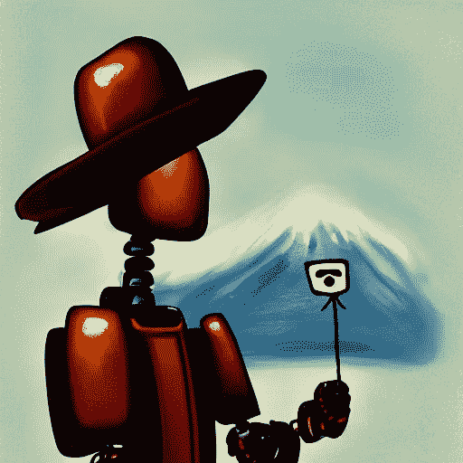
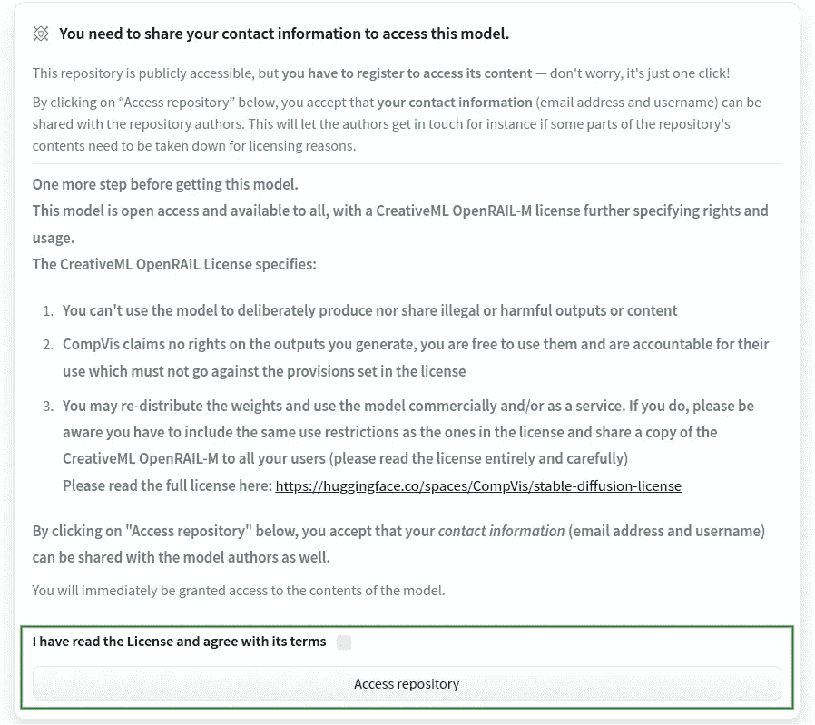
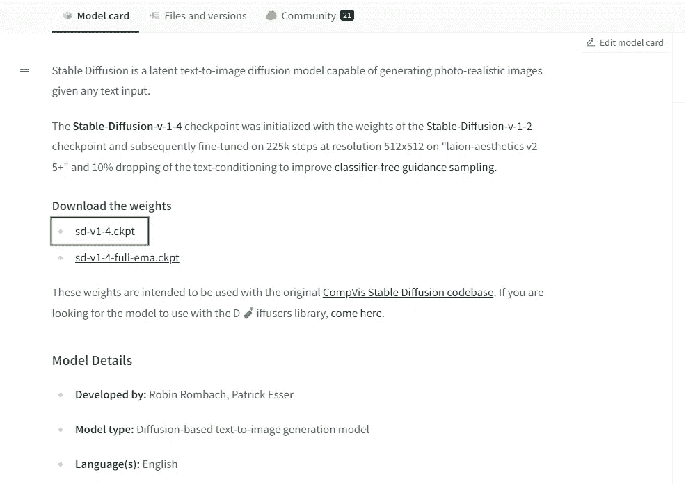

# 如何使用人工智能在您的笔记本电脑上生成令人惊叹的艺术

> 原文：<https://towardsdatascience.com/how-to-generate-stunning-art-on-your-laptop-using-ai-a28192cbb49>

## 如何使用稳定扩散从自然语言的描述中创建逼真的图像，而无需 GPU。



一个戴着画家帽子的机器人正在白色画布上画一座山。数字艺术——稳定扩散生成的图像

当我还是个孩子的时候，我总是钦佩那些能画出任何想到的东西的人。我可以连续几个小时观察它们，因为它们会在纸上形成看似随意的线条。不幸的是，我没有这种天赋。

随着时间的流逝，今天人工智能可以帮助我实现我脑海中的想法。这是两码事，而且这个过程一点也不令人满意。但这是我在纸上表达想法的一种方式。

当 OpenAI 允许我进入 DALL E 2 私人测试程序时，我非常兴奋。然而，缺点是我可以用它做什么的限制，我可以使用它的次数，价格标签，以及我不能以任何方式控制软件的想法。

然后，[稳定扩散](https://stability.ai/blog/stable-diffusion-announcement)来到了方。与 DALL E 2 非常相似，Stable Diffusion 是一个开源的 AI 系统，它从自然语言的描述中创建了逼真的图像和艺术。它结合了概念、属性和风格来创建独特的照片或现有图片的设备变体。好消息是你现在可以在你的笔记本电脑上运行它。

这个故事展示了你如何能在 10 分钟之内在你的系统上创造出令人难以置信的艺术，**，即使你没有 GPU 设备**。我将指导您完成安装过程；您所需要的只是访问一台运行 Python 并安装了 Git 的机器。最后，你将能够用自然语言与模型交流你想画的东西，然后坐下来享受回报。

> [Learning Rate](https://www.dimpo.me/newsletter?utm_source=medium&utm_medium=article&utm_campaign=stable-diffusion) 是为那些对 AI 和 MLOps 的世界感到好奇的人准备的时事通讯。你会在每个月的第一个星期六收到我关于最新人工智能新闻和文章的更新和想法。订阅[这里](https://www.dimpo.me/newsletter?utm_source=medium&utm_medium=article&utm_campaign=stable-diffusion)！

# 什么是稳定扩散

我们说过，稳定扩散是一种潜在扩散模型(LDM ),它从自然语言的描述中创造出现实的图像和艺术。它是由 [Stability AI](https://stability.ai/) 和 [LMU 慕尼黑](https://www.lmu.de/en/newsroom/news-overview/news/revolutionizing-image-generation-by-ai-turning-text-into-images.html)开发的，得到了 [Eleuther AI](https://eleuther.ai/) 和 [LAION](https://laion.ai/) 社区的支持。

稳定扩散从像 [Open AI](https://openai.com/) 的 DALL E 2 或 [Google Brain](https://research.google/teams/brain/) 的 [Imagen](https://imagen.research.google/) 这样的项目中汲取灵感，并在 [LAION-Aesthetics](https://laion.ai/blog/laion-aesthetics/) 上进行训练，这是 [LAION 5B](https://laion.ai/blog/laion-5b/) 即将发布的子集。

稳定扩散作为一个开源项目在 [GitHub](https://github.com/CompVis/stable-diffusion) 上提供。由于其非常宽松的许可证，它让数十亿人能够创造令人惊叹的图像。

# 设置您的环境

现在我们有了这个项目的一些背景，让我们把它投入工作。该过程的第一步是设置您将在其中工作的 Python 环境。

稳定的扩散伴随着如何创造一个迷你康达环境的说明。如果您熟悉使用一个`environment.yaml`文件创建 conda 环境，您可以很好地使用它。然而，我更喜欢使用用`venv`构建的简单 Python 虚拟环境，用`pip`安装包。

我的机器是 Ubuntu 22.04 系统，带 Python `3.8.10`。为此，你至少需要 Python `3.8.5`。所以，首先，克隆存储库:

```
git clone [https://github.com/dpoulopoulos/stable-diffusion.git](https://github.com/dpoulopoulos/stable-diffusion.git) -b [feature-dimpo-local-deployment](https://github.com/dpoulopoulos/stable-diffusion/tree/feature-dimpo-local-deployment)
```

注意，这不是原来的稳定扩散库。这是我为了稍微修改代码而创建的一个 fork。**这些修改允许你运行项目，即使你不能访问 GPU。**该项目的原始代码位于[https://github.com/CompVis/stable-diffusion](https://github.com/CompVis/stable-diffusion)。

进入项目目录并创建一个 Python 虚拟环境:

```
cd stable-diffusion && python3 -m venv venv
```

接下来，激活您的虚拟环境并安装项目所需的`pip`版本:

```
source venv/bin/activate && pip3 install --upgrade pip=20.3
```

正如我们所说的，稳定的扩散伴随着 conda 环境，您可以使用它来安装依赖项。我不会使用它，所以我需要创建一个单独的`requirements.txt`文件。

如果您已经克隆了我在第一步中提供的分支，那么您不需要运行这一步。资源库中已经存在一个`requirements.txt`文件。如果没有，请使用下面的命令创建一个:

```
cat << EOF > requirements.txt
numpy==1.19.2
--extra-index-url [https://download.pytorch.org/whl/cpu](https://download.pytorch.org/whl/cpu)
torch==1.11.0+cpu
torchvision==0.12.0+cpu
albumentations==0.4.3
diffusers
opencv-python==4.1.2.30
pudb==2019.2
invisible-watermark
imageio==2.9.0
imageio-ffmpeg==0.4.2
pytorch-lightning==1.4.2
omegaconf==2.1.1
test-tube>=0.7.5
streamlit>=0.73.1
einops==0.3.0
torch-fidelity==0.3.0
transformers==4.19.2
torchmetrics==0.6.0
kornia==0.6
-e git+https://github.com/CompVis/taming-transformers.git@master#egg=taming-transformers
-e git+https://github.com/openai/CLIP.git@main#egg=clip
EOF
```

现在，我可以在我的虚拟环境中安装项目的依赖项了:

```
pip3 install -r requirements.txt
```

最后，我需要安装稳定的扩散库本身:

```
pip3 install -e .
```

# 获取模型

现在我已经设置了环境，我需要获得模型权重。模型权重的检查点由 Hugging Face 托管，要下载它们，您需要一个帐户。所以，去他们的[页面](https://huggingface.co/)上创建一个。别忘了事后核实你的电子邮件！

下一步是下载模型。前往此地址:[https://hugging face . co/CompVis/stable-diffusion-v-1-4-original](https://huggingface.co/CompVis/stable-diffusion-v-1-4-original)同意分享您的联系方式:



作者截图

现在下载模型。您将在那里看到两个检查点文件:一个`sd-v1-4.ckpt`和一个`sd-v1-4-full-ema.ckpt`。`ema`代表指数移动平均线，是恢复训练的一个检查点。出于我们的目的，我们想要下载更小的`sd-v1-4.ckpt`用于推理，尽管也有使用`ema`的方法。然而，这不是在这里讨论的事情。让我们把事情简单化。



作者截图

根据您的互联网连接，下载模型需要大约 5-10 分钟。毕竟是~4GB。当这个过程完成后，在您的项目的主目录中创建一个`stable-diffusion-v1`文件夹来放置它:

```
mkdir models/ldm/stable-diffusion-v1
```

将模型移动到`stable-diffusion-v1`文件夹中，并将其重命名为`model.ckpt`:

```
mv /path/to/sd-v1-4.ckpt models/ldm/stable-diffusion-v1/model.ckpt
```

# 运行模型

至此，您已经万事俱备了。要创建您的第一件令人惊叹的艺术品，请运行以下命令:

```
python3 scripts/txt2img.py --prompt "An astronaut riding a horse, painted by Pablo Picasso." --plms --n_iter 5 --n_samples 1
```

此时，该项目将下载它使用的几个预训练模型的权重，如剪辑编码器和核心变压器。要有耐心。**另外，请注意，如果您无法访问 GPU，此步骤将会失败。但是不用担心，继续下一节，看看如何在没有 GPU 的情况下生成相同的图像。**

这将生成“一个骑着马的宇航员，由巴勃罗·毕加索绘制”的图像。过程结束时，您会在一个名为`outputs`的文件夹中找到结果。在那里，你会看到五个图像。这是因为您指示模型使用`--n_iter 5`生成五个样本。

这是我得到的结果:


*毕加索画的骑着马的宇航员——稳定扩散生成的图像*

这很令人吃惊，你不同意吗？

# 没有 GPU？没问题！

如果没有 GPU，上面的脚本就不会运行。不幸的是，该项目要求你有一个 GPU 设备和 CUDA 来运行它。

然而，乐趣并不需要止于此。第一步我给你提供的库和分支也可以在 CPU 上运行稳定扩散。**你付出的代价是需要一点时间来完成。根据您的系统不同，可能需要 30 多分钟才能完成**。但是，嘿，如果有人给你画像，你会等多久？

要在 CPU 上运行它，只需给之前执行的命令添加一个`--config`标志，并指向一个不同的配置文件:

```
python3 scripts/txt2img.py --prompt "An astronaut riding a horse, painted by Pablo Picasso." --plms --n_iter 5 --n_samples 1 --config configs/stable-diffusion/v1-inference-cpu.yaml
```

# 摘要

与 DALL E 2 非常相似，Stable Diffusion 是一个开源的 AI 系统，它从自然语言的描述中创建了逼真的图像和艺术。它结合了概念、属性和风格来创建独特的图像或现有图片的设备变体。

这个故事演示了如何在不到 10 分钟的时间内，在您的系统上创建令人难以置信的艺术作品，即使您没有 GPU 设备。最好的部分是，这是一个软件，你可以控制和运行，每当你想产生一个图像，你可以把文字。只要考虑你所产生的东西就行了！

# 关于作者

我的名字是 [Dimitris Poulopoulos](https://www.dimpo.me/?utm_source=medium&utm_medium=article&utm_campaign=stable-diffusion) ，我是一名为 [Arrikto](https://www.arrikto.com/) 工作的机器学习工程师。我曾为欧洲委员会、欧盟统计局、国际货币基金组织、欧洲央行、经合组织和宜家等主要客户设计和实施过人工智能和软件解决方案。

如果你有兴趣阅读更多关于机器学习、深度学习、数据科学和数据运算的帖子，请在 Twitter 上关注我的 [Medium](https://towardsdatascience.com/medium.com/@dpoulopoulos/follow) 、 [LinkedIn](https://www.linkedin.com/in/dpoulopoulos/) 或 [@james2pl](https://twitter.com/james2pl) 。

所表达的观点仅代表我个人，并不代表我的雇主的观点或意见。