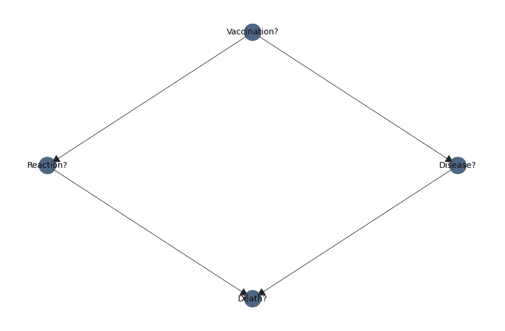
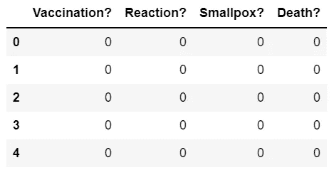

# 如何用不到 10 行代码为任何因果推理项目生成合成数据

> 原文：<https://towardsdatascience.com/how-to-generate-synthetic-data-for-any-causal-inference-project-in-less-than-10-lines-of-code-158688a89349>

## 如果 99%的人接种了疫苗，1%的人出现反应，2%的人得病，你如何生成有代表性的合成数据？


由[穆菲德·马吉纳](https://unsplash.com/@mufidpwt?utm_source=unsplash&utm_medium=referral&utm_content=creditCopyText)在 [Unsplash](https://unsplash.com/s/photos/vaccine?utm_source=unsplash&utm_medium=referral&utm_content=creditCopyText) 上拍摄的照片

## 介绍

在“原因之书”中，Judea Pearl 使用了一个疫苗接种、反应、天花和死亡的例子来描述和解释“因果关系的阶梯”,这促使我用 Python 实现这个例子，但我无法找到一种方法来生成我需要开始使用的测试数据。

[](https://www.amazon.co.uk/Book-Why-Science-Cause-Effect/dp/0241242630)  

在我们深入研究合成数据生成之前，请考虑…

[通过我的推荐链接](https://grahamharrison-86487.medium.com/membership)加入 Medium(如果你使用此链接注册，我将收取一定比例的费用)。

每当我发表新故事时，订阅一封免费电子邮件。

[快速浏览我之前的文章](https://grahamharrison-86487.medium.com/)。

[下载我的免费战略数据驱动决策框架](https://relentless-originator-3199.ck.page/5f4857fd12)。

访问我的数据科学网站— [数据博客](https://www.the-data-blog.co.uk/)。

## 背景

Pearl 提出了疫苗接种计划、反应(副作用)、疾病发展以及疾病和副作用导致的死亡之间的假设关系的因果图，如下所示…



作者图片

珀尔接着描述了一项假设调查的结果如下…

1.  在 100 万名儿童中，990，000 人(99%)接种了疫苗
2.  在接种疫苗的人中，9900 人(990000 人中的 1%)有反应
3.  在那些有反应的人中，99 人(9900 人中的 1%)死于该反应
4.  在没有接种疫苗的人群中，有 200 人(10000 人中的 2%)感染了天花
5.  在患天花的人中，40 人(200 人中的 20%)死于这种疾病

根据 Pearl 提出的因果影响图和假设调查的统计数据，我推测我的第一步是创建一个数据集，将调查表示为一只熊猫`DataFrame`,因此我在互联网上寻找创建数据的方法。

我找到了 scikit-learn 库，用于生成“blob”和“分类”数据，我还找到了像 [faker](https://faker.readthedocs.io/en/master/) 和 [SDV](https://sdv.dev/SDV/) 这样的库，但我找不到任何东西来生成适合作为因果或概率模型输入的二进制数据集。

鉴于我在网上找不到任何合适的东西，并且我需要一些数据来开始我的因果推理之旅，我开始编写代码，可以自己创建任何合成的二进制数据集…

## 程序性解决方案

基本要求是-

1.  创建一个具有正确行数和特征数的空白`DataFrame`
2.  用代表假设调查的 5 个结果中的每一个的值更新`DataFrame`

创造空的`DataFrame`非常简单



作者图片

下一步是实施这一规则——通过将 990，000 或 99%的行的`Vaccination? = 0`更改为`Vaccination? = 1`，实现“在 100 万儿童中，990，000 (99%)接种了疫苗”。

这被证明是非常困难的。我的第一个想法是使用`DataFrame.sample(990000)`进行采样并更新值，但是更新并没有应用到底层的`DataFrame`上，所以这是行不通的。

经过一些实验，这是我想出的解决方案…

…为了确保代码正常工作…

```
1    990000
0     10000
Name: Vaccination?, dtype: int64
```

到目前为止，一切顺利。下一步是实施这一规则——“在接种疫苗的人中，有 9900 人(99 万人中的 1%)出现反应”。这有点复杂，因为它需要两个阶段-

1.  选择`Vaccination? == 1`所在的行
2.  为这些选定行中的 9900 行(或 1%)设置`Reaction? = 1`

经过更多的反复试验，这是我开发的解决方案…

…为了测试它…

```
Vaccination?  Reaction?  Smallpox?  Death?
1             0          0          0         980100
0             0          0          0          10000
1             1          0          0           9900
dtype: int64
```

现在，寻找解决方案的艰苦工作已经结束，实现所有 5 个规则的整个数据集只需几行代码就可以生成…

…为了验证解决方案…


作者图片

## 面向对象编程(OOP)解决方案

程序性解决方案为生成合成二进制数据集提供了一个体面的实现，该数据集将用作因果和概率项目的输入，但它可以重写为 OOP 解决方案，以减少代码重复并最大化代码重用…

为假设的天花例子创建我们的合成数据集变得非常直接…


作者图片

如果你想下载二进制数据生成器的完整版本，包括全面的文档，请前往 GitHub 中的[这个要点。](https://gist.github.com/grahamharrison68/33c48217cb487d79c7456e9c2431a1c2)

# 结论

因果推理是一个热门话题，支持和告知机器学习和人工智能这一分支的图书馆和文章的数量正在呈指数增长。

然而，创建项目以测试因果推理解决方案的第一步是创建一些合成数据，并且没有库或文章为数据创建提供模板。

本文探讨了这个问题的背景，提供了一个生成合成数据的过程化解决方案，还提供了一个面向对象的解决方案，可以轻松地重用它来生成合成数据，以测试任何因果推理问题。

如果你喜欢这篇文章，请考虑…

[通过我的推荐链接](https://grahamharrison-86487.medium.com/membership)加入媒体(如果你使用这个链接注册，我将收取一定比例的费用)。

[](https://grahamharrison-86487.medium.com/membership)  

[每当我发表一个新故事时，订阅一封免费电子邮件](https://grahamharrison-86487.medium.com/subscribe)。

[快速浏览一下我之前的文章](https://grahamharrison-86487.medium.com/)。

[下载我的免费战略数据驱动决策框架](https://relentless-originator-3199.ck.page/5f4857fd12)。

访问我的数据科学网站— [数据博客](https://www.the-data-blog.co.uk/)。