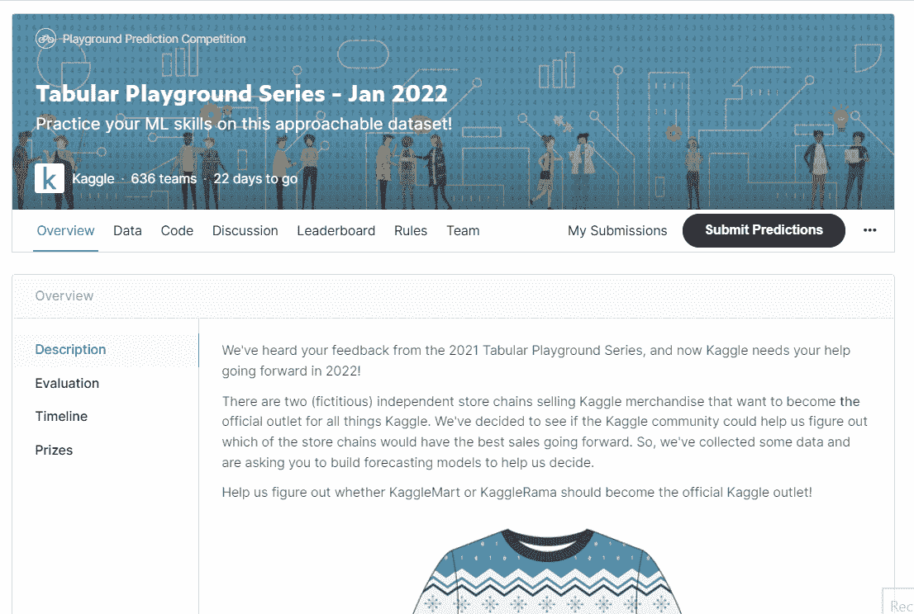
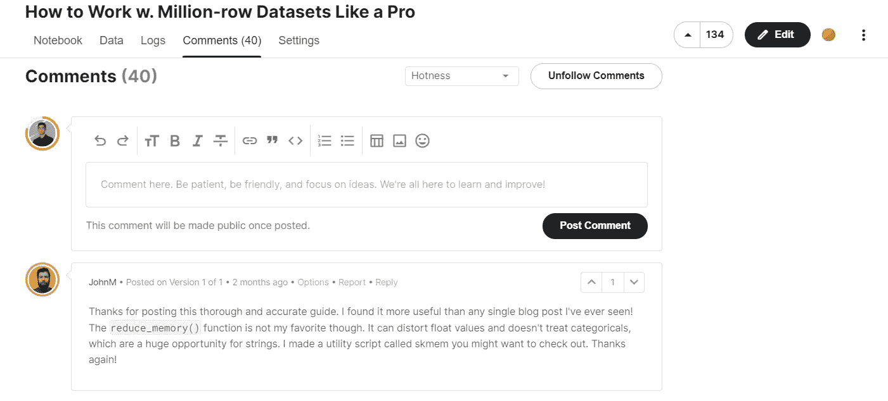
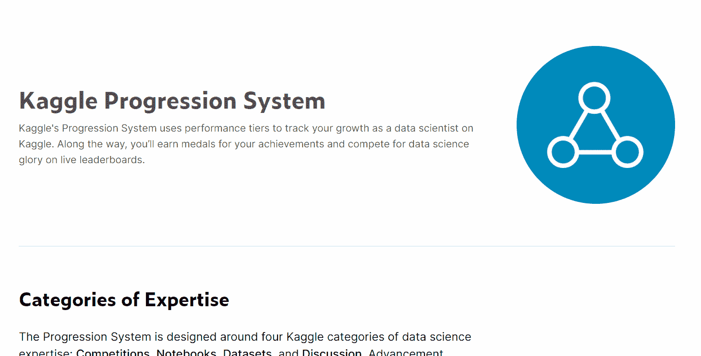
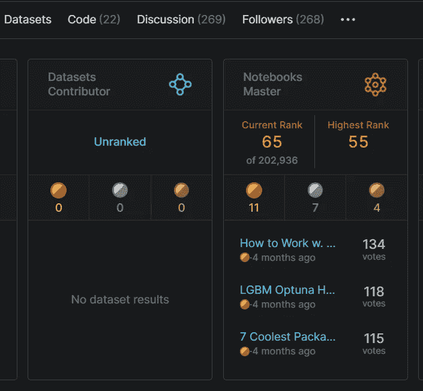
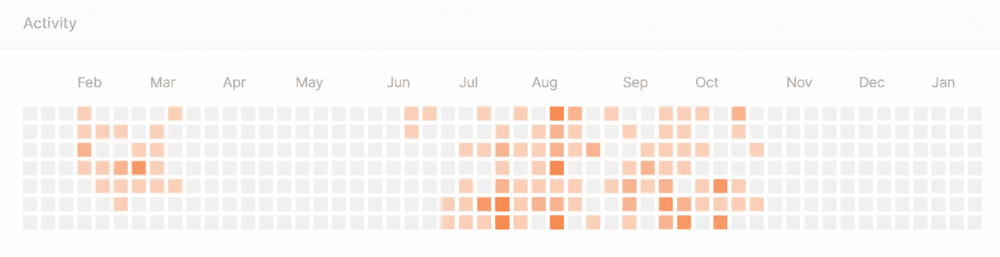
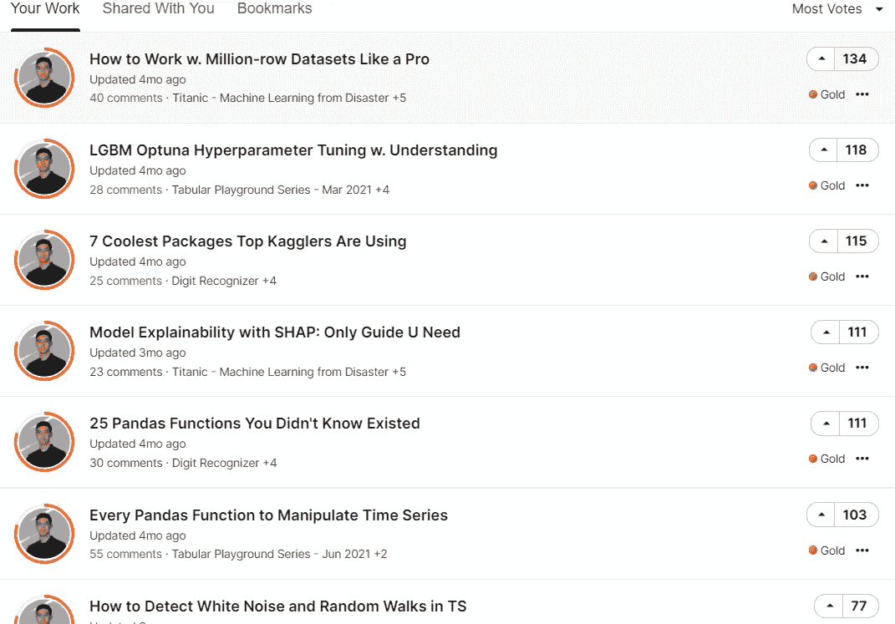

# 如何在 2022 年开始使用 Kaggle(即使你很害怕)

> 原文：<https://towardsdatascience.com/how-to-get-started-on-kaggle-in-2022-even-if-you-are-terrified-8e073853ac46>

## 你的大师之路

**照片由** [**皮特菲舍尔**](https://pixabay.com/?utm_source=link-attribution&utm_medium=referral&utm_campaign=image&utm_content=3849936) **上** [**Pixabay**](https://pixabay.com/?utm_source=link-attribution&utm_medium=referral&utm_campaign=image&utm_content=3849936)

噢，这个地方太棒了。看看这些卡格勒人。要学的东西太多了。这些比赛听起来非常有趣，甚至谷歌似乎也在这里举办比赛。我发誓我会粉碎它。

让我看看这些金色的笔记本。哇，这是大师写的。听起来很奢侈。这家伙似乎知道那么多*该死的*的事情。我从没见过这么酷的数据科学家。让我们看看他的简介——是的，他是一名火箭科学家。

我在想什么？我不能和那个竞争。在我让自己难堪之前，我该走了。是啊，没错。我会在 Coursera 上再学习几年，然后回来给他们看。

…

这很好地总结了我第一次在 Kaggle 上设置键盘时的感受，我相信很多人也是如此。当你意识到你不是*只是足够好与大人物一起玩的时候，你的胃会有一种可怕的下沉感——不知道你是否会像他们一样。*

如果我一直仰卧着，痛苦地思考，我肯定不会获得硕士学位。我只需要迈出第一步，然后想办法解决剩下的问题。

对于初学者来说，这第一步是最重要的一步。如果做错了，你就又回到了骗子综合症，它告诉你，你根本不可能与这些专业人士竞争。

今天，我将向你展示你应该如何分阶段迈出这第一步，这将使你在 Kaggle 上很快获得成功。

  

获得由强大的 AI-Alpha 信号选择和总结的最佳和最新的 ML 和 AI 论文:

  

## 步骤 1:我必须提到的繁琐的设置

一旦你[创建了你的账户](https://www.kaggle.com/account/login)并成为新手(卡格勒的最低等级)，你就离成为正式的卡格勒只有几英寸之遥了。

你所要做的就是参加比赛，赢得你的贡献者徽章。几乎所有 Kaggle 用户的 40%是贡献者，甚至更大比例是新手。

当然，如果你是一个初学者，参加一些 Kaggle 的官方免费课程来让你的技能达到标准并不丢人。我建议先参加[的 ML 入门课程](https://www.kaggle.com/learn/intro-to-machine-learning)，因为它将解释 ML 的基础知识，并在你第一次参加比赛时握住你的手。

## 第二步:首先成为社区的一部分。

许多人以错误的方式加入了 Kaggle。随着每个人都将 Kaggle 作为一个竞赛平台，大多数人都感到越来越大的压力，要立即加入他们，成为一名“Kaggler”

没有什么比这更偏离事实了。

感觉你必须马上参加比赛是一个巨大的陷阱，如果你还没有发展出正确的技能，你会很痛苦，因为 Kaggle 是残酷的竞争对手。即使是最小的挑战也会吸引许多熟练的专家。

那么解决办法是什么呢？

首先成为社区的一部分。感觉你是这个群体中的一员，这样你就消除了你的冒名顶替综合症，并且可以对自己说:“我是一个卡格勒。”

你是怎么做到的？

你开始看笔记本。很多。被所有人。我建议挑一个你感兴趣的比赛(建议见下面几节)，按 upvotes 的多少排序笔记本列表。

作者截图

你向下滚动，打开票数最低的笔记本。通常，这些都是新手写的，需要和你一样多的支持和反馈。

一旦你开始和评论区的作者交流(他们很有可能会回复每一条评论)，你就和他们建立了联系。一旦你对他们的一些笔记本发表了评论，他们很可能会再次关注你。

现在，在每个笔记本里，都有一些待办事项。

首先，至少留下一条评论。它可以是任何东西——代码编写的方式(干净，遵循最佳实践),作者如何解释他的思维过程，数据可视化的质量，或者笔记本的任何可以想象的方面。

你也可以到处提出改进的建议。如果作者知道的比你多，也说出来，告诉他们你学到了新的东西。

我的一个笔记本上的一条评论

如果你不太了解作者在说什么，叉上笔记本，开始修补每一个代码单元。阅读关于未知函数的文档和教程，直到你理解每一行是做什么的。

一旦你在 10-20 个笔记本上重复这个过程，你会发现在同样的时间内，你学到的东西比在一个课程中学到的要多得多。

最棒的是，现在你不仅仅是一个无名小卒——你认识并关注许多 Kagglers，如果你对他们的工作留下了足够好的反馈和赞赏，他们可能也会记得你。

## 第三步:了解 Kaggle hotness 系统的工作原理及其进展系统。

您必须查看 Kaggle docs 上的[这一页](https://www.kaggle.com/progression),以了解如何达到每个等级:

有四个类别，每一个都需要不同程度的努力和技能来获得大师头衔。比赛和数据集的 GMs 是最难的。

你可能不需要军衔，这很好。但是，如果你想建立良好的关系，扩大你的网络，获得一个头衔是获得信誉的一个可靠途径。

最值得尊敬的头衔是竞赛或笔记本中的硕士和硕士(至少在我看来是这样)。尽管如此，任何通用汽车的头衔总是足以赢得许多人的尊重和钦佩。

Kaggle 的 hotness 系统类似于 LinkedIn(但没有二级和三级关系的复杂性)。

如果你制作内容，它通常会显示在你的追随者的 feed 上，以符合他们的偏好。如果他们与你的作品互动，这将同样显示在他们的追随者的饲料。因此，更多的追随者意味着更广泛的影响。

笔记本电脑在竞争中的排名也发生了变化，不是基于投票数，而是基于有多少人对其进行了评论。

## 第四步:选择比赛

现在，你准备好了。一切都是为了这个——选择和参加比赛。

即使你是初学者，我也不推荐这些*入门*比赛:

*   [泰坦尼克号—分类](https://www.kaggle.com/c/titanic)
*   [房价回归](https://www.kaggle.com/c/house-prices-advanced-regression-techniques)

几乎所有初学者都是从这些开始上 Kaggle 的，所以它们已经非常饱和了。此外，有很多抄袭，因为人们只是从以前的获奖者那里抄袭顶级解决方案，以提升排行榜。

如果你发现笔记本上有成千上万的 upvotes，不要感到惊讶——这些比赛自 Kaggle 诞生以来就一直存在，人们有时间以各种可以想象的方式探索他们的数据集。

相反，像我一样，从每月的表格游戏系列(TPS)比赛开始。它们比入门 comps 稍微难一点，但是有趣多了，而且有更大的能力教你一些新东西。

由于他们的初级性质，他们吸引了很少的大师，但仍然很难获胜(我还没有做到)。

## 赢得比赛的终极 4 周工作流程

首先，让我们定义一下“比赛中的成功”

对我来说，如果我的分数在提交的第一名的 1%以内，我会很高兴。比如我很积极参与的 9 月 TPS，我的 ROC AUC 是 0.81708，而第一名是 0.81775。我以 0.0067 的差距获得了第 332 名。

大多数时候，即使使用简单的模型和一点点[超参数调整](/why-is-everyone-at-kaggle-obsessed-with-optuna-for-hyperparameter-tuning-7608fdca337c)，您也可以达到最高分。但是要到达顶端，你必须做大量繁琐的工作和实验。

这是获胜的必要条件，至少在 TPS 竞赛中是如此。

特色赛和代码赛(有奖金)不一样。它们有运行时间和资源限制。例如，有些人不接受训练时间超过 8 小时的解决方案，以保持其实用性，以防主持人希望在未来生产其中一些。

不管是哪种类型的竞争，你都可以采取一些步骤来保证成功。我将在 TPS 竞赛的情况下概述它们，但是你总是可以根据竞赛的持续时间来扩展这些想法。

因此，要想在 TPS 或任何 Kaggle 竞赛中取得好成绩，你应该这样分配时间:

**第一周:探索性数据分析**。它的重要性是不可否认的，它将是你以后如何提出解决方案的一个组成部分。

你应该特别注意数据中的特征，以及如何将它们归一化([不同的分布需要不同的算法](/how-to-differentiate-between-scaling-normalization-and-log-transformations-69873d365a94?source=your_stories_page----------------------------------------)来实现)。EDA 还为您提供了可能的功能工程想法，这是您成功的另一个重要部分。

在第一周，你还应该制定一个验证策略。用一个模型建立一个基线分数( [XGBoost 比较流行](/20-burning-xgboost-faqs-answered-to-use-the-library-like-a-pro-f8013b8df3e4))，看看是否可以用其他方法提高。

**第二周:车型选择**。现在，您使用默认的超参数尝试不同的模型，看看哪一个模型的得分最高。它可以是基于树的，如 XGBoost，也可以是线性模型，如逻辑或线性回归。

我也推荐大家根据自己的直觉和从 EDA 中得到的知识去翻翻 Sklearn 中一些比较稀有的模型。你可能会发现一两个惊喜，甚至比基于树的模型给你更高的分数。

你必须根据[他们的训练和测试分数](/6-sklearn-mistakes-that-silently-tell-you-are-a-rookie-84fa55f2b9dd)通过[交叉验证](/5-cross-validation-techniques-you-need-to-create-models-that-people-trust-62c4629a678b?source=your_stories_page----------------------------------------)来判断这些模型(关键词链接到相关教程)。

**第三周:特征工程**。现在，我们知道了所有总经理通往高层的秘方。特征工程不是你在课程中学到的东西，关于它有很多可以说的，但简单来说:

> 特征工程是关于塑造和转换数据集，以便模型可以从中学习尽可能多的信息。

FE 在表格和[时间序列比赛](/top-4-time-series-feature-engineering-lessons-from-kaggle-ca2d4c9cbbe7)中尤为重要。

每次更改数据时(添加新列、修改现有列等)。)，您应该运行您在第 2 周找到的最佳模型，看看这一变化是否会提高您的分数。

**第 4 周:超参数调优**:现在你已经添加了新的、有趣的特性，是时候从你的潜在模型中榨取每一点性能了。

您将需要一个良好的调优框架。我特别喜欢 [Optuna](/why-is-everyone-at-kaggle-obsessed-with-optuna-for-hyperparameter-tuning-7608fdca337c) ，其他很多 Kagglers 也是。

一旦优化了最佳模型，就可以生成预测并打包提交。或者你可以将多个模型组合成一个整体来进一步提高你的分数。

集合解决方案在现实世界中几乎没有用，因为它们非常昂贵，但是你会看到 Kaggle 中充满了它们。在排行榜的第 50 百分位以上，人们经常使用合奏。你可以在这里了解更多。

最后，所有这些步骤都是迭代的，可以根据您的需求进行更改。你可以随时回到其中任何一个，延长或缩短完成每一步所需的时间。

## 步骤 5:开始出版笔记本——成功的支柱(可选)

如果有一件事能保证让你出名，那就是出版高质量的辅导笔记本。

即使有许多高技能的科学家在竞争中击败它，你会发现没有多少人能以一种水晶般清晰的方式向他人解释他们的工作。

这就是为什么我在笔记本上轻松获得硕士学位的原因:

我截图。

我只需要创造 22 个笔记本就能获得 11 枚金牌(离特级大师还差 4 枚)，这是一个比大多数人都要高的金牌/笔记本比率。在我发表之前，我已经写了相当长一段时间的数据科学教程，所以我有很多写技术内容的练习。

事实上，除了懒惰和其他承诺，没有什么能阻止我获得我的第一个 GM 头衔:

在过去的几个月里，我一直不活动。(截图很明显是我发的)。

你还会发现，最好和最受欢迎的总经理是那些赢得竞争并以专业而又易懂的方式向大众概述其解决方案的人。

写笔记本迫使你写干净的代码，并对你想向他人解释的主题进行研究:

我截图

该社区吞噬了好的笔记本——对于我的任何一个典型的黄金笔记本，我都会收到 20-40 个“谢谢”和反馈意见，而我在 Medium 上的文章几乎没有几个，尽管通常有数千人阅读它们。

## 结论

卡格尔大师头衔绝对是一种威望。它们在你的 LinkedIn 标题上看起来很耀眼，会让你的简历增色不少。

但是 Kaggle 最好的地方总是它的社区。它不仅是最突出的在线数据平台，而且其他行业的程序员也尚未形成如此惊人的社区，拥有如此多的熟练专家。不管你的排名如何，成为其中的一部分会比课程和书本更能拓展你的知识和人脉。

    

## 在 LinkedIn(领英)或 Twitter(T2)上与我进行友好的交谈。或者你可以读我的另一个故事。这些怎么样:

         