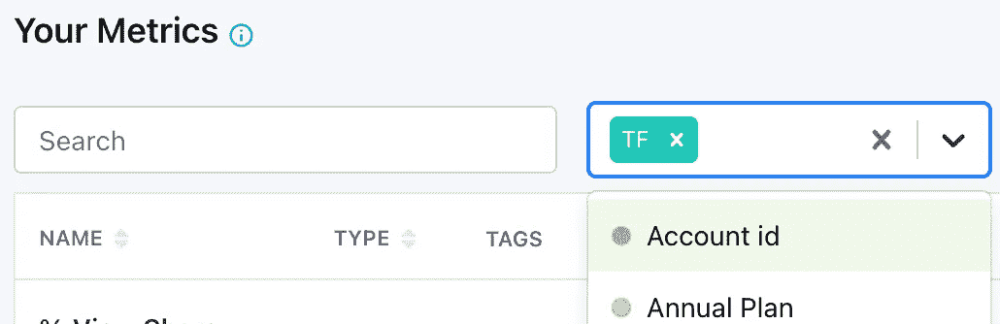
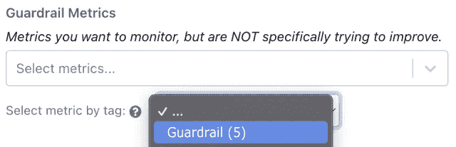

# 如何充分利用 GrowthBook

> 原文：<https://towardsdatascience.com/how-to-get-the-most-out-of-growthbook-82feb792ad4c>


[图片来源](https://en.wikipedia.org/wiki/Thought_experiment#/media/File:Schrodingers_cat.svg)

## 简化 A/B 测试的开源方法

> [GrowthBook](https://www.growthbook.io/) 是一款用于 AB 测试的开源工具，提供了特性标记功能和分析工具。分析工具是本文的重点，它位于数据仓库的顶层，通过 SQL 查询与您正在收集的任何现有用户数据进行交互。这种灵活性是 GrowthBook 对我们的主要吸引力之一，因为这意味着我们能够直接分析我们的实验对我们的业务 KPI 的影响。

作为开源软件，你可以非常灵活地配置 GrowthBook，不管它是有效的还是无效的！)给你。在本文中，我将介绍我们如何配置我们的 GrowthBook 实例，以形成我们在 Typeform 的自助式实验平台的基础，并包括我关于确保健壮性、可用性和效率的顶级技巧。

# 数据源

> 数据源本质上是您的数据仓库的 SQL 视图，它将您的实验特征标记拉入 GrowthBook

设置 GrowthBook 时最重要的事情是决定数据源的结构。需要注意的是，指标与特定的数据源相关联，您不能在不同数据源上定义的实验之间共享这些指标。

我们使用 GrowthBook 来分析通过 [Iterable](https://www.googleadservices.com/pagead/aclk?sa=L&ai=DChcSEwiZn8v3iJb5AhW2gFAGHfULCwAYABABGgJkZw&ohost=www.google.com&cid=CAESbOD2IlCXdMT0vIiNX2iNjRqHxCNMumNEps2jRYXSoiUjyuZZrsFr20GZiJnWsdynXYcgWjV9-5wK3XHlPsfkxibP-rsT_9IhN3yhuEGeY97wYrzc7apEgk4G_MRqOe0ZmD1eQg8MEldTejYqAQ&sig=AOD64_2OqUNup2WY19-8lgSqpOzktaLl0A&q&adurl&ved=2ahUKEwiF5cP3iJb5AhVWhFwKHVSvAmYQ0Qx6BAgEEAE) 发起的在线和电子邮件活动，我们希望在两者中使用相同的 KPI。其中一个最新版本(1.3.0)允许每个数据源有多个查询，这允许我们在一个数据源下公开多种类型的实验，从而在它们之间共享指标。

我们已经按照标识符 id 对数据源进行了分区:

*   `user_id`或`account_id`为已登录用户
*   `form_uid`为新表格功能
*   公共网站访问者的匿名 cookie id。

我们的主要 KPI 类似地在标识符之间划分，因此这对我们很有用。

# 韵律学

> 指标被定义为 SQL 查询，可以从数据仓库的任何地方获取数据

GrowthBook 的一个巨大优势是通过 UI 将指标定义为 SQL 查询，您可以查询数据仓库中的任何表。


作者图片

您可以直接通过 GrowthBook 中的 SQL 定义指标，或者直接从您的数据仓库中提取任何预定义的指标。这是一种类似于 [Eppo](https://www.google.com/url?sa=t&rct=j&q=&esrc=s&source=web&cd=&cad=rja&uact=8&ved=2ahUKEwj_ytndhpb5AhWGiFwKHWjXDqkQFnoECAYQAQ&url=https%3A%2F%2Fwww.eppo.int%2F&usg=AOvVaw13Vl-gMdCwri-ZvBHqrMDP) 的方法，但在优化方面比[有明显的优势](https://www.google.com/url?sa=t&rct=j&q=&esrc=s&source=web&cd=&cad=rja&uact=8&ved=2ahUKEwiYvOvihpb5AhUZacAKHSA0DxIQFnoECBkQAQ&url=https%3A%2F%2Fwww.optimizely.com%2F&usg=AOvVaw0baSuhMgj_fRQCYtwcor_w)，因为它将指标定义交给了数据团队。

在 Typeform，我们是 [dbt](https://www.google.com/url?sa=t&rct=j&q=&esrc=s&source=web&cd=&cad=rja&uact=8&ved=2ahUKEwizhc7qhpb5AhUXSMAKHQhcBAQQFnoECDoQAQ&url=https%3A%2F%2Fwww.getdbt.com%2F&usg=AOvVaw3bJTl7mzWnU4_0t3JvNM_P) 的忠实粉丝，有许多 dbt 模型来定义不同的指标和 KPI，我们的数据仓库环境会随着时间的推移而发展。GrowthBook 使保持用于实验的指标与其他业务保持同步变得非常容易。

## 公制标签

每个指标都可以进行标记，这些标记可用于过滤和搜索指标目录，以找到您正在寻找的指标。我特别喜欢这个功能，因为我是要求为不同的应用程序提供不同颜色标签的用户之一(在 1.2.0 版中引入)！



作者图片

我们使用各种不同的标签，但我们有所有指标都必须有的强制标签，这些标签划分了我们的指标目录，以提高可搜索性。

**标识符 ID:** *用于定位和特征标记的标识符类型。指标只在其中一个上定义，每个指标都链接到特定的数据源。*


作者图片

**产品:** *Typeform 也有一个名为 Videoask 的产品，它有自己的一套指标和数据源。*


作者图片

**版本控制:** *GrowthBook 不支持正确的版本控制，但我们引入了版本控制标签，让我们的用户知道对指标执行了哪些检查。这使我们能够确保我们的所有指标都与我们的数据仓库保持一致，并帮助我们在 GrowthBook 引入新功能时采用它们。*


作者图片

# 护栏

我们正致力于标准化护栏指标，并将其应用于所有实验。这将确保我们不会无意中对我们的 KPI 产生负面影响。GrowthBook 允许您通过标签将指标添加到实验中，因此有一个护栏标签意味着我们可以轻松确保我们正在监控那些最重要的指标。



作者图片

# 自定义标识符类型

> 标识符类型是用于在控件和变量之间划分受众的实体，可以是用户 id、匿名 cookie id 或位置。

版本 1.3.0 引入了自定义标识符类型，允许您选择如何称呼在功能标记中使用的标识符。在以前的版本中，你有两个选择:`user_id`和`anonymous_user_id`。我们不得不在其中一个上别名我们的其他 id，这引起了很多混乱。

我们目前正在从数字`account_id`迁移到字母数字`account_uid`(显然我们用完了数字\_(ツ)_/)，所以能够明确地标记哪个正在被使用是非常有用的。伟大的新功能！

# 动态日期范围

2021 年 11 月，GrowthBook 引入了日期的 SQL 占位符。这些允许您将日期过滤器应用到一个由特定实验日期填充的指标。对于我们来说，当从通常包含数亿行的分区表中查询数据时，这一点尤其重要。下面是分区键`day`上的过滤器示例:

```
WHERE day BETWEEN DATE('{{ startDate }}') AND DATE('{{ endDate }}')
```

这里需要注意的是`startDate`和`endDate`都是时间戳而不是日期，因此我们必须使用`DATE()`函数来匹配分区。此外，在评估指标时,`endDate`被替换为实验结束的时间戳加上转换窗口。如果您在数据源查询中添加了一个`endDate`，那么实验的实际结束日期将被用来过滤分配给您的实验。

# 状态更新

我们面临的一个挑战是预测和防止指标被打破，以减少利益相关者之间的摩擦。指标出现问题有两个主要原因:

*   我们数据仓库的变化。我们有一个非常活跃的 dbt 环境来计算我们的 KPI，这些 KPI 通常会随着业务需求的变化而迁移。
*   SQL 中的拼写错误。当将 sql 从 DataGrip 复制到 GrowthBook 或意外编辑现有指标的 sql 时，很容易出现输入错误。

GrowthBook 开源的一个非常好的特性是，你可以下载一个 config.yml 文件，其中包含来自 GrowthBook 实例的所有 sql 查询。我们有一个 Databricks 笔记本，每天早上运行，对每个指标的 sql 查询运行各种测试。

我们可以检查:

*   表名在数据仓库中可用
*   表格已用最新数据更新
*   度量定义中的 SQL 错误

如果出现问题，将向我们的#growthbook slack 渠道发送 slack 通知，供任何分析师挑选和解决。


作者图片

在 Typeform 中，我们实际上是自托管的，所以所有这些都可以在 MongoDB 中使用，当您通过 UI 添加指标时，MongoDB 会自动更新。如果您不是自托管的，那么您必须手动下载 config.yml。

# 结论

GrowthBook 允许我们在 Typeform 创建一个用户友好、健壮和可靠的实验平台。在这篇文章中，我已经浏览了我的(当前的)顶级技巧，以充分利用 GrowthBook 必须提供的功能。

作者与 GrowthBook 没有任何关系，只是该产品的狂热粉丝！