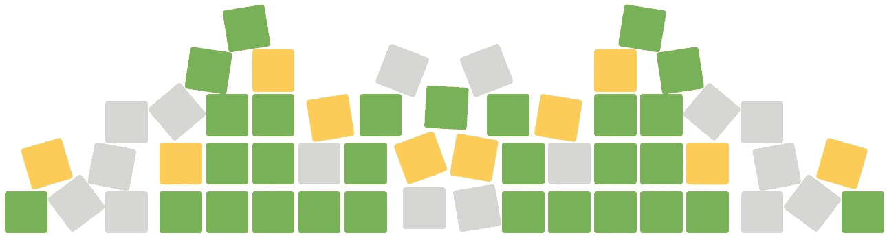
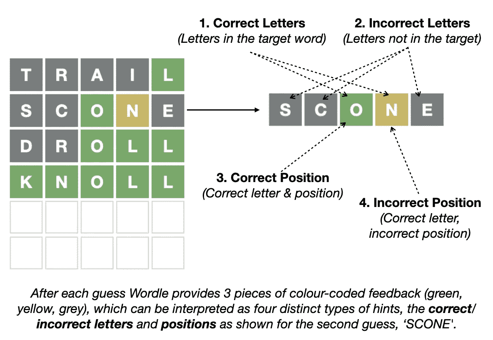
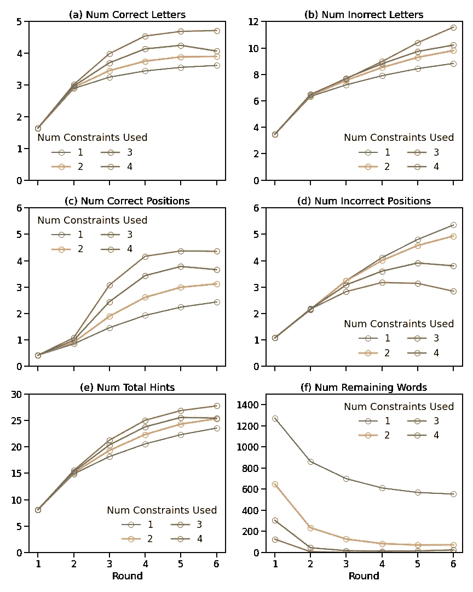
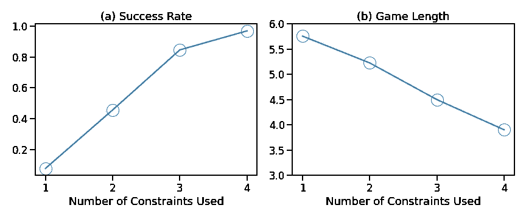
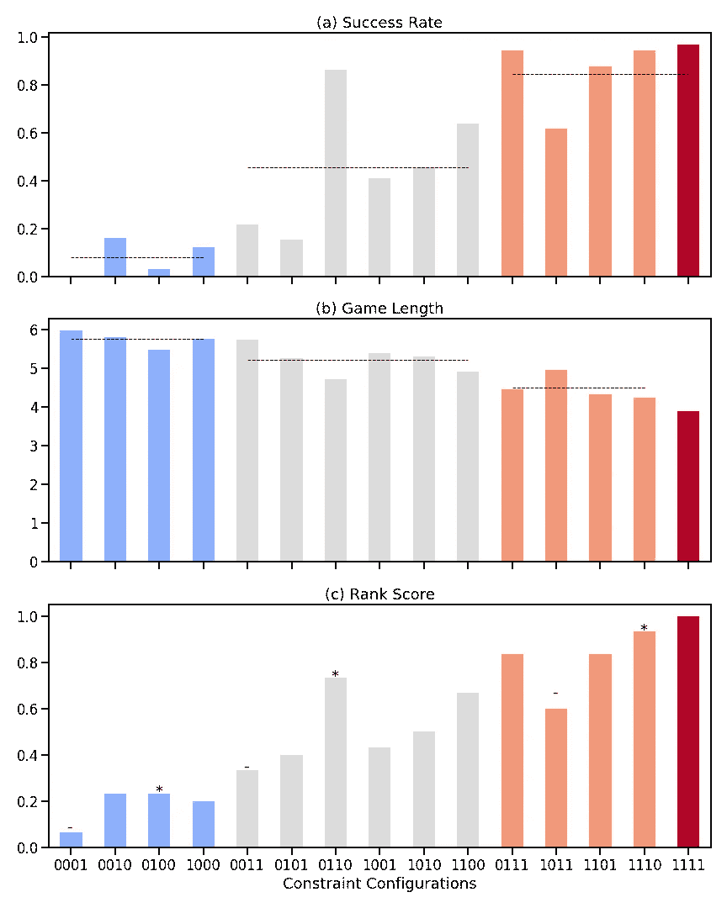
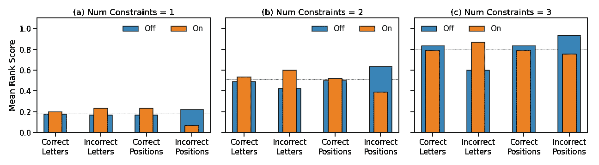
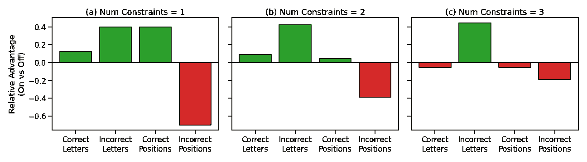

# 如何在 Wordle 中猜对

> 原文：<https://towardsdatascience.com/how-to-guess-well-in-wordle-d21167aae444>

## 从另外 1300 万个世界扑克游戏中吸取的教训

图片作者。

这是我上一篇文章的后续文章，前一篇文章是关于如何用最好的词来开始你的文章。现在我们有了一些好的开始词，值得看看如何进行下一次猜测。有没有猜下一个单词的好策略或者什么都行？你应该如何看待 Wordle 提供的不同形式的反馈？是关注目标词中已知的字母更重要，还是关注被排除的字母更重要？还是两者都有？字母的位置呢？如果我想不出一个词来满足 Wordle 的所有提示，这有什么关系吗？忽略一些提示安全吗？

结果将再次基于对大量模拟游戏(超过 1300 万游戏和近 7000 万猜测)的分析，这一次我将调整模拟器，以更像人类的方式进行游戏。

# TLDR；

下文有很多细节，但主要结果可以总结如下:

*   Wordle 为其玩家提供了 4 种不同类型的反馈，以帮助限制猜测(正确/不正确的字母和正确/不正确的位置)，虽然没有必要为了成功而注意所有这些限制，但一般来说，如果玩家想要在大多数时间内成功，他们需要满足大多数猜测中的 4 个中的 3 个。
*   在用于选择新猜测的约束条件的数量和找到目标单词的可能性之间有很强的正相关性；使用更多的限制大大提高了你的胜算，并以一种可预测的方式减少了你需要的回合数。
*   并非所有约束都是同等创建的，尤其是在与其他约束结合使用时。我们提出证据来支持*错误字母*约束作为一种特别重要的约束类型，而*错误位置*约束作为一种不太重要的约束类型。前者提供了不能从任何其他约束中获得的关于目标单词的信息，而后者提供的信息通常可以从其他约束中获得。
*   实际上，这意味着当选择下一个猜测时，您应该始终努力确保它不包括已知在目标单词中不存在的字母——它应该满足*不正确字母*约束——并且您应该优先满足*正确字母*和/或*正确位置*约束而不是*不正确* *位置*约束。

# 简要概述

除非你没有注意，否则你会听说过 Wordle，并且可能也尝试过。简而言之，Wordle 是一个简单的单词查找谜题，玩家每天有 6 次机会猜测一个新的 5 个字母的目标单词(每个人都得到同一个单词)，这些天数百万人在 Twitter 上分享他们的进展，这帮助 Wordle 成为病毒。

一个 Wordle 游戏和反馈的例子。图片作者。

每次猜测后，玩家会收到多达 3 条颜色编码的反馈，如下所示:

1.  您的猜测中的字母在目标单词中，但位置不正确(黄色)；
2.  您的猜测中的字母在目标单词中，并且在正确的目标单词位置(绿色)；
3.  您猜测的目标单词中缺少的字母(灰色)。

总的来说，这 3 条反馈实际上提供了 4 条不同的信息:(1) *正确的字母；*②*不正确的字母；*(3)*(字母正确)；以及(4) *正确字母的错误位置*。稍后，当我们考虑如何使用这个反馈来约束和引导我们的猜测时，这将是很重要的。*

# *模拟世界:疯狂*模式**

*很明显，我自己并没有玩几百万个 Wordle 游戏，但是我的笔记本电脑有。在我的前一篇文章中，我描述了我是如何建立一个 Wordle 模拟器，并用它来模拟超过一百万个 Wordle 游戏，以找到最好的单词作为开场猜测；大多数人都有一个他们喜欢用来开始游戏的常用词，但有些词比其他词更好。*

*值得注意的是，我的模拟器没有使用确切的 Wordle 词表——是的，我知道这已经变得可用，因为一些人已经设法从 Wordle 源代码中提取了它——因为我没有使用它的许可。相反，我使用的是开源的等价物。我不认为这会对结果产生实质性的影响，至少在我使用的模拟尺度下不会。*

*在我之前的帖子中，我也提到我的模拟器玩起来像一个强大的玩家。我认为这至少有两个重要原因:*

*   *首先，在识别与 Wordle 的各种字母约束相匹配的单词时，模拟器具有完美的回忆能力；虽然对计算机来说很简单，但超出了我们大多数人的能力。*
*   *第二，当猜测一个新单词时，模拟器应用*所有可用的约束/提示，以便最大限度地排除不能作为目标的单词。**

*大多数人不能这么努力地玩，或者不仔细地玩，我们经常做出不满足所有可用约束的猜测。例如，当很难想到满足所有可用约束的单词时，满足某些约束的单词可能会出现在脑海中。在上面的游戏中，第三个猜测' *DROLL* '是这样的一个例子:' *R* '已知被排除在目标之外，我们还知道目标中也有一个' *N* '。然而，这是一个有用的猜测，因为它揭示了目标的新信息。*

*Wordle 有一个'*硬模式'——你可以在玩之前在游戏的设置中选择它——*，它坚持认为*“任何透露的提示都必须在随后的猜测中使用”，*虽然从我所见这仅适用于*正确的字母*和*正确的位置*，因为在硬模式中允许' *DROLL* ，即使' *R* 不正确。但是，在硬模式下不允许使用'*破坏*，因为第 4 个字母必须是' *L* '。“*硬*模式”这个名称可能有点误导。它并没有改变游戏本身，而是迫使玩家更加仔细地思考一个猜测，坚持每个新的猜测至少满足一些已经知道的提示(正确的字母和位置，如果有的话)。然而，它似乎并没有强迫你尊重其他的约束——不正确的位置或不正确的字母——所以也许应该有一个'*疯狂的*'模式，在这个模式中，这些信息也必须得到满足。对此，我的模拟器玩的是'*神经病*模式！*

# *模拟世界:人类模式*

*为了产生一个更像人类的游戏模拟，我们需要抛弃这种疯狂的模式，采用一种更放松的方法来应用约束。如前所述，根据其 3 种类型的反馈，将 Wordle 视为提供 4 种不同类型的约束是有用的:*

1.  **正确字母* —你知道在目标单词中的字母集合；这些正是你一路上收集到的黄色字母。*
2.  **错误字母* —你知道目标单词中没有的字母集合；你收集的灰色信件。*
3.  **正确位置* —目标单词中位置已知的正确字母的子集；绿色字母。*
4.  **错误位置* —位置未知的正确字母及其错误位置的子集；*表示没有对应绿色字母的黄色字母*。*

*默认情况下，我的模拟器将所有这些约束条件应用到每个新猜测的搜索中。为了模拟更像人类的游戏，我们应该允许这些约束在游戏中有选择地打开或关闭。例如，如果*正确字母*约束是上的*，那么模拟器将选择下一个包括目标单词中所有已知字母的猜测。但是，如果*正确字母*约束为*关*，那么在选择下一个猜测时，该约束将被忽略；猜测可能包含一些正确的字母—这可能是偶然发生的，或者是因为使用的其他约束可能支持猜测—或者它可能产生一个没有正确字母的单词，只要它与其他约束兼容。**

*这 4 个约束有 16 种(2x2x2x2)可能的开/关配置。如果所有的约束都被关闭，那么模拟器将有效地以非导向的方式猜测，因此我们将忽略这个配置，因为它不符合合理的游戏玩法。这给我们留下了 15 种可能的配置。*

*为了评估这 15 种配置中的每一种，我们使用所有 2500 个可能的目标词和 392 个一词和两词起始/种子集来运行我们的模拟器；在我之前的[帖子中，这些种子被认为是高质量的起始词。](/what-i-learned-from-playing-more-than-a-million-games-of-wordle-7b69a40dbfdb)总共模拟了 1360 万场游戏和>6900 万轮游戏，基于每场游戏 15 分钟，相当于大约 388 人一年的游戏时间。我们将尝试阐明的关键问题包括:*

1.  *随着回合的展开，这些限制如何影响游戏的进行？对于不同数量的约束，在每一轮中识别出多少个正确的字母或正确的位置？将可用的单词缩减为最终的猜测有多好？*
2.  *使用的约束条件的数量如何影响游戏成功的可能性(成功率*)和每局游戏的平均回合数(*游戏长度)*？**
3.  **哪些约束组合更有可能导致游戏成功？一些约束类型比其他的更有价值还是更没有价值？一些约束类型应该比其他的更有优先权吗？**

# **约束的数量如何影响游戏？**

**在我们考虑具体的约束组合之前，让我们先来看看所使用的约束数量和游戏性之间的关系。使用 1、2、3 或 4(全部)约束如何影响典型游戏的每一轮？如果我们使用更多的约束，我们会从更多的反馈中获益吗？如果使用更多的约束，是否更有效地减少了目标候选词的数量？**

****

**图一。按回合分析博弈；作者图表。**

**在图 1(a-d)的图表中，我们看到不同类型的反馈(正确/不正确的字母和正确/不正确的位置)是如何随着使用不同数量的约束的游戏展开而累积的。不足为奇的是，在每一轮游戏之后，学习到了更多的信息，但是学习的速度不同，这取决于所使用的约束条件的数量。例如，在图 1(c)中，我们看到，当使用 2 个约束时，我们在 6 次猜测之后学习了 2-3 个正确的字母位置，但是当使用 3 个约束时，我们在仅仅 3 次猜测之后学习了超过 3 个正确的目标单词字母位置；也就是说，与使用 2 个约束相比，当使用 3 个约束时，我们在一半的猜测次数中获得甚至更多的正确位置信息。**

**请注意，当使用更多约束时，可能的目标单词候选项的数量减少得更快；图 1(f)。例如，当仅使用单个约束时，则平均而言，潜在目标单词匹配的集合减少到大约 600 个可能的单词，使得成功的可能性非常小。对于 2 个或更多的约束，情况会有很大的改善，3 个或 4 个约束可以将潜在目标词的集合减少到最多几个词，4 个、5 个或 6 个。**

# **越多越好**

**如果使用更多的约束意味着获得更多的提示和更有效地减少可能的目标词集，那么这可能会转化为更高的成功率和更短的游戏？图 2 显示情况确实如此。虽然只依赖单一约束不是一个可行的策略——它导致不到 10%的成功机会——但使用两个约束可以显著提高成功的机会，达到 40%以上。如果我们想在大多数游戏中获胜，那么我们需要平均每次猜测使用两个以上的约束条件；3 个约束意味着成功率> 80%，使用所有可用的约束(我们的*疯狂*模式)导致 96%的成功>**

****

**图二。成功率和游戏时长受平均次数的约束；作者的图表。**

# **并非所有约束都是同等创建的**

**因此，使用更多的约束会有所帮助，但是使用哪些约束有关系吗？2 或 3 个约束的每一组都和其他组一样好吗？**

**在下文中，我们将使用 1 和 0 的 4 位数字符串来表示约束的特定配置；1 表示使用/打开约束，0 表示不使用/关闭约束，1 或 0 的位置表示特定的约束，基于上面使用的顺序(*正确的字母，* *不正确的字母，正确的位置，不正确的位置)*)。例如，1111 表示使用了所有约束(*疯狂*模式)，而 1010 表示使用了*正确字母*和*正确位置*约束(硬*模式的最小形式)。***

****

**图 3。成功率，游戏长度和每个约束配置的总排名分数。单个约束配置根据其约束数量进行排序和颜色编码(蓝色= 1 个约束；灰色= 2 个约束；橙色/鲑鱼= 3 个约束条件；红色= 4 个约束)。在(a)和(b)中，对于给定数量的约束，平均成功率和游戏长度显示为水平虚线。在(c)中，对于给定数量的约束，最好和最差的配置分别用' * '和'-'标记；作者的图表。**

**图 3(a&b)显示了 15 个约束配置中每一个的平均成功率和游戏长度，根据使用的约束数量进行排序(和颜色编码)。例如，我们可以看到前 4 个(单约束)配置(蓝色)的成功率非常低(通常不到 20%)—事实上，仅使用*错误位置*约束(0001)永远不会成功—对于少数成功的游戏，它们通常平均需要至少 5 或 6 次猜测。当我们使用 2 个约束时，成功率会提高，但显然不是所有的 2 约束配置都同样有效。例如，0110 ( *字母不正确*和*位置正确)*配置的成功率接近 90%，相比之下，1100 ( *字母正确*和*字母不正确)*的成功率略高于 60%，0101 ( *字母不正确*和*位置不正确)*的成功率不到 20%。**

**我们能从这些结果模式中学到什么？我们能识别哪些约束比其他约束更好或更差吗？为了做到这一点，我们首先通过计算成功率和游戏时间的平均(标准化)等级来产生每个配置的总分数，以产生图 3(c)所示的*等级分数*；将成功率*和*游戏时长转换成一个值是可取的，因为可以合理地想象玩家会希望优化游戏的这两个方面，我们使用排名是因为这些原始衡量标准依赖于不同的尺度。不足为奇的是，平均等级分数随着所使用的约束的数量而增加，并且总的来说，1111 配置(疯狂模式)具有最高的等级分数，这意味着它具有成功率和游戏长度的最佳组合。但是是不是有些个体的约束比其他的更好呢？**

**第一个线索是注意具有最高等级的配置如何得分(0100、0110 和 1110；在图 3(c)中用' * '标记)，对于给定数量的约束，*所有的*使用*不正确的字母*约束(第二位数字是 1)。此外，最低等级的配置(0001、0011 和 1011；均标有'-')。这是唯一的约束条件。其他约束有时出现在最高等级的配置中，但是它们并不出现在所有的配置中，并且它们也出现在一些最低等级的配置中。这表明*不正确的位置*约束可能在文字游戏中起着重要作用。**

**还要注意的是，对于给定的约束编号，*不正确位置*约束是*从不*出现在顶级配置(“*”)，但是它总是出现在最低级别配置(“-”)。同样，这是唯一一个为真的约束，表明这个约束可能没有发挥特别重要的作用，尤其是当其他约束可用时。**

# **最有用的约束？**

**我们可以通过将使用给定约束的配置的平均等级分数与不使用该约束的配置的平均等级分数进行比较来对此进行量化。在图 4 中，我们针对每个数量的约束(1-3)分别给出了结果。例如，在图 4(b)中，我们可以看到，当在双约束配置中使用*不正确字母*约束( *on* )时，平均等级分数为 0.6，而当不使用时( *off* )平均等级分数仅为 0.42。换句话说，使用*不正确字母*约束的双约束配置比不使用它的双约束配置执行得更好。相比之下，我们还可以看到，与不使用*错误位置*约束的其他 2 约束配置相比，使用*错误位置*约束会导致较差的性能；这并不是说*不正确位置*约束本身是一个不好的约束，而是说，如果你只能想到符合两个约束的猜测，那么*不正确位置*不应该是其中之一。这两种效应对于 3 约束配置也很明显。事实上，在图 4(c)中，我们可以看到*不正确的字母*约束是唯一的约束，与不使用时相比，它的使用提高了等级分数。**

****

**图 5。每个约束打开和关闭时的平均等级分数；作者图表。**

**为了量化上述内容，我们可以将等级分数(有约束和无约束)中的每一个差异转换为*相对优势*分数，如图 5 所示；为了计算约束 *c* 的相对优势，我们将使用 *c* 时的等级分数除以不使用 *c* 时的等级分数。在图 5(b)中，我们看到*不正确字母*约束享有大约 0.4 的相对优势分数，这表明与不使用它的配置相比，使用它的配置在等级分数上经历了 40% *的提高*。在所有配置中，*字母不正确*约束的平均相对优势得分最高，而*位置不正确*约束的平均相对优势得分最低。事实上，*不正确位置*约束具有净负相对优势分数——它的使用导致更差的等级分数——这表明其他约束应该优先于它。**

****

**图 5。每种约束类型的相对优势分数；作者图表。**

**以上有一个重要的微妙之处需要强调。并不是说*不正确的字母*约束保证比任何其他约束更有帮助——*不正确的字母*约束在这个意义上不是*最好的*约束——相反，我们是说将*与*其他约束一起使用是一个重要的约束。当用户不能想出满足所有可用约束的猜测，但可以想到满足某些约束的单词时，这可能会表现出来。例如，也许他们有一个满足*正确字母*约束和*正确位置*约束的单词和一个满足*正确字母*和*错误字母*约束的不同单词。在这种情况下，这里的结果表明，在其他条件相同的情况下，第二个词将是更好的选择。**

**为什么会这样呢？一种解释是*正确字母*和*正确位置*约束不是互斥的，因为它们都涉及已知存在于目标单词中的字母。*错误字母*约束是不同的，因为它是关于在目标单词中是*而不是*的字母。因此，与*正确字母*和*正确位置*约束相比，*正确字母*和*错误字母*约束的组合在目标单词上提供了更加*多样的* *视角*。**

**类似的逻辑可以解释为什么*不正确的位置*约束被证明价值较低:相对于其他约束，它没有给表带来多少新信息。在早期，当知道的正确字母很少，并且知道一两个不正确的位置对于限制对好的猜测的搜索不是很有用时，它也可能是有限的使用。**

# **结论**

**我们该如何看待这一切？这是大量的数据分析，但它能告诉我们任何新的、有用的或可行的东西吗？这对我的下一个 Wordle 游戏意味着什么？**

1.  **我们已经量化了在玩 Worldle 时使用尽可能多的约束的好处，但也许这是不言而喻的。**
2.  **一点不太明显的是，如果我们想在大多数游戏中成功，我们可能需要在大多数猜测中满足至少 3 个约束条件。但是哪三个限制呢？**
3.  **呈现的结果建议应该包括*不正确字母*约束，因为它提供了对目标单词的独特视角。**
4.  **结果还表明，如有必要，可以排除*不正确位置*约束，因为相对于其他约束，它仅提供有限的附加信息。**

**因此，在玩你的下一个 Wordle 游戏时，如果你想不出一个能满足你目前为止对目标单词的所有了解的猜测，那么试试下面的方法:**

*   **如果你知道任何*正确的位置*，那么使用它们并优先考虑*不正确的字母*约束来帮助找到你的下一个单词，如果你能试着使用*正确的字母*约束。**
*   **如果没有任何*正确位置*，则优先考虑*错误字母*和*正确字母约束。***
*   **如果你甚至没有任何*正确的字母*，那就看看我之前的[帖子](/what-i-learned-from-playing-more-than-a-million-games-of-wordle-7b69a40dbfdb)吧，因为你需要更好的起始词来保证你至少在前一两次猜测中得到正确的字母。**

**现在做一些说明。以上是基于模拟，而不是真实的游戏，但至少有很多模拟，游戏可能是相当现实的，尤其是我们没有放松限制。它还使用了一个关于玩家如何使用约束的非常简单的模型:他们要么打开，要么关闭。这并不理想，因为玩家可能会根据情况改变他们的约束使用:当选择一个猜测时，他们会尽可能多地使用约束。在以后的帖子中，我可能会看看这是如何改变事情的，但现在，以上至少应该为完善你自己的 Wordle 策略提供一些帮助。**