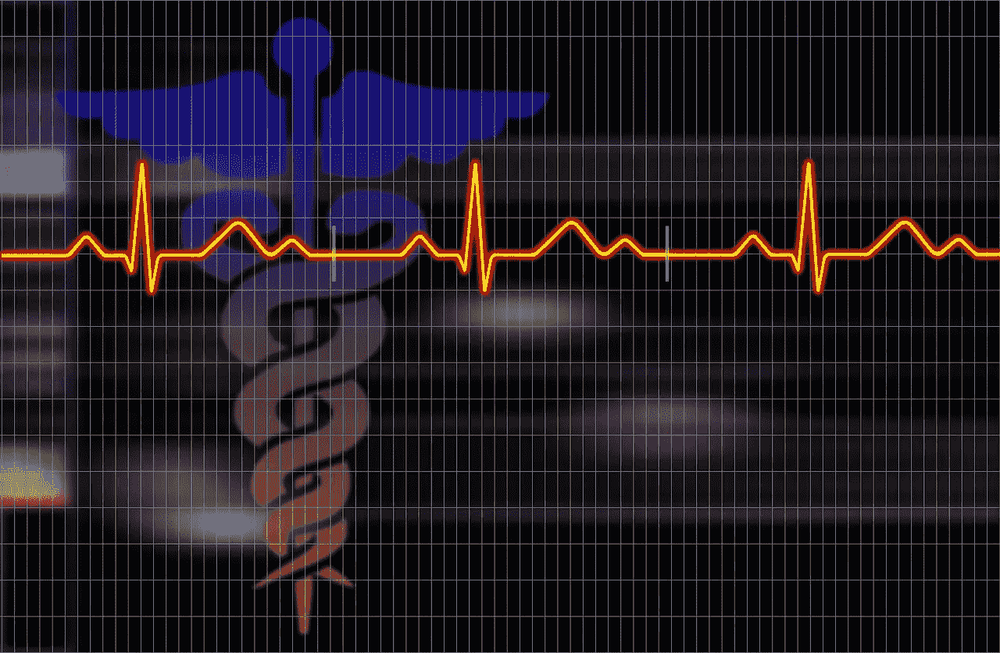
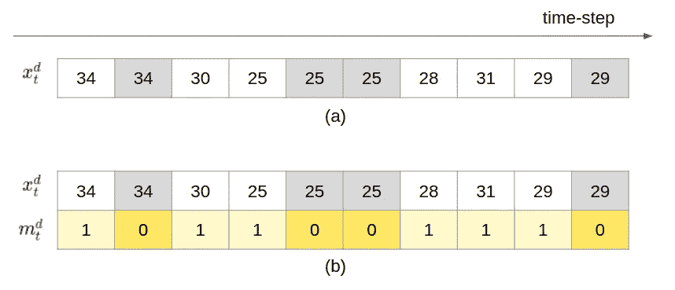
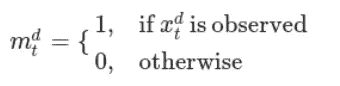
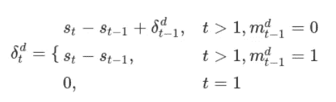
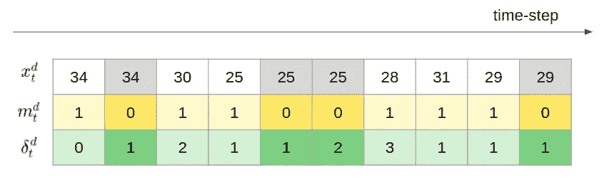
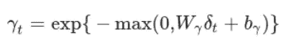
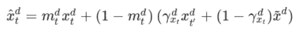

# 医学时间序列研究中缺失数据的处理

> 原文：<https://towardsdatascience.com/how-to-handle-missing-data-in-medical-time-series-studies-e23c8e3e6451>

## 简单有效的方法——专为递归神经网络设计——经受住了广泛的学术评估的考验

图片来源:pixabay.com

> **背景**

大量医疗数据本质上是时间序列数据——心电图、体温监测、血压监测、定期护士体检等等。在这些医学图表的趋势、模式、峰值和谷值中，蕴藏着大量有价值的信息，等待被发现。医疗行业需要对医疗时间序列数据进行有效分析，这被认为是提高医疗质量、优化资源利用和降低整体医疗成本的关键。

医学时间序列分析的一种有前途的形式是通过递归神经网络(RNN)。近年来，RNN 因其建模能力和消费可变长度输入序列的能力而受到医学研究人员的欢迎。研究人员通常将时间序列数据分成均匀的时间步长，如 1 小时/时间步长或 1 天/时间步长。一个时间步长内的所有数据点将通过平均或其他聚合方案进行聚合。这有两个好处。首先，它减少了时间序列数据序列的长度。第二，考虑到原始原始数据点通常在时间上间隔不规则的事实，它归一化了时间上下文。经过这一预处理步骤后，数据基本上可以供 RNN 使用了。**但是有一个没有答案的问题:如果在一个给定的时间步长内没有数据会怎样？**

上述问题在医疗环境中很重要，因为缺失的医疗数据通常不是随机缺失的。数据的缺失本身具有临床意义。例如，医院工作人员可能会停止测量被认为已经稳定的病人的体温。或者，患者的情况可能需要一种不同的测量方法来取代以前的测量方法。因此，通常的零填充或插补方法往往会产生次优的性能。

在这篇博文中，我们将回顾 3 种简单的方法来处理 RNN 时间序列研究中缺失的医学数据。后一种方法建立在前一种方法的基础上，具有更高的复杂性。因此，强烈建议按照出现的顺序阅读。

> **简单缺失编码**

让我们假设每个时间步的输入变量是带有下标`t`的`x`。变量有`d`维度，用上标`d`表示。图 1 (a)显示了输入的图解，并对`d=1`进行了简化。深色阴影部分是缺少的数据。我们应用向前插补，用它们最近的观察值来填充它们。向前插补是有意义的，因为一旦医院工作人员认为指标稳定，他们通常会停止进一步测量，在这种情况下，最近观察到的值可以作为未来实际值的替代值结转。

由这篇[研究论文](https://arxiv.org/abs/1606.04130)提出的简单缺失编码方法建议，我们应该显式编码给定数据点实际上是估算的而不是实际观察到的。这种显式编码向 RNN 提供信号，以考虑数据的缺失。图 1 (b)中显示了一个示例，其中`m`表示缺少`x`，其中`1`表示存在，`0`表示不存在(如公式 1 中所定义)。输入是`x`和`m`的串联。

图 1:编码缺失。深色是缺少值的地方，因此必须进行估算。

公式 1:思念。

这种方法在那篇研究论文中提出的实验中产生了有意义的改进。您的里程可能因数据集而异。但是这是一个非常简单直观的想法，值得一试。

> **时间距离编码**

为了构建上述方法，[本文](https://www.nature.com/articles/s41598-018-24271-9)提出，除了对缺失进行显式编码之外，还要对一个值与最近观测值之间的时间距离进行显式编码。现在，输入是所有三个值编码的串联，即输入`x`、缺失信号`m`和时间距离值`δ`。请参见公式 2 和图 2 中的图示。

公式 2:时间距离。

图 2:编码缺失和时间距离。深色是缺少值的地方，因此必须进行估算。

实验表明，该方法在丢失率显式编码的基础上有了很大的提高。

> **引入衰变**

为了再次建立在上述方法的基础上，[同一篇论文](https://www.nature.com/articles/s41598-018-24271-9)提出了估算值的衰减机制。回想一下，我们应用了向前插补来结转最近观察到的值。但是如果失踪期延长了呢？我们应该无限期地沿用那些旧的观察值吗？如果我们想一想真实世界的场景:医院工作人员停止跟踪一个指标，因为他们认为它是稳定的。该指标值可能仍在正常范围的远端，但相信它最终会回到一个良好的中间值。这意味着，在没有观察到的数据的情况下，我们有很好的理由相信当前的度量值将徘徊一段时间，但最终会“衰减”回良好的医疗默认值。

衰减因子`γ`由权重矩阵`W`和偏差`b`确定，应用于时间距离`δ`(见公式 3)，然后馈送到在`1`结束的反向`exp`函数。`W`和`b`跨时间步长共享，并在培训期间共同学习。

公式 3:衰变因子。

形式上，在任何给定的时间步`t`，如果观察到`x`，我们使用`x`。否则，我们使用最后一次在`t’`观察到的值，衰减到`x`的经验平均值。RNN 的最终输入见公式 4。

公式 4:对 RNN 的最终投入。

该论文还将类似的衰减机制应用于他们的 RNN 模型的隐藏状态，这产生了最好的结果。但是因为我们正在讨论 RNN 输入的原始数据的处理，我们不会深入讨论这个问题。

> **结论**

在这篇博文中，我们介绍了医学时间序列数据研究的背景。我们提出了 3 种为 RNNs 设计的简单方法，旨在明确编码缺失数据的临床意义作为模型的输入，根据提出的论文，这可以产生更好的结果。希望这是一篇快速阅读的文章，它能为你自己的分析项目带来一些好的想法。