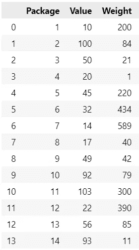
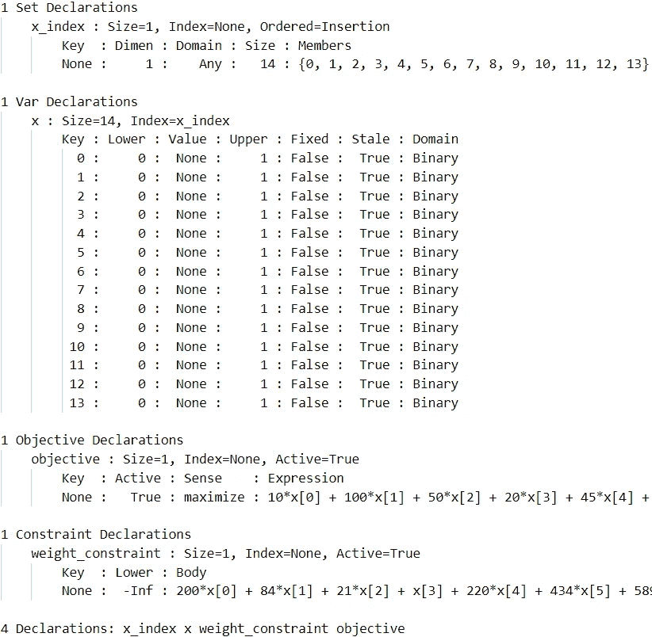
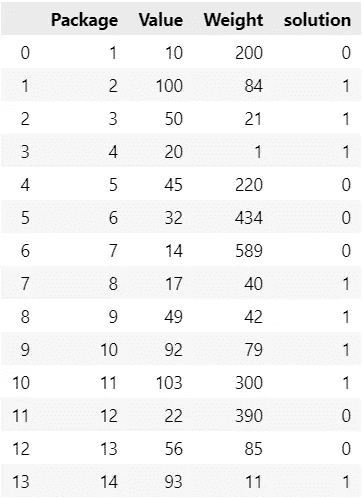
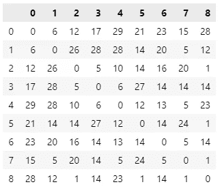
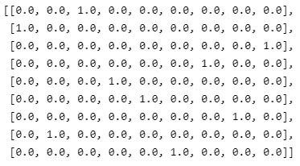
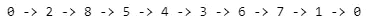
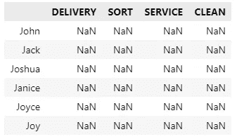
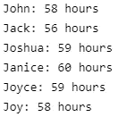

# 如何处理优化问题

> 原文：<https://towardsdatascience.com/how-to-handle-optimization-problems-daf97b3c248c>


由 [Unsplash](https://unsplash.com?utm_source=medium&utm_medium=referral) 上的 [CHUTTERSNAP](https://unsplash.com/@chuttersnap?utm_source=medium&utm_medium=referral) 拍摄

## **带有解决方案和代码的简单示例**

# 变量、约束和目标

为了定义一个优化问题，你需要三样东西:变量、约束和目标。变量可以取不同的值，规划求解将试图找到变量的最佳值。约束是不允许的事情或界限，通过正确设置它们，你肯定会找到一个在现实生活中可以实际使用的解决方案。目标是你在最优化问题中的目标，这是你想要最大化或最小化的。如果现在还不完全清楚的话，[这里有一个更全面的介绍](https://hennie-de-harder.medium.com/why-every-data-scientist-should-learn-mathematical-optimization-3ac102663456)。不要犹豫继续，因为示例将引导您并更详细地解释概念。

# 代码示例

想象你是一个小包裹递送公司的 CEO。该公司发现交付流程可以改进。他们希望首先交付最有价值的包裹组合，并为每次旅行确定最短的路线。他们最不想改进的就是任务的划分。一些员工抱怨，因为他们想更频繁地送货，而不是分拣包裹。

> 如果您想自己尝试这些示例，您需要一个安装了以下包的工作 python 环境: [pyomo](https://pypi.org/project/Pyomo/) 、 [pandas](https://pypi.org/project/pandas/) 和 [numpy](https://pypi.org/project/numpy/) 。您还应该下载一个像 cbc 或 [glpk](https://www.gnu.org/software/glpk/) 这样的[解算器，并在可执行路径中使用它。一些关于](https://www.coin-or.org/download/binary/Cbc/)[列表理解](https://www.w3schools.com/python/python_lists_comprehension.asp)和 [python 编程](https://docs.python.org/3/tutorial/introduction.html)的知识会很有帮助，不在本文讨论范围之内。

## 示例 1:选择要交付的包裹

包裹的价值越高，这个包裹对顾客就越重要。快递公司有一张表格，上面列有包裹及其价值和重量:



每个包裹的包装号，包括价值和重量。

该公司希望选择总价值最高且总重量小于 600 的包裹(这是送货车可以处理的最大重量)。应该选择哪些包？目标很明确:我们希望最大化所选包的总价值。约束条件是所选包裹的总重量应小于或等于 600。我们可以将变量定义为每个包的二进制变量，如果没有选择包，则等于零，如果选择了包，则等于一。

开始编程吧。

首先，我们导入包，加载表并从表中提取数据(这使得下一部分中的代码可读性更好):

```
import numpy as np
import pandas as pd
import pyomo.environ as pyo
from pyomo.opt import SolverFactory
import time# load dataframe with package details
data = pd.read_excel('package_details.xlsx')# extracting the indici, weights and values from the dataframe
indici = list(data.index.values)
weights = data['Weight'].values
values = data['Value'].values
```

现在我们可以开始使用 pyomo:

```
# create a concrete model
model = pyo.ConcreteModel()# define the VARIABLES (in the end 0=not selected, 1=selected)
model.x = pyo.Var(indici, within=pyo.Binary)
x = model.x# define the CONSTRAINT, the total weight should be less than 600
model.weight_constraint = pyo.Constraint(expr= sum([x[p]*weights[p] for p in indici]) <= 600)# define the OBJECTIVE, we want to maximize the value of the selected packages
model.objective = pyo.Objective(expr= sum([x[p]*values[p] for p in indici]), sense=pyo.maximize)# print the complete model
model.pprint()
```

回想一下，该变量是一个二元决策变量，将等于 0(未选择)或 1(已选择)。该约束确保所选包装的总重量不超过 600。为此，我们应该用包裹的重量乘以`x`变量，然后将这些值相加。该目标计算所选包的值的总和(将`x`与一个包的值相乘并求和)，我们希望最大化该目标(`sense=pyo.maximize`)。`model.pprint()`显示已定义的模型:



仅此而已！现在是时候调用求解器了，它会给出我们应该选择的包:

```
# replace the executable path by your own
opt = SolverFactory('cbc', executable='C:\cbc\\bin\cbc.exe')
results = opt.solve(model)
```

几秒钟之内，求解器就找到了最优解！我们可以在原始数据框架中添加一个解决方案列。

```
solution = [int(pyo.value(model.x[p])) for p in indici]
data['solution'] = solution
```



添加了解决方案列。

> 能不能把这个问题改成选择最大数量的包，而不是所选包的最大总值？

问题解决了，让我们继续下一个！


斯蒂芬·门罗在 [Unsplash](https://unsplash.com?utm_source=medium&utm_medium=referral) 拍摄的照片

## 示例 2:确定交付选定包裹的顺序

为了尽可能快地递送选定的包裹，我们想走最短的路线。我们从取货点开始，我们想在那里结束去取新的包裹。我们如何对这个问题建模并使用优化来解决它？这个问题比上一个问题稍微难一点。让我们定义目标、约束和变量。

目标是最小化路线的总距离。约束条件是:我们要从取货点开始，到取货点结束，每个包裹都要投递，所以我们需要访问所有的地址至少一次。我们还需要确保创建一条完整的路线，而不是多条小路线。最后但同样重要的是，变量。我们用二进制变量创建一个 from，to 矩阵，其中 1 表示选择了这条路，0 表示没有选择。如果我们从地址 6 到地址 2。

对于这个问题，我们需要一个距离矩阵。在下面的矩阵中检查从地址 6 到地址 2 的距离是否等于 16。地址 0 是我们的起点(也是终点)。我们需要交付 8 个包裹，由其他 8 个地址代表。



距离矩阵。

创建随机距离矩阵的代码:

```
import random
import pandas as pdindici = range(9)
distances = pd.DataFrame(index=indici, columns=indici)for from_ in indici:
   for to in indici:
      if from_ == to:
         distances.loc[from_, to] = 0
      elif pd.isna(distances.loc[from_, to]):
         dist = random.choice(range(1, 30))
         distances.loc[from_, to] = dist
         distances.loc[to, from_] = dist
```

首先，我们声明模型、地址(列出距离矩阵的索引值)和变量:

```
model = pyo.ConcreteModel()addresses = distances.index# declaring the VARIABLE matrix, again with only binary values
model.x = pyo.Var(addresses, addresses, within=pyo.Binary)
x = model.x
```

在这个例子中，变量是一个矩阵:我们通过对地址循环两次来创建它。所以`x[2,3]`对应的是从地址 2 到地址 3 的路由。

现在是时候声明约束了。这次我们将使用约束列表，因为我们想要同时添加多个约束。

第一个约束列表将保存我们往返于同一个地址的值。我们不想激活它们，所以我们设置所有的变量值，其中 from 和 to 点都等于零:

```
model.diagonal = pyo.ConstraintList()
for a in addresses:
   model.diagonal.add(expr= x[a, a] == 0)
```

下一个约束是关于访问每个地址一次。这意味着每个地址都应该恰好是一个“收件人”地址和一个“发件人”地址。

```
model.visit_once = pyo.ConstraintList()
for a in addresses:
   model.visit_once.add(expr=sum([x[a, to] for to in addresses])==1)
   model.visit_once.add(expr=sum([x[fr, a] for fr in addresses])==1)
```

而最后的约束:我们不想绕圈子，我们要完整的路线！所以如果我们从地址 0 旅行到地址 5，我们不想从地址 5 旅行到地址 0！这两条路线中的任何一条都不应该被激活，所以`x[0, 5] + x[5, 0] <= 1`。这个约束确保我们得到一个完整的路线，而不是多个较小的路线。查看[米勒-塔克-泽姆林公式，了解该约束的解释](https://en.wikipedia.org/wiki/Travelling_salesman_problem)。这里我们引入一个叫做`u`的虚拟变量。

```
n = len(addresses)
model.u = pyo.Var(addresses, within=pyo.NonNegativeIntegers, bounds=(1, n))
u = model.umodel.no_circles = pyo.ConstraintList()
for a1 in range(1, n):
   for a2 in range(1, n):
      if a1 != a2:
         model.no_circles.add(expr= u[a1]-u[a2]+x[a1,a2]*n <= n-1)
```

约束，检查！对于目标，我们希望最小化激活路线的距离总和。我们对地址组合进行循环，并将 x 的值乘以路由的距离。这些值的总和给出了总距离。这一次我们需要呼叫`pyo.minimize`，因为我们想把总距离减到最小。

```
# declaring the OBJECTIVEsum_of_distances = sum([x[a1, a2]*distances.loc[a1, a2] for a1 in addresses for a2 in addresses])model.obj = pyo.Objective(expr=sum_of_distances, sense=pyo.minimize)
```

现在是解决问题的时候了。调用求解器并打印结果:

```
opt = SolverFactory('cbc', executable='C:\cbc\\bin\cbc.exe')
results = opt.solve(model)print(pyo.value(model.obj)) # gives 62 (for this distance matrix)solution = []
for a1 in addresses:
   solution.append([pyo.value(model.x[a1, a2]) for a2 in addresses])
```

目标的值是 62，因此该路由的总距离等于 62。在你的情况下，它可能是另一个数，因为你可能有另一个距离矩阵。解决方案矩阵如下所示:



每行有一个 1，每列也有一个 1。所以我们每个地址都去一次。要使这个解决方案更具可读性，请使用以下代码:

```
def print_route(solution):
   sol_ind = list(np.where(np.array(solution[i]) == 1)[0][0] for i in range(len(solution)))
   one_dict = {k:sol_ind[k] for k, _ in enumerate(sol_ind)} sol_str = '0 -> '
   nxt = one_dict[0]
   sol_str += str(nxt)
   while True: 
      nxt = one_dict[nxt]
      sol_str += ' -> '
      sol_str += str(nxt)
      if nxt == 0:
         break print(sol_str)print_route(solution)
```

结果:



解决方案印刷精美。在拾取点(地址 0)开始和结束。

因此，从起点(起点，地址 0)，我们去地址 2，地址 8，地址 5，地址 4，等等，直到我们回到了起点。我们递送了所有包裹，我们可以肯定这是可用的最短路线之一！

> 注意:这个问题是[旅行商问题](https://en.wikipedia.org/wiki/Travelling_salesman_problem)的变种。

你已经解决了两个问题，很好！让我们继续最后一个！


安妮·斯普拉特在 [Unsplash](https://unsplash.com?utm_source=medium&utm_medium=referral) 上的照片

## 示例 3:任务划分

最后一个问题是关于任务分工。目前，你有六名员工，你想让他们保持快乐和精力充沛。但同时，工作是需要做的！那么，你如何才能同时完成这两项任务，完成工作，并让员工开心呢？简单，你创建另一个优化模型！您定义需要完成的任务，如清洁、分拣包裹、递送包裹和在服务中心。在接下来的一个月里，你要定义每项任务需要多少次轮班，以及每次轮班需要多长时间。这给出了您需要员工工作的总小时数，您希望给每个员工相同的工作时间，执行他们喜欢的任务。

```
# no of shifts needed for the upcoming month
DELIVERIES = 45
SORTING = 20
SERVICE_CENTER = 20
CLEANING = 10task = {'DELIVERY': DELIVERIES, 'SORT': SORTING, 'SERVICE': SERVICE_CENTER, 'CLEAN': CLEANING}# time needed for every shift
time_p_shift = {'DELIVERY': 8, 'SORT': 4, 'SERVICE': 6, 'CLEAN': 3}# total time needed 
total_hours = sum([task[k]*timepershift[k] for k in task.keys()])
```

接下来，你定义你的员工，让他们决定他们喜欢做什么样的轮班。

```
employees = {'John':['DELIVERY', 'CLEAN'], 'Jack':['DELIVERY'], 'Joshua':['SORT', 'CLEAN'], 'Janice':['DELIVERY', 'SERVICE'], 'Joyce':['DELIVERY', 'CLEAN', 'SERVICE', 'SORT'], 'Joy':['CLEAN', 'SERVICE', 'SORT']}emp_list = employees.keys()
```

约翰喜欢送货和打扫卫生，而乔伊喜欢打扫卫生，呆在服务台，整理包裹(她可能没有驾照)。现在您可以计算每个人应该工作的平均小时数，您将在目标中使用该值:

```
avg_hours_pp = total_hours/len(emp_list)final_df = pd.DataFrame(index=emp_list, columns=task.keys())
```

`final_df`最终将获得最佳值:



final_df 将在稍后接收最佳变量值。

约翰这个月应该有六个送货班。

数据处理完后，我们就可以开始建模了。我们使用员工和任务创建一个变量矩阵。

```
model = pyo.ConcreteModel()model.Employees = pyo.Set(initialize=emp_list)
model.Tasks = pyo.Set(initialize=task.keys())# define the VARIABLE matrix x using the employees and the tasks
model.x = pyo.Var(model.Employees, model.Tasks, within=pyo.Integers, bounds=(0, None))# define the hours of work per task
model.hours = pyo.Param(model.Tasks, initialize=time_p_shift)
```

我们希望每个班次都有人，因此我们需要添加约束条件，以确保我们有足够的人员来完成每项任务:

```
model.shifts_needed = pyo.ConstraintList()
for t in model.Tasks:
   model.shifts_needed.add(expr= sum([model.x[employee, t] for employee in model.Employees]) == task[t])
```

我们希望排除人们不想做的某些任务:

```
model.excluded = pyo.ConstraintList()
for employee in model.Employees:
   incl = employees[employee]
   excl_tasks = list(task.keys()-incl)
   for t in excl_tasks:
      model.excluded.add(expr= model.x[employee, t] == 0)
```

我们的目标是给所有员工同等数量的工作，只分配他们想做的任务。我们如何才能做到这一点？我们之前计算了平均小时数。我们希望最大限度地缩短从人们收到信息的时间到`avg_hours_pp`的绝对距离。因为如果这个距离等于零，每个人得到的功都是一样的。

计算绝对距离是可能的，但不像使用`abs()`那么简单。Pyomo 处理不了绝对函数，因为问题变得非线性了。因此，我们在这里引入两个新变量:`model.posdelta`表示与`avg_hours_pp`的正距离，而`model.negdelta`表示负距离。使用约束列表，我们设置这些变量值:

```
model.posdelta = pyo.Var(model.Employees, bounds=(0, None))
model.negdelta = pyo.Var(model.Employees, bounds=(0, None))# defining the variables posdelta en negdelta using CONSTRAINTLIST
model.distance_from_avg = pyo.ConstraintList()
for employee in model.Employees:
   model.distance_from_avg.add(expr= sum([model.x[employee, t]*model.hours[t] for t in model.Tasks]) + model.posdelta[employee] - model.negdelta[employee] == avg_hours_pp)# defining the OBJECTIVE, minimize posdelta + negdelta
model.obj = pyo.Objective(expr= pyo.summation(model.posdelta) + pyo.summation(model.negdelta), sense=pyo.minimize)
```

是时候调用求解器并显示结果了:

```
opt = SolverFactory('cbc', executable='C:\cbc\\bin\cbc.exe')
results = opt.solve(model)def create_result_frame(model, df):
   solution = pd.DataFrame(np.reshape(pyo.value(model.x[:, :]), (df.shape[0], df.shape[1])), index=emp_list, columns=task.keys())
   solution = solution.astype('int')
   return solutionsolution = create_result_frame(model, final_df)
```

`solution`数据帧看起来像这样:


它告诉我们每个人应该轮班多少次。最重要的问题是:任务是否平均分配？

```
for emp in model.Employees:
   print(f'{emp}:', int(sum([pyo.value(model.x[emp, t])*pyo.value(model.hours[t]) for t in model.Tasks])), 'hours')
```



是的，每个人的工作量都差不多！

> 如果你想了解更多关于处理绝对值、线性化和其他高级概念的信息，[请看这里](https://hennie-de-harder.medium.com/taking-your-optimization-skills-to-the-next-level-de47a9c51167)。

# 结论

我们在本帖中处理的问题是[整数线性规划](https://en.wikipedia.org/wiki/Linear_programming)的例子。这是一种在许多不同行业中使用的技术，具有强大的功能。如果你的问题变得更大，像 CBC 这样的开源求解器将需要很长时间才能运行。你可能想切换到商业解算器，如 [Gurobi](https://www.gurobi.com/) 或 [CPLEX](https://www.ibm.com/nl-en/analytics/cplex-optimizer) 。如果你想让你的优化技巧更上一层楼，我可以推荐[这个 Udemy 课程](https://www.udemy.com/course/optimization-with-python-linear-nonlinear-and-cplex-gurobi/)。

## 有关系的

[](/why-every-data-scientist-should-learn-mathematical-optimization-3ac102663456)  [](/taking-your-optimization-skills-to-the-next-level-de47a9c51167)  

*别忘了* [*订阅*](https://hennie-de-harder.medium.com/subscribe) *如果你想在我发表新文章时收到电子邮件。*