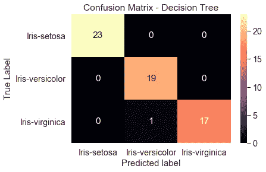

# 如何实现和评估来自 scikit-learn 的决策树分类器

> 原文：<https://towardsdatascience.com/how-to-implement-and-evaluate-decision-tree-classifiers-from-scikit-learn-36ef7f037a78>

## UCL 数据科学学会研讨会 13:什么是决策树，决策树的实现，可视化和评估


吉利·斯图尔特在 [Unsplash](https://unsplash.com?utm_source=medium&utm_medium=referral) 上拍摄的照片

今年，作为 UCL 数据科学协会的科学负责人，该协会将在整个学年举办一系列 20 场研讨会，主题包括 Python(数据科学家工具包)简介和机器学习方法。每个人的目标是创建一系列的小博客文章，这些文章将概述主要观点，并为任何希望跟进的人提供完整研讨会的链接。所有这些都可以在我们的 [GitHub](https://github.com/UCL-DSS) 资源库中找到，并将在全年更新新的研讨会和挑战。

本系列的第十三个研讨会是 Python 数据科学研讨会系列的一部分，涵盖了 Sklearn 中的决策树分类器。在本次研讨会中，我们将介绍什么是决策树、实现模型、可视化模型以及评估模型。一如既往，这篇博客文章是整个研讨会的总结，可以在这里找到[这里](https://github.com/UCL-DSS/DecisionTree-classifiers-worksop)我们还将讨论什么是分类器，从模型中提取特征重要性，以及如何通过网格搜索来改进模型。

如果您错过了我们之前的任何研讨会，您可以在这里找到:

[](/non-linear-regression-with-decision-trees-and-random-forest-afae406df27d)  [](/an-introduction-lasso-and-ridge-regression-using-scitkit-learn-d3427700679c)  [](/introduction-to-logistic-regression-predicting-diabetes-bc3a88f1e60e)  

## 什么是决策树

决策树遵循树状结构(因此得名),其中节点代表特定属性，分支代表决策规则，叶节点代表结果。我们稍后将展示这个结构，这样你就能明白我们的意思，但你可以想象它就像你在高中数学中画的决策树之一，只是规模要复杂得多。该算法本身的工作原理是根据每个节点的不同属性分割数据，同时试图减少选择度量(通常是基尼指数)。本质上，决策树分类器的目标是根据属性分割数据，同时能够将数据准确地分类到预定义的组中(我们的目标变量)。

## 决策树实现

对于这个决策树实现，我们将使用来自`sklearn`的 iris 数据集，它相对容易理解并且易于实现。来自`scikit-learn`的决策树分类器的好处是目标变量可以是分类的也可以是数字的。为了清楚起见，我们使用单个的花名作为实现的类别，这使得可视化和理解输入变得容易。

有了正确格式的数据，我们可以创建决策树，这样我们就可以尝试预测不同流的分类。从`scikit-learn`导入必要的函数后，我们可以在限制树的范围的同时设置一个`max_depth = 3`来限制过度拟合的可能性。这意味着这棵树沿着一个树枝最多可以做三次分裂。这可以在我们的训练数据集上实现，如下所示:

```
from sklearn.tree import DecisionTreeClassifierclf = DecisionTreeClassifier(max_depth =3, random_state = 42)
clf.fit(X_train, y_train)
```

## 可视化决策树

在某些情况下，当我们的实现并不复杂时，我们可能想要理解算法是如何运行的。这是使用决策树分类器的好处之一，因为当您的数据有限或实现有限时，我们可以实际看到树是如何形成的。这可以通过两种主要方式实现:

1.  **为树形图**

```
#import relevant packages
from sklearn import tree
import matplotlib.pyplot as plt#plt the figure, setting a black background
plt.figure(figsize=(30,10), facecolor ='k')
#create the tree plot
a = tree.plot_tree(clf,
                   #use the feature names stored
                   feature_names = feature_names,
                   #use the class names stored
                   class_names = labels,
                   rounded = True,
                   filled = True,
                   fontsize=14)
#show the plot
plt.show()
```


作者图片

2) **作为基于文本的图表**

```
#import relevant functions
from sklearn.tree import export_text#export the decision rules
tree_rules = export_text(clf,
                        feature_names = list(feature_names))#print the result
print(tree_rules)#out:
|--- PetalLengthCm <= 2.45
|   |--- class: Iris-setosa
|--- PetalLengthCm >  2.45
|   |--- PetalWidthCm <= 1.75
|   |   |--- PetalLengthCm <= 5.35
|   |   |   |--- class: Iris-versicolor
|   |   |--- PetalLengthCm >  5.35
|   |   |   |--- class: Iris-virginica
|   |--- PetalWidthCm >  1.75
|   |   |--- PetalLengthCm <= 4.85
|   |   |   |--- class: Iris-virginica
|   |   |--- PetalLengthCm >  4.85
|   |   |   |--- class: Iris-virginica
```

从这里我们可以看到，第一次分割是基于花瓣长度，如果一朵花的花瓣长度小于 2.45 厘米，该算法会将其识别为 Iris-Setosa(上图中的橙色框)。那些花瓣长度比这更长的花瓣则继续进一步分裂以获得更精确的分类。我们还可以看到`max_depth`超参数的位置，因为沿着一个分支的最大分裂数是 3，这意味着我们可以很容易地将结果可视化。

## 决策树评估

虽然我们可以看到模型如何根据训练数据进行训练，但我们最感兴趣的是模型如何处理看不见的数据(我们的测试数据集)。为此，我们可以对测试数据运行训练好的模型，看看它能预测什么。这可以通过以下方式实现:

```
test_pred_decision_tree = clf.predict(test_x)
```

然后，我们可以看到模型在各种方面的表现。可视化这种性能(尤其是分类)的最佳方式之一是通过混淆矩阵。通过在一个轴上显示预测值，在另一个轴上显示实际值，我们可以直观地看到预测标签和真实标签是如何匹配的。这有助于确定我们在哪里可能得到假阳性或假阴性，从而确定算法的执行情况。

```
#import the relevant packages
from sklearn import metrics
import seaborn as sns
import matplotlib.pyplot as plt#get the confusion matrix
confusion_matrix = metrics.confusion_matrix(test_lab,  
                                            test_pred_decision_tree)#turn this into a dataframe
matrix_df = pd.DataFrame(confusion_matrix)#plot the result
ax = plt.axes()
sns.set(font_scale=1.3)
plt.figure(figsize=(10,7))
sns.heatmap(matrix_df, annot=True, fmt="g", ax=ax, cmap="magma")#set axis titles
ax.set_title('Confusion Matrix - Decision Tree')
ax.set_xlabel("Predicted label", fontsize =15)
ax.set_xticklabels(['']+labels)
ax.set_ylabel("True Label", fontsize=15)
ax.set_yticklabels(list(labels), rotation = 0)plt.show()
```



作者图片

我们在这里可以看到，在测试数据集上，只有一个值未能从 Iris-virginca 类中预测出来，而算法建议这应该是 Iris-versicolor。

这很好，但是这到底意味着什么呢？当我们的数据集中有许多不同的类时，又该怎么办呢？为此，我们可以使用`scikit-learn`库中的内置指标来提取分类报告，以告诉我们算法的执行情况。我们可以这样做:

```
print(metrics.classification_report(test_lab,
                                    test_pred_decision_tree))#out:                 precision    recall  f1-score   support

    Iris-setosa       1.00      1.00      1.00        23
Iris-versicolor       0.95      1.00      0.97        19
 Iris-virginica       1.00      0.94      0.97        18

       accuracy                           0.98        60
      macro avg       0.98      0.98      0.98        60
   weighted avg       0.98      0.98      0.98        60
```

在这里，我们可以看到每个组和整体的精度(我们预测某个类中有多少值在该类中)、召回率(每个类中有多少值被赋予了正确的标签)和 f1 得分(精度和召回率的加权平均值)的主要指标。您使用此模型的目标是什么，以及您的实现在哪里增加了价值，这将取决于您对误报还是漏报更感兴趣，您最重视哪个指标。

这里，准确度分数是真阳性和真阴性在分配的标签总数中的分数:

> 总和(对角线)/总和(所有方框)

当数据中的目标变量类平衡良好时，这是一个很好的度量。

精度分数告诉我们，我们预测的某个类中有多少值实际上在该类中。这意味着它为我们提供了关于假阳性的信息(不是阳性但被标记为阳性的样本)。这被分配为:

> 真阳性(对角线上的数字)/所有阳性(列和)

每堂课。当您担心错误预测该类中的某个值时，这很有用。

Recall 告诉我们每个类中有多少值被分配了正确的标签。这给了我们关于假阴性的信息。对于任何类别，这等于:

> 真正数(对角线上的数字)/所有赋值(行和)

并且在假阴性成本高的情况下是有用的度量，例如在癌症筛查中。

最后，F1 分数是精度和召回率的加权平均值，1 为最好，0 为最差。这使用调和平均值，而不是算术平均值，因此该值更接近较小的数字。这防止了在两个参数中的一个非常高而另一个很低的情况下高估模型的性能。这在您不太关心精确度或召回率，但关心每个类的性能的情况下很有用。

## 为什么要使用决策树？

使用决策树的优势在于:

*   它们很容易解释(取决于数据的大小和树的深度)
*   他们可以通过`scikit-learn`处理数字和分类数据
*   它们可以限制模型中不良预测的影响
*   您可以提取它们的结构，以便能够可视化它们是如何工作的

然而，使用决策树也有缺点或不足之处，它们是:

*   当一个阶级在我们的目标预测器中占优势时，他们会挣扎
*   当允许数据无休止地增长时，它们可能会使你的数据溢出
*   数据的微小变化可能会产生非常不同的结果

这些只是在您实现决策树时需要记住的事情，因为它们在实践中非常有用，并且可以与其他分类算法(如 k-最近邻或随机森林)一起使用，以帮助做出关于分类的决策。

因此，您可以轻松地用 Python 实现和评估决策树。在实践本身中，提供了关于分类器、评估指标、特征重要性以及如何通过调整超参数来改进模型的更多信息，这些信息都可以在[这里](https://github.com/UCL-DSS/DecisionTree-classifiers-worksop)找到。

如果您想了解我们协会的更多信息，请随时关注我们的社交网站:

脸书:[https://www.facebook.com/ucldata](https://www.facebook.com/ucldata)

insta gram:[https://www.instagram.com/ucl.datasci/](https://www.instagram.com/ucl.datasci/)

领英:[https://www.linkedin.com/company/ucldata/](https://www.linkedin.com/company/ucldata/)

如果你想了解来自 UCL 数据科学协会和其他优秀作者的最新消息，请随时使用我下面的推荐代码注册 medium。

[](https://philip-wilkinson.medium.com/membership)  

我的其他媒体文章可在以下网址找到:

[](/git-and-github-basics-for-data-scientists-b9fd96f8a02a)  [](/easy-grouped-bar-charts-in-python-b6161cdd563d)  [](/an-introduction-to-object-oriented-programming-for-data-scientists-879106d90d89) 