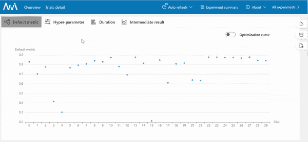
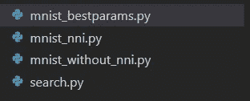
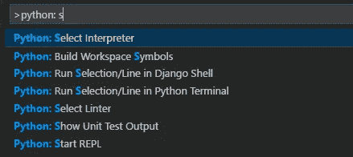
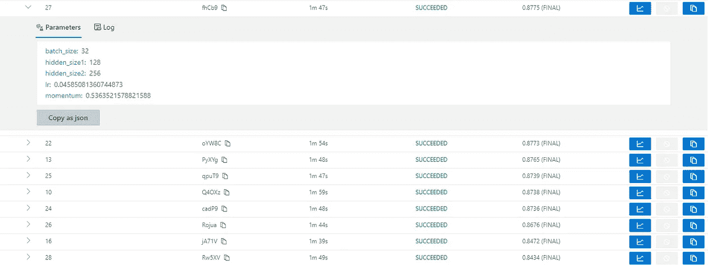
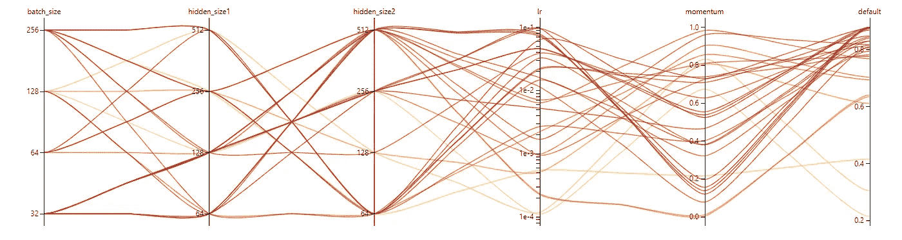

# 如何轻松将任何 ML/DL 性能提高 10%

> 原文：<https://towardsdatascience.com/how-to-improve-any-ml-dl-performance-by-10-easily-90dbbd01a4b3>

## 使用神经网络智能的超参数调整教程。

在本文结束时，你将能够使用微软的 NNI 库进行超参数调整，在我看来，这是深度学习的最佳超参数优化库之一，它有一个 web 界面来可视化你的实验。



NNI 网络界面(作者)

# **简介**

构建深度学习模型需要构建架构，架构由不同的超参数组成，如学习速率、批量、层数、层中单元数等。因此，选择正确的超参数对于获得高精度的分数是非常重要的。幸运的是，有一些策略可以找到使模型性能最大化的超参数的最佳组合。

# **超参数优化技术**

有几种技术可以用来寻找最佳的超参数组合。我将在下面列出其中的一些。

*   **手动搜索** —我们手动改变超参数的值，并试图找到最佳组合。

*建议*:适用于模型太大，需要太多时间训练的情况。然而，这一过程既繁琐又耗时。通常不能保证找到最佳组合。

*   **网格搜索—** 联系搜索空间中超参数的所有组合。

*建议*:在搜索空间较小或者模型不太大的情况下可以应用。它最终会找到超参数的最佳组合。但是，太费时间了。例如，如果我们有一个由 3 个超参数组成的搜索空间，每个超参数有 5 个搜索值，我们将得到 5 =125 个组合。

*   **随机搜索** —尝试从搜索空间中随机选择超参数。

建议:这可能会有意想不到的效果。当模型不需要太多训练，并且您有很好的计算资源时，它可以被应用。但是，在搜索空间较大的情况下，这也很耗时。

*   **树形结构 Parzen 估计器(TPE)** -是一种黑盒优化技术，它根据历史测量值顺序构建模型以逼近超参数的性能。

*建议*:如果你的计算资源有限或者模型太大，这是最好的选择之一。它显示了令人敬畏的结果，总的来说，比随机搜索要好。

我将在我们的培训中使用 **TPE** 进行超参数优化。

# 分类问题

我这篇文章的目标不是构建一个复杂的架构，因此，为了简单起见，我将在流行的 FashionMNIST 数据集上做一个简单的分类问题，该数据集有 10 个类，我将更多地关注超参数调优。因此，我将使用 Pytorch 官方教程中的代码，稍微修改一下，然后应用 NNI。

# **设置**

*   打开命令行/终端

确保安装了 python。否则，[安装](https://www.python.org/downloads/)即可。

```
python -V              #Windows
python3 --version      #Unix/MacoS
```

*   [创建虚拟环境](https://packaging.python.org/en/latest/guides/installing-using-pip-and-virtual-environments/)

```
python -m venv hyper_env    #Windows
python3 -m venv hyper_env   #Unix/MacoS
```

*   激活虚拟环境

```
hyper_env\scripts\activate         #Windows
source hyper_env/bin/activate      #Unix/MacOS
```

*   [安装 Pytorch](https://pytorch.org/) 和 torchvision

```
pip3 install torch torchvision torchaudio   #Windows/Macpip3 install torch torchvision torchaudio — extra-index-url [https://download.pytorch.org/whl/cpu](https://download.pytorch.org/whl/cpu)        #Linux
```

*   安装 NNI

```
pip install nni
```

一切准备就绪后，让我们打开 Visual Studio 代码并创建四个文件。



作者照片

然后选择 hyper_env 环境的 python 解释器(Ctrl+Shift+P)



来源:[https://code.visualstudio.com/docs/python/environments](https://code.visualstudio.com/docs/python/environments)

注意:如果你看不到 python 解释器，按 E *进入解释器路径..*手动添加并浏览(C:\ Users \ gkere \ hyper _ env \ Scripts \ python . exe)

## 文件

mnist _ without _ nni . py-->它使用初始超参数训练基线模型

search.py 和 mnist _ nni . py-->它搜索超参数并查看 web 界面可视化。

mnist _ bestparams . py-->具有最佳搜索超参数的最终文件。

# 1.具有初始超参数的模型性能(基线)

*   mnist_without_nni.py

**10 个时期后的结果:**准确度:77.3%，平均损失:0.649939(初始模型准确度)

# 2.NNI 超参数搜索

## 第一步

*   搜索. py

在这个文件中，我们设置了实验的搜索空间和配置。

关于**类型**的说明:

*   *选择*:变量值为选项之一。
*   *对数均匀*:变量值根据[对数均匀分布](https://en.wikipedia.org/wiki/Reciprocal_distribution)从一个范围【低，高】中抽取
*   *均匀*:变量值从范围【低，高】均匀采样

关于**配置**的说明:

*   *trial_command* :在 Mac 上使用 python3，在 Windows 上使用 python
*   *max_trial_number* :要运行的实验数量。一般来说，TPE 需要至少 20 次热身。
*   *trial_gpu_number* :大于零时需要 CUDA。

## 第二步

创建 mnist _ nni . py-文件与 mnist_without_nni.py 相同，但有 4 行修改:

添加:

```
nni.report_intermediate_result(test_acc)nni.report_final_result(test_acc)params = nni.get_next_parameter()
```

移除:

```
params = {‘batch_size’: 32,’hidden_size1': 128,’hidden_size2': 128, ‘lr’: 0.001,’momentum’: 0.5}
```

创建这些文件后，只需运行 search.py 文件并打开 localhost[http://localhost:8080/](http://localhost:8080/)

一旦所有试验完成，你会得到一个实验结果列表。



实验结果(作者照片)

在该图中，显示了代表具有不同超参数优化的单独训练的试验的排序列表。

## 结果:找到最佳搜索超参数

```
params = {"batch_size": 32, "hidden_size1": 128, "hidden_size2": 256, "lr": 0.04585081360744873, "momentum": 0.5363521578821588}
```



超参数(作者)

## 调试:

*   如果试用失败，请检查查看试用错误(试用详细信息->选择失败的试用->日志->Vie 试用错误)以查看详细的错误。
*   如果试验成功，但默认度量没有显示数据，请检查测试集的准确性分数的数据类型，并确保它返回 float 数据类型。

# 3.最佳超参数模型性能

运行 mnist _ bestparams . py-->它与 mnist_without_nni.py 相同，但我只是用最佳搜索的参数交换了初始参数。

> 哇哦。！！！！！！！，结果令人着迷。
> 
> **10 个周期后的结果:**准确率: **87.5%** ，平均损失:0.350102
> 
> 与初始模型相比提高了 10%，从 77.3%提高到 87.5%。

# **结论**

建立深度学习/机器学习模型具有挑战性。主要任务之一是构建一个好的架构，但是超参数也是需要考虑的重要方面。结果表明，超参数优化比初始模型提高了 10%。此外，如上所述，不同的优化技术各有优缺点。在本文中，我使用了 TPE，这是对于资源数量有限的大型模型的最佳方法之一。我喜欢 NNI 图书馆，不仅因为它有内置的算法，可以做超参数调整，而且因为它有一个很好的网络界面来可视化你的实验结果。

如果你想了解更多关于应用数据科学的知识，这里是我的新 YouTube 频道— [AI Academy with Friends](https://www.youtube.com/channel/UCvlF0PPaQ2GAuqYKJT4UpJQ)

[](https://www.youtube.com/channel/UCvlF0PPaQ2GAuqYKJT4UpJQ)  

> 感谢您的阅读。我希望这篇文章对你有帮助。
> 
> 如果你想看我即将发布的关于**黑盒模型解释**和更多内容的帖子，*你可以关注我的* [*中的*](https://medium.com/@gkeretchashvili) *来保持更新。*

[](https://medium.com/@gkeretchashvili)  

> 我以前的文章:

[](/fish-weight-prediction-regression-analysis-for-beginners-part-1-8e43b0cb07e)  [](/regression-analysis-for-beginners-using-tree-based-methods-2b65bd193a7) 