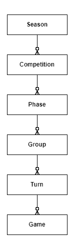
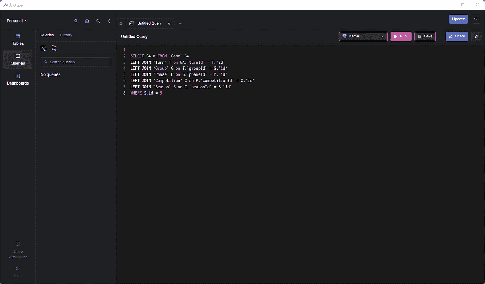
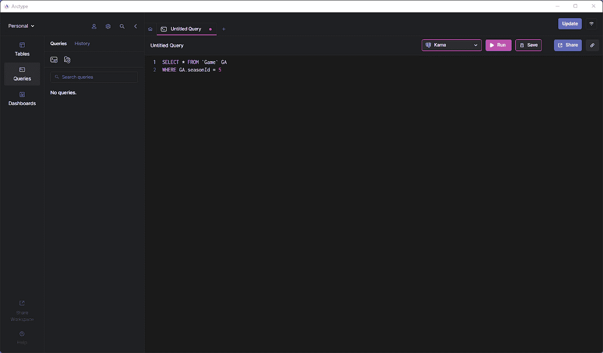

# 如何通过列传播提高分层 SQL 表结构的性能

> 原文：<https://towardsdatascience.com/how-to-improve-performance-in-a-hierarchical-sql-table-structure-with-column-propagation-3b8cacdc87a9>

## 列传播作为分层表结构上缓慢查询的解决方案


谢尔盖·佐尔金在 [Unsplash](https://unsplash.com?utm_source=medium&utm_medium=referral) 上拍摄的照片

本文将展示在处理分层数据结构时，列传播如何成为提高查询性能的一种简单方法。

我们将通过一个基于数据驱动项目的真实场景来实现这一点，该项目涉及一个为体育行业的初创公司开发的实时数据网站。您将了解到作为分层 SQL 表结构中固有的性能问题的解决方案的列传播的所有知识。我们开始吧。

# 语境

我和我的团队最近为足球迷开发了一个有数百万页面的网站。该网站的理念是成为足球支持者的权威资源，尤其是在博彩方面。数据库和应用程序架构并不特别复杂。这是因为调度程序负责定期重新计算复杂数据并将其存储在表中，这样查询就不必涉及 [SQL 聚合](https://arctype.com/blog/sql-aggregate-functions/)。所以，真正的挑战在于非功能性需求，比如性能和页面加载时间。

# 应用领域

体育行业中有几家数据提供商，每一家都为其客户提供不同的数据集。具体来说，足球行业有四种类型的数据:

1.  履历数据:身高、身高、年龄、效力过的球队、获得的奖杯、获得的个人奖项以及足球运动员和教练。
2.  **历史数据**:过去比赛的结果以及那些比赛中发生的事件，比如进球、助攻、黄牌、红牌、传球等。
3.  **当前和未来数据**:当前赛季的比赛结果和这些比赛中发生的事件，以及未来比赛的表格。
4.  **直播数据**:正在进行的比赛的实时结果和直播事件。

我们的网站涉及所有这些类型的数据，特别关注 SEO 原因的历史数据和支持投注的实时数据。

# 分层表结构

我不能与你分享整个数据结构，因为我签署了一个 NDA。与此同时，理解足球赛季的结构就足以理解这个现实世界的场景。

详细地说，足球提供商通常如下组织一个赛季中的比赛数据:

*   季节:有起止日期，一般持续一个日历年
*   **比赛**:甲 a 比赛所属。一个竞争的例子存在于一个赛季中。在这里了解更多关于足球比赛如何运作的[。](https://en.wikipedia.org/wiki/List_of_association_football_competitions)
*   **阶段**:与比赛相关的阶段(如资格赛阶段、淘汰赛阶段、决赛阶段)。每个比赛都有自己的规则，许多比赛只有一个阶段。
*   **组**:与阶段相关联的组(例如，A 组、B 组、C 组、…)。有些比赛，如世界杯，涉及不同的小组，每个小组都有自己的团队。大多数比赛只有一个普通组。
*   **转**:从逻辑角度对应一天的比赛。它通常持续一周，并涵盖一个小组中所有球队的比赛(例如，MLS 有 17 场主场比赛和 17 场客场比赛；因此，它有 34 匝)。
*   两个足球队之间的比赛。

如下面的 [ER 模式](https://arctype.com/blog/erd-builder/)所示，这 5 个表代表一个分层数据结构:



用于表示足球数据的分层数据结构的 ER 模式

# 技术、规格和性能要求

我们在 Node.js 中开发了后端，用 [Express 4.17.2](https://expressjs.com/en/changelog/4x.html#4.17.2) 和 [Sequelize 6.10](https://sequelize.org/docs/v6/) 作为 ORM ( [对象关系映射](https://en.wikipedia.org/wiki/Object%E2%80%93relational_mapping))。前端是一个用 TypeScript 开发的 [Next.js 12](https://nextjs.org/blog/next-12) 应用。至于数据库，我们决定选择 AWS 托管的 Postgres 服务器。

该网站运行在 AWS Elastic Beanstalk 上，前端有 12 个实例，后端有 8 个实例，目前每天有 1 到 5 千人观看。我们客户的目标是在一年内达到 6 万的日浏览量。因此，网站必须准备好在不降低性能的情况下托管数百万的月用户。

该网站应该在性能，搜索引擎优化和可访问性在[谷歌灯塔](https://developers.google.com/web/tools/lighthouse)测试得分 80+。此外，加载时间应该总是少于 2 秒，最好在几百毫秒的量级。真正的挑战在于此，因为该网站包含超过 200 万个页面，预渲染这些页面需要数周时间。此外，大多数页面上显示的内容不是静态的。因此，我们选择了[增量静态再生](https://nextjs.org/docs/basic-features/data-fetching/incremental-static-regeneration)方法。当一个访问者点击了一个从来没有人访问过的页面时，Next.js 使用从后端公开的 API 中检索到的数据来生成这个页面。然后，Next.js 根据页面的重要性缓存页面 30 秒或 60 秒。

因此，后端必须以极快的速度为服务器端生成过程提供所需的数据。

# 为什么查询层次表很慢

现在让我们来看看为什么分层表结构会对性能构成挑战。

## 1.连接查询很慢

分层数据结构中的一个常见场景是，您希望根据与层次结构中更高层的对象相关联的参数来过滤树叶。例如，您可能希望检索某个特定赛季的所有比赛。在这种情况下，由于叶表`Game`没有直接连接到`Season`，所以您必须执行一个查询，该查询涉及的连接数量与层次结构中的元素数量一样多。

因此，您可能最终会编写以下查询:

```
SELECT GA.* FROM `Game` GA LEFT JOIN `Turn` T on GA.`turnId` = T.`id` LEFT JOIN `Group` G on T.`groupId` = G.`id` LEFT JOIN `Phase` P on G.`phaseId` = P.`id` LEFT JOIN `Competition` C on P.`competitionId` = C.`id` LEFT JOIN `Season` S on C.`seasonId` = S.`id` WHERE S.id = 5
```



这个查询(显示在 [Arctype](https://arctype.com/blog/sql-hierarchy/arctype.com) 中)的性能会很慢

这样的查询很慢。每个连接执行一个[笛卡尔积](https://en.wikipedia.org/wiki/Cartesian_product)操作，这需要时间并可能产生数千条记录。因此，层次数据结构越长，性能就越差。

此外，如果您想检索所有数据，而不仅仅是`Game`表中的列，由于笛卡尔积的性质，您将不得不处理数千行数百列的数据。这可能会变得混乱，但这正是 ORM 发挥作用的地方。

## 2.ORM 数据解耦和转换需要时间

当通过 ORM 查询数据库时，您通常对检索应用程序级表示的数据感兴趣。原始数据库级表示在应用程序级可能没有用。因此，当大多数高级 orm 执行查询时，它们从数据库中检索所需的数据，并将其转换成应用程序级别的表示。这个过程包括两个步骤:数据解耦和数据转换。

在后台，来自连接查询的原始数据首先被解耦，然后在应用程序级别被转换成各自的表示。因此，当处理所有数据时，具有数百列的数千条记录成为一个小型数据集，每条记录都具有在[数据模型类](https://sequelize.org/docs/v6/core-concepts/model-basics/)中定义的属性。因此，包含从数据库中提取的原始数据的数组将成为一组`Game`对象。每个`Game`对象将有一个包含其各自的`Turn`实例的转弯字段。然后，`Turn`对象将有一个组字段存储其各自的`Group`对象，依此类推。

生成这种转换后的数据是您愿意接受的开销。处理杂乱的原始数据具有挑战性，并且会导致代码味道。另一方面，这个在幕后发生的过程需要时间，你不能忽视它。当原始记录有数千行时尤其如此，因为处理存储数千个元素的数组总是很棘手。

换句话说，层次表结构上的普通连接查询在数据库层和应用层都很慢。

# 作为解决方案的列传播

解决方案是在分层结构中将列从父列传播到子列，以避免这种性能问题。我们来了解一下原因。

## 为什么应该在分层数据库中传播列

当分析上面的连接查询时，很明显问题在于对叶表`Game`应用过滤器。你必须经历整个层级。但是既然 Game 是层次结构中最重要的元素，为什么不直接添加`seasonId`、`competitionId`、`phaseId`和`groupId`列呢？这就是列传播的意义所在！

通过将外键列直接传播给子列，可以避免所有的连接。现在，您可以用下面的查询替换上面的查询:

```
SELECT * FROM `Game` GA WHERE GA.seasonId = 5
```



更快的查询，如 [Arctype](https://arctype.com/blog/sql-hierarchy/arctype.com) 所示

可以想象，这个查询比原来的查询快得多。此外，它直接返回您感兴趣的内容。因此，您现在可以忽略 ORM 数据解耦和转换过程了。

注意，列传播涉及到数据复制，应该谨慎使用。但是在深入研究如何优雅地实现它之前，让我们看看应该传播哪些列。

## 如何选择要传播的列

您应该向下传播层次结构中较高的实体的每一列，这可能对筛选有用。例如，这涉及到外部键。此外，您可能希望传播用于过滤数据的[枚举列](https://www.postgresql.org/docs/current/datatype-enum.html),或者使用来自父代的聚合数据生成列，以避免连接。

# 列传播的三大方法

当我的团队选择列传播方法时，我们考虑了三种不同的实现方法。下面我们来一一分析。

## 1.创建实体化视图

我们在层次表结构中实现列传播的第一个想法是创建一个包含所需列的[物化视图](https://www.postgresql.org/docs/current/sql-creatematerializedview.html)。物化视图存储查询的结果，并且它通常表示复杂查询(例如上面给出的连接查询)的行和/或列的子集。

对于物化查询，您可以定义何时生成视图。然后，数据库会将它存储在磁盘上，并使它像普通表一样可用。尽管生成查询可能很慢，但您可以尽量少启动它。因此，物化视图代表了一种快速的解决方案。

另一方面，在处理动态数据时，物化视图并不是最好的方法。这是因为实例化视图可能不是最新的。它存储的数据取决于您决定何时生成视图或刷新视图。此外，包含大量数据的物化视图会占用大量的磁盘空间，这可能会带来问题，并增加存储成本。

## 2.定义虚拟视图

另一个可能的解决方案是使用[虚拟视图](https://www.postgresql.org/docs/9.2/sql-createview.html)。同样，虚拟视图是存储查询结果的表。实体化视图的不同之处在于，这次您的数据库不将查询结果存储在磁盘上，而是将其保存在内存中。因此，虚拟视图总是最新的，用实时数据解决问题。

另一方面，数据库必须在每次访问视图时执行生成查询。因此，如果生成查询需要时间，那么涉及视图的整个过程必然会很慢。虚拟视图是一个强大的工具，但是考虑到我们的性能目标，我们不得不寻找另一个解决方案。

## 3.使用触发器

[SQL 触发器](https://arctype.com/blog/learn-sql-triggers/)允许您在数据库中发生特定事件时自动启动查询。换句话说，触发器使您能够跨数据库同步数据。因此，通过在层次结构表中定义所需的列并让自定义触发器更新它们，您可以轻松地实现列传播。

可以想象，触发器会增加性能开销。这是因为每次它们等待的事件发生时，您的数据库都会执行它们。但是执行查询需要时间和内存。所以，触发是有代价的。另一方面，这种成本通常可以忽略不计，尤其是与虚拟或物化视图的缺点相比。

触发器的问题是定义它们可能需要一些时间。同时，您可以只处理这个任务一次，并在需要时更新它们。因此，触发器允许您轻松优雅地实现列传播。此外，由于我们采用了列传播并使用触发器来实现它，我们已经设法满足了客户定义的性能需求。

# 最后的想法

层次结构在数据库中很常见，如果处理不当，可能会导致应用程序出现性能问题和效率低下。这是因为它们需要长连接查询和 ORM 数据处理，这既慢又耗时。幸运的是，您可以通过在层次中将列从父列传播到子列来避免这一切。我希望这个真实的案例研究能够帮助您构建更好更快的应用程序！

*原载于 2022 年 6 月 1 日*<https://arctype.com>**。**