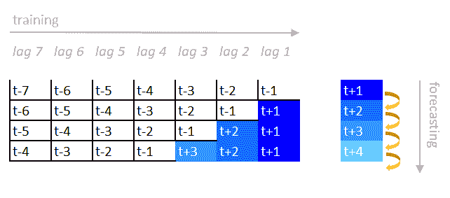
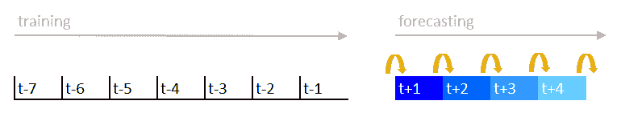
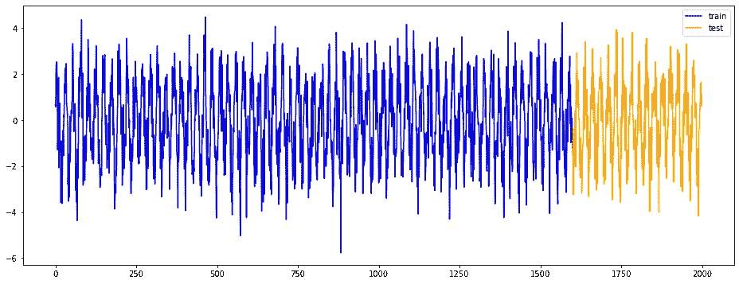
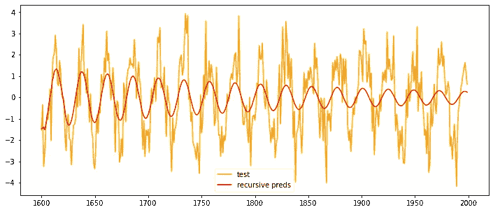
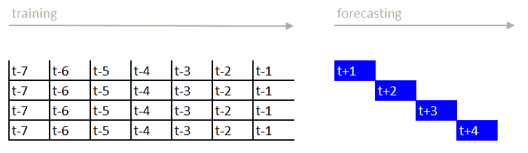
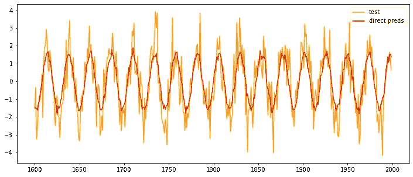
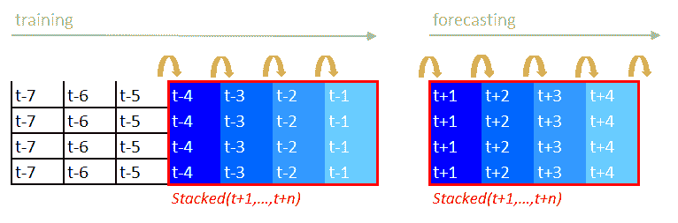
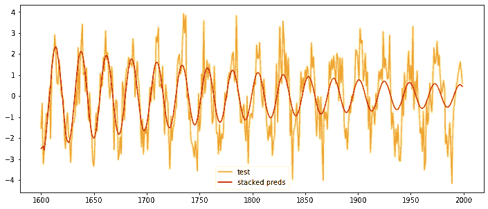
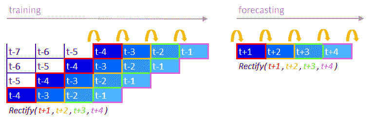
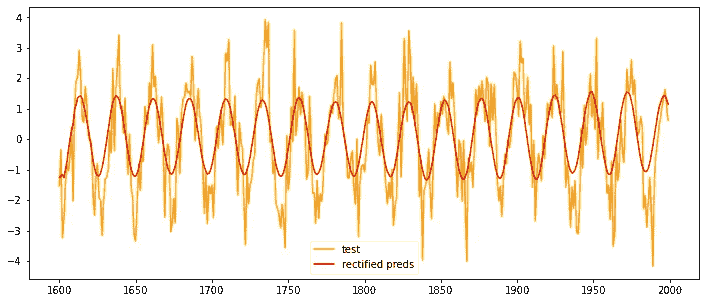

# 如何改进递归时间序列预测

> 原文：<https://towardsdatascience.com/how-to-improve-recursive-time-series-forecasting-ff5b90a98eeb>

## 无需深度学习的递归方法的简单而有效的演变

由[半切口袋妖怪](https://unsplash.com/@halfcutpokemon?utm_source=medium&utm_medium=referral)在 [Unsplash](https://unsplash.com?utm_source=medium&utm_medium=referral) 上拍摄的照片

当处理时间序列预测问题时，标准的基准方法是递归方法。它可以很容易地在任何机器学习模型上使用，它需要很低的假设，并且很容易解释。

**递归预测包括创建目标序列的滞后特征，并在其上拟合机器学习模型**。当预测未来的进一步步骤时，先前步骤的预测用于创建新的滞后特征。由于在预测时目标的未来值是未知的，因此使用之前预测的值似乎是实际值的良好近似值。

实践中的递归时间序列预测。图片由作者摘自 [GitHub](https://github.com/cerlymarco/tspiral#overview) 。

在实践中，**我们要求一个模型预测未来的多个时间点，这个模型只被训练预测未来的一个时间点。这可能导致次优和不受控制的预测**。这就像我们在准备一场马拉松，训练自己每次训练只跑 5 公里。通过这种方式，我们可以跑完马拉松的第一段，但也有可能在比赛结束时遇到一些困难。我们假设跑前 5 公里就像跑最后 5 公里。

实践中的递归时间序列预测(紧凑方式)。图片由作者摘自 [GitHub](https://github.com/cerlymarco/tspiral#overview) 。

**预测时间序列的多个步骤比只预测第一步**更复杂。我们应该采取适当的谨慎措施使其发挥作用，而不是希望重复上一步的预测。出于这些原因，我开发了 [**tspiral**](https://github.com/cerlymarco/tspiral) ，*一个 python 包，用 scikit-learn 估值器进行时间序列预测*。它提供了递归预测的一个非常有效的实现，也提供了一些很好的替代方案，这些将在本文的下一部分介绍。

# 递归基线

假设我们正在进行一项简单的预测任务。我们必须提前几个时间步预测一个类似正弦的信号。

模拟数据。训练测试再分配(图片由作者提供)。

乍一看，这似乎是一项容易的任务。该系列遵循一个循环模式，存在一个规则的噪音水平。让我们看看递归预测是如何工作的。

用 [**tspiral**](https://github.com/cerlymarco/tspiral) 提供递归预测非常简单。我们必须像处理受监督的表格任务一样管理数据。在我们的例子中，不需要外生特性(相反，我们可以随时通过它们)。我们可以简单地使用目标来构建模型，因为滞后特征是根据它自动构建的。

递归预测(图片由作者提供)。

根据测试数据生成的预测证实了我们的担忧。递归预测在开始的几个步骤看起来不错，但是到最后往往会消失。在第一方面，这种缓慢衰退背后的主要原因是预测误差的**增加幅度，这产生了糟糕的滞后特征。另一方面，**学习到的模型参数不适合长期预测**。**

# 超越递归方法

作为递归方法的替代方法，我们有许多其他技术可供选择。

从最著名的一个开始，要考虑**直接进场**。它包括为我们想要预测的每个时间步安装一个单独的估计器。

实践中的直接时间序列预测。图片由作者摘自 [GitHub](https://github.com/cerlymarco/tspiral#overview) 。

与递归预测相比，它建立了独立的估计器，专门用于预测具有不同延迟水平的目标。在我们的模拟环境中，它取得了很好的效果。预测不会随着时间的推移而消失，而且似乎会保持稳定，直到预测期结束。

直接预测(图片由作者提供)。

我们的另一个选择是**堆叠方法**。堆叠是机器学习中众所周知的技术。它包括根据其他估计器之前(在不同的数据分区上)生成的预测来拟合估计器。时间序列生态系统中堆叠方法的应用极其简单和自然。我们只需小心地生成预测，并在最新部分的训练数据上堆叠预测，以保持时间相关性。

实践中的堆叠时间序列预测。图片由作者摘自 [GitHub](https://github.com/cerlymarco/tspiral#overview) 。

在测试数据的第一部分，我们注意到叠加的预测值和观察值之间有很大的匹配。随着时间的推移，预测失去了它的力量，趋于平缓，就像在递归场景中一样。消失场景是通过递归建模在幕后生成的，因为堆叠是基于递归预测操作的。叠加的作用是试图通过调整整个预测范围内的预测来减轻递归方法的衰退。

堆叠预测(图片由作者提供)。

我们要分析的最后一种方法是**修正方法**。它可以被看作是直接方法和递归方法的混合，也可以被看作是堆叠方法的一种发展。代替训练多个预测器的可能性，我们用单个模型在不同的滑动窗口训练束上生成递归预测。以这种方式生成的预测随后在时间步长级别上进行调整，以适应多个估计值。希望生成一个修正的(即修正的)最终预测。

实践中的修正时间序列预测。图片由作者取自 [GitHub](https://github.com/cerlymarco/tspiral#overview) 。

校正后的预测非常好地遵循正弦模式，显示出与我们模拟场景中的直接方法一样好。

修正后的预测(图片由作者提供)。

# 摘要

在这篇文章中，我们研究了一些有价值的预测技术，作为经典递归时间序列预测的替代方法。他们似乎都很有前途。它们的**有效性肯定与研究案例相关，并且必须被验证**并与递归基准进行比较。所有这些都可以使用 [**tspiral**](https://github.com/cerlymarco/tspiral) 库作为标准的 scikit-learn 估算器来访问。这使我们能够像处理表格监督任务一样处理任何时间序列问题，而不需要学习新的语法，同时利用基于 scikit-learn 构建的所有工具的优势。

[**查看我的 GITHUB 回购**](https://github.com/cerlymarco/MEDIUM_NoteBook)

保持联系: [Linkedin](https://www.linkedin.com/in/marco-cerliani-b0bba714b/)