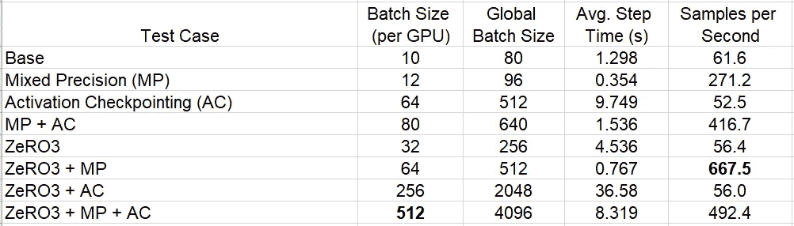
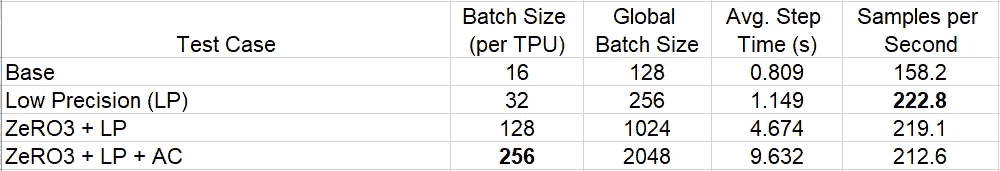
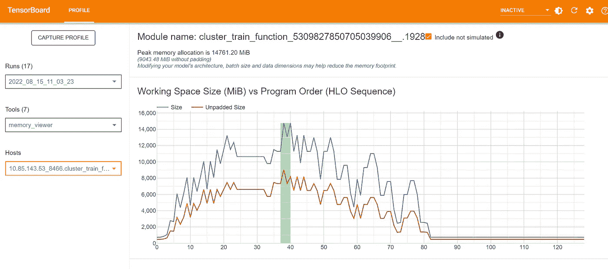
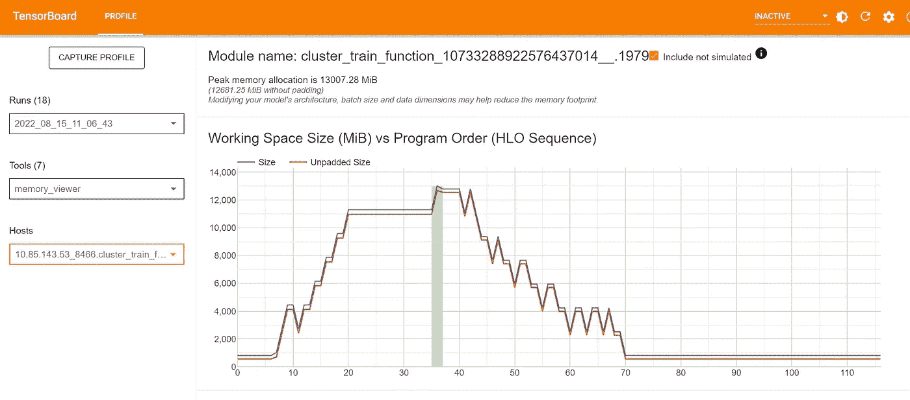
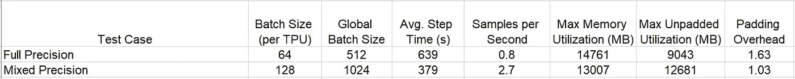

# 如何通过内存优化提高训练绩效

> 原文：<https://towardsdatascience.com/how-to-increase-training-performance-through-memory-optimization-1000d30351c8>

## 充分利用 GPU 内存的技巧


[alevision.co](https://unsplash.com/@alevisionco?utm_source=medium&utm_medium=referral)在 [Unsplash](https://unsplash.com?utm_source=medium&utm_medium=referral) 上拍照

优化深度神经网络(DNN)训练工作负载的运行时性能的关键之一是最大限度地利用训练实例的资源。GPU 或其他训练加速器的资源尤其如此，它们通常是训练设备中最昂贵的组件。在这篇文章中，我们将重点关注 GPU(或替代训练加速器)的**内存利用率**。关于培训绩效优化的更多建议，请务必查看我们的其他博客帖子(例如[此处](/tensorflow-performance-analysis-314b56dceb59)和[此处](/overcoming-data-preprocessing-bottlenecks-with-tensorflow-data-service-nvidia-dali-and-other-d6321917f851))。为了简单起见，每当我们提到 GPU 内存的时候，我们更泛指*任何*训练加速器的内存，包括 GPU、[谷歌云 TPU](https://cloud.google.com/tpu) 、[哈瓦那高迪](https://habana.ai/training/gaudi/)等。

GPU 内存优化最基本的例子是增加批量大小，以尽可能将内存利用率提高到接近 100%。一般来说(但不总是)，你的整体训练吞吐量会增加。这是因为存在与每个训练步骤相关联的*固定成本*操作，例如 GPU 内核加载和梯度共享。这些是*固定成本*，因为它们不依赖于批量大小。因此，这些操作的每个样品的*成本*会随着批量的增加而降低。

请注意，还有其他因素，如内存对齐，可能会发挥作用，因此不能保证总吞吐量会增加。但绝对值得一试。还要记住，即使在调整训练批大小时吞吐量确实增加了，也不能保证收敛速度(作为历元数的函数)保持不变。通常，这可以通过适当调整一些优化器设置来控制(参见此处的[在数据分布式培训的背景下对该主题的讨论】,但并非总是如此。作为一个极端的例子，考虑这样一种情况:批处理的大小等于整个数据集的大小。增加批量大小不会给每个训练步骤增加任何额外的信息，因此，整个训练步骤的数量不会减少。](/a-guide-to-highly-distributed-dnn-training-9e4814fb8bd3)

这篇文章的重点是 GPU 内存已经被充分利用的情况，我们正在寻求在不改变模型的架构或收敛能力的情况下减少内存消耗**，以便释放内存用于其他用途。有许多众所周知的降低内存消耗的技术。在本帖中，我们将回顾其中的一小部分，包括混合精度训练、激活检查点和基于零的分布式训练(使用 FSDP)。我们有意省略了一些技术，因为它们的性能损失相对较高(例如 CPU 卸载)，或者缺乏通用性(例如 float8 量化——在撰写本文时)。**

这篇文章将包括几个使用 py torch(1.12 版)和 tensor flow(2.8 版)的代码片段。这些实现示例不应以任何方式被视为任何官方 API 文档和/或教程的替代。特别是，我们将使用的一些 API 仍被认为是实验性的，可能会进行修订和优化。请务必了解最新最棒的内存优化 API 产品。

# 动机——为什么您应该关注内存优化

在这一节中，我们提供了一些优化内存利用率的情况，这意味着可以显著提高训练的运行时性能。

## 训练大型模型

需要优化内存利用率的一个最常见的情况是，训练模型过于庞大，以至于它们根本不适合单个 GPU。深度学习的一些最新进展依赖于极大模型的使用，这些模型的大小有数十亿个参数。训练这样的模型不是一件简单的事情，通常需要先进的模型分发策略、大量的 GPU 和足够的创造力。在过去的几年中，已经创建了许多库来解决这个独特的挑战(包括 [deepspeed](https://www.deepspeed.ai/) 、 [fairscale](https://fairscale.readthedocs.io/en/latest/) 、 [GSPMD](https://arxiv.org/abs/2105.04663) 等等)。在这些解决方案中，内存优化是一个关键因素。

值得注意的是，虽然内存优化的主题经常在大型模型训练的上下文中出现，但在其他场景中，内存优化可能非常有益。在我们看来，熟悉这篇文章中讨论的技术是很重要的**，即使你不是在训练一个大型模型**。

## 增加批量

您可以增加训练批次大小的程度受到 GPU 中可用内存量的限制。你越能优化你的内存使用，你就越能释放内存来增加你的批处理大小。虽然对于大多数模型来说，大批量是一种奢侈，因为它可以增加您的整体训练量，但对于一些模型来说，大批量是至关重要的。例如，使用[对比损失](https://arxiv.org/pdf/2002.05709.pdf)的模型，一种结合了大量正面和负面例子的损失，已被证明从特别大的批量中受益匪浅。

## 提高 GPU 性能

内存优化可以提高训练吞吐量的另一种方式是通过提高 GPU 性能。一般来说，当 GPU 在更少的内存上运行时，它需要更少的计算能力。这是优化内存使用影响 GPU 性能的最明显的方式。然而，内存优化还有其他方法可以提高 GPU 利用率。

**示例-内存对齐:**你的模型映射到加速器内存的方式高度依赖于组成它的张量的具体大小，这并不奇怪。批量大小、线性图层中的要素数量或卷积图层中的过滤器数量的微小变化都会对张量的映射方式产生重大影响。在大多数情况下，当 ML 工程师构建他们的深度学习模型时，他们(理所当然地)主要关心这些变化如何影响模型收敛。它们不考虑这种内存对齐问题，而是严重依赖 SW 堆栈以最佳方式将张量映射到内存。然而，有时结果映射会导致加速器计算能力的次优使用。例如，未能遵循[谷歌云 TPU](https://cloud.google.com/tpu) 编程的[性能指南](https://cloud.google.com/tpu/docs/performance-guide#tensor_dimensions)可能会导致大量内存填充，这相当于 TPU 计算能力的巨大浪费。调整模型参数可以改善内存对齐，减少填充量，并提高吞吐量。我们在下面展示了一个详细的例子。

希望我们已经让你相信了优化你的 GPU 内存的价值。在下一节中，我们将回顾实现这一点的几种方法。

# 内存优化方法

有很多技术都属于 GPU 内存优化的范畴。在这一节中，我们将重点介绍一些能够提供有意义的好处，同时又相对容易编程的工具。我们将使用流行的 [timm](https://pypi.org/project/timm/) 库，基于 PyTorch 1.12 中大约 13 亿个参数的分类模型，演示我们在玩具[视觉转换器](https://en.wikipedia.org/wiki/Vision_transformer) (ViT)上讨论的方法的实现。

在下面的代码块中，我们使用标准 PyTorch 数据分布 API，[分布式数据并行](https://pytorch.org/tutorials/intermediate/ddp_tutorial.html) (DDP)在一个伪数据集上训练我们的模型。有关 DDP 的详细信息，请参考官方[文件](https://pytorch.org/docs/stable/notes/ddp.html)。

```
import time, os
import torch
import torch.distributed as dist
import torch.multiprocessing as mp
from torch.utils.data import Dataset
from timm.models.vision_transformer import VisionTransformer# A fake dataset
class FakeDataset(Dataset):
  def __len__(self):
    return 1000000 def __getitem__(self, index):
    rand_image = torch.randn([3, 224, 224], dtype=torch.float32)
    label = torch.tensor(data=[index % 1000], dtype=torch.int64)
    return rand_image, label# build a ViT model using timm
def build_model():
  model_args ={
            "img_size": 224,
            "patch_size": 14,
            "embed_dim": 2560,
            "mlp_ratio": 4.0,
            "num_heads": 16,
            "depth": 16
        }
  return VisionTransformer(**model_args)# DDP setup
def setup(rank, world_size):
  os.environ['MASTER_ADDR'] = os.environ.get('MASTER_ADDR',
                                             'localhost')
  os.environ['MASTER_PORT'] = os.environ.get('MASTER_PORT',
                                             str(2222))
  dist.init_process_group('nccl', rank=rank,
                          world_size=world_size)# wrap the model with DDP
def wrap_model(model,local_rank):
  from torch.nn.parallel import DistributedDataParallel as DDP
  model.to(torch.cuda.current_device())
  model = DDP(model,device_ids=[local_rank])
  return model# standard training loop
def train(local_rank, world_size):
  setup(local_rank, world_size)
  torch.cuda.set_device(local_rank) dataset = FakeDataset()
  model = build_model()
  model = wrap_model(model, local_rank)
  **batch_size = 10 # per GPU batch size**
  optimizer = torch.optim.Adam(model.parameters())
  data_loader = torch.utils.data.DataLoader(dataset,
                          batch_size=batch_size, num_workers=16)
  loss_function = torch.nn.CrossEntropyLoss()
  t0 = time.perf_counter()
  summ = 0
  count =0
  for idx, (inputs, target) in enumerate(data_loader, start=1):
    inputs = inputs.to(torch.cuda.current_device())
    targets = torch.squeeze(target.to(torch.cuda.current_device()),
                            -1)
    optimizer.zero_grad()
    outputs = model(inputs)
    loss = loss_function(outputs, targets)
    loss.backward()
    optimizer.step() if torch.distributed.get_rank() == 0:
      batch_time = time.perf_counter() - t0
      print(f'step: {idx}: step time is {batch_time}')
      if idx > 1: # skip first step
        summ += batch_time
        count += 1
      t0 = time.perf_counter() if torch.distributed.get_rank() == 0:
    print(f'average step time: {summ/count}')
  dist.destroy_process_group()if __name__ == '__main__':
  gpus_per_machine = torch.cuda.device_count()
  mp.spawn(fn=train,
           args=(gpus_per_machine,),
           nprocs=gpus_per_machine,
           join=True)
```

我们现在将回顾一些内存优化方法，并展示如何将它们应用到上面的脚本中。

## 混合精度

在 PyTorch 和 TensorFlow 等流行的训练框架中使用的默认浮点类型是 float32，它使用 32 位表示。许多平台支持 1 位精度浮点。使用这些较低精度的浮点可以将浮点张量的内存利用率减半。由于在训练期间执行的绝大多数操作都是浮点操作，因此对内存节省的影响可能是显著的。同时，出于精度或性能的考虑，有些操作最好留在 float32 中。PyTorch 和 TensorFlow 都支持使用*混合精度*模式的选项，在这种模式下，16 位和 32 位浮点数串联使用(细节取决于实现)。有两种低精度浮点格式，float16 和 [bfloat16](https://cloud.google.com/tpu/docs/bfloat16) 。Bfloat16 有许多属性使它成为机器学习的首选格式；然而，它只在相对较新的平台上受支持。

在下面的代码块中，我们演示了训练循环所需的简单更改，以便将 PyTorch 的[自动混合精度](https://pytorch.org/tutorials/recipes/recipes/amp_recipe.html) (AMP)支持与 bfloat16 一起使用。注意，使用 float16 时，需要一个额外的[梯度缩放](https://pytorch.org/docs/stable/amp.html#torch.cuda.amp.GradScaler)步骤。

```
for idx, (inputs, target) in enumerate(data_loader, start=1):
    inputs = inputs.to(torch.cuda.current_device())
    targets = torch.squeeze(target.to(torch.cuda.current_device()),
                            -1)
    optimizer.zero_grad()
    **with torch.cuda.amp.autocast(dtype=torch.bfloat16)**:
      outputs = model(inputs)
      loss = loss_function(outputs, targets)
    loss.backward()
    optimizer.step()
```

有关混合精度的更多信息，请务必查看 [PyTorch](https://pytorch.org/tutorials/recipes/recipes/amp_recipe.html) 和[tensor flow](https://www.tensorflow.org/guide/mixed_precision)API 的文档，同时密切关注每个 API 的详细信息。另外，请看这篇强烈推荐的[博文](https://pytorch.org/blog/what-every-user-should-know-about-mixed-precision-training-in-pytorch/)。

## 激活检查点

在标准训练步骤的正向传递期间，所有中间激活张量都存储在存储器中，并用于计算反向传递期间的梯度更新。使用激活检查点时，只有指定激活的张量输出存储在内存中。从存储的激活检查点重新计算所有其他激活(使用适当的转发段)。这种技术以重复部分正向传递为代价来减少内存，即增加 GPU 操作的数量。这意味着使用激活检查点可能会增加您的步骤时间，从而降低您的吞吐量。！).然而，在许多情况下，通过利用释放的内存来增加批处理大小，总体吞吐量(每秒采样数)实际上可能会增加。

在下面的代码块中，我们演示了使用 [PyTorch 检查点 API](https://pytorch.org/docs/stable/checkpoint.html) 来包装具有激活检查点支持的 timm 转换器块。然后，我们使用专用的 timm VisionTransformer 构造函数参数传入增强的 Transformer 块。

```
def build_model():
  model_args ={
            "img_size": 224,
            "patch_size": 14,
            "embed_dim": 2560,
            "mlp_ratio": 4.0,
            "num_heads": 16,
            "depth": 16
        }
  from timm.models.vision_transformer import Block
  import torch.nn as nn
  from torch.utils.checkpoint import checkpoint
  class CKPTBlock(nn.Module):
    def __init__(self, dim, num_heads, mlp_ratio=4.,
                 qkv_bias=False, drop=0., attn_drop=0.,
                 init_values=None, drop_path=0.,
                 act_layer=nn.GELU, norm_layer=nn.LayerNorm):
      super().__init__()
      self.block = Block(dim, num_heads, mlp_ratio,
                         qkv_bias, drop, attn_drop,
                         init_values, drop_path,
                         act_layer, norm_layer) def forward(self, x):
      return checkpoint(self.block,x) model_args['block_fn'] = CKPTBlock
  return VisionTransformer(**model_args)
```

如文档中所述，使用激活检查点可能会对依赖随机生成的变量的图层(例如，丢弃图层)和在正向传递过程中收集统计数据的图层(例如，批量规范化图层)产生影响。在采用激活检查点之前，应该仔细研究和解决这些问题。更多细节参见 [FairScale 关于激活检查点](https://fairscale.readthedocs.io/en/latest/deep_dive/activation_checkpointing.html)的文档。

## 零冗余优化器([零](https://arxiv.org/pdf/1910.02054.pdf))

零冗余优化器( [ZeRO](https://arxiv.org/pdf/1910.02054.pdf) )指的是[本文](https://arxiv.org/pdf/1910.02054.pdf)中描述的技术集合，用于优化内存利用率，以支持超大型模型的训练。在本帖中，我们将演示一种技术，通常称为 ZeRO3。

**ZeRO3** 是一种执行数据分布式训练的技术，它取代了标准的数据分布方案(如 PyTorch 中的 [DDP](https://pytorch.org/docs/stable/notes/ddp.html) 和 TensorFlow 中的 [MirroredStrategy](https://www.tensorflow.org/api_docs/python/tf/distribute/MirroredStrategy) )。在标准的数据分发方案中，每个 GPU 都保留自己的模型副本。通过在所有 GPU 之间共享梯度来确保模型之间的一致性。这需要高度的冗余。ZeRO3 建议通过在所有 GPU 上分割模型来消除这种冗余。因此，每个单独的参数将驻留在单个 GPU 上，并由单个 GPU 拥有和更新，而不是所有的 GPU。与标准方案一样，完整的训练步骤将在独立的本地批处理中在每个 GPU 上执行。当 GPU 达到存储在 *gpu_j* 上的*参数 _i* 时，它将需要从 *gpu_j* 中提取其权重来执行所需的计算，但它随后会立即删除权重，以便它不会占用任何内存。这在向前和向后传球中都发生。一旦计算出梯度更新，GPU 需要将它们传达给它们各自参数的所有者。

在 *N* 个 GPU 上使用 ZeRO3 时，每个型号只存储该型号的 *1/N* 分之一。潜在的内存节省与 GPU 的数量成线性关系，不受训练批次大小的影响。特别要注意的是，ZeRO3 内存节省仅适用于多 GPU 场景。不利的一面是，ZeRO3 需要 GPU 之间多 50%的网络通信来更新参数。ZeRO3 以相对较小的网络通信增加为代价，为内存节省提供了一个实质性的机会。关于这些计算的更多细节，参见[零文件](https://arxiv.org/pdf/1910.02054.pdf)。

ZeRO3 的实现:zero 3 的实现有很多，包括在 [deepspeed](https://www.deepspeed.ai/) 和 [fairscale](https://fairscale.readthedocs.io/en/latest/) 中。在 1.11 版本中，PyTorch 发布了他们自己的 ZeRO3 实现，名为[fullyshardeddata parallel](https://pytorch.org/docs/1.11/fsdp.html)(FSDP)。有关分区和 FSDP API 的更多详细信息，请参见[基础](https://pytorch.org/docs/1.11/fsdp.html)和[高级](https://pytorch.org/docs/1.11/fsdp.html) FSDP 教程，以及[本概述](https://medium.com/pytorch/training-a-1-trillion-parameter-model-with-pytorch-fully-sharded-data-parallel-on-aws-3ac13aa96cff)。

在下面的代码块中，我们演示了使用 FSDP 时如何包装我们的模型。该代码在很大程度上依赖于官方教程，详细内容请参考这些教程。该代码包括用于以混合精度和激活检查点配置 FSDP 的控件。(注意，在撰写本文时，激活检查点需要 PyTorch 的[夜间版本。)](https://pytorch.org/)

我要感谢 [Less Wright](https://www.linkedin.com/in/less-wright-22b59017/) 和 [Hamid Shojanazeri](https://www.linkedin.com/in/hamid-nazeri/) 对使用 FSDP API 的指导。

```
def wrap_model(model, local_rank):
  from functools import partial
  from timm.models.vision_transformer import Block
  from torch.distributed.fsdp import (
      FullyShardedDataParallel as FSDP,
      MixedPrecision,
      ShardingStrategy
  )
  from torch.distributed.fsdp.wrap import (    
      transformer_auto_wrap_policy
  ) **mixed_prec = True
  ckpt_act = True** bfSixteen = MixedPrecision(
      param_dtype=torch.bfloat16,
      reduce_dtype=torch.bfloat16,
      buffer_dtype=torch.bfloat16,
  ) mp_policy = bfSixteen if mixed_prec else None my_auto_wrap_policy = partial(transformer_auto_wrap_policy,
                                transformer_layer_cls={Block,}) model = FSDP(model,
               auto_wrap_policy=my_auto_wrap_policy,
               mixed_precision=mp_policy,
               device_id=torch.cuda.current_device(),
               sharding_strategy=ShardingStrategy.FULL_SHARD) if ckpt_act: # requires pytorch nightly
    from torch.distributed.algorithms.\
        _checkpoint.checkpoint_wrapper import (
      checkpoint_wrapper,
      CheckpointImpl,
      apply_activation_checkpointing_wrapper
    )
    check_fn = lambda submodule: isinstance(submodule, Block)
    non_reentrant_wrapper = partial(
        checkpoint_wrapper,
        offload_to_cpu=False,
        checkpoint_impl=CheckpointImpl.NO_REENTRANT)
    apply_activation_checkpointing_wrapper(
        model, checkpoint_wrapper_fn=non_reentrant_wrapper,
        check_fn=check_fn)
  return model
```

如上所述，ZeRO3 只是众多*模型分片*技术中的一种。您可能会发现，对于您的特定目的，一种不同的模型分片方法，或者多种方法的某种组合，更加合适。其他此类方法包括[流水线并行](https://pytorch.org/docs/stable/pipeline.html)，其中一个模型被分割成连续的分片，每个分片在一个单独的 GPU 上运行；以及[张量并行](https://docs.aws.amazon.com/sagemaker/latest/dg/model-parallel-extended-features-pytorch-tensor-parallelism-how-it-works.html)，其中特定的层/张量被分割到多个 GPU 上。查看[这篇概述](https://medium.com/pytorch/pytorch-data-parallel-best-practices-on-google-cloud-6c8da2be180d)，它调查了一些技术并提出了一个选择最佳选项的标准。

# 实验

## 在 GPU 上增加批量大小(PyTorch)

为了展示我们所讨论的不同技术的价值，我们在一个 [Amazon EC2 p4.24xlarge 实例](https://aws.amazon.com/ec2/instance-types/p4/)(有 8 个 GPU)上运行了上面分享的 PyTorch 脚本。在下表中，我们总结了每次试验能够达到的批量大小，以及由此产生的训练速度(每秒样本数)。



GPU 上的性能结果(按作者)

虽然使用混合精度只能适度增加批量大小，但它可以显著提高训练速度。另一方面，激活检查点可以大大增加批量大小，但对训练速度来说代价很小。当结合使用 FSDP 和混合精度时，接收到最大吞吐量。当结合所有三种技术时，得到最大的批量。

请记住，根据项目的具体情况，比较结果可能会有很大差异。在得出任何结论之前，一定要进行自己的详细评估。

**重要提示(承蒙**[**Less Wright**](https://www.linkedin.com/in/less-wright-22b59017/)**)**:我们在这个实验中的目标是评估不同的内存优化方法对我们最大限度地增加批处理大小的能力的影响，而不会遇到内存不足(OOM)故障。但是，您应该知道，在 PyTorch 中以这种方式最大化内存利用率有时会产生负面影响，例如内存分配失败和重试，这反过来会降低您的训练吞吐量。不幸的是，在撰写本文时，这些重试是在后台执行的，不会通知用户。如果你怀疑这可能发生在你身上，一定要看看这个教程。

## 增加 TPU (PyTorch/XLA)的批量

在我们的下一个实验中，我们展示了如何应用我们讨论的方法来增加[云 TPU v3–8 VM](https://cloud.google.com/tpu/docs/run-calculation-pytorch)上 PyTorch 模型的训练批量。在进入实验细节之前，先做一些介绍性的评论:

1.  在 TPU 的 PyTorch 训练需要对你的剧本做一些修改。最值得注意的是，它需要 py torch/XLA python 库。你可以查看 TPU [文档](https://cloud.google.com/tpu/docs/run-calculation-pytorch)了解更多细节。
2.  在撰写本文时，PyTorch/XLA 支持低精度(16 位)浮点，但不支持 PyTorch 支持的自动混合精度(AMP)。如果您需要混合使用低精度和全精度浮点，您将需要手动应用它。
3.  FSDP 对 [PyTorch/XLA](https://pytorch.org/xla/release/1.12/index.html) 的支持在 1.12 版本中发布。尽管 torch-xla 版本提供了与 PyTorch FSDP 类似的特性集，但在撰写本文时，具体的 API 和使用流程是不同的。更多细节见 [API](https://github.com/pytorch/xla) 。
4.  torch-xla 中 FSDP 的使用在[这个了不起的 github 项目](https://github.com/ronghanghu/vit_10b_fsdp_example)(由 [Ronghang Hu](http://ronghanghu.com/) 提供)中的视觉转换器上演示，我们在实验中使用了它。

我们通过使用以下命令行参数运行上述项目中的 *run_vit_training.py* 脚本，训练了一个大约 8 亿参数的视觉传递:

```
python3 run_vit_training.py \
 --embed_dim 2048 \
 --num_heads 16 \
 --num_blocks 16 \
 --batch_size 256 \
 --log_step_interval 1\
 --fake_data\
#--run_without_fsdp\
#--no_grad_ckpt\
```

我们使用 *run_without_fsdp* 和 *no_grad_ckpt* 标志来分别控制 fsdp 和激活检查点的使用。低浮点精度设置是通过 XLA _ 使用 _BF16 环境变量控制的。

结果，包括我们能够达到的批量大小和由此产生的产量，可以在下表中找到。



TPU 的绩效结果(按作者)

我们再次警告不要从这些结果中得出任何关于你自己项目的结论。如前所述，我们可以看到内存优化技术非常有效。使用 bfloat16 不仅可以增加批量大小，还可以提高训练吞吐量。ZeRO3 和激活检查点为增加批量大小提供了进一步的机会，而总体吞吐量的成本适中。

非常感谢 Vaibhav Singh 关于在云 TPU 上使用 FSDP 的指导。

## 改进 TPU 上的内存对齐(TensorFlow)

在这个基于 TensorFlow 的实验中，我们展示了使用混合精度对 TPU 记忆比对和模型训练速度的影响。

在下面的代码块中，我们定义了一个简单的卷积模型，该模型被训练来对公共的 [flowers](https://colab.research.google.com/github/GoogleCloudPlatform/training-data-analyst/blob/master/courses/fast-and-lean-data-science/03_Flower_pictures_to_TFRecords.ipynb) 数据集执行分类。关于在云 TPU 上构建和运行 TensorFlow 模型的详细信息，请查看[官方教程](https://cloud.google.com/tpu/docs/tutorials)以及[这篇博文](/tpu-training-6eb84100d138)。

```
import tensorflow as tf
from tensorflow import keras
from tensorflow.keras import layers
from tensorflow.keras import mixed_precision**local_batch_size = 64 # 128** batch_size = 8*local_batch_sizeimage_size = 331
n_layers = 7
**n_filters = 64****# Uncomment to use mixed
#mixed_precision.set_global_policy('mixed_bfloat16')**tpu = tf.distribute.cluster_resolver.TPUClusterResolver()
tf.config.experimental_connect_to_cluster(tpu)
tf.tpu.experimental.initialize_tpu_system(tpu)
strategy = tf.distribute.TPUStrategy(tpu)with strategy.scope():
  inputs = keras.Input(shape=(image_size,image_size,3), 
                       name='frame')
  x = layers.Conv2D(n_filters, 3, activation='relu', 
                    padding='same', name=f'conv_0')(inputs)
  for i in range(1,n_layers):
    x = layers.Conv2D(n_filters, 3, activation='relu', 
                      padding='same', name=f'conv_{i}')(x)
  x = layers.Flatten()(x)
  x = layers.Dense(5, name='dense_logits')(x)
  outputs = layers.Activation('softmax', dtype='float32', 
                              name='predictions')(x)
  model = keras.Model(inputs=inputs, outputs=outputs)
  model.compile(loss='categorical_crossentropy',
                  optimizer='adam')def parse_tfrecord(example):
  features = {
    "image": tf.io.FixedLenFeature([], tf.string),
    "class": tf.io.FixedLenFeature([], tf.int64),
    "one_hot_class": tf.io.VarLenFeature(tf.float32),
  }
  example = tf.io.parse_single_example(example, features)
  decoded = tf.image.decode_jpeg(example['image'], channels=3)
  normalized = tf.cast(decoded, tf.float32) / 255.0
  image_tensor = tf.reshape(normalized, [image_size,image_size, 3])
  one_hot_class = tf.reshape(tf.sparse.to_dense(
                                    example['one_hot_class']), [5])
  return image_tensor, one_hot_classp = 'gs://flowers-public/tfrecords-jpeg-331x331/flowers00-230.tfrec'
dataset = tf.data.TFRecordDataset([p],  
  num_parallel_reads=tf.data.AUTOTUNE)\
  .map(parse_tfrecord, num_parallel_calls=tf.data.AUTOTUNE)\
  .batch(batch_size).repeat().prefetch(tf.data.AUTOTUNE)model.fit(dataset)
```

请注意，在上面显示的脚本中，我们将每层的过滤器(通道)数量设置为 64，并将本地批处理大小设置为 64。如[文档](https://cloud.google.com/tpu/docs/performance-guide#tensor_dimensions)中所述，TPU 会将通道大小或批量大小填充为可被 128 整除的数字。因此，我们可以预期这些张量的分配会导致 2 倍的填充开销。

下图显示了使用[云 TPU 分析器](https://cloud.google.com/tpu/docs/cloud-tpu-tools)捕获的填充(蓝色)和未填充(红色)TPU 内存利用率。



TensorBoard 中的 TPU 内存配置文件(作者)

正如所料，填充开销很大，大约是 1.63 倍，相当于近 40%的计算浪费。这个问题最简单的解决方案是将本地批处理大小加倍到 128。不幸的是，在 TPUv3 上运行时，这导致了 TPU OOM 异常。这就是混合精度来拯救。通过将脚本配置为使用混合精度，我们能够减少内存占用，从而允许增加批处理大小。这不仅减少了填充开销，还将训练吞吐量提高了 3 倍以上。

下图显示了应用混合精度并将本地批处理大小加倍后的内存配置文件:



TensorBoard 中的 TPU 内存配置文件(作者)

实验结果总结在下表中:



TPU 的绩效结果(按作者)

# 摘要

要在现代深度学习领域取得成功，需要熟练掌握各种工具，以应对与优化使用培训资源相关的各种挑战。在这篇文章中，我们回顾了几种强大的技术，用于优化你的训练工作负载的 GPU 内存利用率。我们表明，这些技术不仅能使你显著扩大批量，还能使你的训练量显著增加。