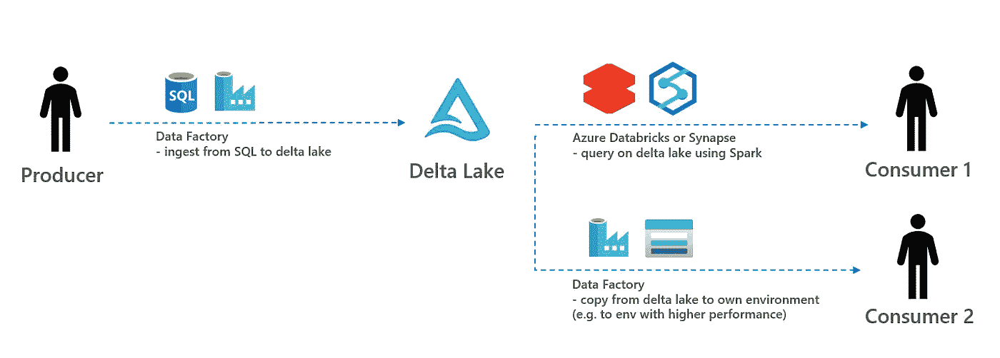
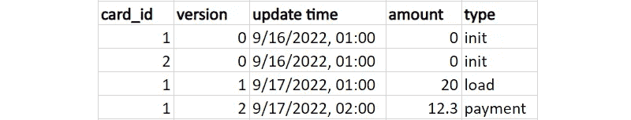
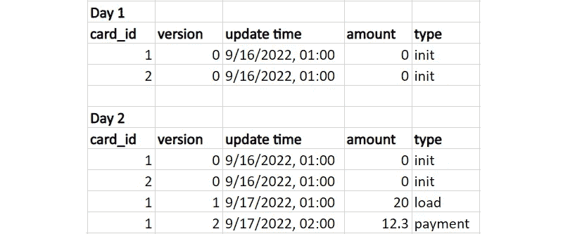
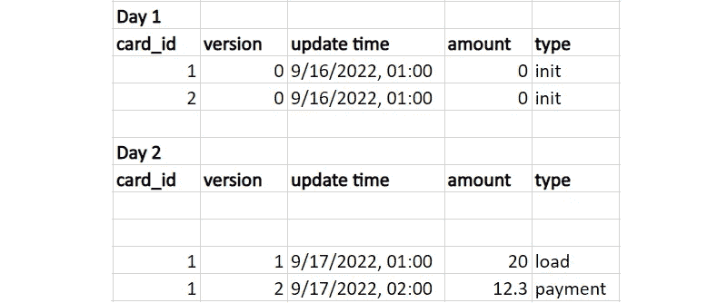
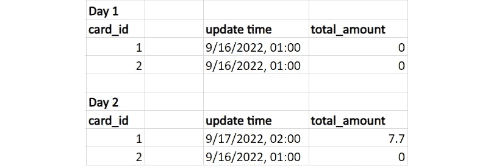

# 如何从 Azure 数据湖获取和使用数据

> 原文：<https://towardsdatascience.com/how-to-ingest-and-consume-data-from-azure-data-lake-e66b56406b08>

## 摄入/消费模式分析，包括三角洲湖 PoC

由[克林特·王茂林](https://unsplash.com/@clintadair?utm_source=unsplash&utm_medium=referral&utm_content=creditCopyText)在 [Unsplash](https://unsplash.com/s/photos/data-patterns?utm_source=unsplash&utm_medium=referral&utm_content=creditCopyText) 上拍摄

# 1.介绍

许多公司考虑建立一个企业数据湖。这个想法是将数据存储在一个集中的存储库中。数据湖的主要利益相关者是以下两个实体:

*   **数据生产者:**接收数据到数据湖的实体。这通常是指不直接从数据湖中获利的实体，他们更喜欢一种无需太多开销的简单数据获取方式(类似于“一劳永逸”)
*   **数据消费者:**使用数据创造商业价值的实体。这通常是从数据湖中获益最多的实体，并且更喜欢无需太多返工就可以轻松使用数据(数据被正确分区，而不是许多小文件，等等)

在这篇博文中，第 2 章讨论了四种不同的数据摄取模式。随后，第三章阐述了两种消费模式。在第 4 章中，使用 ADF 和 delta lake 讨论了使用 git repo `[adf-deltalake-ingestion-consumption](https://github.com/rebremer/adf-deltalake-ingestion-consumption)`的概念验证，另请参见下图。最后，在第五章得出结论。

1.建筑概念验证—作者图片

# 2.数据生产者:摄取模式

在本章中，使用以下两个维度来区分四种类型的摄取模式:

*   原始数据与日终聚合:如果使用原始数据，所有源数据都将被接收到目标中。如果使用日终，源数据将以有意义的完整形式聚合到目标
*   快照与增量:在使用快照的情况下，所有源数据每天都被接收到目标中。在使用增量情况下，只有变异的源数据被接收到目标中。

在本章的剩余部分，我们将讨论这四种模式，它们是上述两个维度的组合。为了进一步阐明，使用了一个示例数据集，其中在第一天生产卡 1 和 2，然后在第二天在卡 1 上完成两个卡交易，见下文。

2.0.示例数据集

在接下来的段落中，我们将从正反两方面讨论这些模式。

## 2.1 模式 P1:原始数据-快照

在快照模式中，每天都发送完整的原始数据集。对于上面的数据集，这意味着第 1 天和第 2 天的数据如下。

2.1 .模式 P1:原始数据—快照

利弊分析如下:

*   (pro)数据生产者最容易采用的模式；只需要进行数据转储，而不需要跟踪更改
*   (不)对大型数据集不可行；每天发送数据集的成本很高。大型数据集也会影响性能(复制时间)。备份也是如此。
*   (缺点)数据消费者需要跟踪变化。由于数据消费者对数据的了解通常比数据生产者少，这很容易出错。当数据被复制到消费者自己的环境中时，这尤其具有挑战性(如果不进行复制，而是使用数据虚拟化，delta lake 可以提供帮助)

## 2.2 模式 P2:原始数据—delta

在增量模式中，插入新数据并更新现有数据。对于不可变的数据集，总是会插入新数据，因为不会发生更新。如果数据集是可变的，那么可以进行更新。在这种情况下，关键是源和目标中都有一个唯一的 ID，以便可以匹配数据。对于示例数据集，模式 2 可以如下应用(仅插入):

2.2.模式 P2:原始数据-增量

利弊分析如下:

*   (亲)更高效的模式。发送大型数据集没有成本，性能可能会更好，复制大型数据集时出错/超时的可能性更小。
*   (缺点)数据消费者必须能够使用所有以前的数据增量。如果缺少一个增量，数据集就会损坏。
*   (专业)数据消费者可以在自己的环境中轻松识别变更并进行更新。三角洲也可以通过 ADF 数据流和三角洲湖泊轻松处理。

## 2.3 模式 P3:一天结束—快照

在一天结束时的快照模式中，目标不是同步原始数据源和数据接收器。相反，会在一天结束时创建并发送一个聚合。这可能是因为以下原因:

*   消费者只对最终结果感兴趣(而对导致这个最终结果的 N 个突变不感兴趣)

对于示例数据集，消费者可能只对卡的 total_amount 感兴趣，见下文。

2.3.模式 P3:一天结束-快照

利弊分析如下:

*   (不利)由于消费者只能获得汇总数据，因此会发生数据丢失。
*   (pro)数据模式可能更有效，例如，如果数据消费者只对最终结果感兴趣，而对导致最终结果的 N 个突变不感兴趣。

## 2.4 模式 P4:一天结束— delta

模式 4:一天结束—增量几乎类似于 2a 一天结束—快照，但只发送突变的数据。对于示例数据集，这意味着:

2.4.模式 P4:一天结束-快照

模式 3 和模式 4 的利弊分析基本相同。唯一的区别是，在聚合仍然很大的情况下，增量可能更有效。

## 2.5 结论

这四种模式各有利弊。然而，对于企业数据湖的标准化来说，使用**模式 P2:原始数据—增量**作为缺省值可能是个好主意。原因如下:

*   当所有原始数据从源发送到目标时，不会发生数据丢失。生产者很难预测消费者需要什么样的聚合。相反，消费者可以自己决定他们需要什么样的聚合。数据湖中的多个区域也有所帮助，其中一个着陆区域用于接收所有原始数据，一个瓶装区域用于创建多个聚合以供使用
*   增量是一种更具成本效益的模式，因为需要拷贝的数据较少。对于大型数据集，增量甚至可能是唯一可行的解决方案。

# 3.数据消费者:消费模式

在本章中，两种不同的消费模式讨论如下:

*   复制数据:消费者将数据从数据湖复制到他们自己的环境中
*   虚拟化数据:消费者直接使用数据湖中的数据

在接下来的两段中，我们将讨论每种消费模式的利弊。

## 3.2 模式 C1:虚拟化数据

在数据虚拟化模式中，消费者直接在数据湖上查询，数据不会复制到他们自己的环境中。

*   (亲)单一来源的事实，没有重复的数据创建
*   (亲)消费者容易介入的模式。如果消费者没有太多的技术知识，只想创建一些(Power BI)报告，这一点尤其如此
*   (支持)Delta lake 可用于简化使用 SQL 对存储帐户的查询
*   (不利)对于有强烈性能需求(SLA)的团队不可行
*   (缺点)将企业数据湖数据与不属于数据湖的数据(例如，位于消费者自己的 SQL 环境中的数据)连接起来可能很困难

## 3.2 模式 C2:复制数据

在复制数据模式中，消费者将数据从企业数据湖卸载到自己的环境中。

*   (赞成)消费者完全控制数据。如果客户有严格的性能要求(为 24x7 网站提供服务)或严格的 SLA(为数据湖提供服务的团队可能无法在凌晨 03:00 回答问题)，这一点尤为重要
*   (缺点)复制可能需要很长时间，尤其是当大型数据集必须复制到消费者自己的环境中时
*   (缺点)消费者需要具备技术知识来设置自己的环境(ADF、数据库、网络等)。

## 3.3 结论

这两种模式各有利弊。然而，对于企业数据湖的标准化，使用**模式 C1:默认虚拟化数据**可能是个好主意。这可以解释如下:

*   防止了数据不必要的复制，并且是最具成本效益的。
*   还可以利用 Delta lake 来简化数据消耗，这将在下一章中详述。
*   如果使用了 delta lake，而消费者仍然希望将数据复制到自己的环境中，则可以使用 ADF 从 delta lake 复制数据

# 4.ADF、Delta Lake 和 Spark:概念验证

在本章中，使用以下体系结构构建概念验证:

*   **数据生产者:**来自 SQLDB 的数据使用流向 delta lake 的 ADF 数据流获取。使用上面讨论的四种模式(原始数据与聚合数据、完整快照与增量增量)获取数据
*   **数据消费者:**一旦数据被接收到 delta lake，消费者就可以使用 Databricks 和 Synapse 笔记本使用 Spark 查询数据。如果消费者想要将数据复制到自己的环境中，则创建两条 ADF 管道，可以将快照或最新增量复制到自己的环境中

另请参见下图:

4.建筑概念验证—作者图片

项目可以在 git repo `[adf-deltalake-ingestion-consumption](https://github.com/rebremer/adf-deltalake-ingestion-consumption)`中找到。为运行 PoC 执行以下步骤:

1.  替换变量并运行`[scripts/deploy_resources.sh](https://github.com/rebremer/adf-deltalake-ingestion-consumption/blob/main/scripts/deploy_resources.sh)`来部署 ADF 和 deltalake。
2.  运行不同的生产者管道将数据接收到三角洲湖
3.  消费者类型 1:创建一个 Databricks 工作区或 Synapse 工作区，并运行`[notebooks](https://github.com/rebremer/adf-deltalake-ingestion-consumption/tree/main/notebooks)`来查询 delta lake 上的数据
4.  消费者类型 2:运行消费者管道，将数据消费到自己的存储帐户

# 5.结论

许多公司考虑建立一个企业数据湖。数据湖的主要利益相关者是数据生产者和数据消费者。数据生产者通常在寻找一种轻松获取数据的方式，而数据生产者是从数据中创造商业价值的实体。在这篇博文中，作者提出了以下观点:

*   生产者应该将原始数据**存储到数据湖中，并在**增量**中完成此操作。基本原理是原始数据可防止数据丢失，增量数据具有成本效益且可扩展**
*   消费者应**直接从数据湖中**查询数据，并在那里建立数据产品。基本原理是这样可以防止数据重复，并且具有成本效益。可能的例外是，当消费者需要更高的性能/更高的 SLA 时(例如，为 24x7 网站提供服务)，可以将数据复制到自己的环境中
*   **Delta lake** 可以帮助消费者轻松查询数据，而 Data Factory 支持 delta as sink，可以帮助生产者以 Delta lake 格式自动添加数据。这在这次 **git 回购** : `[adf-deltalake-ingestion-consumption](https://github.com/rebremer/adf-deltalake-ingestion-consumption)`中得到了实践