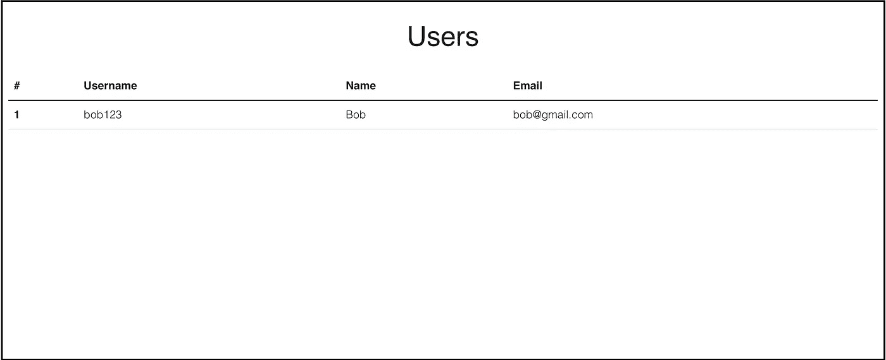
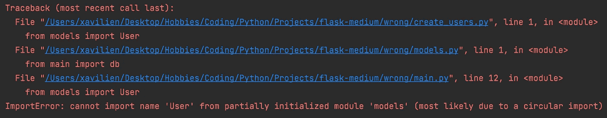
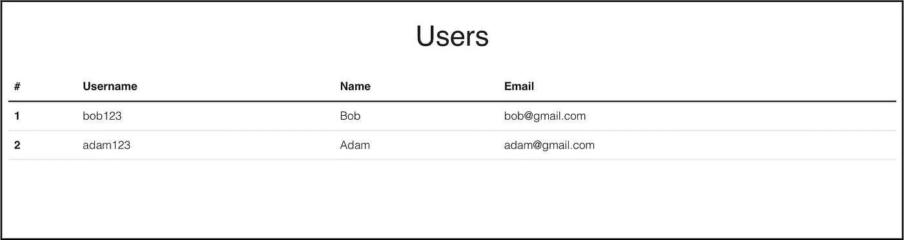

# 如何使用 Flask-SQLAlchemy 将虚拟数据插入数据库

> 原文：<https://towardsdatascience.com/how-to-insert-dummy-data-into-databases-using-flask-sqlalchemy-9c59efab4527>

## 通过构建您的烧瓶项目


[Flask](https://flask.palletsprojects.com/en/2.0.x/) 是一个伟大的 **python web 框架**，因为它极其**轻量级**、**易于设置**、**灵活**。许多[网站](https://stackshare.io/flask)，包括网飞、Airbnb 和 Reddit 等热门网站，都是使用 Flask 构建的。

Flask 的灵活性部分是由于这个框架的核心是非常基础的。这个包只提供了一些基本的功能，比如路由、渲染模板和部署应用程序。为了获得更强大的功能，Flask 提供了一些扩展建议，比如用于用户会话管理的`flask-login`、用于创建 web 表单的`flask-wtf`和用于数据库管理的`flask-sqlalchemy`，正如标题所示，我们将在本文中讨论这些。

然而，这种灵活性的一个缺点是，有时初学者可能不知道实现某个功能的最佳实践。虽然有许多优秀的教程详细介绍了如何添加各种扩展来加速开发过程，但有时会有某些功能被遗漏。

特别是在自己开发网站的时候，我发现找不到任何满足我使用 Flask-SQLAlchemy 插入哑数据要求的教程。因此，当我最终发现这个问题时，我认为写一篇文章来分享我所面临的困难以及我最终是如何解决它们的会很好。但首先，我们来介绍一下 Flask-SQLAlchemy。

[Flask-SQLAlchemy](https://flask-sqlalchemy.palletsprojects.com/en/2.x/) 是一个 **Flask 扩展**，它为 Flask 应用添加了对 [SQLAlchemy](https://www.sqlalchemy.org) 的支持。SQLAlchemy 是一个**对象关系映射器**，它基本上允许我们将 SQL 表视为 python 类，将这些表中的行视为这些类的实例。它的美妙之处在于，我们可以为 CRUD 操作编写 python 代码而不是 SQL 代码，而且无论我们最终使用什么样的数据库，我们都不需要修改这些代码！

你可能想知道，当我们已经有 SQLAlchemy 时，为什么还要使用 Flask-SQLAlchemy。事实上，有可能同时使用烧瓶和 SQLAlchemy，如这里的所示。然而，Flask-SQLAlchemy 的主要优势在于，它**简化了**完成像建立数据库连接这样的常见任务所需的代码量，并且它可以很好地与任何 Flask 应用程序集成。

文章中指出的主要缺点是在 Flask 应用程序之外加载数据变得有些棘手。然而，我发现这只是当 Flask 项目没有正确构建时的问题。一个简单的重构可以很容易地让我们编写一个外部脚本来加载数据，并有许多其他的好处，稍后将简要讨论。

事不宜迟，我将首先演示当 Flask 项目没有正确构建时所面临的挑战，然后我将向您展示我发现的构建项目的最有效的方法。这个项目的代码可以在[这里](https://github.com/Xavilien/flask-structure-medium)找到。

*注意:这不是一个完整的教程，所以我假设读者对 Flask 和 Flask-SQLAlchemy 有基本的了解。好的教程可以在这里* *找到* [*。*](https://blog.miguelgrinberg.com/post/the-flask-mega-tutorial-part-i-hello-world)

为了演示如何在 Flask 应用程序之外插入虚拟数据，我将使用一个非常简单的只有一个视图的应用程序。由于大多数应用程序将处理用户帐户，其详细信息存储在数据库中，我将创建一个应用程序，在主页上显示所有用户的详细信息，如下所示:



每个用户都存储在一个由`models.py`中的`User`类定义的**用户表**中，还有一些我们需要的方法，比如创建新用户和获取显示在主页上的用户详细信息。

## 不可取的做事方法

我发现许多教程的问题是，它们经常把大部分(如果不是整个应用程序)放在一个文件中。我的意思是，他们将从同一个文件中初始化应用程序、创建视图和运行服务器:

项目结构非常简单，如下所示:

```
/project
  main.py
  models.py
  database.db
  create_users.py
  /static
    css
      style.css
  /templates
    users.html
```

虽然这可能很快很容易，但是随着项目变得更大更复杂，这个`main.py`文件将变得越来越难以维护。

当我们想在数据库中插入虚拟数据来测试我们的应用程序时，我们也会遇到一个很大的挑战。当然，我可以将创建更多用户的代码放在`main.py`中，并在`app.run()`之前运行:

然而，每次我们想创建一个新用户时，我们都必须重启服务器，用一个单独的文件来创建新用户更有意义。

不幸的是，如果我们试图这样做:

我们得到一个错误，因为`models.py`从`main.py`进口，T3 也从`models.py`进口！



## 做事情的明智方法

确保加载外部数据时出现最小问题(以及其他开发问题)的最佳方式是拥有一个良好的项目结构，允许**灵活性**和**模块化**。我建议采用类似如下的结构:

```
/project
  main.py
  /src
    __init__.py
    config.py
    /users
      routes.py
    /models
      models.py
    /database
      database.db
      create_users.py
    /static
      css
        style.css
    /templates
      users.html
```

现在，我将介绍项目的重要部分，让您大致了解不同部分是如何协同工作的。

## **__init__。py，main.py，config.py**

`__init__.py`是创建你的应用程序的地方，以及它的配置和像 Flask-SQLAlchemy 这样的扩展的添加。您可能会注意到，我们不是先创建应用程序，然后将应用程序传递给`SQLAlchemy`构造函数(这在许多教程中都有)，而是全局定义`SQLAlchemy`对象，然后在`init_app()`函数中初始化它。然后我们在`app.app_context()`中运行`db.create_all()`函数。[技术细节](https://flask-sqlalchemy.palletsprojects.com/en/2.x/contexts/)超出了本文的范围，但是`app_context()`允许我们稍后使用外部脚本向数据库添加数据。

`main.py`导入`init_app()`功能，初始化应用程序，并运行它。这是您要运行以启动服务器的文件。

`config.py`将配置定义为一个类，由`__init__.py`导入。这很有用，因为我们可以**为不同的用途创建不同的配置**，例如开发、测试和生产，使用环境变量轻松地在它们之间切换。例如，我们可能使用 Sqlite 数据库(`database.db`)进行开发，但是如果我们想要在生产服务器上部署，我们可以使用引用 Postgres 数据库的生产配置。

## routes.py，create_user.py

`routes.py`是我们定义主页视图的地方，该视图只显示一个包含我们用户详细信息的表格。我们使用[蓝图](https://flask.palletsprojects.com/en/2.0.x/blueprints/)，它允许更多的模块化应用。

`create_user.py`真是我们一直在等着看的。这是我们使用脚本自动将数据插入数据库的地方，而不必运行应用服务器。我们导入了`init_app()`函数和`User`类，并使用`app_context()`来创建新用户！



瞧啊。没有错误。

## 结论

总之，我向您展示了一个更好的项目结构如何允许我们创建一个外部脚本来使用 Flask-SQLAlchemy 将虚拟数据插入到数据库中。虽然这可能需要更多的时间来设置，但从长远来看，其好处绝对是值得的。例如，通过使用蓝图，我们可以分离应用程序不同部分的逻辑，从而使代码更易于阅读和维护。此外，如果我们想为我们的应用程序添加一个具有独特逻辑的新部分，我们可以在一个新文件中创建一个新的蓝图，而不是将我们所有的代码都放在同一个文件中。或者，如果我们想在数据库中创建一个新表，我们可以在一个单独的文件中定义一个新模型，以及数据库的逻辑。