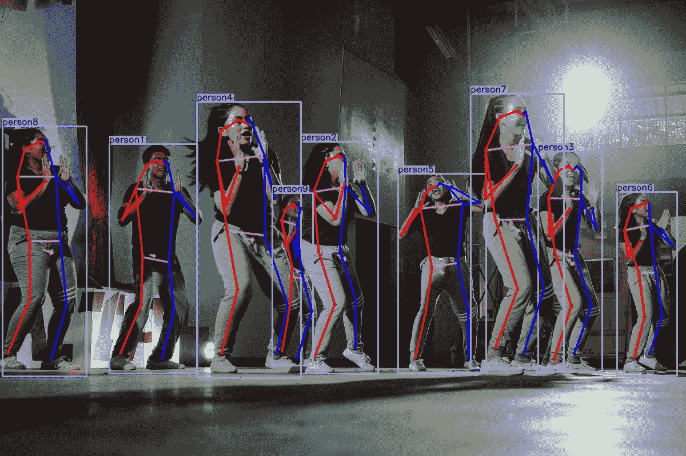

# 如何在 Windows 上安装中央轨道

> 原文：<https://towardsdatascience.com/how-to-install-center-track-on-windows-10a109ef7f75>

## 最先进的姿态估计，内置跟踪器触手可及

CenterTrack 的检测。雷尼尔·里道在 [Unsplash](https://unsplash.com?utm_source=medium&utm_medium=referral) 上拍摄的照片

最近，我受雇开发一个需要实时姿态估计的 MVP。前几年，占主导地位的技术是 CMU 的 OpenPose，尽管有点麻烦，但一旦你设法正确设置，它就能很好地工作。备选方案包括 [CenterNet](https://github.com/xingyizhou/CenterNet) 、 [AlphaPose](https://github.com/MVIG-SJTU/AlphaPose) 和 [PoseNet](https://blog.tensorflow.org/2018/05/real-time-human-pose-estimation-in.html) 。总的来说，所有这些技术都缺少内置的[跟踪器](https://en.wikipedia.org/wiki/Video_tracking)。快进到 2020 年，CenterNet 背后的同一批作者推出了[center track](https://github.com/xingyizhou/CenterTrack)——一个姿势估计网络，包括跟踪作为其问题公式化的一部分。

对于门外汉来说，**追踪就是将帧连接起来，创造一个历史**。每当我们检测到一个人，我们就给它一个 ID，在所有后续帧中，每当我们看到*这个人，*我们就应该给它相同的 ID。换句话说，跟踪确保我们知道视频中谁是谁。例如，假设你有一个监控摄像头发现了一个罪犯。追踪器让我们可以查询这个人在视频中出现的时间和地点。

作为参考，CenterTrack 中的追踪器是基于数据关联的极简在线追踪器，很像[排序](https://github.com/abewley/sort)。简单地说，它只使用过去和现在的数据(而不是未来的)。此外，它将其自身限制为仅使用过去检测的位置/姿态来建立先前和当前帧姿态之间的相似性矩阵。因此，没有使用图像/视觉特征。最后，分配算法将先前姿态的 id 与当前姿态进行匹配。默认情况下，它使用贪婪的分配策略。

与以前的方法相比，使用 CenterTrack 的主要优势除了其更高的准确性之外，还在于不必滚动您的跟踪器实现或依赖 [OpenCV 的](https://docs.opencv.org/4.x/d2/d0a/tutorial_introduction_to_tracker.html)缓慢且过时的跟踪 API。此外，与 OpenPose 不同，它是基于 Python 的，并获得了麻省理工学院的许可。

关于限制，尽管在姿势估计方面是最先进的，但它的跟踪器对你来说可能有点太小了，所以你可能仍然想在它上面滚动一些自定义跟踪作为备份。例如，作为一个基于关联的跟踪器，它在分配 id 时不使用视觉信息。因此，它不能处理闭塞或重入。

# 在 Windows 上运行。

源代码仅适用于 Linux。然而，我们可以带着一点爱在 Windows 上运行它。在这里，我将列出我为使它工作所采取的步骤以及它们的基本原理。我将坚持使用这种格式，为您提供自己处理任何问题的工具，因为移植库充其量只是一种黑客行为。

**总结:**幸运的是，代码库并不严重依赖于 Linux 特性。大部分工作是为 Windows 端口( [DCNv2](https://github.com/rathaROG/DCNv2_Windows) )替换 Linux 依赖项，并在我们的系统中获得 Python (3.8)、CUDA (11.1)和 PyTorch (1.8)的正确版本。自始至终，我们混合使用 conda 和 pip 命令来安装所有必需的依赖项。

**免责声明:**将知识库移植到 Windows 后，我只用过它进行推断(网络摄像头和视频)。我并不认为这一过程完全适用于定制数据集或计算数据集指标的培训。

我们开始吧:

**第一步:**使用 Python 3.8 构建 conda 环境。你爱怎么叫都行。不要忘记激活它！

> `conda create -y --name centertrack python=3.8`
> 
> `conda activate *centertrack*`

**第二步:**获得合适的 CUDA 工具包(11.1)，一些加速 API，Git，和一个工作的 C++编译器。

> `conda install -y cudatoolkit=11.1 mkl mkl-devel mkl-include tbb intel-openmp blas freetype zlib git cxx-compiler -c conda-forge`

**第三步:**从现在开始，我们做任何事情都要用画中画。以我的经验来看，conda 在获取原生库方面非常出色，比如 CUDA，但是在获取我们需要的 Python 东西方面却很糟糕。所以我们从更新我们的基础设施开始，然后从它的官方库安装 PyTorch 1.8。

> `pip install -U pip setuptools wheel`
> 
> `pip install torch==1.8.2+cu111 torchvision==0.9.2+cu111 -f [https://download.pytorch.org/whl/lts/1.8/torch_lts.html](https://download.pytorch.org/whl/lts/1.8/torch_lts.html)`

**第四步:**克隆 CenterTrack 存储库并使用 pip 安装 requirements.txt 文件(`pip install -r requirements.txt`)。最后，在资源库根目录下创建一个名为“models”的文件夹，并从[官方资源库](https://github.com/xingyizhou/CenterTrack/blob/master/readme/MODEL_ZOO.md)下载您需要的模型。如果你正在寻找姿势估计，向下滚动到末尾，下载 coco_pose_tracking。

**第五步:** CenterTrack 将 DCNv2 代码库用于可变形卷积。但是，这个存储库包含一个 Linux 版本的子模块。相反，我们应该下载这个库，DCNv2 的一个 Windows 端口。将这个 repo 克隆到`src/lib/model/networks/`，使用终端导航到它(不要忘记激活 conda 环境！)和`run python setup.py build develop`

**第六步:**测试您的安装。这里有一个片段，您可以在存储库根目录的终端上使用。如有必要，请确保更改型号名称。

> `python src/demo.py tracking,multi_pose --load_model models/coco_pose.pth --demo webcam`

这是一个简单的教程。将来，我可能会写更多关于跟踪以及它如何帮助创建容错系统的内容。与此同时，我刚刚发表了一篇关于组合人工智能模型如何显著恶化您的性能的文章。在处理视频和流时，您可以减轻这些问题的方法之一是通过跟踪。

</the-pitfalls-of-using-ai-as-the-input-of-another-ai-e0a3f0f485e4>  

他的一切都是为了现在。如果你对这篇文章有任何问题，请随时评论或与我联系。你也可以订阅我的收件箱，以便在我发表文章的时候得到通知[。](https://ygorserpa.medium.com/subscribe)

如果你是中新，我强烈推荐[订阅](https://ygorserpa.medium.com/membership)。对于数据和 IT 专业人士来说，中型文章是 [StackOverflow](https://stackoverflow.com/) 的完美搭档，对于新手来说更是如此。注册时请考虑使用[我的会员链接。](https://ygorserpa.medium.com/membership)

感谢阅读:)