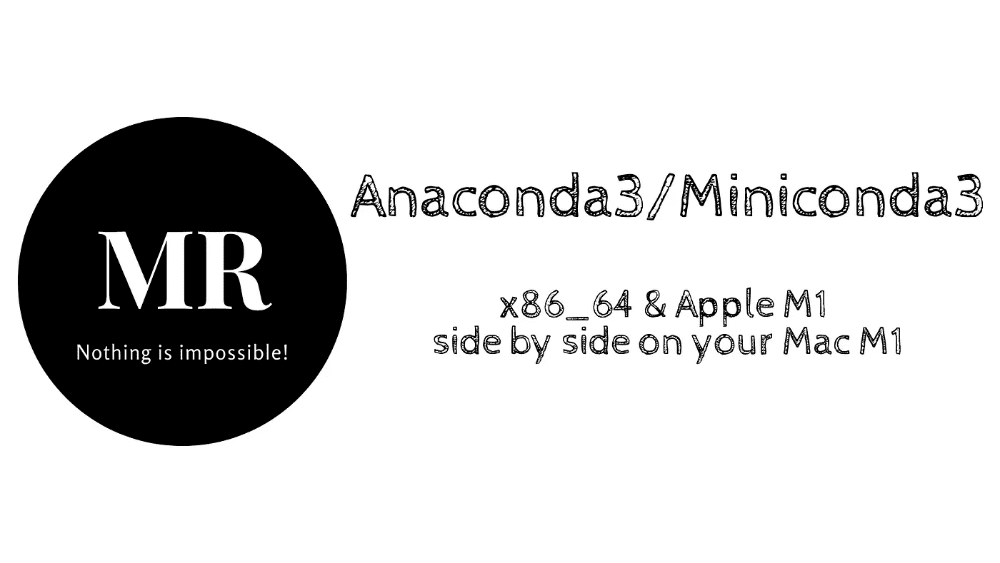
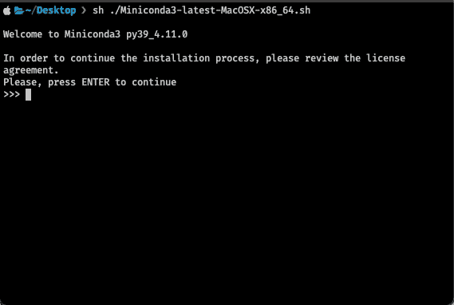
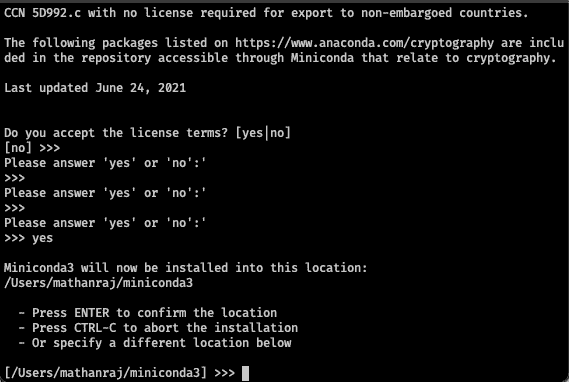
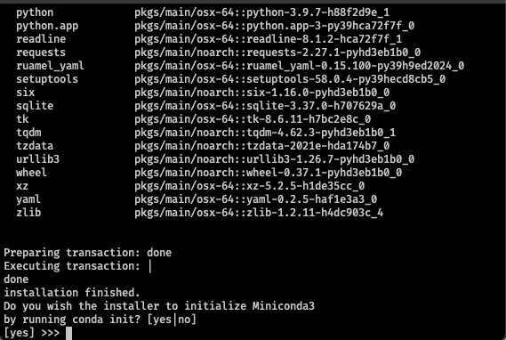
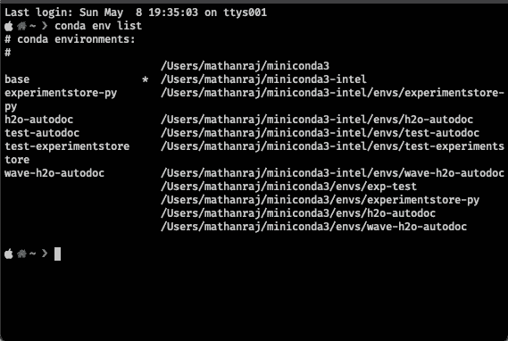
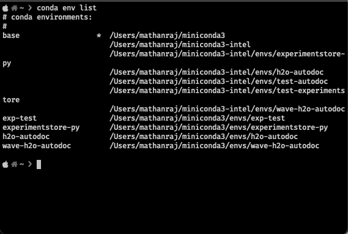

# 如何在 Mac Book M1 上并排安装 Miniconda x86_64 和苹果 M1

> 原文：<https://towardsdatascience.com/how-to-install-miniconda-x86-64-apple-m1-side-by-side-on-mac-book-m1-a476936bfaf0>

## 迷你康达 x86_64 &迷你康达苹果 M1 并排在 Mac 图书 M1



PC:作者

如果你是一名使用苹果 Mac M1 的 *Python 开发人员/ ML 工程师/数据科学家*，你可能知道没有 *arm64* 项目依赖分布的痛苦🥲。一种解决方法是通过启用了 *rosetta2* 的终端使用包管理器，比如 Anaconda3/Miniconda3。

但幸运的是，现在苹果 M1 得到了 Anaconda 的官方支持，你可以[下载](https://docs.conda.io/en/latest/miniconda.html)并用苹果的硅片为你的 Mac 安装 Anaconda3/Miniconda3。但是作为一名 ML 工程师，我想保留 Miniconda3 的两种风格(x86_64 &苹果 M1 ),因为我正在为这两种架构进行产品开发。

## 如何让 Miniconda3 x86_64 & Miniconda3 苹果 M1 并排，甚至有可能吗？

答案是**“是的”**，这花了我一些时间⏰想出一种便捷的方法。所以我决定把它写在这里，这样对很多像我一样的人会有用。

**先决条件:** Rosetta2 使能端子。

## **安装 Miniconda3 x86_64**

打开启用 rosetta2 的终端，

1.  检查您的终端是否支持 rosetta2

```
$ uname -m
x86_64
```

如果你得到`x86_64`，那么你在一个 rosetta2 使能的终端上

2.下载 Miniconda3 x86_64 bash 安装程序

```
$ wget [https://repo.anaconda.com/miniconda/Miniconda3-latest-MacOSX-x86_64.sh](https://repo.anaconda.com/miniconda/Miniconda3-latest-MacOSX-x86_64.sh)
```

3.运行安装程序

```
$ sh ./Miniconda3-latest-MacOSX-x86_64.sh
```

4.它会提示一个审查许可协议，按**键*输入*键**继续



PC:作者

5.然后继续按回车键，直到你得到下面的提示。一旦你得到它，输入 ***yes*** 并按 ***回车*** 继续


PC:作者

6.接下来，它会提示您安装路径



PC:作者

在这里键入`/Users/[your user name]/miniconda3-intel``(让我们把这个路径称为 **Miniconda x86_64 路径**)或者您喜欢的任何路径，主要思想是您应该保留 Miniconda Apple M1 的默认安装路径(只是为了区分两个安装)

7.它将下载基本包并在指定路径安装 Miniconda x86_64。一旦完成，就会提示是否运行`conda init.`



PC:作者

当你得到这个提示时，输入 ***no*** 并按下 ***进入*。我们不想给你的终端启动脚本添加 conda 初始化器(例如`.bashrc`或`.zshrc`或其他)**

现在我们已经成功安装了 Miniconda3 x86_64。接下来，我们需要以同样的方式安装迷你康达苹果 M1，除了一些变化。

## **安装 Miniconda3 苹果 M1**

打开一个终端(没有 rosetta2 的终端)

1.  检查您的终端是否未启用 rosetta2(默认 M1 终端)

```
$ uname -m
arm64
```

如果你得到`arm64`，那么你在一个默认的终端上

2.下载 Miniconda3 x86_64 bash 安装程序

```
$ wget [https://repo.anaconda.com/miniconda/Miniconda3-latest-MacOSX-arm64.sh](https://repo.anaconda.com/miniconda/Miniconda3-latest-MacOSX-arm64.sh)
```

3.然后进行类似于前面的安装过程(从[步骤 3](https://medium.com/p/a476936bfaf0#ca13) 到[步骤 5](https://medium.com/p/a476936bfaf0#575a) )。

4.当它提示安装路径时，我会推荐安装在默认路径`Users/[your user name]/miniconda3/`。如果没有，请使用不同的路径。(让我们把这条路径称为**迷你康达苹果 M1 路径**)。

5.安装完成后，会提示是否运行 conda init，键入 ***no*** 并按 ***进入*。**

## **为两个安装配置 conda init**

通常当我们运行`conda init`时，它会根据我们使用的 shell 类型在终端启动文件中添加一些 shell 命令。

但是这里我们不能简单地在同一个文件中添加 x86_64 和苹果 M1 的 init。**基于终端会话的架构激活正确的** `**conda installtion**` **需要更智能一点。**

您可以简单地在`.zshrc`或您正在使用的任何 shell 启动脚本上做任何事情。但是让我告诉你我是如何干净利落地做到的。

1.  为 conda init 创建自定义启动脚本

```
$ mkdir ~/.custrc/ && touch ~/.custrc/.condarc
```

2.打开并在脚本中添加 conda init 函数

```
init_conda() {
   # >>> conda initialize >>> conda_path_m1="/Users/mathanraj/miniconda3"
   __conda_setup="$('${conda_path_m1}/bin/conda' 'shell.zsh' 'hook' 2> /dev/null)"
   if [ $? -eq 0 ]; then
      eval "$__conda_setup"
   else
      if [ -f "${conda_path_m1}/etc/profile.d/conda.sh" ]; then
          . "${conda_path_m1}/etc/profile.d/conda.sh"
      else
          export PATH="${conda_path_m1}/bin:$PATH"
      fi
   fi
   unset __conda_setup# <<< conda initialize <<<
}init_conda_intel() {
   # >>> conda initialize >>> conda_path_intel="/Users/mathanraj/miniconda3-intel"
   __conda_setup="$('${conda_path_intel}/bin/conda' 'shell.zsh' 'hook' 2> /dev/null)"
   if [ $? -eq 0 ]; then
      eval "$__conda_setup"
   else
      if [ -f "${conda_path_intel}/etc/profile.d/conda.sh" ]; then
          . "${conda_path_intel}/etc/profile.d/conda.sh"
      else
          export PATH="${conda_path_intel}/bin:$PATH"
      fi
   fi
   unset __conda_setup
   # <<< conda initialize <<<
}
```

这里，

*   `conda_path_m1`是我为苹果 M1 公司安装 Miniconda 的地方
*   `conda_path_intel`是我为 x86_64 安装 Miniconda 的地方

根据您安装 Miniconda Apple M1 和 x86_64 的位置，相应地替换路径。

3.打开并添加下面几行到你的 shell 启动脚本中，在我的例子中是`.zshrc`

```
$ open ~/.zshrc
```

增加

```
# init conda based on arch
source ~/.custrc/.condarc
if [[ $(uname -m) == 'x86_64' ]]; then
    init_conda_intel
    echo "conda x86_64 is activated"
else
    init_conda
    echo "conda m1 is activated"
fi
```

这会给你的终端行为增加小智能。基本上，它只是根据终端会话的架构配置合适的 conda 安装。

就这样，现在关闭所有正在运行的终端会话并尝试

*   打开 rosetta2 enabled 终端，会得到**“康达 x86_64 已激活”。**如果打印`conda env list`



PC:作者

*   打开默认终端(不带 rosetta2)，会得到**“康达 m1 已激活”。**如果你打印`conda env list`



PC:作者

**注意:**如果仔细观察，它会打印两种情况下所有可用的 conda 环境。但是，当它来自支持 rosetta2 的终端时，请注意，仅打印 miniconda3-intel 环境下的名称，miniconda3-intel 下的基本路径将带有 **(*)** 符号。miniconda3-m1 也是如此。

希望你觉得超级有帮助。

没有什么是不可能的，让我们做吧…🎉