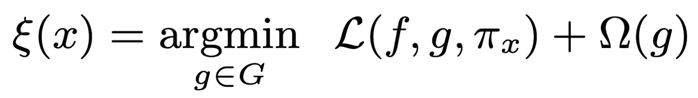
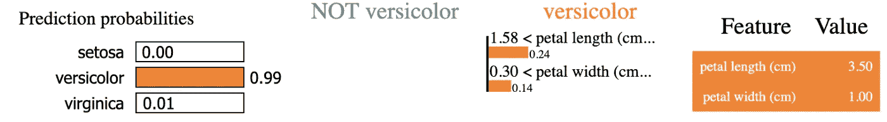
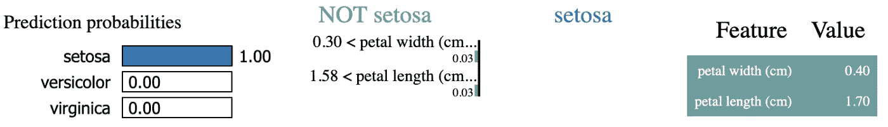
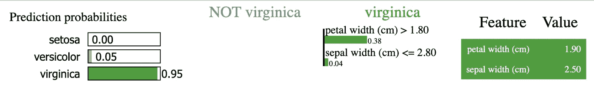

# 如何解读任何机器学习预测

> 原文：<https://towardsdatascience.com/how-to-interpret-any-machine-learning-prediction-64ff43020214>

## 人工智能|可解释性|数据科学

## 将黑盒模型转换成玻璃盒子


威廉·冈克尔在 [Unsplash](https://unsplash.com?utm_source=medium&utm_medium=referral) 上拍摄的照片

局部可解释模型不可知解释(LIME)是 Ribeiro 等人[1]开发的 Python 项目，用于解释任何监督机器学习(ML)模型的预测。

大多数 ML 算法是黑盒；我们无法正确理解它们是如何进行特定预测的。这是人工智能的一个巨大缺点，随着人工智能(AI)变得越来越普遍，理解“*的重要性这是为什么？*'是不断增加的。

在本帖中，我们将讨论 LIME 项目如何工作以及为什么工作。我们还将通过一个使用真实数据集的示例来进一步理解 LIME 的结果。

# 理解机器学习的基础

在我们能够理解并真正欣赏 LIME 的牛逼之前，我们必须先了解 ML 的基本直觉。

任何被监督的问题都可以归结为两个主要特征:𝒙(我们的特征)和𝑦(我们的目标)。我们想建立一个模型ƒ(𝒙)来生成一个预测𝑦'每当我们提供一些样本𝒙'.

在训练期间，ML 模型不断地调整映射函数ƒ(𝒙的权重)，这使得该模型成为一个黑箱，因为理解这些权重如何变化并不容易。

> 理解任何 ML 模型的预测归结为理解所述模型背后的映射函数。

# 理解模型可解释性类型

模型可解释性有两种主要类型:

# 1.全球解释

给定一个模型，使用整个训练数据集生成全局解释。全局解释显示了整体特征对模型的重要性。对于每个特性，全局解释通常会回答这个问题:*“总的来说，这个特性对有多重要？”*

# 2.当地解释

当地的解释直接基于单一的观察。利用局部解释，我们试图理解为什么会对特定样本产生特定的预测。对于任何给定的样本，本地解释通常会回答这个问题:*“哪个特征对这个特定的预测影响最大？”*

在这篇文章的其余部分，我们将集中讨论当地的解释。

# 石灰的直觉

LIME 试图通过采样实例来近似模型的映射函数ƒ(𝒙) (称为输入扰动)。通俗地说，LIME 生成了一堆合成样本𝒙'，这些样本与原始实例𝒙.非常接近然后，LIME 将𝒙'传递给原始模型，并记录各自的预测。这个过程使 LIME 能够确定不同的输入波动是如何影响的。在过程的最后，对于给定的样本𝒙，LIME 将能够通过确定每个特征的单独影响来近似预测。因此，LIME 能够通过了解哪些要素对预测的贡献最大来解释特定的预测。

# 概括起来

*   𝒙'石灰样品实例
*   LIME 使用𝒙'生成一组预测𝑦'使用ƒ(𝒙)
*   LIME 比较预测与原始预测的接近程度，并对它们进行加权。
*   LIME 使用权重来确定哪些特征对单个预测最有影响。

# 潜得更深

如前所述，莱姆的整个想法是试图解释ƒ(𝒙).LIME 通过代理模型实现了这一点。替代模型 g 是用于解释另一种预测算法的结果的任何模型。一般来说，g 会是一个更简单、更易解释的模型(比如决策树或线性模型)。我们可以正式定义代理模型集合为 G，使得 G∈**G**

但是，LIME 如何选择使用哪个 g 来解释原始模型呢？

LIME 考虑了两个主要的决定因素:

****警告:好听的话传入****

1.  局部保真度，用 *L(f，g，π)表示——也称为保真度函数*
2.  复杂度，用*ω(g)*表示

什么是地方忠信？

我们有两个部分:

*   **本地**

我们已经讨论过了。局部简单意味着我们一次只关注一个特定的预测，而不是整体考虑。

*   **忠诚**

就像暗示的那样，这是对我们选择的 g 能够多精确地跟随原始模型的度量。g 的预测越接近于，g 被认为越忠实于。我们把两个预测的‘接近’称为接近度，数学上定义为π。

简单吧？

# 什么是复杂性？

向一个 5 岁的孩子解释 2+2 比解释∫ tan(𝒙).容易为什么？因为 2+2 背后的‘映射函数’比积分简单多了。

g 背后的主要动机是解读。因此，g 必须是可解释的。g 越简单，它就变得越容易解释。

根据被评估模型的类型，复杂性有不同的度量方法。例如，在决策树中，复杂性可以直接由树的深度给出(树越深，越复杂，越难解释)。在线性模型中，复杂性可以用非零权重的数量来衡量。

> LIME 试图最小化复杂性，最大化忠实性。



保真度函数 *L(f，g，π)* 可以由任何损失函数定义。LIME 使用平方损失距离函数。损失函数也根据要解释的模型的类型而变化(图像分类器将需要与表格不同的损失函数)。

这主要是石灰项目的要点。还有更多的内容，所以如果你喜欢这篇文章，我强烈推荐阅读[1]。

现在，让我们用一些 Python 例子来体验一下吧！

# Python 中的工作时间示例

首先，我们需要使用 pip 安装 LIME。你可以在[2]中找到 LIME 的源代码。

```
pip install lime
```

我们将使用 Scikit-learn [3]提供给我们的 iris 数据集作为示例来演示软件包的用法。

首先，我们需要导入我们需要的不同的包。

```
# imports
import numpy as np
from sklearn.datasets import load_iris
from sklearn.ensemble import RandomForestClassifier
from sklearn.metrics import accuracy_score
from sklearn.model_selection import train_test_split
```

我们也可以进口石灰如下:

```
from lime.lime_tabular import LimeTabularExplainer
```

我们的问题有一个监督的表格结构。因此，我们需要导入 LimeTabularExplainer。此外，当使用石灰时，设置 NumPy 的随机种子可能是个好主意。LIME 利用 NumPy 作为其后端；因此，将随机种子设置为我们选择的数量将确保我们可以获得可重复的实验。我们可以使用以下方式设置随机种子:

```
np.random.seed(1)
```

然后，我们创建一个助手函数，它接受我们的训练和测试集，训练一个基本的 RandomForestClassifier，并计算出它的准确度分数。这里的目标不是构建最健壮的模型，而是为我们的解释获得一个基础模型。

我们从 Scikit-learn 获取数据集，对其进行分割，并按如下方式训练我们的模型:

接下来，我们需要生成我们的 LIME explainer 函数。这里我们需要指定训练数据、特征名、类标签，以及是否离散化连续变量。

现在我们可以为任何我们想要的预测生成一个解释。在这一步，我们开始控制要显示的最有影响力的特征的数量。这可以是介于 1 和数据集中要素数量之间的任意整数值。

针对三种不同的预测运行最后这段代码，我们得到:



作者图片



作者图片



作者图片

在可视化的左侧，我们得到了每一类的预测概率分布。在右边，我们得到了对该预测最有影响的前 2 个(我们在初始化上面的 explainer 函数时指定的)特征以及它们各自的值。在图的中心，我们得到每个有影响的特征的条件(基于扰动的输入)及其强度(即，对模型的贡献/影响)。

例如，在第一次预测中，模型以 99%的置信度预测样本为杂色。这个分数的 24%是因为花瓣长度大于 1.58 厘米，另外 14%的影响是因为花瓣宽度大于 0.3 厘米

# 结论

而且真的是这样！这个包的美妙之处在于它严格遵循了我们刚刚讨论过的“代码模板”。即使在解释图像或文本分类器时。唯一不同的部分是导入所需的解释器(在我们的例子中，我们使用 LimeTabularExplainer，因为我们想要解释表格数据)。

要记住的一个重要方面是，解释器函数只能和它试图逼近的原始模型一样好。因此，当在野外时，一定要确保使用交叉验证对模型进行稳健的训练，并进行适当的验证。此外，LIME 还可用于评估任何给定 ML 模型的稳健性。

LIME 是对可解释人工智能世界的惊人介绍。LIME 和领域都在不断成长和成熟，这使得现在是开始将 XAI 纳入数据建模管道的最佳时机。

你喜欢这篇文章吗？如果是的话，也许你可以考虑成为会员来支持我和你其他喜欢的作家。

[](https://david-farrugia.medium.com/membership)  

# 参考

[1]里贝罗，M.T .，辛格，s .和盖斯特林，c .，2016 年 8 月。“我为什么要相信你？”解释任何分类器的预测。第 22 届 ACM SIGKDD 知识发现和数据挖掘国际会议论文集(第 1135-1144 页)。

[2]https://github.com/marcotcr/lime

[3][https://sci kit-learn . org/stable/auto _ examples/datasets/plot _ iris _ dataset . html](https://scikit-learn.org/stable/auto_examples/datasets/plot_iris_dataset.html)

想给我买杯咖啡吗？

[](https://paypal.me/itsdavidfarrugia?country.x=MT&locale.x=en_US)  

# 想联系吗？

我很想听听你对这个话题的想法，或者其他什么。如果你想联系我，请给我发电子邮件到 davidfarrugia53@gmail.com。

[Linkedin](https://www.linkedin.com/in/david-farrugia/)——[Twitter](https://twitter.com/davidfarrugia53)